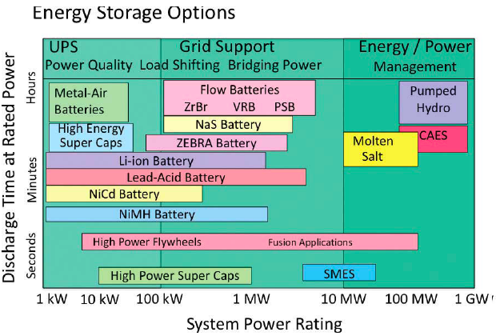

Claude me demande pourquoi on ne stockerait pas la surproduction éolienne avec des volants d'inertie. Lui répondre me permet de terminer un vieux brouillon sur le stockage d'énergie en utilisant un autre brouillon sur la voiture électrique comme introduction.

### Jamais contente



La première voiture à avoir atteint la stupéfiante vitesse de 100 km/h était une voiture électrique, la "[Jamais Contente](w:)", et c'était en 1899. De nos jours, la "[White Zombie](http://www.plasmaboyracing.com/whitezombie.php)" [laisse sur place une Maserati](http://www.youtube.com/watch?v=vGQSQAz9v6c) de 400 chevaux. Mais pourquoi donc nos routes ne sont-elles toujours pas envahies de voitures électriques ?

La réponse est pour beaucoup liée à la faible [densité d'énergie](w:) des batteries. Les meilleures batteries actuelles (Lithium-Ion) sont capables de stocker environ un quart de kilowattheure par kilogramme de batteries. C'est 8 fois mieux que les bonnes vieilles batteries au plomb, mais c'est 67 fois moins que l'énergie contenue dans 1 kg d'essence.

Même si le moteur de votre voiture ne parvient à transformer qu'un tiers\* de cette énergie en mouvement, un réservoir d'essence reste au moins 20x plus léger qu'une bonne batterie équivalente. Donc un réservoir de 40 litres d'essence (~ 30 kg)  correspond à environ 600 kg de batteries. Et même si un moteur électrique est sensiblement plus petit qu'un moteur à combustion de la même puissance, les batteries restent un handicap de poids pour un véhicule.

Evidemment, on peut réduire la taille de la batterie en récupérant l'énergie cinétique d'un véhicule à la descente, ou au freinage. Mais là se pose un autre problème : la [puissance](w:Puissance_(physique)) de charge ou décharge des batteries est également limitée.. Il faut par exemple 3.5 heures pour recharger complètement le [Roadster Tesla](w:en:Tesla_Roadster#Battery_system) de mes rêves, ce qui nécessite une alimentation électrique d'une puissance de 4.8 kW. Or comme je l'avais calculé [ici](/2011/07/03/srec/), une voiture qui ralentit de 36km/h à 0 en 5 secondes produit une puissance de 26 kW.  C'est pour cela que les voitures hybrides comme la [Toyota Prius](w:) n'utilisent pas des batteries Li-ion, mais plutôt des [NiMH](w:Accumulateur_nickel-hydrure_métallique) de densité énergétique inférieure, mais permettant des courants de charge/décharge plus élevés.

### Alors on stocke l'énergie, ou la puissance ?

La "Jamais Contente" avait un nom prédestiné pour une voiture électrique : il n'existe pas de technologie de stockage ayant à la fois une forte [densité d'énergie](w:) et une forte "densité de puissance", qu'on appelle plutôt [puissance massique](w:). On voit ceci et bien d'autres choses intéressantes dans le graphique ci-dessous [[1]](#ref-1), qui classe différentes technologies de stockage d'énergie selon leur puissance nominale (horizontalement) et le temps pendant lequel cette puissance nominale est disponible en décharge (verticalement)\*\*. Evidemment, on peut décharger un système plus lentement en en tirant une puissance inférieure, mais ça ne change rien à l'énergie stockable, donnée par le produit des deux axes.

Remarquez comme les diverses technologies forment des bandes horizontales : la puissance et l'énergie stockée par un système augmentent linéairement avec sa taille, donc le temps donné par le rapport énergie/puissance ne varie pas : il y a des technologies "rapides" capables d'absorber et de restituer des pics de puissance (en bas du dessin) et d'autres "lentes" capables de stocker plus d'énergie par unité de volume (en haut).

Les systèmes adaptés aux véhicules sont sur la gauche du graphique, entre 1 et 10 kW pour les scooters et entre 10 et 100 kW  pour les voitures. Remarquez aussi que les bonnes vieilles [batteries au plomb](w:) sont  situées entre les batteries Li-ion de la Tesla et les NiMH de la Prius. Elles sont lourdes, mais bon marché : si on calculait la densité d'énergie par dollar ou Euro investi (pas trouvé = à faire...), elles auraient probablement encore leur mot à dire...

Au dessus des batteries Li-ion, on trouve deux technologies en développement, pas encore commercialisées à ma connaissance:

- Les "ultra-batteries" comme celles au [difluorure de xénon](w:) [[2]](#ref-2). L'énergie électrique y est stockée directement dans la structure du matériau comme dans une supercap, mais avec une densité d'énergie bien supérieure.
- Les "batteries métal-air". Les [accumulateurs lithium-air](w:Accumulateur_lithium#Accumulateur_lithium-air) (le [lithium](w:) étant un métal ) sont les plus prometteuses, avec une densité d'énergie environ 10x plus élevée que le Li-ion. Avec de telles batteries, une voiture électrique atteindrait une autonomie comparable à une voiture à essence. Mais sauf progrès inattendu, il faudra toujours des heures pour la recharger.

Au dessous de tous ces types de batteries, on trouve des technologies encore mieux adaptées au stockage de puissance : les supercaps et les volants d'inertie [dont j'ai déjà parlé un peu ici](/2011/07/03/srec/) pour les véhicules.

### Du Gyrobus au Tokamak

L'[énergie cinétique](w:énergie_cinétique#Cas_de_la_rotation_autour_d'un_axe_fixe) d'un volant d'inertie vaut E=½.J.ω² où ω est la vitesse angulaire et J le [moment d'inertie](w:) du volant, qui augmente comme le carré du rayon. Pour stocker beaucoup d'énergie, il faut donc faire tourner le plus vite possible un volant du plus grand diamètre possible. Mais il y a deux hics:

- Le premier est que la vitesse périphérique du volant atteint la vitesse du son plus vite qu'on ne pense : un volant d'1 m de diamètre ( π m de circonférence) devient supersonique à 100 tours/s, soit 6000 tours/minute déjà.
- Le second c'est la résistance mécanique du volant sous l'effet de la force centrifuge. Comme on le voit dans [ce tableau](w:Volant_d'inertie#Stockage_d'énergie), un volant en acier bien dense éclate avant d'atteindre la vitesse du son. On ne gagne rien à utiliser du titane, plus résistant mais plus léger. Pour atteindre des densités d'énergie comparables à de bonnes batteries, il faut réaliser des volants en fibre de carbone ou de kevlar, tournant sous vide d'air...

La raison pour laquelle le légendaire [Gyrobus](w:) stockait son énergie dans un volant d'inertie de 1.5 tonnes plutôt que dans une masse équivalente de batteries au plomb tient à la petite phrase "_La recharge du volant prenait de 30 secondes à 3 minutes_" : les volants d'inertie stockent plutôt de la puissance que de l'énergie. Si on envisage de les utiliser dans les éoliennes [[3]](#ref-3) c'est pour lisser l'effet de rafales de vent espacées de quelques minutes, pas pour stocker une tempête nocturne pour un lendemain calme.

Une fois [quelques détails réglés](/2005/12/11/la-fusion-thermonucleaire/), les volants d'inertie pourraient jouer un rôle important dans les centrales à fusion thermonucléaire en stockant une partie de l'énergie produite pendant les courtes réactions de fusion pour alimenter les aimants et réchauffer le plasma entre deux réactions. Avec un rotor de quelques dizaines de mètres de long et quelques dizaines de tonnes, on peut stocker puis restituer 100 MW pendant 10 secondes. Tout ça pour stocker environ 70 KWh d'électricité, l'équivalent de quelques jours de votre consommation personnelle.



### Panoramix, il nous faut de la potion magique...

Si vous rêvez d'être autonome en électricité avec votre petite éolienne personnelle ou vos quelques m² de panneaux solaires, il vous suffira de stocker quelques dizaines de kWh pour les nuits ou les jours sans vent. Vous aurez besoin d'une capacité de stockage assez similaire à celle d'une voiture électrique, et quelques centaines de kg de batteries feront l'affaire. Vous pourriez être tentés d'utiliser votre voiture électrique comme stockage, mais le hic c'est que votre maison doit stocker de l'énergie pour le soir alors que votre [voiture doit en stocker pour le jour](/2009/03/04/la-voiture-electrique-ne-sera-pas-solaire/). Pas de bol : il vous faudra donc 2 batteries.

Si vous êtes une petite ville isolée comme Fairbanks en Alaska, il vous faut la plus grosse batterie du monde [[4]](#ref-4) pour fournir 40 MW à vos 12'000 habitants en cas de défaillance de votre centrale thermique. Enfin, pendant 7 minutes seulement, le temps de démarrer les groupes de secours, parce qu'à Fairbanks, ils ne sont pas écolos. Et aussi parce que leurs 1300 tonnes de batteries NiCd ne stockent que 5 MWh.

Donc si votre village d'irréductibles possède une vraie éolienne d' 1MW ou plus, et/ou des hectares de panneaux solaires, et que vous voulez tenir quelques jours sans vent, il vous faut la même batterie que Fairbanks. Ou quelque chose de mieux, parce que si vous faites le calcul, la densité d'énergie de leur batterie n'est que de 4 Wh/kg, que le [cadmium, c'est pas "vert"](w:Cadmium#Toxicité_et_toxicologie_du_cadmium) et que le lithium, il n'y en aura pas assez pour tous les écolos du monde.

D'autres types de batteries sont actuellement en développement comme la  [batterie sodium-soufre](w:) (NaS) ou les [batteries à sel fondu](w:en:Molten_salt_battery) type "Zebra", mais la voie la plus prometteuse me semble être les "batteries à flux redox" ("[flow batteries](w:en:Flow_battery)" en anglais). Ces sont des sortes de [piles à combustible](w:) réversibles qui fonctionnent avec diverses soupes d'électrolytes bizarres comme le [bromure](w:brome) de [vanadium](w:) ou du zinc/[cérium](w:).



La densité d'énergie de ces systèmes n'est pas vraiment plus élevée que celles de batteries Li-ion, donc on parle toujours d'installations de centaines de tonnes. Leur avantage est que la puissance est stockée/fournie par un élément relativement petit, alors que l'énergie stockable peut être augmentée à volonté en augmentant simplement le volume des réservoirs d'électrolytes. Ceci permet de réduire le coût de ces solutions par rapport à un wagon train de batteries plus classiques.

Je ne vois pas d'autre solution économique et utilisable à cette échelle actuellement ou dans un futur proche, mais dans un futur plus lointain, on pourrait imaginer utiliser  le [stockage d'énergie magnétique à supraconducteur](w:SMES) (SMES en anglais). L'idée est de faire tourner du courant électrique en circuit fermé dans un anneau supraconducteur. Ceci crée un champ magnétique extrêmement fort, autour de 20 [Tesla](w:Tesla_(unité)) duquel on peut ensuite retirer l'énergie par induction. Lorsqu'on sait que le champ magnétique terrestre est environ un million de fois moins puissant, on comprend que les pièces métalliques ne sont pas bienvenues à proximité d'un SMES, qui pose une quantité de problèmes technologiques intéressants. Les installations de labo actuelles sont plutôt orientées "puissance", mais on pourrait imaginer des SMES de quelques dizaines de kilomètres de diamètre pour le stockage d'énergie [[5]](#ref-5).

Mais sur le graphique on constate un gros trou qui sépare toutes ces "petites" solutions de celles déjà utilisées aujourd'hui dans la production d'énergie centralisée.

### Big is beautiful

Il existe en effet déjà trois systèmes de stockage adaptés aux centaines de MWh, voire de GWh. Commençons par les deux les moins connus :

- Le stockage thermique dans le sel fondu est particulièrement adapté aux [centrales solaires thermiques](w:centrale_solaire_thermodynamique). Par exemple [celle d'Andasol](w:Centrale_solaire_d'Andasol) en Espagne peut stocker 1GWh, soit  l'équivalent de 7h30 de production de la centrale à pleine puissance en chauffant 28'500 tonnes de sels à 400 °C, soit une densité d'énergie de 35 Wh/kg (0.126 MJ/kg), comparable à celles de batteries au plomb.
- Le stockage d'énergie à air comprimé ([CAES en anglais](w:en:Compressed_air_energy_storage)). Là encore, la densité d'énergie volumique de l'air comprimé à 300 bars est comparable à celle des batteries, mais deux difficultés apparaissent. D'abord, les compresseurs et moteurs à air doivent tenir compte de la thermodynamique. En comprimant un gaz il s’échauffe, et il refroidit lorsqu'il se détend.  Il faut récupérer cette composante thermique de l'énergie pour obtenir des rendements acceptables. D'autre part, construire des réservoirs de grandes dimensions pour de l'air à haute pression n'est pas une petite affaire. Ces deux obstacles hypothèquent la [voiture à air](w:véhicule_à_air_comprimé), mais en grand, ça peut marcher. Des installations pilotes comme ADELE en Allemagne [[6]](#ref-6) arrivent à stocker 350 MWh en comprimant de l'air dans des cavernes et atteignent des rendements de 70% en récupérant la chaleur produite lors de la compression.

Et enfin le "stockage hydraulique gravitaire" réalisé par de nombreuses installations que les français appellent [STEP](w:énergie_hydroélectrique#Les_stations_de_transfert_d'énergie_par_pompage). En Suisse, ça veut dire STation d'EPuration, alors on préfère les appeler "stations de [pompage-turbinage](w:)".

L'[énergie potentielle](https://fr.wikipedia.org/wiki/énergie_potentielle de_pesanteur) d'une masse m élevée d'une hauteur h est de E=m.g.h Joules, où g=9.81 que j'arrondis à 10. Pour stocker 1 kWh = 3.6 MJ, il faut donc élever 3'600 litres d'eau de 100m. Ou 360 litres de 1000m. Donc une montagne, c'est mieux qu'une colline. Et un grand lac aussi parce que pour stocker 1GWh il faut un million de fois plus d'eau. Et stocker une puissance de 1GW, ça veut dire pomper 1000 m³ d'eau par seconde à 10 bars, ou 100 m³ d'eau par seconde à 100 bars. Impressionnant, mais on sait faire depuis assez longtemps. Jusqu'ici, ça nécessitait des pompes spéciales, distinctes des turbines, mais l'arrivée des imprévisibles éoliennes motive la recherche de turbines réversibles, capables de passer du mode turbinage au mode pompage en quelques minutes, comme la turbine [Hydrodyna](http://hydrodyna.epfl.ch/projet) de l'EPFL [[7]](#ref-7) \*\*\*.

{{< figure src="./images/64c5da256dab01f12526df752ff0074c.jpg" alt="le site Nant de Drance à la frontière franco-suisse près de Chamonix. Une STEP souterraine de 900 MW y est en construction pour exploiter les 250m de différence de niveau entre les deux barrages. Cliquer pour plus d'infos" caption="le site &quot;Nant de Drance&quot; à la frontière franco-suisse près de Chamonix. Une STEP souterraine de 900 MW y est en construction pour exploiter les 250m de différence de niveau entre les deux barrages. Cliquer pour plus d'infos" link="http://www.nant-de-drance.ch/" align="aligncenter" width="600" >}}

D'après [cette liste](w:en:List_of_pumped-storage_hydroelectric_power_stations) il existe actuellement au moins 50 "STEPs" d'une puissance de plus de 1 GW dans le monde, dont le [barrage de Grand'Maison](w:) en France, celui de [Linth-Limmern](w:de:Kraftwerke_Linth-Limmern) en Suisse et même la [Centrale de Coo-Trois-Ponts](w:) en Belgique (rien au Québec ?) Avec de nombreuses autres installations de puissance inférieure, la capacité de stockage hydraulique représente au niveau mondial une puissance de 100 GW et une énergie que, fautes de données j'évalue à X TWh en multipliant les 100 GWh par X dizaines d'heures.

Ca parait beaucoup comme ça, mais même pour X=3 ça ne représente pas un millième de la [production d'électricité](w:) renouvelable mondiale, qui elle-même ne représente que 18 % de la production d'électricité totale.

J'ai lu quelque part (je ne retrouve plus où) que toutes les batteries du monde (démarreurs de voitures + téléphone et ordinateurs portables, toutes) stockent 4 minutes de la production mondiale d'électricité. D'après les calculs ci-dessus, toutes les STEP du monde stockent environ 1.5 heures de production mondiale.

C'est assez tant que des centrales thermiques produisent l'énergie "[en ruban](http://www.fmv.ch/fr/cahiers_electricite/differentes_couches_electricite.htm)", mais si on remplace ces sources d'énergie fiables et régulières par des [sources aléatoires](/2011/01/15/qui-veut-de-lelectricite-a-prix-negatif/), qu'on tient à l' "indépendance énergétique" et que de plus on ne veuille pas créer de nouvelles lignes de transport qui permettraient de lisser la production et la consommation à l'échelle du continent, il va falloir augmenter énormément la capacité de stockage. Tellement qu'on se sait pas le faire. Il faudra faire des compromis. Ou regarder une fois encore les 3 premières lignes du [tableau des densités d'énergie](w:Densité_d'énergie#Densités_d'énergie_typiques) avant de [retourner aux arbres](w:pourquoi_j'ai_mangé_mon_père)...

### Notes:

- \* Avant de pester contre le mauvais rendement des moteurs thermiques, rappelez-vous que la chaleur réchauffe "gratis" l'habitacle et dégivre les vitres en hiver...
- \*\* Le temps de charge est environ égal au temps de décharge, sauf pour les batteries, plus lentes à charger qu'à décharger.
- \*\*\* Une chose m'a frappé en écrivant cet article : la "puissance des liquides". Carburants, flux redox ou eau alpine, les liquides permettent des solutions "scalables" sur toute la gamme de puissances...Ils sont faciles à stocker, à pomper et à utiliser. D'ailleurs, après ce méga article, je prendrais bien une bière.

### Références

1. "[Integrating Renewable Electricity on the Grid](http://www.aps.org/policy/reports/popa-reports/upload/integratingelec.pdf)", Report, American Physical Society (excellente référence, très complète)
2. Christopher Mims "[New "Ultra-Battery" as Energy-Dense as High Explosives](http://www.technologyreview.com/view/419767/new-ultra-battery-as-energy-dense-as-high/)", Technology Review., 2010
3. Gabriel-Octavian Cimuca, ["Système inertiel de stockage d'énergie associé a des générateurs éoliens](http://pastel.archives-ouvertes.fr/docs/00/50/02/85/PDF/These_CIMUCA.pdf)", Thèse de doctorat, ENSAM, 2005
4. Edmund Conway "[World's biggest battery switched on in Alaska](http://www.telegraph.co.uk/technology/3312118/Worlds-biggest-battery-switched-on-in-Alaska.html)", The Telegraph, 23 August 2003
5. [Superconducting Magnetic Energy Storage (SMES) Systems for GRID](http://nextbigfuture.com/2011/10/superconducting-magnetic-energy-storage.html) sur BigNextFuture ([pdf de 21 slides](http://www.superpower-inc.com/system/files/2011_1012+EPRI+Conf_Brookhaven+SMES.pdf))
6. [ADELE – Adiabatic compressed-air energy storage (CAES) for electricity supply](http://www.rwe.com/web/cms/mediablob/en/391748/data/364260/1/rwe-power-ag/innovations/Brochure-ADELE.pdf) brochure \[pdf\]
7. François Avellan "[Evolution des groupes de pompage-turbinage : Situation actuelle, technologies et nouveaux projets](http://hydrodyna.epfl.ch/files/content/sites/hydrodyna/files/documents/Evolution%20des%20groupes%20de%20pompage-turbinage.pdf)", bulletin electrosuisse 2/2012

### Autres sources

- Jean-Marc Jancovici, "[Est-ce facile de stocker l'énergie ?](http://www.manicore.com/documentation/stockage.html)" sur Manicore.com
- "[Les systèmes de stockage d’énergie Dossier Stratégique](http://www.scribd.com/doc/109127635)" ADEME
- Davide Castelvecchi, "[How Big a Battery Would It Take to Power All of the U.S.?](http://www.scientificamerican.com/article.cfm?id=castelvecchi-how-big-battery-would-it-take-power-usa)", Scientific American, Février 2012
- Axel Strang, Louis Sanchez, Franck Delplace "L’industrie des énergies décarbonées en 2010 Chap 11: [Stockage de l’énergie : Définition et technologies existantes](http://www.developpement-durable.gouv.fr/IMG/pdf/Nucleaire.pdf)", Direction Générale de l’Energie et du Climat
