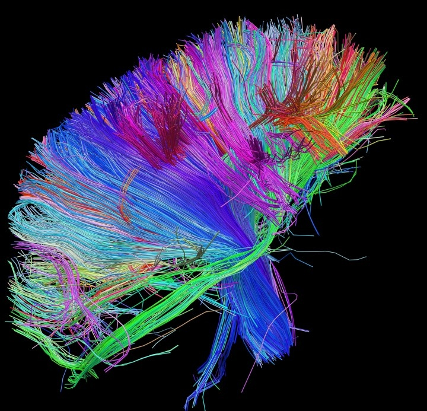

Le mot "science" a beau figurer sur une [cinquantaine d'albums](http://www.allcdcovers.com/search/music/all/science/1), presque autant de noms de groupes et une multitude de titres de morceaux, ce n'est [pas toujours en son honneur](http://www.rockcorner.net/lyrics/System-Of-A-Down/Toxicity/Science-l755.html),  [lorsque le rapport est compréhensible](http://www.lyricsmode.com/lyrics/t/the_birthday_massacre/science.html).

Je ne connais qu'un groupe visiblement inspiré par la science : [Muse](w:Muse_(groupe)). Dans les albums "Supermassive Black Hole", "[HAARP](w:High_frequency_active_auroral_research_program)", "Black Holes and Revelations", "Starlight", "Butterfly and hurricanes" et "Origin of Symmetry", outre les titres, les références sont très discrètes : on devine un voyage interstellaire dans les paroles de "[Starlight](http://www.azlyrics.com/lyrics/muse/starlight.html)" mais on en reste souvent à la simple figure de style comme dans "[Neutron Star Collision](http://www.azlyrics.com/lyrics/muse/neutronstarcollisionloveisforever.html)" ou "[Supermassive Black Hole](http://www.azlyrics.com/lyrics/muse/supermassiveblackhole.html)".

Ca évolue un peu avec le dernier album de Muse baptisé "The 2nd Law" en l'honneur du [deuxième principe de la thermodynamique](w:). Une voix l'énonce inlassablement, et correctement, dans [The 2nd Law: Isolated System](http://www.youtube.com/watch?v=VXPoJAyeF8k) :

> In an isolated system, entropy can only increase.

Même si je ne partage pas [l'interprétation](http://www.azlyrics.com/lyrics/muse/the2ndlawunsustainable.html) de ce principe appliqué à l'économie de notre petite planète (qui n'est pas un système isolé du point de vue thermodynamique), j'aime bien le clip de "Unsustainable", surtout le début:



Mais ce qui m'a plus intéressé, c'est l'image utilisée pour la couverture de l'album "The 2nd Law" :

Il s'agit d'une représentation des principales connexions du cerveau réalisée par le [Human Connectome Project](http://www.humanconnectomeproject.org/). A part les jolies couleurs, ça n'a rien à voir avec les fantastiques ["brainbow" dont Sirtin nous avait causé](http://sirtin.cafe-sciences.org/2007/12/04/brainbow-ou-lart-scientifique/). Le Human Connectome utilise un scanner spécial développé avec Siemens \[1\] permettant d'obtenir le gradient (~la direction) des [voies neuronales](w:Voie_neuronale) interconnectant les différentes zones du cerveau, puis des logiciels de modélisation et de visualisation du réseau pour produire ces images spectaculaires.

Après avoir un peu fouiné dans Spotify, je n'ai pas trouvé d'autre couverture de disque reprenant une illustration scientifique, ni de disque ou même de "chansons à textes" scientifiques. (références bienvenues dans les commentaires)

Peut-être parce que peu de rockers sont titulaires d'un doctorat. En fait je n'en connais qu'un, et pas des moindres puisque [Brian May](w:) est [l'un des meilleurs guitaristes](http://www.rollingstone.com/music/lists/100-greatest-guitarists-20111123/brian-may-19691231) du monde ([preuve en vidéo)](http://www.youtube.com/watch?v=JYabmM-uxdE). Après avoir bricolé lui même sa légendaire "[Red Special](w:)" et interrompu ses études en astrophysiques pour cause de Queen, il a rendu son travail de thèse \[2\] 30 ans après l'avoir commencé.

|  |  |
| --- | --- |

Brian May a composé de nombreux tubes de Queen comme "We will rock you" et "The Show must go on", mais aucun ne s'appelle "Zodiacal Dust", hélas.

Qui osera publier le premier article scientifique sous forme de rock ?

### Référence:

1. Van J Wedeen et al. "[In vivo imaging of fiber pathways of the human brain with ultra-high gradients](http://www.medical.siemens.com/siemens/en_INT/gg_mr_FBAs/files/MAGNETOM_World/ismrm_proceedings/ismrm_2012/1876_ISMRM2012.pdf)", Proceeding of [ISMRM 2012](http://www.ismrm.org/12/)
2. 
