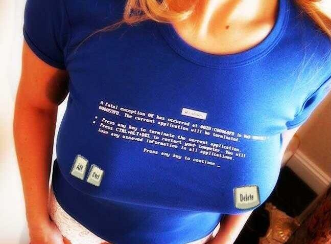
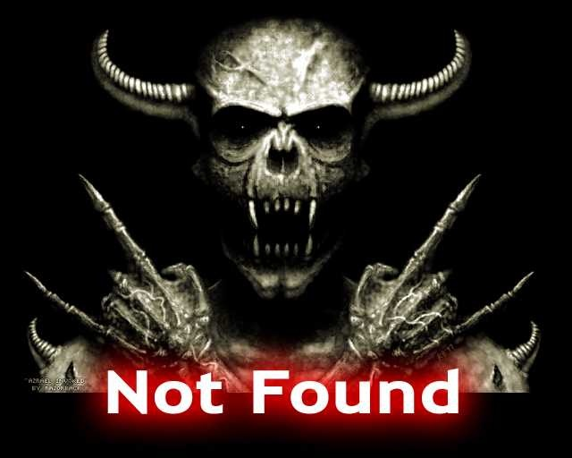
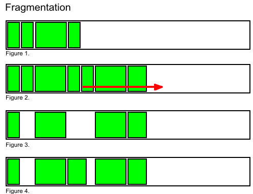

_Article publié dans le cadre de la [semaine thématique sur la mort du C@fé des Sciences](http://thema.cafe-sciences.org/), pour changer un peu de toute cette biologie._

Alors comme ça vous voulez enlever vos photos de biture de Facebook ou donner votre vieil ordi à votre maman sans les traces de vos visites à des sites olé-olé ? Pas simple de détruire des informations alors que le rôle des mémoires informatiques est précisément de les conserver.

D'abord, les données sont défendues contre leur pire ennemi : l'homme. Il y a le distrait qui clique machinalement sur "oui" à la boite de dialogue "êtes-vous sur de vouloir effacer ce fichier très important sur lequel vous avez bossé 3 jours ?"; il y a le jaloux qui dit à son ex "mais c'est tout simple : fais click droit sur le disque dur et choisis Formater..."; il y a le [DBA](https://fr.wikipedia.org/wiki/Administrateur_de_base_de_données) licencié qui fait un petit "drop database" avant de partir... Il existe 3 stratégies pour éviter ça:

1. ne pas autoriser l'effacement des données
2. faire semblant de les effacer, mais ne pas les effacer pour de vrai.
3. faire des copies de sécurité pour les ressusciter, au cas où.

Pour des raisons techniques que nous allons expliquer plus bas, l'informatique actuelle combine les 3 stratégies au point qu'effacer des données est devenu une opération redoutablement complexe.

D'abord, il faut réaliser que l'écrasement est la principale cause de mortalité des données. Il y en a un tout petit peu qui meurent d'inanition lorsque l'alimentation d'un PC flanche, un peu plus qui meurent dans un crash de disque dur mécanique ou magnétique, mais la plupart meurent écrasées par d'autres données écrites au même emplacement mémoire qu'elles.

Donc "_1\. ne pas autoriser l'effacement des données_" revient à "_1\. ne pas autoriser l'écriture de données là où il y en a déjà_". Cette fonction de police est aujourd'hui réalisée en partie dans les applications comme les bases de données, et à un niveau inférieur dans les [systèmes d'exploitation](https://fr.wikipedia.org/wiki/systèmes_d'exploitation), qui peuvent même utiliser des circuits de [protection mémoire](https://en.wikipedia.org/wiki/memory_protection) présents dans les microprocesseurs récents.

Que ce soit au niveau de la mémoire RAM, du disque dur ou d'une base de donnée répartie à travers la planète, le principe est le même : un programme n'a le droit d'écrire des données qu'aux emplacements mémoire marqués comme étant libres. Dès lors, pour effacer des données, "il suffit de" marquer leur emplacement en mémoire comme étant libre, ce qui permet de réutiliser la mémoire libérée. Mais ce n'est pas si simple, car 4 monstres rôdent:

1. l'Hydre de Lerne
2. Le Docteur Frankenstein
3. L'Ecran Bleu de la Mort
4. La Fragmentation

## L'Hydre de Lerne

Les systèmes informatiques actuels utilisent une [hiérarchie mémoire](https://fr.wikipedia.org/wiki/hiérarchie_mémoire) dans laquelle une donnée peut être présente simultanément à plusieurs niveaux. Elle ressemble alors à une [Hydre de Lerne](https://fr.wikipedia.org/wiki/Hydre_de_Lerne) dont il faut couper les têtes dans un certain ordre pour la tuer.

Dans un système simple, il faut en principe attaquer le niveau le plus haut de la hiérarchie, et poursuivre vers le bas. C'est pour cela par exemple que Windows ne vous permet pas d'effacer un document Word (= marquer son emplacement comme libre sur le disque dur) tant qu'il est ouvert (= présent en mémoire RAM) sinon le fichier serait recréé à la prochaine sauvegarde.

Çà se complique avec les systèmes multicœurs/multiprocesseurs ou répartis sur un réseau : là il faut utiliser une arme spéciale appelée [protocole de cohérence de cache](https://fr.wikipedia.org/wiki/protocole_de_cohérence_de_cache) pour qu'une donnée morte pourrisse si rapidement ses clones qu'ils ne puissent pas être ressuscités.

Le niveau le plus bas de la hiérarchie mémoire pose le plus gros problème. A mon sens c'est actuellement internet, un disque dur de PC typique étant essentiellement rempli de gigabytes téléchargés. Mais la difficulté existe aussi pour ces bons vieux disques/bande/cartes perforées de sauvegarde : comment effacer des informations à ce niveau où il n'existe aucune "cohérence de cache" ? Il n'existe (heureusement?) aucun moyen d'effacer [tous les zombie.mp3](http://www.google.com/search?q=zombie.mp3) du net.

## Le Docteur Frankenstein

Or tant que tous les clones d'une donnée n'ont pas été écrasés, voire broyés, elle peut ressusciter   :

- En RAM, des programmes mal fichus peuvent continuer à utiliser des [pointeurs](https://fr.wikipedia.org/wiki/pointeur_(programmation)) vers des données tuées, voire les ressusciter en les copiant à un emplacement valide.
- Sur disque, des [programmes spéciaux](http://pcsupport.about.com/od/filerecovery/tp/free-file-recovery-programs.htm) peuvent "dés-effacer" des fichiers.
- Sur internet, on peut retrouver une page effacée dans le [cache des moteurs de recherche](http://webcache.googleusercontent.com/search?q=cache:drgoulu.com) ou sur un [site d'archives](http://wayback.archive.org/web/*//) par exemple. Et la republier.
- Et toute donnée ayant au moins une copie de sécurité (n'est-ce pas ?), une catastrophe peut paradoxalement rendre la vie à des données effacées après la création de la copie...

## L'Écran Bleu de la Mort

Quand une donnée est tuée, il faut en informer ses proches: les références. Au sens large, ce sont toutes les autres données qui se réfèrent à la disparue et qui risquent l'équivalent informatique de la gaffe "ah, et bien des choses à ta femme de ma part !" - "... elle est morte la semaine passée..." :  le crash.

En RAM, les [pointeurs](https://fr.wikipedia.org/wiki/pointeur_(programmation)) vers la donnée effacée indiquent désormais une tombe. Les suivre invoque l'[Écran Bleu de la Mort](https://fr.wikipedia.org/wiki/écran_bleu_de_la_mort) ainsi nommé en raison de son apparence sous Windows, mais il se présente aussi sous forme [sonore pour les pommes](http://www.youtube.com/watch?v=4FOOmoukpJc) et [paniquée chez les pingouins](https://fr.wikipedia.org/wiki/panique_du_noyau), entre autres. Dans tous les cas, vous allez perdre un peu de temps à redémarrer votre machine, et parfois beaucoup de données saines...

Sur disque, les noms de fichiers disparus provoquent des variantes moins létales de l'Écran Bleu de la Mort,  les bien connus messages  "File not found".

Mais l'Écran Bleu de la Mort envahit aussi internet, le niveau le plus bas de la hiérarchie mémoire. D'[apparence parfois plus sympa](http://images.google.com/images?q=404+error+page) l'[Erreur 404](https://fr.wikipedia.org/wiki/Erreur_HTTP_404) n'en est pas moins redoutable, et beaucoup moins bavarde. Les données à cet [URL](https://fr.wikipedia.org/wiki/Uniform_Ressource_Locator) ont-elles été effacées, déplacées ou n'ont-elles même jamais existé ? Est-ce temporaire ou définitif ? Aucun moyen de le savoir sans investigations poussées.

Pour vous qui surfez, ce problème occasionnel peut souvent se résoudre en utilisant un moteur de recherche pour retrouver une autre page avec le même contenu. Sur drgoulu.com, ça devient embêtant : malgré l'utilisation d'un [outil](http://wordpress.org/extend/plugins/broken-link-checker/) qui gère les redirections  425 liens sur 6110 se sont brisés au fil des ans. J'en répare manuellement quelques uns, parfois. Les autres apparaissent [comme ça](http://ozone3d.net/404). Mais il y a pire : de plus en plus de sites web utilisent du contenu, voire du code, stocké sur un[Content Delivery Network](https://fr.wikipedia.org/wiki/Content_Delivery_Network) (CDN). Si de tels liens se cassent, ça peut rendre indisponible des sites entiers.

Les informaticiens ont développé de nombreux et intenses efforts pour repousser l'Écran Bleu de la Mort, avec des succès variés. Ils ont assez bien réussi à remplacer les dangereux pointeurs par des [références](https://fr.wikipedia.org/wiki/référence_(informatique)) en mémoire plus intelligentes, qui prennent une valeur précise (en général nulle) au moment même où la donnée qu'ils pointent meurt. Dans les bases de données, ils ont eu l'idée des contraintes d'[intégrité référentielle](https://fr.wikipedia.org/wiki/intégrité_référentielle). C'est très bien, très rigoureux et tout, mais ça oblige à effacer en cascade tous les enregistrements liés aux enregistrements effacés par des [clés étrangères](https://fr.wikipedia.org/wiki/clé_étrangère). Une petite mort naturelle peut ainsi causer un holocauste, donc si on l'utilise, on préfère désactiver la possibilité d'effacer les données...

Certains [systèmes de fichiers](https://fr.wikipedia.org/wiki/système_de_fichier) utilisent des concepts inspirés des bases de données, mais je n'en connais toujours aucun qui permette de déplacer ou de renommer un fichier système sans tout casser : les fichiers n'ont toujours pas une "adresse" unique.

Les [URL](http://fr.wikipedia.org/wiki/Uniform_Resource_Locator) d'internet peuvent être vues comme des adresses uniques, mais là ce sont les données correspondantes qui peuvent être modifiées ou supprimées sans contrôle...

## La Fragmentation

Le quatrième monstre qui défend les données contre la mort porte un nom de grenade mortelle : la [fragmentation](https://fr.wikipedia.org/wiki/fragmentation_(informatique)).

Commençons par parler de la mémoire RAM. Une donnée effacée y laisse un trou.  Cet emplacement libre est par la suite ré-alloué à une  donnée naissante, mais celle-ci ne peut pas être plus grande que le trou, donc il y a de fortes chances que le trou ne soit que partiellement rempli par une donnée plus petite, en laissant un reste de trou encore plus petit. Au bout d'un certain temps, la mémoire disponible sera fragmentée en beaucoup de petits trous dans lesquels les grosses données ne pourront plus se caser.

En RAM, l'utilisation de références adaptées et la vitesse de copie de la mémoire permet de [ramasser les miettes](https://fr.wikipedia.org/wiki/Ramasse-miettes_(informatique)) de temps en temps, mais sur des supports plus lents comme les disques on préfère diviser au besoin un gros fichier en une chaîne de petits blocs remplissant exactement les trous laissés libres par les fichiers effacés. Mais cette fragmentation des fichiers ralentit l'accès aux données.

## Les données doivent-elles mourir ?

Supprimer des données est une opération dangereuse et complexe. Elle est à peu près maîtrisée en RAM, où elle est indispensable. Mais sur disque dur et dans le nuage internet où la mémoire est extrêmement bon marché, répliquée et difficilement réutilisable, la solution la plus simple, fiable et efficace consiste à ne pas tuer les données, ou du moins ne pas les écraser. En fait il suffit souvent de les laisser se momifier : lorsque toutes les références vers une donnée auront disparu ou seront elles aussi momifiées, la donnée sera perdue dans la gigantesque [mémoire de la Machine](/2008/11/29/les-dimensions-de-la-machine/) presque aussi surement que si elle avait été effacée : il n'y aura plus moyen de la retrouver.

C'est apparemment cette approche par momification qu'avaient choisi Facebook et Flickr pour "effacer" les photos. Selon [cet article](http://www.petapixel.com/2010/10/11/facebook-has-a-zombie-photo-problem/), il fallait entre quelques minutes et quatre mois environ pour que toutes (?) les références à une photo soient supprimées. C'est compréhensible si on considère qu'il peut y en avoir des centaines, voire des milliers sur les comptes Facebook des "amis" de l'auteur de la photo, mais aussi sur des sites externes. En supprimant une photo sur demande d'un utilisateur, Facebook ou Flickr modifient le contenu d'autres utilisateurs, voire d'autres sites, sans leur autorisation, ni même avertissement, ce qui pourrait soulever des problèmes légaux...

Avant d'appuyer sur \[return\] ou de clicker sur \[ok\], il vaut mieux partir de l'idée que l'ajout de données est encore plus irréversible que leur suppression. Oups, je viens de remplacer tout cet article par un seul espace.. (authentique!). \[Ctrl\]-\[Z\] ouf, tout est récupéré ! Merci Undo ! Où en étais-je ? Ah oui : CQFD.
