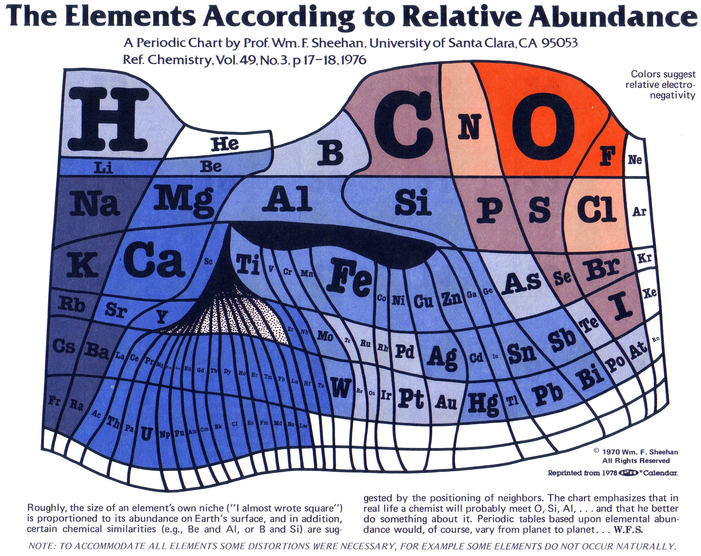
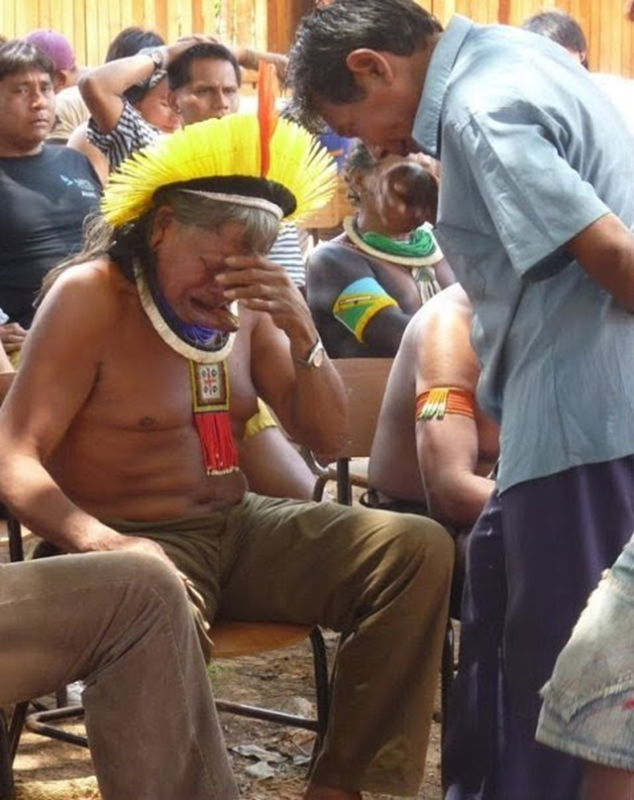
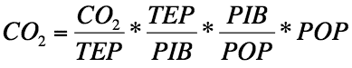

_Il me reste un problème en cette fin d'année : que faire d'une bonne dizaine d'articles commencés en 2012  et restés à l'état de brouillons ? (Alors que mon job consiste entre autres à combattre la production d'invendus et les stocks que ça génère... il va me falloir une bonne résolution 2013...) Alors je vide le stock, en vrac et un peu plus bruts que d'habitude, en faisant pour commencer un multipack de 5 brouillons sur mes interrogations écono-écolo-énergétiques, avec un soupçon de démographie:_

### Combien vaut l'énergie

L'énergie est rare, précieuse, et il faut l'économiser parce qu'elle va coûter plus cher, vous dit-on. On vous ment. L'énergie est ce qu'il y a de plus abondant dans l'Univers, elle ne vaut rien du tout car c'est la plus élémentaire des matières premières.

Ca vous choque d'assimiler l'énergie à de la matière première ? Pourtant vous connaissez surement E=m.c² la célèbre formule qui relie les deux via ce facteur c², la vitesse de la lumière au carré. Elle dit qu'un kg de matière quelconque est équivalente à une énergie de 1 \[kg\] x 300'000'000² \[m²/s²\] = 9.1016\[kg.m²/s²\] soit 90 [peta](http://fr.wikipedia.org/wiki/P%C3%A9ta)[joule](http://fr.wikipedia.org/wiki/Joule), ou 25 milliards de [kWh](http://fr.wikipedia.org/wiki/Kwh), ou encore 2'149'613 [tonnes équivalent pétrole](http://fr.wikipedia.org/wiki/Tonne_d%27%C3%A9quivalent_p%C3%A9trole) \[tep\]\*

La [production d'énergie annuelle](http://fr.wikipedia.org/wiki/Ressources_et_consommation_%C3%A9nerg%C3%A9tiques_mondiales) de l'humanité étant d'environ 12 milliards de tep, l'équation d'Albert nous dit que nous convertissons environ 5.5 tonnes de matière en énergie chaque année. Seulement. Si nous avions des mines d'antimatière quelque part, nous saurions la convertir milligramme par milligramme en énergie avec un rendement de 100%, et même si cette antimatière se négociait à mille fois le prix actuel de l'or, disons 40 millions d'euro le kg, ça nous mettrait le kWh à 0.2 centimes environ. Rien du tout.

### Abondance

Embryon d'article motivé par la collision entre:

1. cette (ancienne) figure revenue sur le devant du web :
    
    
    
    cliquer pour agrandir
    
2. la lecture du [paragraphe "Abondance" de l'article "Uranium" de la wikipédia](http://fr.wikipedia.org/wiki/Uranium#Abondance) : _"Il est plus abondant dans la nature que l'or ou l'argent. (...)  Ainsi, le sous-sol d'un jardin sur un carré de 20 m de côté peut-il en contenir, sur une profondeur de 10 m, environ 24 kg. (...). L'eau de mer contient environ 3 mg d'uranium par m3, soit 4,5 milliards de tonnes d'uranium dissous dans les océans. Les eaux douces en contiennent souvent aussi en diverses concentrations ; dont par exemple le Rhône qui en charrie environ 29 t/an, provenant essentiellement du ruissellement des roches uranifères des Alpes."_
3. l'article "[Record haul of uranium harvested from seawater](http://www.newscientist.com/article/dn22201-record-haul-of-uranium-harvested-from-seawater.html)" paru en août sur New Scientist et relayé [dans l'Usine Nouvelle](http://www.usinenouvelle.com/article/chimie-un-filet-pour-pecher-l-uranium.N180862) où l'on apprend qu'il existe des filets sur lesquels l'uranium dissous dans l'eau de mer se dépose à raison de presque 4 grammes par kilogramme de filet. Encore un petit effort et cette technologie pourrait être compétitive avec l'extraction minière et donner accès à un stock d'environ 6500 ans de consommation actuelle...

Petit avis sans frais aux écologistes suisses : ne pas trop la ramener à propos de l'indépendance énergétique du pays, car un seul filet à uranium en travers du Rhône au Bouveret pourrait suffire...

### Pourquoi je ne suis pas contre Belo Monte.

Je comprends. Je suis très triste pour les 25000 indiens d'Amazonie qui perdront leurs terres, et pour les centaines de km2 de forêt vierge qui seront inondés avec leur  biodiverses plantes et bestioles. Mais je ne signerai pas [cet appel pour stopper la construction](http://amazonwatch.org/take-action/stop-the-belo-monte-monster-dam) du [barrage de Belo Monte](http://fr.wikipedia.org/wiki/Projet_de_barrage_de_Belo_Monte) au Brésil, [ni celui du célèbre Raoni](http://raoni.fr/), même si j'y ai été invité par des proches. Voici pourquoi.

D'abord la cohérence. On nous rabâche qu'il faut des sources d'énergie propres et durables, or l'hydroélectricité représente [85% de l'électricité renouvelable](http://fr.wikipedia.org/wiki/%C3%89nergie_renouvelable#Aper.C3.A7u_g.C3.A9n.C3.A9ral) produite dans le monde, et [90% de l'électricité brésilienne](http://fr.wikipedia.org/wiki/%C3%89nergie_hydro%C3%A9lectrique#Br.C3.A9sil). Le barrage de Belo Monte produira 38600 [GWh](http://fr.wikipedia.org/wiki/Watt-heure) par an, soit l'équivalent de [tous les barrages suisses](http://fr.wikipedia.org/wiki/%C3%89nergie_en_Suisse#Installations_hydro.C3.A9lectriques) à lui tout seul. Pour produire autant d'énergie autrement, il faudrait soit:

- des centrales à charbon qui balanceraient environ 38 millions de tonnes de CO2 dans l'air chaque année (le charbon dégage environ [un kilo de CO2 par KWh](http://www.greenit.fr/article/energie/combien-de-co2-degage-un-1-kwh-electrique) produit)
- ou environ 100 km2 de cellules photovoltaïques (j'ai compté [2000 kWh/m2/an](http://jyaindia.up.seesaa.net/image/world_global_8100.png) et 20% de [rendement](http://drgoulu.local/2010/05/09/comment-on-mesure-le-rendement-des-cellules-solaires/)), mais ça c'est la surface nette des cellules. Avec les espaces pour l'entretien des panneaux et des lignes électriques, plus les inévitables obstacles naturels sur une telle surface, on devrait approcher d'une surface comparable à celle du lac du Belo Monte, soit 440 km² (on trouve parfois mention d'une surface engloutie de 6140 km2, qui le correspond à la somme des [4 barrages projetés dans la région](http://en.wikipedia.org/wiki/Belo_Monte_Dam#Redesign) )
- ou 4 réacteurs nucléaires de 1 GW, mais ça les écolos n'en veulent pas même si c'est pour sauver la forêt tropicale,

A part ça, la [population du Brésil](http://fr.wikipedia.org/wiki/D%C3%A9mographie_du_Br%C3%A9sil) augmente de 1% par an, et 1% de 190 millions, ça fait presque 2 millions d'emplois à créer par an  pour maintenir le [taux de chômage actuel autour de 6%](http://www.indexmundi.com/g/g.aspx?c=br&v=74&l=fr). Ce n'est pas moi, natif d'un pays qui a aussi sacrifié de beaux paysages (alpins) et au moins [un village](http://www.rts.ch/archives/tv/information/carrefour/4453043-village-englouti.html) pour obtenir l'électricité (propre!) nécessaire à son développement qui vais dire aux brésiliens "non, ne faites surtout pas comme nous".

### C'est maintenant ! (ou pas)

Je n'ai pas aimé du tout \[openbook booknumber="ISBN:9782020987684" templatenumber="5"\]  Ou plutôt j'ai été très déçu par ce pamphlet politique commis par Jean-Marc Jancovici, dont je pense toujours beaucoup de bien depuis que j'ai découvert [Manicore](http://drgoulu.local/2009/02/15/manicore/).

Je ne dis pas qu'ils ont tort sur le diagnostic : comme eux, je suis persuadé que nous avons atteint le [pic pétrolier](http://fr.wikipedia.org/wiki/Pic_p%C3%A9trolier), et que ceci causera un profond bouleversement de nos sociétés. Comme eux, j'appelle de mes voeux une classe politique dotée de compétences scientifiques minimales. Ce qui me déçoit, c'est justement le manque de rigueur scientifique de leur bouquin : très peu de chiffres, pas de graphiques, pas de références et encore moins de formules. Pourtant il y en a une géniale, justement [découverte sur le site de Jancovici](http://www.manicore.com/documentation/serre/kaya.html) qui pourrait justement guider le politique et aussi servir de base à une excellent bouquin : [l'équation de Kaya](http://fr.wikipedia.org/wiki/%C3%89quation_de_Kaya) :

Je n'arrive pas à comprendre comment des gens connaissant ceci peuvent limiter leurs propositions concernant la démographie à une phrase que je ne retrouve plus mais qui dit en substance "nous ne souhaitons pas tuer les 3/4 de la population" (POP) alors que les enfants et petits-enfants susceptibles de pâtir du désastre annoncé ne sont pas encore nés. Je ne comprends pas non plus pourquoi des gens pronucléaires réalistes se résignent à voir la production (ou consommation) d'énergie ([TEP](http://fr.wikipedia.org/wiki/Tonne_d'%C3%A9quivalent_p%C3%A9trole)) diminuer alors qu'ils connaissent les moyens de la maintenir.

Les solutions préconisées dans le bouquin ciblent essentiellement une décroissance du PIB, dont on voit pourtant qu'il est une "variable muette" de l'équation de Kaya.  Je ne connais pas Alain Grandjean, mais j'ai de la peine à croire qu'un économiste puisse souhaiter une politique de décroissance sur la base d'une vision aussi caricaturale de l'économie  moderne. En considérant par exemple que le PIB est essentiellement produit par la consommation de ressources "gratuites" dont les combustibles fossiles, Grandjean et Jancovici semblent ignorer que l['intensité énergétique](http://fr.wikipedia.org/wiki/Liste_des_pays_par_intensit%C3%A9_%C3%A9nerg%C3%A9tique) TEP/PIB varie d'un facteur supérieur à 7 selon les pays. A les lire, le [secteur tertiaire](http://fr.wikipedia.org/wiki/Secteur_tertiaire) ne satisferait que des besoins superfétatoires fortement consommateurs d'énergie comme des banques génératrices de crises, donc autant d'activités à éliminer lors d'un [Grand Bond en avant](http://fr.wikipedia.org/wiki/Grand_Bond_en_avant) version 2.012. Santé ? Formation ? Caisses de pension ? "[Back to the trees!](http://fr.wikipedia.org/wiki/Pourquoi_j'ai_mang%C3%A9_mon_p%C3%A8re)" rétorquent Jancovici et Grandjean.

A part ça, le sous titre de "C'est maintenant !" est "3 ans pour sauver le monde" surtout parce qu'il y avait une élection présidentielle française qui devait être gagnée par un leader, un De Gaulle écolo capable de mettre en oeuvre le programme proposé. Ca semble raté.

Finalement, ce que je reproche le plus à Jancovici et Grandjean, c'est leur vision technocentriste de la politique, celle qui consiste à dire au monde et à la France : "nous avons étudié, nous avons calculé, alors faites comme on dit sinon vous êtes foutus". Je pensais un peu comme eux avant de jouer à [Civilization](http://fr.wikipedia.org/wiki/Civilization), et puis j'ai compris qu'il y avait plusieurs manières de gagner. Et aussi que quand je jouais, ça finissait souvent par une guerre nucléaire...

### Démographie du 21ème siècle

Pour comprendre la situation actuelle de la démographie humaine, 13 minutes et 21 secondes suffisent grâce à la fantastique [conférence "Religions et Bébés" de Hans Rosling au TED](http://www.ted.com/talks/hans_rosling_religions_and_babies.html)

Il y démontre plusieurs faits qui peuvent surprendre:

- 80% de la population mondiale vit désormais dans des pays à taux de fécondité proche de 2
- la religion dominante n'a pas d'influence significative sur la natalité
- l'augmentation du niveau de vie (PIB/habitant) est préalable à la diminution de la natalité
- les plus fortes croissances démographiques s'enregistrent dans les pays aux plus fortes taux de mortalité.
- le nombre de naissances n'augmente plus notablement dans le monde
- la population mondiale va augmenter jusqu'à 10 milliards d'habitants par "remplissage de la pyramide des âges". (voyez absolument la vidéo, au moins à partir de 10:20, par pitié!)



A ce propos je remarque que ni l'article "[Développement durable](http://fr.wikipedia.org/wiki/D%C3%A9veloppement_durable)" ni "[Durabilité](http://fr.wikipedia.org/wiki/Durabilit%C3%A9)" de la Wikipédia ne fassent la moindre référence à la démographie... Suis-je donc je seul à me poser [la question d'un lien](http://drgoulu.local/2009/06/06/developpement-durable-et-equation-de-kaya/) ? Il me semble que tous les modèles de société "durable" considèrent le problème dans un sens unique : puisque les ressources terrestres sont limitées, il faut limiter notre consommation totale, peu importe combien nous sommes. Pourquoi ne pas limiter plutôt notre nombre ? Car en fin de compte, c'est bien ce nombre qui risque d'être limité de force...
