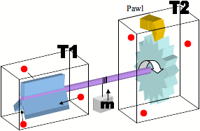

Un collègue est arrivé au boulot tout excité par le "[moteur magnétique](http://tvmag.lefigaro.fr/programme-tv/article/divertissement/69742/l-inventeur-un-jure-emu-par-une-invention.html)" présenté par un certain Aurélien Prévost à l'émission "l'inventeur 2012" sur M6. Il s'agit d'une "rampe de lancement" magnétique très similaire à celle ci-dessous [[1]](#ref-1), déjà [brevetée](/2009/03/08/combien-pour-ce-brevet/) en 1977 [[2]](#ref-2):



Après une petite démo de la version linéaire du moteur qui pourrait étonner ceux qui n'ont jamais joué avec des [Geomags](http://www.geomagworld.com/en) ou autres aimants, Aurélien explique calmement kyaka refermer la rampe pour former un circuit circulaire fermé et fixer les billes à une roue pour que celle-ci tourne toute seule, grâce à un moteur magnétique qui ne nécessite ni carburant ni batterie.

L'enthousiasme du jury pour cette "invention" qui va permettre à la France d’alimenter le monde en énergie gratuite fait peine à voir dans un premier temps. Seuls quelques membres du jury demandent à en voir plus, et aucun ne prononce les 2 mots qui qualifient cette "invention" dès le premier coup d'oeil scientifique : "bull shit". En français : "[mouvement perpétuel](w:)".

Après avoir revu la séquence plusieurs fois, je suis persuadé qu'il s'agit d'un canular monté par Aurélien avec la complicité d'une partie du jury, voire de toute l'émission de M6. Si j'ai tort, alors j'ai vraiment très honte pour la chaîne de E=M6 : il ne faut pas laisser croire au public qu'il existe la moindre possibilité qu'un truc pareil existe.

Il en va de la santé mentale des spectateurs : combien d'hurluberlus ont passé leur vie à ruiner leur santé mentale et le porte-monnaie familial à bricoler des machines condamnées à l'immobilité perpétuelle. Voici une [collection de dessins](http://www.flickr.com/photos/goulu/sets/72157629905515654/) commencée pour l'occasion, de Léonard de Vinci à nos jours [[3]](#ref-3), [[4]](#ref-4), [[5]](#ref-5)

On pourrait imaginer qu'après des siècles d'échec expérimental et de réussites scientifiques à expliquer pourquoi ça ne peut pas marcher, les génies amateur se découragent un peu et travaillent à des choses éventuellement possibles comme la téléportation ou la machine à remonter le temps. Mais non. Sur internet et YouTube en particulier, on [trouve des floppées de solutions](http://www.youtube.com/results?search_query=perpetual+motion) pour fournir de l'énergie gratuite. Certaines sont d'habiles montages avec un moteur caché dans un coin ou un petit jet d'air invisible bien placé. Ma palme va à [cette magnifique réalisation d'un célèbre dessin d'Escher](http://www.youtube.com/watch?v=0v2xnl6LwJE).

## Et avec des aimants ?

Une machine est toujours un peu plus étonnante voire magique quand on y ajoute quelques aimants et leurs [champs magnétiques](w:champ_magnétique) invisibles. Avec des aimants, on peut attirer n'importe quel bout de ferraille à distance, et même repousser un autre aimant. Cette force de répulsion est tellement inhabituelle qu'on en est tout perturbé, comme le juré d'Aurélien qui parle de répulsion alors que son expérience n'utilise que l'attraction des aimants sur la bille. Voici une chouette application de la répulsion magnétique:



Cette chaise longue n'a pas besoin d'énergie pour vous maintenir en lévitation. Pour comprendre pourquoi, il faut comprendre la différence entre [force](w:Force_\(physique\)) et [travail d'une force](w:).

La Terre attire un kilo de sucre avec une force constante et permanente de 9.81 [Newton](w:Newton_\(unité\)) dirigée vers le sol. Lorsque vous posez le sucre sur la table, celle-ci exerce une force de réaction égale, mais vers le haut. Comment ? En fait ce sont les électrons de la surface de la table qui repoussent les électrons de la surface du paquet de sucre parce qu'ils sont chargés comme eux. C'est cette répulsion (électrostatique) qui empêche le paquet de sucre de passer à travers la table. Pourtant, il n'y a pas besoin de brancher la table à une prise électrique pour qu'elle fonctionne car une force "statique", qui ne crée pas un mouvement ou un changement des objets qu'elle lie ne "travaille" pas : elle ne consomme ni ne produit d'énergie.

De même, un [aimant permanent](w:) n'a besoin d'aucune énergie pour rester coller à votre panneau d'affichage, ni pour repousser un autre aimant dans la chaise longue. Il ne s'use pas. Ce n'est que parce qu'on a besoin d'aimants plus puissants et moins chers qu'on utilise des [électroaimants](w:électroaimant) pour les [trains à sustentation magnétique](w:) : leur consommation d'électricité pour maintenir des tonnes à quelques millimètres d'un rail est théoriquement nulle, et en pratique très faible. Par contre, lorsqu'on veut déplacer le train, là ça consomme de l'énergie car la force de propulsion "[travaille](w:travail_d'une_force)" : elle doit s'exercer tout au long du chemin. Les moteur électriques, qu'ils soient rotatifs ou [linéaires](w:Machine_électrique#Moteurs_linéaires) utilisent les électroaimants pour convertir l'énergie électrique en énergie mécanique.



Les aimants d'Aurélien accélèrent la bille, mais ensuite la freinent et l'immobilisent à son point d'arrêt, à la position correspondant au fond du trou tracé sur la figure ci-dessus. Il n'existe aucun moyen de couper leur champ magnétique pendant qu'elle se déplace, où plutôt, les moyens existants nécessitent de dépenser au moins autant d'énergie que l'[énergie cinétique](w:) acquise par la bille. En fait c'est Aurélien qui fournit l'énergie du mouvement lorsqu’il reprend sa bille tombée dans le puits magnétique et la déplace toujours sous l'influence des aimants à l'extrémité de la rampe, ou la force est plus élevée.

S'il enroule son dispositif sur un cercle, la source d'énergie (Aurélien) permettant de remonter la bille depuis le fond du puits disparaîtra : ça ne marchera pas.

Comme l'a bien dit un commentateur sur [ce forum](http://forums.futura-sciences.com/physique/542305-aberrant-moteur-magnetique-linventeur-2012-m6-3.html), Aurélien aurait tout aussi bien pu laisser tomber la bille par terre à travers un tube, puis dire qu'en enroulant le tube elle tournera en rond...

## Pourquoi ça ne peut pas marcher

Plutôt qu'une seule explication, en voici plusieurs, destinées à différentes configurations mentales:

1. "Dieu dit: Que la lumière soit! Et la lumière fut." ( [Genèse](w:) 1:3 ) Mais la lumière n'étant qu'une forme commune de l'énergie, chose beaucoup plus fondamentale et donc difficile à définir, il est probable que Moïse n'a pas tout compris que Dieu lui dictait : "Que l'énergie soit! Et l'énergie fut". Et depuis le Big Bang, cette énergie n'a pas varié d'un seul [Joule](w:), sauf peut-être sur les lieux des miracles, car seul Dieu Himself a (éventuellement) le pouvoir de créer ou de détruire de l'énergie dans Son Univers. Faire une machine à mouvement perpétuel, ce serait comme faire un miracle sans être Dieu. Tu comprends, pauvre mortel ?
2. "Rien ne se perd, rien ne se crée, tout se transforme". La célèbre loi de [conservation de la masse](w:) de Lavoisier a pris une dimension encore plus générale lorsqu'un [employé du bureau des brevets de Berne](w:Albert_Einstein) y a ajouté "e=m.c² " : en fait c'est l'[énergie qui est conservée](w:Conservation_de_l'énergie). C'est le [premier principe de la thermodynamique](w:premier_principe_de_la_thermodynamique). En physique, un "[principe](w:Principe_physique)" est une loi qui n'a jamais été formellement démontrée\* mais qui est vérifiée dans toutes les expériences que l'on a pu imaginer jusqu'ici, et jamais infirmée par aucune. Faire une machine à mouvement perpétuel est équivalent à en faire une qui produit de la matière. As-tu bien compris ça, ô bricoleur inconscient ?
3. Oui mais de célèbres scientifiques ont aussi étudié des mouvements perpétuels plus sophistiqués. Il y a par exemple le [Démon de Maxwell](w:), et la [roue à cliquet de Feynman-Smoluchowski](w:en:Brownian_ratchet), un nano-moteur mu par le mouvement brownien:  Là, c'est une bonne maîtrise du [deuxième principe de la thermodynamique](w:) qui est nécessaire pour montrer que ces systèmes peuvent fonctionner, mais nécessitent qu'on leur apporte de l'énergie de l'extérieur conformément aux lois susmentionnées. Dans le cas de la roue à cliquet, c'est d'ailleurs Feynman lui-même qui a montré que ce moteur ne fonctionne que si la température T1 est plus élevée que T2, et que la puissance du moteur ne dépasse pas celle prévue par l'[efficacité de Carnot](w:Cycle_de_Carnot#L'efficacité_de_Carnot). Imaginer une machine à [mouvement perpétuel de 2ème ordre](w:Mouvement_perpétuel#Machines_perpétuelles_de_deuxième_ordre), voilà qui commence à être un challenge abordable et respectable, disciple.

Mais je t'en supplie, cher lecteur : tu as dit non à l'héroïne, non à la chiantologie, dis aussi NON aux mouvements perpétuels, au moins de premier ordre.

## E pur si muove...

C'est vrai, il existe des mouvements "pseudo perpétuels" pour lesquels les sources d'énergie sont si discrètes qu'il faut une bonne analyse pour expliquer leur fonctionnement. Dans cette catégorie je placerai le [radiomètre de Crookes](w:), la [pendule Atmos](w:), l'[assistance gravitationnelle](w:), et peut-être aussi l'[oiseau buveur](w:). Vos suggestions sont bienvenues dans les commentaires.

A la réflexion, je range aussi dans cette catégorie la grande [roue d'Aldo Costa](http://www.aldocosta.fr), qui tourne réellement comme on le voit dans [ce reportage](http://www.youtube.com/watch?v=QEbq9aPPaxg). Puisque ça ne peut pas être un mouvement perpétuel, sa puissance, de l'ordre de 1 watt seulement [selon ces calculs](http://moteur-hackenberger.over-blog.com/article-29302432.html), provient de quelque part, mais je ne sais pas d'où. Un minuscule vent ? une petite dilatation thermique due à l'éclairage ? l'induction d'un câble électrique ? A mon avis, cette réalisation spectaculaire mériterait une étude sérieuse. Mais M. Costa survivrait-il à l'explication ?



Enfin je vous soumets cette idée folle vue au salon des inventeurs de Genève il y a de nombreuses années, quand il était encore rigolo grâce aux mouvements perpétuels plutôt qu'aux sex toys chinois : une voie ferrée (ou magnétique) en circuit fermé circulaire de 1000 km de diamètre, avec un train de train roulant sur une voie ferrée (ou planant dessus en lévitation magnétique). Un train  aussi long que la voie (3142 km...) avec de lourds wagons, et des locomotives fonctionnant à l'envers, comme génératrices injectant dans le réseau l'énergie cinétique du train. Et comme source d'énergie, la [force de Coriolis](w:). Ca peut marcher ? ou pas ?

_\* Note ajoutée le 11.10.2013_ : en fait le [théorème de Noether](w:théorème_de_Noether_\(physique\)) peut être considéré comme une démonstration mathématique du principe de conservation de l'énergie.

## Références

1. Gilles Charles, "[Rampe de lancement](http://www.supermagnete.de/fre/project68)", site supermagnete.de
2. Hartman, Emil T., "[U.S. Patent 4,215,330](http://www.google.com/patents?vid=4215330)", 1977
3. [MACHINES A "MOUVEMENT PERPETUEL"](https://web.archive.org/web/20120504030343/http://quanthomme.free.fr/energielibre/machines/MVP.htm) sur Quant'Homme
4. Donald E. Simanek, "[Perpetual Futility A short history of the search for perpetual motion.](http://www.lhup.edu/~dsimanek/museum/people/people.htm)"
5. 
