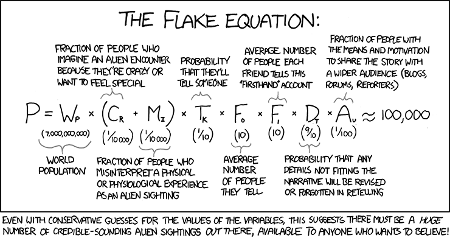
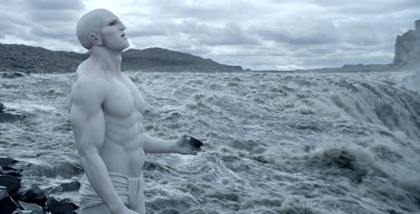

Je suis [récemment tombé](http://io9.com/5970501/the-great-filter-theory-suggests-humans-have-already-conquered-the-threat-of-extinction) sur un texte étonnant datant de 1998 : "[The Great Filter - Are We Almost Past It?](http://hanson.gmu.edu/greatfilter.html)" de [Robin Hanson](http://www.google.com/url?q=http%3A%2F%2Fhanson.gmu.edu%2F&sa=D&sntz=1&usg=AFQjCNGUOr_j3eU-rVfWRpddaQ6E21wuFQ) professeur d'économie passionné de science-fiction ([son blog](http://www.overcomingbias.com/)). En cette fin d'année de fin du monde, j'ai traduit en français (avec la permission de l'auteur) ce texte d'un optimisme apocalyptique qui intègre plusieurs sujets de réflexion déjà abordés sur drgoulu.com. Truffé de notions surprenantes et d'idées originales, mais parfois discutables, je vous le livre tel quel (j'ai juste ajouté quelques illustrations pour égayer le tout). Mes commentaires seront dans les commentaires, avec les vôtres je l'espère.

## Le Grand Filtre - l'avons nous bientôt passé?

L'humanité semble avoir un bel avenir, à savoir une possibilité non nulle de remplir durablement l'univers de vie.

Mais le fait que l'espace autour de nous semble mort nous dit maintenant que n'importe quelle parcelle de matière inerte est confrontée à une chance astronomiquement faible d'atteindre un tel futur. Il existe donc un Grand Filtre entre la mort et l'expansion durable de la vie, et l'humanité fait face à une inquiétante question: où nous trouvons-nous par rapport à ce filtre?

En combinant ce que nous disent les biologistes, les astronomes, les physiciens et les chercheurs en sciences sociales, on s'attend à un filtre bien plus petit que ce que l'on observe.  Donc, l'une de ces disciplines doit avoir tort. Pour savoir qui a tort et pour informer nos choix, nous devrions étudier et reconsidérer tous ces domaines. Entre autres, nous devrions chercher des preuves de l'existence des extraterrestres, par exemple via des signaux, des fossiles, ou l'astronomie. Contrairement aux attentes habituelles, la preuve de vie extraterrestre sera probablement négative, mais ce sera une information de valeur. Car plus il aura été facile à la vie d'évoluer jusqu'à notre stade, plus nos chances futures sont probablement sombres.

### Introduction

Fermi, Dyson, Hart, Tipler et d'autres \[Finney & Jones, Dyson 66, Hart 75, Tipler 80] ont relativisé la pertinence de SETI (recherche  d'intelligence extraterrestre) par le "Grand Silence" [Brin 83], aussi connu sous le nom de [paradoxe de Fermi](w:) : le fait est que les extraterrestres n'ont pas colonisé la Terre pour le moment. Cependant, ce qui n'a pas encore été suffisamment mis en évidence ou analysé est la pertinence de ce fait dans les choix très importants que nous effectuons aujourd'hui.

Le Grand Silence doit nous forcer à réviser une ou plusieurs idées communes en biologie, astronomie, physique ou sciences sociales. Et certaines de ces révisions suggèrent fortement que l'humanité sera beaucoup plus consciente d'éventuelles catastrophes. Afin de clarifier ces points, le présent document examinera d'abord comment nos idées actuelles dans ces domaines nous conduit à ne pas attendre le Grand Silence, et examinera ensuite une variété de révisions possibles que nous pourrions envisager.

### La vie colonisera

Jusqu'à présent, la vie sur Terre semble avoir adapté sa technologie pour remplir chaque niche écologique qu'elle pouvait. Des populations et espèces auparavant stables ont constamment augmenté dans les frontières nouvellement ouvertes. Toutes les formes de vie semblent avoir connu une "phase de dispersion" pour encourager la colonisation, avec des mutations non-triviales et des mélanges sexuels permettant l'exploration de nouvelles technologies [Tipler 80].

De même, l'humanité a continué à progresser technologiquement, et à remplir de nouvelles niches géographiques et économiques lorsque c'est devenu technologiquement faisable. Par exemple, alors que la Chine impériale s'était fermée à l'exploration pour un temps, d'autres peuples concurrents comme les Européens en ont profité pour remplir l'espace.

Ce phénomène est facile à comprendre dans une perspective évolutive. En général, il n'y a besoin que de quelques individus d'une même espèce pour tenter de combler une niche écologique, même si toutes les autres formes de vie n'y sont pas intéressées. Les mutations qui encouragent de tels essais peuvent être richement récompensées. De même, nous nous attendons à ce que la compétition interne entre notre propre descendance continue à progresser technologiquement et à occuper de nouvelles niches à mesure qu'elles deviennent technologiquement et économiquement accessibles.

La colonisation a été une expérience cohérente avec la vie sur Terre sur le long terme, et notre compréhension actuelle des systèmes sociaux humains suggère cela va continuer. Bien que les humains évoluent dans une combinaison complexe et co-évolutive de systèmes organisationnels, culturels, [mémétiques](w:mémétique) et génétiques, tous ces systèmes montrent des tendances à long terme à utiliser des ressources en faveur de la reproduction.

Ainsi, il faut s'attendre à ce que, lorsque le voyage spatial sera possible,  certains de nos descendants essayeront de coloniser  les planètes pour commencer, puis les étoiles, et enfin d'autres galaxies. Et nous devrions nous attendre à une telle expansion, même si la plupart de nos descendants se contenteront de regarder leur nombril, de craindre la concurrence des colons [Benford 81], d'avoir peur du contact avec des extraterrestres et de vouloir préserver l'univers dans son état naturel. Au moins, nous devrions nous attendre à ceci aussi longtemps qu'une société a suffisamment de compétition interne pour permettre à assez de ses membres d'avoir et de promouvoir d'autres points de vue. Après tout, les nombrilistes accros à la réalité virtuelle pourraient en vouloir plus, plus de masse et d'énergie (de [néguentropie](w:) pure) pour construire et faire fonctionner des ordinateurs plus puissants, et devraient vouloir s'étendre pour atténuer les catastrophes locales [Zuckerman 85].

Un million d'années est une période courte à l'échelle cosmique, mais elle est plus que suffisante pour qu'un taux de croissance de la population anecdotique (> .001% / an.)  submerge les limites physiques fondamentales sur la puissance de calcul disponible dans tout l'univers observable [Zaslavskii 96]. Ceci demeure vrai même en utilisant les trous noirs pour la néguentropie et des ordinateurs quantiques pour les calculs, dont chacun élève au carré les ressources disponibles par rapport aux approches standard. Ainsi, nous avons de bonnes raisons de partir de l'idée que toutes les ressources inutilisées seront colonisées sur des échelles de temps cosmologiques, même si nous trouvions d'autres civilisations avec qui communiquer ou vers lesquelles nous "téléporter" [Scheffer 94].



La théorie évolutionniste suggère même [Hansson et Stuart 90] que la pression de la concurrence entre les colons devrait encourager à maximiser le taux de croissance économique pour que ceux qui voyagent trop lentement, s'attardent trop longtemps ou choisissent de ne pas se reproduire [Stephenson 79] soient dépassés par les autres. Des sondes de plus en plus rapides et prenant de plus en plus de risques doivent être lancées de plus en plus loin pour avoir une chance d'être le premier à coloniser un vaste territoire vierge.

Techniquement, une telle colonisation de l'espace semble possible, même si c'est bien au-delà de nos capacités actuelles étant donné que nous pouvons d'ores et déjà envisager les technologies requises.  Des vaisseaux interstellaires autonomes lents seraient seraient à peu près faisables maintenant si nous étions assez riches pour les construire. Et des sondes [interstellaires](http://www.foresight.org/Conferences/MNT05/Papers/Bishop/index.html) rapides de moins d'un kilogramme [Forward 85,87] auto-reproductrices [Tipler80] basées sur les [nanotechnologies [Drexler 92b] [dotées d'intelligence (artificielle ou téléchargée)](http://hanson.gmu.edu/uploads.html) [Hanson 94]) semblent possibles d'ici quelques siècles.

Il n'y a pas de limite évidente à la vitesse d'un vaisseau spatial (autre que celle de la lumière) si l'on dispose des ressources suffisantes. Et avec un contrôle total  (nanotechnologique) de la structure atomique de la matière [Drexler 92a], les colons seront principalement intéressés par les atomes et la néguentropie qu'ils pourront extraire d'un site de colonisation [Dyson 66,79], ainsi que par la commodité de son emplacement.

### Le Point de Donnée

Par conséquent, pendant le prochain million d'années (au plus), nos descendants pourraient avoir une chance envisageable (supérieure à un pour mille) d'atteindre un "point explosif" d'où ils s'étendront vers l'extérieur à une vitesse proche de celle de la lumière, pour coloniser notre galaxie, puis l'univers, en écrasant toute forme de vie moins développée sur son chemin. Le voyage à [vitesse supraluminique](w:vitesse_supraluminique) impliquerait une expansion encore plus rapide.

Nous nous attendons à ce qu'une telle explosion comble toutes les niches disponibles contenant des ressources massiques ou néguentropiques utilisables. Et même si la plupart des précieuses ressources sont situées entre les étoiles ou aux centres galactiques, nous devons nous attendre à ce que certains de nos descendants fassent usage de la plupart de la matière et des ressources énergétiques qu'ils pourront économiquement atteindre, y compris celles situées dans des systèmes solaires "marginaux" comme le nôtre et ceux proches du nôtre.

Une fois qu'une telle explosion dépasse l'échelle où une catastrophe unique comme une supernova pourrait la détruire, elle peut devenir une explosion "durable" de vie avancée qui ne peut être stoppée que par une autre explosion de vie avancée similaire.  Après cela, si une catastrophe détruit une colonie établie de longue date, d'autres colons devraient bientôt revenir réessayer.

Sans voyages supraluminiques imposant une conformité, nous ne devrions pas être surpris par une grande diversité entre les différentes parties d'une explosion, et plus encore entre explosions différentes [Hoerner 78]. On s'attendra par exemple à différentes cultures, différentes langues, et de légères modifications du corps. Nous nous attendons cependant à une beaucoup moins grande diversité, en ce qui concerne les choix qui conduiraient une civilisation ou une entité à un fort désavantage concurrentiel en matière de reproduction.

Par exemple, si l'on peut imaginer des sondes prédatrices envoyés pour rechercher et détruire d'autres formes de vie [Brin 83], il est plus difficile de comprendre pourquoi de telles sondes ne coloniseraient pas de manière agressive les systèmes qu'elles ont visités, si une telle colonisation était peu coûteuse. Une colonisation agressive donnerait aux sondes la possibilité de se multiplier, et d'interdire l'accès aux ressources par des compétiteurs.  Si cet effort de colonisation pouvait cacher ses origines à ceux qui pourraient exercer des représailles, qu'y aurait-il à perdre?

De même, si certains groupes pourraient vraisemblablement laisser certains endroits "en jachère" comme "réserves naturelles" génératrices d'information [Fogg 87], il est beaucoup plus difficile d'imaginer que la majorité des lieux serait ainsi préservée. Il devrait y avoir des des rendements décroissants à ces informations, et les groupes qui utilisent plus de leurs ressources devrait avoir un avantage concurrentiel. Et étant donné l'immensité de l'espace, des ressources substantielles devraient être utilisées pour empêcher des "braconniers" de se glisser dans une telle réserve pour la coloniser.

Enfin, nous nous attendons à ce que la vie avancée perturbe sensiblement les lieux qu'elle colonise. Chaque fois que les systèmes naturels ne sont pas idéalement structurés pour les besoins des colons, nous nous attendons à ce que des changements soient apportés. Et à moins que les structures idéales imitent toujours étroitement les apparences naturelles ou soient effectivement invisibles, nous nous attendons à ce que la vie avancée produise des changements visibles.

Par exemple, il suffit d'une petite quantité de déchets nucléaires déversés sur une planète pour changer visiblement son spectre [Whitmire & Wright 80.] Et une civilisation pourrait convertir assez d'astéroïdes d'une étoile en collecteurs d'énergie solaire orbitaux pour recueillir une fraction substantielle de cette production stellaire, et ainsi modifier sensiblement l'apparence spectrale, temporelle et spatiale de l'étoile. Les colons les plus avancés pourraient même démonter des étoiles [Criswell 85] ou les enfermer dans des [sphère de Dyson](w:) en moins d'un million d'années après leur arrivée. Des galaxies pourraient même être complètement restructurées [Dyson 66].

Si une telle vie avancée avait déjà substantiellement colonisé notre planète, nous le saurions.  Nous saurions également savoir si elle avait restructuré une grande partie de la ceinture d'astéroïdes de notre système solaire (bien que de plus petites colonies pourrait être difficile à détecter [Papagiannis 78]). Et elle n'a certainement pas démonté Jupiter ou notre Soleil. Nous devrions même être au courant si elle avait agressivement colonisé des étoiles proches mais nous avaient conservés comme "réserve naturelle".

Notre planète et notre système solaire, cependant, ne semblent pas substantiellement colonisés par une forme compétitive de vie avancée venue des étoiles, ni rien d'autre que ce que nous voyons. Au contraire, nous avons expliqué avec beaucoup de succès le comportement de notre planète et du système solaire, des étoiles à proximité, de notre galaxie et même d'autres galaxies par de simples processus physiques "morts" plutôt que par les processus complexes et finalistes de la vie avancée. Compte tenu de la similitude de notre galaxie avec les galaxies proches, il est même difficile de voir comment notre galaxie toute entière pourrait être une "réserve naturelle" parmi des galaxies sensiblement restructurées.

Ces considérations suggèrent fortement qu'aucune civilisation de l'univers passé n'a atteint un tel "point explosif", à devenir la source d'une expansion à vitesse de la lumière par une colonisation en profondeur. (C'est-à-dire, aucune civilisation dans le [cône de lumière](w:) d'un million d'années pour nous,  voir l'[annexe technique](#annexe) ci-dessous. Beaucoup de conséquences découlent de ce "point de donnée" unique [Hart 75, Tipler 80].

### Le Grand Filtre

Pensez à notre meilleure idée du chemin évolutionniste vers l'explosion qui conduit à une colonisation visible de la plupart de l'univers visible :

1. Le bon système stellaire, contenant des molécules organiques
2. Quelque chose d'auto-reproductif (par exemple, l'[acide ribonucléique](w:))
3. Un simple organisme unicellulaire ([procaryote](w:))
4. Des unicellulaires complexes ([archées](w:Archaea) et [eucaryotes](w:eucaryote))
5. La reproduction sexuée
6. Organismes multicellulaires
7. Animaux utilisant des outils grâce à leur gros cerveau
8. Où nous en sommes maintenant
9. Explosion colonisatrice

(Cette liste d'étapes n'est pas censée être complète.) Le Grand Silence implique que l'un ou plusieurs de ces étapes sont très improbables; il y a un "Grand Filtre" le long du chemin entre les choses inertes et la vie explosive. La grande majorité vaste des choses qui commencent le long de ce chemin n'arrivent pas au bout.En fait, jusqu'à présent, rien parmi les milliards de milliards d'étoiles dans notre univers passé n'a parcouru l'entier du chemin.  (Il se peut bien sûr qu'une telle explosion ait lieu en dehors de notre cône de lumière [Wesson 90].)

Le fait que notre univers semble fondamentalement mort suggère qu'il est très très difficile à une vie durable et avancée de s'établir. Et si il existait d'autres voies radicalement différentes à l'expansion de vie durable [Shapiro & Feinberg 82], ça ne ferait qu'aggraver le problème, ce qui implique que le filtre le long de notre chemin doit être encore plus large.

### Une histoire est fausse.

Les biologistes d'autres scientifiques ont travaillé dur pendant longtemps pour fournir des explications plausibles à chacune des étapes de l'évolution énumérés ci-dessus, explications qui ne rendent aucune étape particulièrement improbable. Des modèles plausibles ont été proposés sur la façon dont l'ARN a évolué pour se reproduire, comment de simples cellules (procaryote) se sont développées autour de lui, [comment les cellules sont devenues plus complexes](http://sssf.byethost31.com/dna/symb.htm) (eucaryotes), comment les cellules se sont réunies en organismes, comment le cerveau et les mains évolué à partir de simples mécanismes de contrôle, et comment notre cerveau et nos mains ont conduit à l'utilisation des outils et à la génération de scénarios qui nous ont menés là où nous en sommes aujourd'hui.

Ensemble, ces explications plausibles ont convaincu d'innombrables équipes de construire des estimations relativement élevés de la probabilité qu'une quelconque planète finisse par produire une vie intelligente comme la nôtre par des estimations relativement faibles de chaque facteur de filtre dans la célèbre "[équation de Drake](w:)".

De même, les "optimistes technologiques" ont utilisé des tendances économiques standard et notre compréhension des processus évolutifs  pour soutenir la plausibilité de l'histoire mentionnée ci-dessus, selon laquelle nos descendants ont une bonne chance de coloniser notre système solaire, puis, au moyen de technologies de voyages spatiaux plus en plus rapides et fiables, coloniser d'autres étoiles et galaxies. Si c'est le cas, nos descendants ont une chance raisonnable d'atteindre le "point explosif" dans un laps de temps cosmologiquement court (disons un million d'années).

Bien sûr, beaucoup de gens ne considèrent pas ce scénario comme particulièrement "optimiste"; ils préféreraient que nos descendants choisissent une voie plus stable, moins susceptibles de "troubler l'univers". Mais je vais continuer à utiliser le mot "optimiste" pour décrire ce scénario, parce que même les fanatiques  de la stabilité devraient être préoccupés par les implications d'une humanité ne vivant pas assez longtemps ou n'étant pas assez libre pour avoir même une chance sur un million par exemple, qu'un seul de nos descendants puisse s'échapper et coloniser l'espace.  Il semble que tout scénario raisonnablement non pessimiste comporterait une chance non négligeable qu'au moins certains de nos descendants puisse choisir la voie explosive au cours du prochain million d'années.

Bien que toutes ces histoires aient un minimum de plausibilité, notre principal "point de donnée" implique qu'au moins une de ces histoires plausibles est fausse : une ou plusieurs de ces étapes sont beaucoup plus improbables qu'elles n'en ont l'air. Si c'était l'une de nos étapes passées, comme  le développement d'un unicellulaire, alors il ne faut pas s'attendre à voir une autre forme de vie ayant évolué indépendamment à moins de quelques milliards d'années-lumière de nous. Mais s'il s'agit d'une étape entre maintenant et le choix d'exploser qui est très improbable, nous devrions craindre pour notre avenir. À tout le moins, notre potentiel serait beaucoup moins élevé qu'il n'y paraît. L'optimisme (tel que défini ici) en ce qui concerne notre avenir est directement opposé à l'optimisme quant à la facilité des précédentes étapes de l'évolution. Dans la mesure où ces succès étaient faciles, notre incapacité future à exploser est presque certaine.

Notez que cette source d'inquiétude repose sur une base différente de celle des simples arguments statistiques de Gott [Gott 93] et Leslie [Leslie 96] selon lesquels, toutes choses étant égales par ailleurs, il ne faut pas s'attendre à ce qu'il y ait beaucoup plus d'humains à l'avenir que ce qu'il y en a eu dans le passé. Bien que ces arguments ne doivent pas être ignorés, leur force dépend beaucoup des hypothèses auxiliaires que l'on fait sur d'autres informations pertinentes. En revanche, la conclusion selon laquelle le Grand Filtre est très grand est relativement insensible à d'autres hypothèses.

### Il importe de savoir qui a tort

Un optimisme rationnel quant à notre avenir n'est donc possible que dans la mesure où nous pouvons trouver de précédentes étapes évolutives qui soient vraisemblablement plus improbables qu'elles n'y paraissent. Inversement, sans telles découvertes, nous devons envisager la possibilité que nous avons encore à traverser une partie substantielle du Grand Filtre. Si c'est le cas, alors nos perspectives sont sombres, mais connaître ce fait peut au moins nous aider à améliorer nos chances.

Par exemple, si nos perspectives s'avéraient sombres nous devrions prendre particulièrement au sérieux les scénarios plausibles, comme une guerre nucléaire ou une catastrophe écologique, qui pourraient conduire à notre incapacité future d'exploser à travers l'univers. Une longue liste de tels sujets de préoccupation peut être trouvée dans [Leslie 96]. Notre point de donnée principal, le Grand Silence, nous dit qu'au moins un de ces scénarios est beaucoup plus probable qu'il n'y paraît.

Avec un tel avertissement en main nous pourrions par exemple prendre des précautions supplémentaires pour protéger nos écosystèmes, peut-être même à un coût considérable pour notre croissance économique. Nous pourrions même être particulièrement prudents en ce qui concerne la possibilité de détruire le monde par des expériences de physique. Et nous pourrions accorder une priorité bien plus élevée à des projets comme Biosphère 2, qui pourraient permettre à une partie de l'humanité de survivre à un grand désastre.

Pour savoir si un tel sacrifice est nécessaire, l'humanité ferait bien d'étudier tout ce domaine avec beaucoup plus de soin, compte tenu de toutes les explications plausibles du Grand Filtre. Pour encourager ces études, le reste de cet article tentera d'examiner l'état actuel de nos connaissances, en considérant tour à tour les différentes possibilités  sur qui a peut-être tort, et les divers types d'indices qui pourraient clarifier la question.

### Reconsidérer la biologie

Tout d'abord, examinons et reconsidérons nos connaissances en biologie, en gardant un œil sur les précédentes étapes de l'évolution qui pourraient être plus improbables qu'elles ne semblent.

Beaucoup d'hypothèses théoriques ont été proposées pour rendre diverses étapes de l'évolution relativement probables, du moins sur le long terme. Étant donné la complexité du sujet, cependant, ces hypothèses sont , de manière compréhensible, sommaires. Ainsi, la façon simpliste selon laquelle ces théories pourraient être fausses serait d'avoir ignoré certains facteurs et éléments importants. En règle générale, les modèles simples plausibles ne parviennent bien souvent pas à capturer l'essence de phénomènes complexes.

Il convient également de noter que de nombreux biologistes s'attendent à un grand filtre, et non un petit, entre la matière inerte et la vie intelligente utilisant des outils comme la nôtre.  Ils se sont plaints que les astronomes qui estiment les facteurs de l'équation de Drake ne connaissent pas suffisamment la biologie, et ils notent en particulier que l'utilisation généralisée d'outils comme on en voit chez les humains n'est apparue qu'une seule fois, et pourrait être un accident très peu probable de l'évolution [Simpson 64, Mayr 85,95].

Dans tous les cas, il s'avère que l'idée même qu'une partie significative du Grand Filtre réside dans notre évolution passée a des implications importantes qui peuvent nous aider  à évaluer cette hypothèse [Carter 83, Hanson 96].

Tout d'abord, distinguons deux types différents d'étapes évolutives. Appelons "discrète" une étape évolutive qui doit réussir dans un laps de temps donné, un échec impliquant un échec définitif , pour toujours. Par exemple, si un certain type de système solaire est requis, alors le succès ne peut se produire ici que si un tel système solaire se forme.  D'autre part, appelons, "essais et erreurs" une étape qui ressemble à une recherche d'un optimum dans un terrain presque plat, où l'échec d'aujourd'hui n'affecte pas beaucoup les chances d'un succès demain. Les implications principales du Grand Filtre concernent les étapes du type "essais et erreurs".

Considérons une situation où un certain nombre d'étapes "essais et erreurs" doivent être  effectuées dans un certain ordre et dans une certaine fenêtre temporelle.  Autrement dit, à chaque étape il y a une certaine probabilité uniforme par unité de temps d'achever cette étape, étant donné que l'étape précédente a été passée. Si la probabilité de terminer toutes les étapes pendant la fenêtre temporelle est faible, il s'avère que dans les cas où toutes les étapes ont été franchies, le temps moyen pour terminer chaque étape difficile n'est pas corrélé à la difficulté de l'étape!

Par exemple, disons que vous avez une heure pour ouvrir par "essais et erreurs" cinq cadenas à numéros à respectivement 1,2,3,4,5 rangées de 10 chiffres.  Le temps moyen d'ouverture des cadenas serait respectivement de 0.01, .01, .1, 1, 10, et 100 heures.  Alors, en considérant seulement les rares cas où vous avez ouvert les 5 cadenas en 1 heure, le temps moyen d'ouverture des 2 premiers serait .0096 et .075 respectivement, proches des temps attendus de 0.01 et 0.1 heure. Le temps moyen pour ouvrir le troisième cadenas serait cependant de 0,20 heures, et le temps moyen pour l'ouverture des deux derniers serait de 0.24 heure. Ce qui signifie que, étant donné un succès final, toutes les étapes difficiles, aussi difficiles qu'elles soient, prennent à peu près le même temps, alors que les étapes faciles prennent à peu près le temps attendu (voir [annexe technique](#annexe)) Et toutes ces durées d'étapes (ainsi que le reste du temps) suivent approximativement une distribution exponentielle, avec un écart type d'au moins 76% de la moyenne. (Les modèles où la durée de la fenêtre temporelle est également aléatoire donnent des résultats similaires.)

Nous pouvons appliquer ce modèle à l'évolution de la vie sur Terre, en examinant les fossiles pour découvrir que les innovations majeures sont à peu près équidistantes. Une telle analyse peut compléter d'autres recherches pour trouver les étapes intrinsèquement difficiles, nécessaires et utiles dans l'histoire de l'évolution, comme l'ont tenté [Barrow et Tipler 86]

Les archives fossiles montrent environ cinq périodes à peu près équidistantes entre les grands changements évolutifs depuis la Terre s'est formée [Schopf 92, Skelton 93]. Plus précisément, les premiers fossiles clairs d'unicellulaires datent de 0,9 milliards années après que la Terre se soit refroidie (il y a 4,5 milliards d'années), bien que d'autres indices suggèrent que la vie soit apparue après 0,5 milliards années déjà [Balter 96]). Les plus anciens unicellulaires complexes fossiles (apparemment eucaryotes) apparaissent environ 2,0 milliards d'années après cette première étape.  0,8 milliards années plus tard, le rythme de l'évolution accélère de façon spectaculaire, peut-être avec l'invention du sexe [Schopf 95], puis 0,5 milliards années plus tard, nous voyons les premiers fossiles importants de la vie multicellulaire [Knoll 95]. Enfin,0,6 milliards années de plus nous emmènent là où nous en sommes aujourd'hui.

Bien que ces périodes ne soient pas exactement égales, elles sont à peu près compatibles avec la distribution (environ exponentielle) des durées entre les étapes difficiles prévues par le modèle d' "essais et erreurs" ci-dessus.  Certaines complications et mises en garde doivent cependant être considérées.

Tout d'abord, en supposant que la première étape se soit passée sur Terre, tout ce que nous savons vraiment est qu'il a dû se passer quelque temps entre le moment où la planète s'est refroidie suffisamment pour accueillir la vie et l'âge des plus anciens fossiles, qui se trouvent également être les plus anciennes roches connues où il était possible de voir de tels fossiles. Ainsi, tout ce que nous pouvons dire, c'est que cette première étape a pris entre 0,0 et environ 0,5 milliards d'années. Et puisque l'environnement de la Terre primitive était inhabituel, il peut y avoir eu une fenêtre spéciale d'opportunité pendant laquelle plusieurs étapes "discrètes" ont eu lieu.

Deuxièmement, l'apparition des premiers fossiles d'unicellulaires complexes correspond de près à la transition de la Terre vers une atmosphère dominée par l'oxygène, une transition qui semble avoir attendu la lente oxydation du fer des océans. Comme les eucaryotes ont besoin d'oxygène pour respirer, ils n'auraient probablement pas pu se répandre avant ce point. Donc, une difficile étape "essais et erreurs" n'a probablement pas eu lieu à cette époque. Une ou plusieurs étapes difficiles ont pu avoir lieu avant, mais dans des populations trop petites pour apparaître dans les archives fossiles. Le "potentiel" créé par ces étapes difficiles a pu avoir besoin d'un changement de l'environnement afin de "fleurir".

Troisièmement, la fameuse explosion cambrienne d'il y a environ 0,6 milliards d'années a également coïncidé avec des modifications indépendantes de l'environnement, tels que la rupture d'un super-continent et la fin de la pire glaciation de la Terre.  Si nous pensons aux évènements environnementaux comme étant aléatoires, nous pouvons modéliser ceci comme une double étape biologique / environnementale difficile : une étape biologique difficile a d'abord créé un potentiel, potentiel qui n'a pu être réalisé qu'après une étape difficile environnementale compatible ultérieure.

Enfin, la taille du cerveau par rapport à la taille du corps a augmenté régulièrement chez les mammifères et les oiseaux depuis l'extinction massive d'il y a 65 millions d'années (très probablement causée par un évènement extérieur comme un astéroïde) qui a éliminé la concurrence des dinosaures \[Russell 83, Jerison 91]. Ainsi, si de grands cerveaux étaient l'étape difficile la plus récente, cette étape devrait être placée il y a environ 0,3 milliards années là où l'on retrouve l'ancêtre commun le plus récent des mammifères et des oiseaux, peu après l'invention de l'œuf [amniotique](w:Amniota) (ce qui a permis aux animaux de coloniser la terre) [Ostrom 92]. Sinon, peut-être que la plus récente étape difficile a été le développement d'un langage potentiel chez les mammifères et non chez les oiseaux, un potentiel qui n'a pas été exploité jusqu'à ce que les cerveaux deviennent suffisamment grands. (Mayr semble penser que les oiseaux n'étaient pas à la hauteur de la tâche [Mayr 85]).

En rassemblant tout ceci, une meilleure estimation des étapes difficiles serait la suivante. Premièrement, une ou plusieurs étapes difficiles eurent lieu dans les premières 0,5 milliards d'années après que la Terre ait refroidi. Puis zéro ou plus étapes difficiles eurent lieu en attendant que le fer de l'océan s'oxyde. Ensuite, une ou plusieurs difficiles ont eu lieu au cours des prochaines 0,8 milliards d'années, la dernière (peut-être l'invention du sexe ou celle des cellules archées) ayant finalement libéré le potentiel d'affecter le registre fossile il y a environ 1,2 milliards d'années.

Une double étale biologique / environnementale a alors eu lieu au cours des 0,5 milliard d'années suivantes pour répandre la vie multicellulaire puis, 0,3 milliard d'années plus tard, l'étape difficile de l'invention de l'œuf amniotique eut lieu. Enfin, au cours des dernières 0,3 milliard d'années, il n'y a eu soit aucune étape difficile et la génération continue de nouvelles possibilités, soit y a eu une étape difficile simple ou double, quelque chose comme l'invention d'un potentiel de langage des mammifères, qui a nécessité un évènement aléatoire (mais peut-être pas rare) de l'environnement il y a 65 millions d'années pour commencer à être libéré.

Un durée typique d'environ 0,3 milliards années entre étapes difficiles semble correspondre simplement à ces données. Et avec cette correspondance, il est alors naturel d'estimer à qu'une étape difficile a eu lieu au début de la vie, puis entre zéro et huit étapes jusqu'à la complexité, deux à trois étapes jusqu'au sexe, une double étape à la société, une étape berceau unique, et peut-être une étape finale jusqu'au langage. Dans l'ensemble, nous pouvons estimer grossièrement le total des étapes difficiles entre sept et neuf.

Ce modèle suggère un certain nombre de prédictions qui peuvent aider à le confirmer ou l'infirmer. Par exemple, ce modèle prédit que le temps restant jusqu'à ce que la fenêtre d'opportunité pour la vie sur Terre se ferme est d'environ 0,3 milliards années [Carter 83]. Ce modèle pourrait donc être confirmé par l'analyse astronomique pour ce qui concerne durées moyennes jusqu'à ce que la Terre subisse un effet de serre galopant, une glaciation irréversible, une trop forte teneur en oxygène pour la vie terrestre puisse persister, une grave instabilité du Soleil, une supernova proche, un énorme impact d'astéroïde ou une autre catastrophe liée au voyage du soleil à travers la galaxie [Barrow et Tipler 86, Leslie 96].

Ce modèle implique également que, comme certaines étapes de l'évolution  ont duré suffisamment longtemps, le temps réellement mis n'indique pas la difficulté des étapes. Ainsi, nous devrons utiliser d'autres indices pour trouver les étapes les plus difficiles parmi les difficiles. Enfin, ce modèle suggère fortement que nos ancêtres ont traversé au plus une étape "essais et erreurs"  pendant les cent derniers millions d'années. Cette dernière étape peut cependant avoir nécessité une conjonction spéciale d'éléments, tels que de grands cerveaux et de bonnes mains apparaissant chez le même animal en même temps. (Ces prédictions supplémentaires de ce modèle n'ont pas été publiés ailleurs à ma connaissance.)

A ces environ neuf étapes biologiques difficiles nous pourrions ajouter deux autres étapes discrètes (aléatoires, mais pas du type "essais et erreurs"): une étape initiale pour que la bonne sorte de planète orbite autour du bon type de soleil, et une étape finale où l'humanité réussit, ou se détruit prochainement. Ensemble, ces onze étapes pourrait expliquer le Grand Filtre si la moyenne (logarithmique) de chaque filtre variait au moins d'un facteur cent. Autrement dit, il pourrait y avoir en moyenne, soit une chance d'un pour cent de passer une étape discrète, ou un temps attendu de 30 milliards d'années pour terminer une étape "essais et erreurs".Evidemment, le Grand Filtre n'a pas besoin d'être réparti uniformément entre ces étapes; seule la question insidieuse de la proportion du filtre qui reste dans la dernière étape motive notre analyse.

L'indice récent de vie unicellulaire sur Mars [McKay. al. 96] est pertinente pour reconsidérer les étapes préalables à la vie unicellulaire. S'il y a vraiment eu de la vie unicellulaire au début de l'histoire de Mars, et si nous trouvons qu'elle était assez différente pour impliquer qu'elle ait probablement évolué indépendamment de la vie sur Terre, et à moins que la Terre et Mars aient partagé le même environnement inhabituel, l'étape totale depuis "matière inerte autour du bon soleil" jusqu'à "unicellulaires" doit être assez facile. Un optimisme futur pourrait alors être fondé sur d'autres étapes antérieures.

Si la vie a évolué sur une de ces planètes, et a été propagée à l'autre via une panspermie locale, alors nous n'en savons pas beaucoup plus qu'auparavant. Mais si la vie unicellulaire a commencé avant notre système solaire, et s'est répandue ici via un panspermie plus large [Crick 73, Weber & Greenberg], alors ça pourrait aider. Il pourrait alors y avoir eu beaucoup plus d'étapes difficiles par "essais et erreurs"prenant peut-être dix milliards d'années. Cela semble particulièrement plausible étant donné la complexité étonnante de la vie primitive que nous voyons, et que cette vie ait survécu pratiquement inchangée jusqu'à ce jour.

Ce scénario de panspermie large permet aussi aux étapes antérieures à la vie unicellulaire d'être plus improbables dans une région donnée de l'espace, mais au prix de rendre l'étape suivante d'autant plus probable en offrant davantage d'endroits d'où commencer. Une panspermie large d'unicellulaires complexes pourrait également être possible mais semble moins probable étant donné que de telles formes de vie semblent moins robustes face aux environnements extrêmes, et davantage ajustées à l'environnement terrestre [Crick 81].

Des signaux radio émis par des intelligences extraterrestres serait bien sûr des informations riches sur sur la taille complète du filtre jusqu'au point où ces signaux sont possibles. Non seulement cette information aiderait à cerner nos hypothèses biologiques, mais ce serait apparemment aussi de mauvaises nouvelles pour notre avenir explosif. Et plus l'origine de ces signaux serait proche, pire ce serait (voir cependant la discussion sur l' "[hypothèse du zoo](w:)" ci-dessous). Inversement, des résultats négatifs serait de bonnes nouvelles, et cette perspective devrait encourager de telles recherches. Notez que ceci est le contraire de la justification habituellement offerte par [les chercheurs de SETI](http://www.seti-inst.edu/), qui soulignent habituellement la valeur des informations que les extraterrestres pourraient nous envoyer.

La recherche sur SETI et l'évolution de la vie fait bien plus que satisfaire la curiosité intellectuelle : elle nous offre de l'information unique à long terme quant à l'avenir de l'humanité.

### Reconsidérer l'astrophysique

Il y a aussi plusieurs façons dont nous pourrions reconsidérer notre compréhension de la physique et de l'astronomie pour aider à expliquer le Grand Filtre.

Une possibilité est que le voyage spatial et la colonisation rapide des étoiles et des galaxies est beaucoup plus difficile qu'il n'y paraît, et en pratique impossible, même pour des machines nanotechnologiques intelligentes. Le milieu interstellaire, par exemple, pourrait être beaucoup plus sévère que nous l'imaginons. Cela donne à penser que nous avons de bonnes chances de survivre, mais peu de quitter notre système solaire à une vitesse importante. Plus la vitesse maximale est faible, moins le Grand Filtre doit être expliqué.

Une autre possibilité est que l'univers est beaucoup plus petit que l'on croit, peut-être en raison d'une topologie non triviale, de sorte que notre cône de lumière passé contient beaucoup moins qu'il n'y paraît. Cela permettrait également de réduire la partie du Grand Filtre devant être expliquée.

Peut-être l'alternative physique la plus optimiste est qu'il serait relativement facile de créer de "bébé-univers" locaux de masse et de néguentropie illimitées, et que le processus de faire ceci très régulièrement empêche les colons spatiaux ordinaires de s'échapper de la zone, peut-être par l'intermédiaire d'une explosion de supernova locale. La portion du Grand Filtre que ceci pourrait expliquer ne dépendrait que de la régularité avec laquelle ces évasions de colons sont empêchées.

Il y a aussi trois alternatives astrophysiques "sauvant les apparences stellaires" qui pourrait expliquer pourquoi un univers apparemment mort serait réellement vivant, notre système étant un "zoo" isolé [Ball 73].

Tout d'abord, l'ingénierie d'envergure comme les capteurs solaires en orbite faits à partir d'astéroïdes, les sphères de Dyson, et le démontage stellaire pourraient être impossibles en pratique, ce qui expliquerait pourquoi les étoiles proches ont l'air si naturelles. Deuxièmement, les structures qui utilisent le mieux ces ressources pourraient parvenir presque toujours à préserver les spectres naturels et d'autres apparences. Troisièmement, notre compréhension de l'astrophysique pourrait juste être fausse, de façon que les étoiles et les galaxies apparemment mortes qui nous entourent sont en réalité bien vivantes.

Encore une autre possibilité est que la vie avancée colonise principalement la "[matière noire](http://www.eclipse.net/~cmmiller/DM/)", laissant en friche les étoiles et la matière ordinaire que nous voyons. Ce scénario exigerait une version plus étendue de l'hypothèse du "zoo social" que j'appelle "zoo commun", discutée ci-dessous.

Notre compréhension de la matière noire en tant que simple matière inerte progresse rapidement, et pourrait aider à confirmer ou infirmer cette possibilité. De récentes observations de [lentilles gravitationnelles](w:lentille_gravitationnelle) [Bennett, et al. al. 96] indiquent que près de la moitié (et peut-être la totalité) de la matière noire dans notre halo galactique est constituée d'objets entre une masse solaire et un dixième de masse solaire, et relativement peu de dans la gamme en dessous jusqu'à la taille de la Terre.  Le plus petit objet indépendant déjà découvert , dans cette gamme est une [naine brune ](https://web.archive.org/web/20120927174802/http://hubblesite.org/newscenter/archive/releases/1995/48)de la masse de 20 à 50 masses de Jupiter qui a un spectre similaire à celui de Jupiter [Savage, Sahli, & Villard 95], ce qui est compréhensible.

### Repenser les théories sociales

Personnellement, je pense que la plus grande partie du Grand Filtre est susceptible d'être expliquée par les étapes dont je pense que nous comprenons le moins : les étapes de l'évolution biologique de la vie et de l'intelligence. Cependant, de nombreux spécialistes des sciences physiques se concentrent sur l'explication du filtre par les domaines dont ils semblent penser que nous comprenons le moins: les sciences sociales.

Les astronomes Sagan et Newman, par exemple, affirment que ce nous allons soit nous auto-détruire avec des armes nucléaires, soit apprendre à "vivre avec les autres groupes dans le respect mutuel" en perdant "nos prédispositions propres à la territorialité et l'agression. ... Cette adaptation doit s'appliquer ... avec une très grande précision, à ... chaque individu de la civilisation" afin que nous devenions "moins susceptibles de nous engager dans un impérialisme galactique agressif."[Sagan & Newman].

De même, Papagiannis affirme que "ceux qui parviennent à surmonter leurs tendances innées vers la croissance matérielle continue de matière et la remplacent par des objectifs non-matériels seront les seuls à survivre à cette crise", ce qui implique une galaxie "peuplé de civilisations stables sur le plan éthique et spirituel." [Papagiannis 84]. Et Stephenson affirme que "Pour une intelligence véritablement avancée, la recherche de la qualité plutôt que de la quantité redondante serait primordiale." [Stephenson 82].

Maintenant, bien sûr que si une fraction substantielle des civilisations suivait de tels scénarios, ces théories pourraient expliquer une petite partie du Grand Filtre.  Mais pour expliquer une partie substantielle du Grand Filtre, de tels scénarios devraient découler de situations telles que la nôtre avec une très grande fiabilité. Bien que cela soit logiquement possible, ces auteurs ne proposent aucune raison de s'attendre à une telle situation. Ces théories ressemblent donc plus à des vœux pieux qu'à des tentatives sérieuses d'expliquer le phénomène à l'aide de notre meilleure compréhension des sciences sociales.

Au contraire, alors que l'on s'attend à ce que des groupes temporairement puissants aient une plus forte tendance à la colonisation et à l'agressivité au combat, la vérification de ceci montre qu'il n'y a pas de corrélation connue entre ces facteurs, ni aucune raison théorique connue de s'attendre à une telle corrélation. Et même si un évènement ponctuel avait sélectionné une faible tendance colonisatrice, nous nous attendons à ce que de plus fortes tendances soient finalement re-sélectionnées si la variation était encore permise.

Les sociologues ont de bonnes raisons de s'attendre à ce que des populations en concurrence remplissent à la fois de nouvelles niches, et se détournent de guerres ayant de graves conséquences, et des sociologues qui ont étudié le sujet ont prévu de substantielle migrations interstellaires [Finney & Jones 85].

Compte tenu de la confusion que ce sujet semble produire, il semble utile de mentionner qu'il ne faut pas mettre de grands espoirs sur l'idée que, puisque que nous avons le contrôle sur les processus génétiques, l'intelligence peut se libérer d' "impératifs biologiques" et choisir de nouveaux buts. La mauvaise herbe ne colonise pas parce qu'elle a le but d'atteindre un impératif biologique.  Les organismes biologiques ont toujours été libres de poursuivre leur but quel qu'il soit, et d'en inventer de nouveaux. Le fait est qu'en général les créatures dont les objectifs mènent à une reproduction maximale finissent par dominer l'avenir.

De même, le contrôle de l'homme sur la génétique va changer la façon dont la variation est codée, et accélérer considérablement le processus de variation, mais il ne va pas laisser l'homme échapper au processus évolutionnaire de base : la variation et la sélection. Éviter de ce processus exigerait un contrôle global de la reproduction, ce qui implique au moins qu'un gouvernement mondial fort régule les naissances, la croissance économique locale, et même la propagation des idées, avec un processus politique suffisamment anti-démocratique pour éviter que la variation et la sélection ne s'applique au processus politique lui-même.

Les hypothèses sociales suivantes, bien qu'apparemment peu probables, sont cependant au moins un peu plausibles et ancrées dans notre compréhension des sciences sociales.

Les scénarios sociaux les plus pessimistes sont ceux comme une guerre nucléaire massive ou une catastrophe écologique. Une telle guerre dévastatrice serait plus susceptible d'arriver avant la dispersion dans le système solaire, à moins qu'elle ne puisse détruire notre soleil. Et une catastrophe écologique devrait survenir avant notre capacité à transcender notre héritage biologique, par exemple  l'intelligence des machines (artificielle ou téléchargée). Il semble possible, bien que peu probable, que seulement un monde sur un million de mondes à notre stade évite un tel destin. Comme ceci laisserait encore la plus grande partie du Grand Filtre à expliquer d'une autre manière, la perspective d'une telle possibilité est une forte motivation pour l'étude du Grand Filtre.

Un scénario similaire pourrait être une sorte de ruine sociale quelconque, du genre qui conduisit à la chute un certain nombre de civilisations anciennes relativement isolées (telles que l'Ile de Pâques), mais en beaucoup plus grave, de sorte qu'il ne reste rien qui puisse renaître de ses cendres et recommencer. Lorsque nous comprendrons mieux ces évènements historiques, peut-être serons nous en meilleure position pour écarter cette possibilité.

Un scénario de dévastation est implicitement compris dans la formulation habituelle de l' équation de Drake. Pour les précédentes étapes de l'évolution, l'équation demande la probabilité pour que le système atteigne l'étape suivante, mais à notre niveau d'évolution, l'équation demande le temps prévu jusqu'à ce que la civilisation disparaisse, et une fois disparue elle est supposée ne jamais se rétablir.

Une approche différente conduisant à d'autres théories sociales est de réaliser que si nos descendants n'ont plus suffisamment de concurrence interne, le modèle évolutionniste n'a plus besoin de s'appliquer. Par exemple, si l'on est disposé à admettre un univers clos et que le voyage supraluminique à partir d'un point d'explosion est possible, on peut supposer que la première civilisation parvenue à un point d'explosion où que ce soit a du avoir un fort gouvernement central stable (comme la Chine impériale), qui a placé une très forte valeur [idiosynchrasique](w:idiosynchrasie) de la préservation de l'aspect naturel de l'univers [Freiheit 93, Crawford 95]. En étant les premiers et en s'étendant très vite, ces défenseurs de l'environnement pourraient imposer leurs préférences à tous les retardataires.

Le voyage supraluminique pourrait être atteint par un "warp drive" comme dans \[Alcubierre 94]. Des [trous de ver](w:trou_de_ver) artificiels ne seraient pas suffisants pour s'étendre plus vite que la vitesse de la lumière parce que les extrémités des trous doivent se déplacer normalement. De "longs" trous de vers pré-existants pourraient cependant suffire.

Sans voyages supraluminiques, un scénario écologiste nécessiterait qu'une forte majorité des civilisations adhèrent d'une certaine manière à des valeurs écologistes, et qu'une politique écologiste n'impose pas à une civilisation du "laisser-aller" écologique un désavantage militaire qui l'empêcherait de tenir en respect ses concurrents.   La taille moyenne et la densité des pouvoirs non-écologistes devraient également ne pas être en contradiction avec notre observation qui ne révèle pas de telles régions cosmologiques différentes.

Aucune théorie sociale particulière n'est nécessaire pour l'hypothèse du "zoo"  [Ball 73] qui est livrée avec l'une des alternatives astrophysiques énumérées ci-dessus, qui impliquerait que les systèmes colonisés agressivement ressemblent à des systèmes naturels. Il est assez naturel de supposer que de petites fractions de l'espace seraient préservées comme réserves naturelles. Par contre on semble avoir besoin d'une théorie sociale particulière pour expliquer l'hypothèse d'un "zoo commun" selon laquelle toute la matière visible par nous a été mise de côté comme réserve naturelle.

La similitude des structures de la matière visible dans l'Univers observable devrait être expliquée par une préférence remarquablement commune pour la densité et la nature de ces réserves, et un manque généralisé de préférence pour tout "jardin" visible partiellement restructuré. Il faudrait de plus un effort remarquablement coordonné à large échelle pour punir les pouvoirs déviants qui pourraient essayer d'envoyer des signaux radio ou des sondes auto-reproductrices vers ces étoiles préservant la faune. Il faut par exemple considérer que l'énergie d'une seule étoile pourrait alimenter un signal intermittent à bande étroite détectable par la vie pré-explosive comme la notre dans l'univers entier  [Gott 82].

Je mentionne cette hypothèse du "zoo commun" non pas parce que je trouve qu'elle est particulièrement plausible, mais parce qu'elle figure parmi les scénarios les plus plausible je peux construire sans invoquer également des alternatives astrophysiques invoquant comme le voyage supraluminique.  Il illustre également les extrêmes nécessaires à la construction d'explications purement sociales cohérentes du Grand Filtre.

### Conclusion

Aucune civilisations extraterrestres n'a sensiblement colonisé notre système solaire ou des systèmes à proximité. Ainsi, parmi les milliards de milliards d'étoiles dans notre univers passé, aucune n'a atteint le niveau de la technologie et de croissance que nous pourrions bientôt atteindre. Ce seul point de donnée implique qu'un Grand Filtre se trouve entre la matière inerte ordinaire et la vie avancée explosive durable.  Et la grande question est: où en sommes-nous dans ce filtre?

Pour soutenir l'optimisme quant à notre avenir, nous devons trouver des étapes particulièrement improbables parmi les étapes de l'évolution passée. Et en fait, nous pouvons trouver un certain nombre des candidats plausibles de groupes d'étapes biologiques difficiles par "essais et erreurs" : la vie, la complexité, le sexe, la société, le berceau et le langage. En présumant qu'il y a environ neuf étapes difficiles au total, le Grand Filtre pourrait s'expliquer si le temps prévu pour chacune de ces étapes était en moyenne (logarithmique)  d'une trentaine de milliards d'années, si seulement un pour cent des étoiles pouvait accueillir ces étapes, et si nous avions seulement environ un pour cent de chances de ne pas nous auto-détruire rapidement (ou d'interdire de façon permanente la colonisation).

Alors que l'on pourrait aussi expliquer certaines parties du Grand Filtre par des approches inhabituelles de l'astrophysique ou des sciences sociales, ces hypothèses me semblent moins plausibles qu'une espérance de 30 milliards d'années pour franchir les étapes biologiques identifiées. Il y a cependant beaucoup de place pour des désaccords.

Plus la portion de filtre à laquelle nous faisons face est grande, plus l'humanité doit être prudente pour essayer d'éviter les scénarios négatifs. Afin d'effectuer des choix informés, nous ferions bien d'analyser toutes ces questions avec beaucoup d'attention et de recueillir des données plus pertinentes.

Heureusement, des progrès rapides ont été accomplis dans plusieurs domaines empiriques. L'astronomie de la matière noire pourrait bientôt confirmer ou infirmer l'hypothèse du "zoo commun".  De preuves de vie sur Mars pourraient bientôt indiquer la facilité des premières étapes de l'évolution de la vie.

D'autres progrès se poursuivent, à un rythme plus lent, mais encourageant. Une grande variété de recherches se poursuivent pour éclairer l'histoire des débuts de la vie sur Terre. La physique théorique étudie si le voyage supraluminique est possible. Et l'ingénierie spéculative contribue à estimer la faisabilité du voyage interstellaire et de grandes constructions dans le système solaire. Les astronomes et les modélisateurs globaux travaillent à évaluer combien de temps la Terre restera accueillante pour la vie (si on ne la détruit pas).  Et les sociologues continuent à améliorer notre compréhension de ce qui pourrait susciter les tendances à la colonisation ou à l'auto-destruction

Il se pourrait que bientôt un vaisseau spatial puisse tester les théories de panspermie large, peut-être par la recherche d'unicellulaires dans les comètes. Et les chercheurs de SETI continuent à tester l'hypothèse selon laquelle la vie à notre stade est dense, de sorte que nous sommes toujours confrontés à un filtre énorme. (Ils pourraient aussi envisager la recherche de diffuseurs renégats de partout dans l'univers vers le "zoo commun".)

Enfin, nous ferions bien de garder à l'esprit quelques aspects inhabituels de ce casse-tête du Grand Filtre. Tout d'abord, gardons à l'esprit sa nature interdisciplinaire.  Bien qu'il puisse être réconfortant pour chaque discipline de prétendre que le Filtre doit sûrement se trouver dans une autre discipline de moindre réputation (à leurs yeux), ces litiges doivent certainement être appuyés par une analyse détaillée utilisant notre meilleure compréhension de ces disciplines. Il n'est plus acceptable que des astronomes prétendent simplement, sans autre analyse, que les gens vont perdre leur tendance à coloniser, pas plus qu'il n'est acceptable pour les biologistes de simplement déclarer que les astronomes ne peuvent pas savoir si l'univers est aussi grand qu'ils le prétendent.

Deuxièmement, il faut se méfier du phénomène du "[Dieu bouche-trou](w:)" par lequel on qualifie de miracle tout ce que nous ne comprenons pas. Contrairement au célèbre ivrogne à la recherche de ses clés sous le réverbère, ici nous sommes tentés de conclure que les clés doivent se trouver dans quelque coin sombre que nous n'avons pas examiné, plutôt que de faire face à la conclusion désagréable que les clés peuvent être perdues à jamais.

Enfin, il faut nous rappeler que le Grand Filtre est si grand qu'il n'est pas suffisant de simplement trouver quelques étapes improbables; elles doivent être suffisamment improbables.  Même si la vie ne se développe qu'une seule fois par galaxie, il reste à expliquer le reste du Filtre: pourquoi n'avons nous n'ai pas vu une explosion arriver ici depuis une galaxie quelconque de notre univers passé ?  Et si nous n'arrivons pas à trouver le Grand Filtre dans notre passé, nous devrons le craindre pour notre avenir.

### Remerciements

Je (Robin Hanson) remercie les personnes suivantes pour leurs commentaires: Curt Adams, Niklas Bostrom, Brandon Carter , John K. Clark, Mark Crosby, Bradley Felton, Eric Watt Forste , Sean , Hastings , Eugene Leitl, John Leslie , Sean Morgan , Pat Powers, Hara Ra, And Sandberg , Damien R. Sullivan , et Michael Wiik.

### Annexe technique

Cette annexe contient une description plus précise de notre point de donnée unique, et un calcul de nouveaux résultats concernant les étapes difficiles de type "essais et erreurs" .

En ce qui concerne le point de donnée, examinons la probabilité cumulée F(t, dv) qu'un volume de l'espace dv donné (en expansiont cosmologique) aura contenu la première origine d'une voie évolutive qui résulte en une explosion (arrivant) au temps t depuis le big bang, et s'étendant pour coloniser et visiblement modifier la plupart de l'univers visible. (Plus précisément, laissons cette probabilité être contingente à l'univers survivant aussi longtemps dans son état physique familier, plutôt que, par exemple, subir une transition destructrice à un état de vide de plus bas niveau.)

Si ces probabilités sont indépendantes pour les petits volumes, le nombre attendu d'autres explosions arrivant ici jusqu'à T = l'âge de l'univers moins un million d'années est au minimum l'intégrale de F(t, dv) sur la surface du cône de lumière passé dont le sommet est un million d'années dans notre passé. En utilisant une approximation espace homogène (sans doute valide aux échelles cosmologiques), de telle sorte que F(t, dv) = F(t) \* dv, on obtient:

$\int_{t=0}^{T}4\pi F(T-t)t^2dt$

Notre point de donnée unique donne une forte preuve probabiliste que cette intégrale ne vaut pas beaucoup plus de un. Cela implique que F(t) est très petit! Par exemple, si F est indépendante du temps, de sorte que F(t) = 1-e-f.t ou approximativement f.t pour f.t petit, alors f.T.(volume-moyen-par-étoile) n'est pas beaucoup plus grand que 1 / (nombre d'étoiles dans l'univers visible),soit environ 10 -22.

Maintenant, considérons N étapes difficiles de type "essais et erreurs" qui doivent être effectuées dans une fenêtre temporelle de durée W. Si la probabilité que l'étape i prenne moins que le temps ti est 1-exp (-fi.ti) ou environ fi.ti pour fi.ti petit, alors en supposant que tous les fi \* W sont petits, la densité de probabilité jointe sur les différentes durées des étapes difficiles ti est environ ​​le produit de tous les f i, indépendant de tout ti. Sous la condition que Σ ti< W et que tout  ti>0, cette distribution traite donc tous les i à égalité, quel que soit fi. Ainsi sous condition de succès, toutes les étapes difficiles ont à peu près la même répartition des durées, quelle que soit leur difficulté. (Pour un traitement mathématique plus rigoureux , voir [Hanson 96].)

### Références

- M. Alcubierre (1994) "The warp drive: hyper-fast travel within general relativity", _Class._ _Quantum Grav._ 11:L73.
- John A. Ball (1973) "The Zoo Hypothesis", _Icarus_, 19:347.
- Michael Balter (1996) "Looking for Clues to the Mystery of Life on Earth" _Science_ August 16, 273:870-872.
- John D. Barrow, Frank J. Tipler (1986) _The Anthropic Cosmological_ _Principle_ Oxford University Press, NY.
- Gregory Benford (1981) "Extraterrestrial Intelligence?" [_Q._](http://www.google.com/url?q=http%3A%2F%2Fwww.blacksci.co.uk%2Fproducts%2Fjournals%2Fqjras.htm&sa=D&sntz=1&usg=AFQjCNEMFV2zPr9ZAsAwcrYtyNVOiSoH1Q) [_Jl. R. astr._](http://www.google.com/url?q=http%3A%2F%2Fwww.blacksci.co.uk%2Fproducts%2Fjournals%2Fqjras.htm&sa=D&sntz=1&usg=AFQjCNEMFV2zPr9ZAsAwcrYtyNVOiSoH1Q)[_Soc._](http://www.google.com/url?q=http%3A%2F%2Fwww.blacksci.co.uk%2Fproducts%2Fjournals%2Fqjras.htm&sa=D&sntz=1&usg=AFQjCNEMFV2zPr9ZAsAwcrYtyNVOiSoH1Q) 22:217.
- David Bennett, Kim Driest, Christopher Stubbs, Alex Rodgers, Kem Cook, Will Sutherland (1996) ["Researchers](http://www.google.com/url?q=http%3A%2F%2Fwwwmacho.mcmaster.ca%2FPubs%2FPressRelease%2FAAS96.html&sa=D&sntz=1&usg=AFQjCNEOGJKDsoMUyfc3pp3nOB2KnrXYvQ) [Determine Machos May Comprise Fifty Percent of Galactic Dark](http://www.google.com/url?q=http%3A%2F%2Fwwwmacho.mcmaster.ca%2FPubs%2FPressRelease%2FAAS96.html&sa=D&sntz=1&usg=AFQjCNEOGJKDsoMUyfc3pp3nOB2KnrXYvQ) [Matter"](http://www.google.com/url?q=http%3A%2F%2Fwwwmacho.mcmaster.ca%2FPubs%2FPressRelease%2FAAS96.html&sa=D&sntz=1&usg=AFQjCNEOGJKDsoMUyfc3pp3nOB2KnrXYvQ), Press Release, AAS Meeting, San Antonio, Texas, January 16.
- Glen David Brin (1983) "The \`Great Silence': The Controversy Concerning Extraterrestrial Intelligent Life, [_Q._](http://www.google.com/url?q=http%3A%2F%2Fwww.blacksci.co.uk%2Fproducts%2Fjournals%2Fqjras.htm&sa=D&sntz=1&usg=AFQjCNEMFV2zPr9ZAsAwcrYtyNVOiSoH1Q) [_Jl. R. astr._](http://www.google.com/url?q=http%3A%2F%2Fwww.blacksci.co.uk%2Fproducts%2Fjournals%2Fqjras.htm&sa=D&sntz=1&usg=AFQjCNEMFV2zPr9ZAsAwcrYtyNVOiSoH1Q) [_Soc._](http://www.google.com/url?q=http%3A%2F%2Fwww.blacksci.co.uk%2Fproducts%2Fjournals%2Fqjras.htm&sa=D&sntz=1&usg=AFQjCNEMFV2zPr9ZAsAwcrYtyNVOiSoH1Q) 24:283-309.
- Brandon Carter (1983) "The Anthropic principle and its implications for biological evolution" _Phil. Trans. R. Soc. Lond._ A 310:347-363.
- Brandon Carter (1993) "The Anthropic Selection Principle and the Ultra-Darwinian Synthesis", in _The Anthropic Principle_, ed. F Bertola, U. Curi, Cambridge Univ. Press, 33-63.
- I. A. Crawford (1995) "Some Thoughts on the Implications of Faster-Than Light Interstellar Space Travel" [_Q._](http://www.google.com/url?q=http%3A%2F%2Fwww.blacksci.co.uk%2Fproducts%2Fjournals%2Fqjras.htm&sa=D&sntz=1&usg=AFQjCNEMFV2zPr9ZAsAwcrYtyNVOiSoH1Q) [_Jl. R. astr._](http://www.google.com/url?q=http%3A%2F%2Fwww.blacksci.co.uk%2Fproducts%2Fjournals%2Fqjras.htm&sa=D&sntz=1&usg=AFQjCNEMFV2zPr9ZAsAwcrYtyNVOiSoH1Q) [_Soc._](http://www.google.com/url?q=http%3A%2F%2Fwww.blacksci.co.uk%2Fproducts%2Fjournals%2Fqjras.htm&sa=D&sntz=1&usg=AFQjCNEMFV2zPr9ZAsAwcrYtyNVOiSoH1Q)36:205-218.
- Francis Crick, L.E. Orgel (1973) "Directed Panspermia" _Icarus_ 19:341.
- Francis Crick (1981) _Life Itself: its origin and nature_, Simon and Schuster, NY.
- David R. Criswell (1985), "Solar System Industrialization: Implications for Interstellar Migrations", in _Interstellar Migration and the Human_ _Experience_, ed. Finney & Jones, 50-87.
- K. Eric Drexler (1992a) [_Nanosystems_](ftp://ftp.parc.xerox.com/pub/nano/nanosystems.html), John Wiley & Sons, Inc., NY.
- K. Eric Drexler (1992b) "Molecular Manufacturing for Space Systems: An Overview", _Journal of The British Interplanetary Society_, Vol. 45:401-405.
- Freeman Dyson (1966) "The Search for Extraterrestrial Technology" in _Perspectives in Modern Physics_, ed. R.E. Marshak, Wiley, NY, 641-655.
- Freeman Dyson (1979) ["Time without end: physics and biology in an open](http://www.google.com/url?q=http%3A%2F%2Fwww.hia.com%2Fpcr%2Fdyson.html&sa=D&sntz=1&usg=AFQjCNH9IuVek6Cy40KmGtOOR1h8vnaK_Q) [universe"](http://www.google.com/url?q=http%3A%2F%2Fwww.hia.com%2Fpcr%2Fdyson.html&sa=D&sntz=1&usg=AFQjCNH9IuVek6Cy40KmGtOOR1h8vnaK_Q) _Reviews of Modern Physics_, 51:3, July.
- Martyn J. Fogg (1987) "Temporal Aspects of the Interaction among the First Galactic Civilizations: The \`Interdict Hypothesis'" _Icarus_ 69:370-384.
- Robert Forward (1985) "Starwisp: An Ultralight Interstellar Probe",_AIAA Journal of Spacecraft and Rockets_ 22:345-350.
- Robert Forward (1986) "Feasibility of Interstellar Travel: A Review" _Journal of the British Interplanetary Society_ 39:379-394. Ben R. Finney, Eric M. Jones (1985) _Interstellar Migration and the Human_ _Experience_, Univ. of Calif. Press.
- Ben R. Finney, Eric M. Jones (1985) "Fermi's Question" in_Interstellar Migration and the Human_ _Experience_ ed. Finney & Jones, 298-300.
- Walter M. Fitch, Francisco J. Ayala (1995) _Tempo and Mode in_ _Evolution, Genetics and Paleontology 50 Years After Simpson_, National Academy Press, Washington D.C.
- F. E. Freiheit (1993) "The Possibilities of FTL: Or Fermi's Paradox Reconsidered, 1993, [_http://www-personal.engin.umich.edu/\~fritx/Ftlessay/essay.html_](http://www.google.com/url?q=http%3A%2F%2Fwww-personal.engin.umich.edu%2F%257Efritx%2FFtlessay%2Fessay.html&sa=D&sntz=1&usg=AFQjCNFfE6X-B71mT2a_gV7HOEIbCK8f0g)
- Donald Goldsmith (1980) _The Quest for Extraterrestrial Life, A Book of Readings_, University Science Books.
- J. Richard Gott (1982) "Cosmology and Life in the Universe", in _Extraterrestrials, Where Are They?_, ed. M. Hart & B. Zuckerman, 122-134.
- J. Richard Gott (1993) ["Implications of the Copernican principle for](http://www.google.com/url?q=http%3A%2F%2Fwww.mit.edu%2F%257Ebelg4mit%2Fservices%2Fgrim.html&sa=D&sntz=1&usg=AFQjCNENnWLyiVOmXHbMRQ3Ni6nYqCHHTg) [our future prospects"](http://www.google.com/url?q=http%3A%2F%2Fwww.mit.edu%2F%257Ebelg4mit%2Fservices%2Fgrim.html&sa=D&sntz=1&usg=AFQjCNENnWLyiVOmXHbMRQ3Ni6nYqCHHTg) _Nature_ May 27, 363:315-319. Robin D. Hanson (1994) [If Uploads Come First: The Crack of a Future Dawn](http://www.google.com/url?q=http%3A%2F%2Fhanson.gmu.edu%2Fuploads.html&sa=D&sntz=1&usg=AFQjCNGn4F6OmdUoISZorSuRccMDYfAKdQ). [_Extropy_](http://www.google.com/url?q=http%3A%2F%2Fwww.primenet.com%2F%257Emaxmore%2Fextropy.htm&sa=D&sntz=1&usg=AFQjCNFBAXKcNbz-Rhd35awYP20KIrLUww) 6(2):10-15.
- Robin D. Hanson (1996) ["Given Early Success,](http://www.google.com/url?q=http%3A%2F%2Fhanson.gmu.edu%2Fhardsteps.ps&sa=D&sntz=1&usg=AFQjCNGptvtdhwgWxm_O60sDeyuRR-I4Jw) [Hard Tasks Look Easy"](http://www.google.com/url?q=http%3A%2F%2Fhanson.gmu.edu%2Fhardsteps.ps&sa=D&sntz=1&usg=AFQjCNGptvtdhwgWxm_O60sDeyuRR-I4Jw), Working Paper, September.
- Ingemar Hansson, Charles Stuart (1990) "Malthusian Selection of Preferences", _American Economic Review_, June 80(3):529-544.
- Michael H. Hart (1975) "An Explanation for the Absence of Extraterrestrials on Earth", [_Q._](http://www.google.com/url?q=http%3A%2F%2Fwww.blacksci.co.uk%2Fproducts%2Fjournals%2Fqjras.htm&sa=D&sntz=1&usg=AFQjCNEMFV2zPr9ZAsAwcrYtyNVOiSoH1Q) [_Jl. R. astr._](http://www.google.com/url?q=http%3A%2F%2Fwww.blacksci.co.uk%2Fproducts%2Fjournals%2Fqjras.htm&sa=D&sntz=1&usg=AFQjCNEMFV2zPr9ZAsAwcrYtyNVOiSoH1Q) [_Soc._](http://www.google.com/url?q=http%3A%2F%2Fwww.blacksci.co.uk%2Fproducts%2Fjournals%2Fqjras.htm&sa=D&sntz=1&usg=AFQjCNEMFV2zPr9ZAsAwcrYtyNVOiSoH1Q) 16:128.
- Michael H. Hart, Ben Zuckerman (1982) _Extraterrestrials, Where Are_ _They?_, Pergamon Press, New York.
- Sabastian von Hoerner (1978) "Where is Everybody?" _Naturwissenschaften_, 65:553.
- Harry J. Jerison (1991) _Brain Size and the Evolution of Mind_, American Museum of Natural History, New York.
- Andrew Knoll (1995) "Proteroic and Early Cambrian Protists: Evidence for Accelerating Evolutionary Tempo" in _Tempo and Mode in_ _Evolution, Genetics and Paleontology 50 Years After Simpson_, ed. Fitch & Ayala, 63-83.
- Thomas Kuiper, Glen David Brin (1989) _Extraterrestrial Civilization_, Am. Assoc. Physics Teachers, College Park, MD.
- John Leslie (1996) _The End of the World: The Science and Ethics of_ _Human Extinction_, Routledge, NY.
- Ernst Mayr (1985) "The probability of extraterrestrial intelligent life", in _Extraterrestrials, Science and alien_ _intelligence_, ed. Regis, 23-30.
- Ernst Mayr (1995) ["Can](http://www.google.com/url?q=http%3A%2F%2Fwww.transatlantech.com%2FTPS%2Fhot-top-d-mayr.html&sa=D&sntz=1&usg=AFQjCNFGv5GLe68T_tKZyep88BXQhV09wg) [SETI Succeed?](http://www.google.com/url?q=http%3A%2F%2Fwww.transatlantech.com%2FTPS%2Fhot-top-d-mayr.html&sa=D&sntz=1&usg=AFQjCNFGv5GLe68T_tKZyep88BXQhV09wg) [Not Likely"](http://www.google.com/url?q=http%3A%2F%2Fwww.transatlantech.com%2FTPS%2Fhot-top-d-mayr.html&sa=D&sntz=1&usg=AFQjCNFGv5GLe68T_tKZyep88BXQhV09wg), _Bioastronomy News_, 7:3.
- David S. McKay, Everett K Gibson Jr., Kathie L. Thomas-Keprta, Hojatollah Vali, Christopher S. Romanek, Simon J. Clemett, Xavier D.F. Chillier, Claude R. Maechling, Richard N. Xare (1996) "Search for Past Life on Mars: Possible Relic Biogenic Activity in Martian Meteorite ALH84001", _Science_, August 16, 273:?.
- Christopher Miller (1995) "Cosmic Hide and Seek: the Search for the Missing Mass" [http://w3.gti.net/cmmiller/drkmttr.html](http://www.google.com/url?q=http%3A%2F%2Fw3.gti.net%2Fcmmiller%2Fdrkmttr.html&sa=D&sntz=1&usg=AFQjCNE4cWOP1BMCVuLKB00xxSjSbrlVCQ)
- John Ostrom (1992) "A History of Vertebrate Successes", in _Major_ _Events in the History of Life_, ed. J.W. Schopf, 119-139.
- Michael D. Papagiannis (1978) "Are We Alone, or Could They be in the Asteroid Belt?" [_Q._](http://www.google.com/url?q=http%3A%2F%2Fwww.blacksci.co.uk%2Fproducts%2Fjournals%2Fqjras.htm&sa=D&sntz=1&usg=AFQjCNEMFV2zPr9ZAsAwcrYtyNVOiSoH1Q) [_Jl. R. astr._](http://www.google.com/url?q=http%3A%2F%2Fwww.blacksci.co.uk%2Fproducts%2Fjournals%2Fqjras.htm&sa=D&sntz=1&usg=AFQjCNEMFV2zPr9ZAsAwcrYtyNVOiSoH1Q) [_Soc._](http://www.google.com/url?q=http%3A%2F%2Fwww.blacksci.co.uk%2Fproducts%2Fjournals%2Fqjras.htm&sa=D&sntz=1&usg=AFQjCNEMFV2zPr9ZAsAwcrYtyNVOiSoH1Q) 19:277. Michael D. Papagiannis (1984) "Natural Selection of Stellar Civilizations by the Limits of Growth", [_Q._](http://www.google.com/url?q=http%3A%2F%2Fwww.blacksci.co.uk%2Fproducts%2Fjournals%2Fqjras.htm&sa=D&sntz=1&usg=AFQjCNEMFV2zPr9ZAsAwcrYtyNVOiSoH1Q) [_Jl. R. astr._](http://www.google.com/url?q=http%3A%2F%2Fwww.blacksci.co.uk%2Fproducts%2Fjournals%2Fqjras.htm&sa=D&sntz=1&usg=AFQjCNEMFV2zPr9ZAsAwcrYtyNVOiSoH1Q) [_Soc._](http://www.google.com/url?q=http%3A%2F%2Fwww.blacksci.co.uk%2Fproducts%2Fjournals%2Fqjras.htm&sa=D&sntz=1&usg=AFQjCNEMFV2zPr9ZAsAwcrYtyNVOiSoH1Q) 25:309-318.
- Edward Regis, Jr. (1985) _Extraterrestrials, Science and alien_ _intelligence_, Cambridge University Press, NY.
- Mark Ridley (1993) _Evolution_, Blackwell Scientific Publications, Boston.
- Dale A. Russell (1983) "Exponential Evolution: Implications for Intelligent Extraterrestrial Life" _Adv. Space Res._ 3(9):95-103.
- Carl Sagan, William I. Newman (1983) "The Solipsist Approach to Extraterrestrial Intelligence", [_Q._](http://www.google.com/url?q=http%3A%2F%2Fwww.blacksci.co.uk%2Fproducts%2Fjournals%2Fqjras.htm&sa=D&sntz=1&usg=AFQjCNEMFV2zPr9ZAsAwcrYtyNVOiSoH1Q) [_Jl. R. astr._](http://www.google.com/url?q=http%3A%2F%2Fwww.blacksci.co.uk%2Fproducts%2Fjournals%2Fqjras.htm&sa=D&sntz=1&usg=AFQjCNEMFV2zPr9ZAsAwcrYtyNVOiSoH1Q) [_Soc._](http://www.google.com/url?q=http%3A%2F%2Fwww.blacksci.co.uk%2Fproducts%2Fjournals%2Fqjras.htm&sa=D&sntz=1&usg=AFQjCNEMFV2zPr9ZAsAwcrYtyNVOiSoH1Q) 24:113-121.
- Don Savage, Jim Sahli, Ray Villard (1995) "Astronomers Announce First Clear Evidence of a Brown Dwarf", Space Telescope Press Release No. STScI-PR95-48, November 29.
- Louis K. Scheffer (1994) "Machine Intelligence, the Cost of Interstellar Travel and Fermi's Paradox" [_Q._](http://www.google.com/url?q=http%3A%2F%2Fwww.blacksci.co.uk%2Fproducts%2Fjournals%2Fqjras.htm&sa=D&sntz=1&usg=AFQjCNEMFV2zPr9ZAsAwcrYtyNVOiSoH1Q) [_Jl. R. astr._](http://www.google.com/url?q=http%3A%2F%2Fwww.blacksci.co.uk%2Fproducts%2Fjournals%2Fqjras.htm&sa=D&sntz=1&usg=AFQjCNEMFV2zPr9ZAsAwcrYtyNVOiSoH1Q) [_Soc._](http://www.google.com/url?q=http%3A%2F%2Fwww.blacksci.co.uk%2Fproducts%2Fjournals%2Fqjras.htm&sa=D&sntz=1&usg=AFQjCNEMFV2zPr9ZAsAwcrYtyNVOiSoH1Q) 35:157-175.
- J. William Schopf (1992) "The Oldest Fossils and What They Mean", in _Major_ _Events in the History of Life_, ed. J.W. Schopf, 29-63.
- J. William Schopf (1992) _Major Events in the History of Life_, Jones and Bartlett, Boston.
- J. William Schopf (1995) "Disparate Rates, Differing Fates: Tempo and Mode of Evolution Changed from the Precambrian to the Phanerozoic", in _Tempo and Mode in Evolution, Genetics and Paleontology 50 Years_ _After Simpson_, ed. Fitch & Ayala, 41-61.
- Robert Shapiro, Gerald Feinberg (1982) "Possible Forms of Life in Environments Very Different from the Earth", in _Extraterrestrials, Where Are They?_, ed. M. Hart & B. Zuckerman, 113-121.
- George G. Simpson (1964) "The nonprevalence of humanoids" _Science_ 143:769.
- Peter Skelton (1993) _Evolution: A Biological and Palaeontological_ _Approach_, Addison-Wesley, NY. David G. Stephenson (1979) "Extraterrestrial Cultures within the Solar System?", [_Q._](http://www.google.com/url?q=http%3A%2F%2Fwww.blacksci.co.uk%2Fproducts%2Fjournals%2Fqjras.htm&sa=D&sntz=1&usg=AFQjCNEMFV2zPr9ZAsAwcrYtyNVOiSoH1Q) [_Jl. R. astr._](http://www.google.com/url?q=http%3A%2F%2Fwww.blacksci.co.uk%2Fproducts%2Fjournals%2Fqjras.htm&sa=D&sntz=1&usg=AFQjCNEMFV2zPr9ZAsAwcrYtyNVOiSoH1Q) [_Soc._](http://www.google.com/url?q=http%3A%2F%2Fwww.blacksci.co.uk%2Fproducts%2Fjournals%2Fqjras.htm&sa=D&sntz=1&usg=AFQjCNEMFV2zPr9ZAsAwcrYtyNVOiSoH1Q) 20:422.
- David G. Stephenson (1982) "Models of Interstellar Exploration" [_Q._](http://www.google.com/url?q=http%3A%2F%2Fwww.blacksci.co.uk%2Fproducts%2Fjournals%2Fqjras.htm&sa=D&sntz=1&usg=AFQjCNEMFV2zPr9ZAsAwcrYtyNVOiSoH1Q) [_Jl. R. astr._](http://www.google.com/url?q=http%3A%2F%2Fwww.blacksci.co.uk%2Fproducts%2Fjournals%2Fqjras.htm&sa=D&sntz=1&usg=AFQjCNEMFV2zPr9ZAsAwcrYtyNVOiSoH1Q) [_Soc._](http://www.google.com/url?q=http%3A%2F%2Fwww.blacksci.co.uk%2Fproducts%2Fjournals%2Fqjras.htm&sa=D&sntz=1&usg=AFQjCNEMFV2zPr9ZAsAwcrYtyNVOiSoH1Q) 23:236-251.
- Frank J. Tipler (1980) "Extraterrestrial Intelligent Beings do not Exist", [_Q._](http://www.google.com/url?q=http%3A%2F%2Fwww.blacksci.co.uk%2Fproducts%2Fjournals%2Fqjras.htm&sa=D&sntz=1&usg=AFQjCNEMFV2zPr9ZAsAwcrYtyNVOiSoH1Q) [_Jl. R. astr._](http://www.google.com/url?q=http%3A%2F%2Fwww.blacksci.co.uk%2Fproducts%2Fjournals%2Fqjras.htm&sa=D&sntz=1&usg=AFQjCNEMFV2zPr9ZAsAwcrYtyNVOiSoH1Q) [_Soc._](http://www.google.com/url?q=http%3A%2F%2Fwww.blacksci.co.uk%2Fproducts%2Fjournals%2Fqjras.htm&sa=D&sntz=1&usg=AFQjCNEMFV2zPr9ZAsAwcrYtyNVOiSoH1Q) 21:267-281.
- Frank J. Tipler (1981) "Additional Remarks on Extraterrestrial Intelligence", [_Q._](http://www.google.com/url?q=http%3A%2F%2Fwww.blacksci.co.uk%2Fproducts%2Fjournals%2Fqjras.htm&sa=D&sntz=1&usg=AFQjCNEMFV2zPr9ZAsAwcrYtyNVOiSoH1Q) [_Jl. R. astr._](http://www.google.com/url?q=http%3A%2F%2Fwww.blacksci.co.uk%2Fproducts%2Fjournals%2Fqjras.htm&sa=D&sntz=1&usg=AFQjCNEMFV2zPr9ZAsAwcrYtyNVOiSoH1Q) [_Soc._](http://www.google.com/url?q=http%3A%2F%2Fwww.blacksci.co.uk%2Fproducts%2Fjournals%2Fqjras.htm&sa=D&sntz=1&usg=AFQjCNEMFV2zPr9ZAsAwcrYtyNVOiSoH1Q) 22:279-292.
- P. Weber, J.M. Greenberg (1985) "Can Spores Survive in Interstellar Space?" _Nature_ 316:403-407.
- Paul S. Wesson (1990) "Cosmology, Extraterrestrial Intelligence, and a Resolution of the Fermi-Hart Paradox", [_Q._](http://www.google.com/url?q=http%3A%2F%2Fwww.blacksci.co.uk%2Fproducts%2Fjournals%2Fqjras.htm&sa=D&sntz=1&usg=AFQjCNEMFV2zPr9ZAsAwcrYtyNVOiSoH1Q) [_Jl. R. astr._](http://www.google.com/url?q=http%3A%2F%2Fwww.blacksci.co.uk%2Fproducts%2Fjournals%2Fqjras.htm&sa=D&sntz=1&usg=AFQjCNEMFV2zPr9ZAsAwcrYtyNVOiSoH1Q) [_Soc._](http://www.google.com/url?q=http%3A%2F%2Fwww.blacksci.co.uk%2Fproducts%2Fjournals%2Fqjras.htm&sa=D&sntz=1&usg=AFQjCNEMFV2zPr9ZAsAwcrYtyNVOiSoH1Q) 31:161-170.
- D.P. Whitmire, D.P. Wright (1980) "Nuclear Waste Spectrum as Evidence of Technological Extraterrestrial Civilizations" _Icarus_ 42:149-156.
- O.B. Zaslavskii (1996) "Generalized second law and the Bekenstein entropy bound in _Gedankenexperiments_ with black holes" _Class._ _Quantum Grav._ 13:L7-L11.
- B. Zuckerman (1985) "Stellar Evolution: Motivation for Mass Interstellar Migrations" [_Q._](http://www.google.com/url?q=http%3A%2F%2Fwww.blacksci.co.uk%2Fproducts%2Fjournals%2Fqjras.htm&sa=D&sntz=1&usg=AFQjCNEMFV2zPr9ZAsAwcrYtyNVOiSoH1Q) [_Jl. R. astr._](http://www.google.com/url?q=http%3A%2F%2Fwww.blacksci.co.uk%2Fproducts%2Fjournals%2Fqjras.htm&sa=D&sntz=1&usg=AFQjCNEMFV2zPr9ZAsAwcrYtyNVOiSoH1Q) [_Soc._](http://www.google.com/url?q=http%3A%2F%2Fwww.blacksci.co.uk%2Fproducts%2Fjournals%2Fqjras.htm&sa=D&sntz=1&usg=AFQjCNEMFV2zPr9ZAsAwcrYtyNVOiSoH1Q) 26:56-59.
