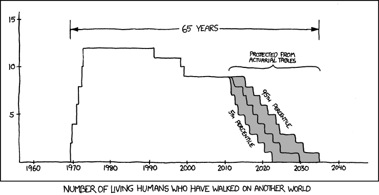
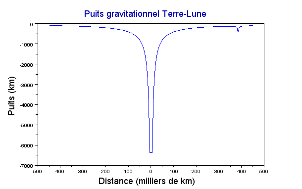
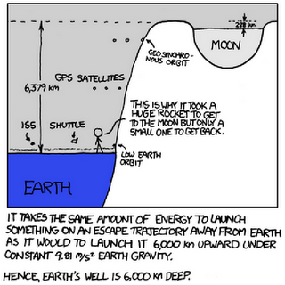
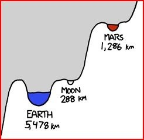

La mort de Neil Armstrong me fait penser à plusieurs petites choses, et à une plus importante:

- D'abord que la [prédiction graphique de xkcd.com](http://xkcd.com/893/) est en marche : 
- Ensuite, un bon reportage récent intitulé "La fin des astronautes ?" (avec un point d'interrogation), passé sur Arte cet été [[1]](#ref-1). [Eugene Cernan](w:), dernier humain à avoir foulé la Lune, y explique qu'il était convaincu qu'il serait rapidement suivi par beaucoup d'autres et qu'un vol habité vers Mars aurait lieu au XXème siècle encore...
- Un autre reportage (pas retrouvé) passé aussi cet été dans lequel les pionniers se rappellent des années folles, et en particulier du sang-froid de Neil Armstrong. Par exemple cette fois où il s'est éjecté à la dernière seconde d'un engin d'entrainement et a failli atterrir en parachute au milieu des flammes:



Après ça,  il est allé tranquillement au bureau des astronautes faire du travail administratif...

- La transcription d'une conversation entre John Fitzgerald Kennedy et [James E. Webb](w:) en 1963 [[2]](#ref-2) révèle que le coût de la course à la Lune n'était pas facile à justifier:
  - Kennedy : "_La température va continuer à monter à moins que nous ne puissions dire que ça a une justification militaire, et pas seulement du prestige_".
  - Webb : "_Je pense que ça générera la technologie qui fera la différence pour ce pays bien au delà de l'espace_" ("far beyond space", j'aime bien ;-) ).
  - Et lorsque Kennedy lui demande la Lune pourra être conquise lors de son second mandat (1965-1969 s'il n'avait pas été assassiné), Webb répond catégoriquement "_Non_". Puis "_Ca prendra juste plus longtemps que ça. C'est un sacré boulot, vraiment un sacré boulot..._"
- Et puis Neil et les 11 autres l'ont fait. En prenant des risques fous comme le montre par exemple l'[AMDEC](w:) de la fusée Saturn V [[3]](#ref-3) : "_The total [S-IVB](w:) propulsion stage reliability for the engine. TVC, tank and feed system is: P = (.9522) (.9939) (.9940) = .938_". 6% de risque d'échec rien que pour le 3ème étage ...
- Pourtant, pour aller sur Mars, certains sont prêts à courir un risque de 100% d'y rester. Et pas forcément des illuminés : même notre [Claude Nicollier](w:) national serait prêt à faire un voyage simple course [[4]](#ref-4) ! En fait, si on y réfléchit ce ne serait pas idiot : la grosse difficulté d'une mission humaine vers Mars, c'est d'y amener un véhicule capable de revenir. L'Australie et quelques autres contrées lointaines ont été colonisées par des prisonniers partis sans espoir de retour, pourquoi pas Mars ?
- Pour ma part, la question posée par Nikos Pranzos [[5]](#ref-5) continue de me tarabuster : après avoir dépensé tant d'énergie pour sortir de notre puits gravitationnel, pourquoi redescendre dans un autre ? Pourquoi ne pas rester dans l'espace, où tout est si léger, si accessible ?
- Vous ne savez pas ce qu'est un puits gravitationnel ? Alors lisez la suite, vous allez comprendre pourquoi ce n'est pas demain que des hommes iront loin dans l'espace.

### Les puits gravitationnels

Pour qu'une fusée décolle, il faut que ses moteurs exercent une force supérieure à F=m.g, où m est la masse de la fusée, et [g=9.81 m/s²](w:Pesanteur) l'attraction à la surface de la Terre. Mais plus elle s'éloigne de la surface, plus cette force diminue car la force de [gravitation](w:) diminue comme le carré de la distance\*.

Pour s'éloigner à l'infini, il faut que le [travail de la force](w:travail_d'une_force) de propulsion de la fusée atteigne l'énergie de libération\*\* E=m.[G.M/R](https://web.archive.org/web/20170107143048/http://www.wolframalpha.com/input/?i=Gravitational+constant+*+Mass+Earth+%2FRadius+Earth) où G est la [constante gravitationnelle](w:), M la masse de la Terre et R son rayon [[7]](#ref-7).

La fusée doit donc produire un travail (= énergie) d'au moins E=62,5.106Joules par kg à expédier très loin.

L'idée du "puits gravitationnel", c'est de considérer cette énergie comme une énergie potentielle "normale", dans le champ de gravité constant du niveau du sol caractérisé par g=9.81 m/s². On obtient ainsi E/(m.g) ~ 6300 km, une distance que l'on peut visualiser comme la hauteur d'un puits imaginaire qu'il faut faire gravir à la fusée. La surface de la Terre est au fond d'un puits, à 6300 km sous le niveau de l'espace environnant.

Si l'énergie de la fusée n'est pas suffisante pour sortir du puits, elle retombera tôt ou tard sur la Terre, à moins qu'on ne lui ait aussi donné une vitesse tangentielle qui lui permette de se mettre en orbite en "roulant" contre le mur du puits, qui n'est pas vertical. En effet, si on trace la fonction E(r)=-g.R²/|r| pour r>R (en faisant un fond plat au puits pour r<R), on obtient la courbe suivante, qui lie le rayon r de l'orbite et le niveau correspondant d'énergie dans le puits [[7]](#ref-7):

D'ailleurs, sur cette courbe calculé par Julien [[7]](#ref-7) avec [Scilab](http://www.scilab.org/), on voit l'orbite de la Lune, à 360'000 km, qui creuse elle aussi un tout petit "puits gravitationnel" de 288 km seulement. Toute les missions Apollo sont là : un énorme fusée [Saturn V](w:) pour "gravir" environ 6000 km de puits, un petit [module de service Apollo](w:module_de_service_Apollo) pour parcourir les 300'000 km jusqu'à la Lune en "montant" encore de 200 km dans le puits (et freiner la "descente" équivalente au retour) , et un minuscule [LEM](w:module_lunaire_Apollo) 20x moins puissant (par kg) que la fusée Saturn-V pour descendre au fond de la Lune et en ressortir.

Randall Munroe de xkcd (encore) a réalisé un [extraordinaires dessin](http://xkcd.com/681/) de tous les puits gravitationnels du système solaire, les remplissant même avec des demi-planètes à l'échelle :



Le plus important est évidemment celui du Soleil, tellement profond qu'il n'est que très partiellement représenté à gauche. Son influence est très importante pour les planètes intérieures : Mercure, Vénus, la Terre et Mars, qui sont situées à des niveaux très différents de ce puits. Pour aller vers l'une de ces planètes, il faut non seulement sortir du puits local de la Terre mais gravir ou descendre un bout du puits gravitationnel du Soleil \*\*\*.

Par contre, une fois passée l'orbite des astéroïdes, pousser jusqu'à Jupiter, Saturne, Uranus, Neptune ou beaucoup plus loin ne nécessite pas beaucoup plus d'énergie : les sondes n'accélèrent que pour gagner du temps, et elles peuvent d'ailleurs utiliser pour ça l'[assistance gravitationnelle](w:) des énormes puits de Jupiter et Saturne. En passant, j'adore la représentation des anneaux de Saturne en couches dans le puits de la planète!

La problématique d'un vol habité vers Mars apparaît dans deux détails de ce génial dessin:

|  |  |
| -------------------------------------------------------------------------- | ------------------------------------------------------------------------------------------------------ |

L'illustration de gauche révèle que depuis Apollo, les humains sont confinés dans quelques centaines de km au fond de leur puits. La défunte navette spatiale ne permettait que de monter que de quelques centaines de km (proche de la Terre, les km de puits sont approximativement égaux à des altitudes), et assembler un vaisseau spatial au niveau de la [station spatiale internationale](w:) n'aiderait pas beaucoup à sortir du puits. Par contre, l'[orbite géostationnaire](w:) à 35'786 km d'altitude est toute proche de la sortie du puits, mais sauf erreur aucun véhicule habité n'est capable d'y aller.

A droite, on voit qu'un voyage vers Mars nécessiterait un véhicule beaucoup, beaucoup plus puissant que le [Module de service Apollo](w:) car il devra gravir le puits du Soleil entre les deux planètes, plus haut que celui de la Terre. *"This is a tough job, a real tough job."* comme dirait James Webb.

Voilà pourquoi après le "petit pas pour l'homme" de Neil Armstrong en bordure de notre puits, le "grand bond pour l'humanité" devra attendre que l'on dispose de systèmes de propulsion très puissants et légers.

En attendant, on pourrait commencer par installer de vraies bases spatiales aux points de Lagrange, [exploiter les astéroïdes](https://web.archive.org/web/20120831160918/http://www.planetaryresources.com/) et pourquoi pas, proposer quelques voyages "simple course". Je serais éventuellement tenté par [Titan](<w:Titan_(lune)>), autour de mon 90ème anniversaire...



### Notes:

\* et aussi parce que sa masse m diminue en cramant son carburant, mais ceci ne joue pas de rôle dans le calcul du puits gravitationnel car "les masses se simplifient".

\*\* à ne pas confondre avec la fameuse "[vitesse de libération](w:)" de 11.2 km/s qu'une fusée n'a pas besoin d'atteindre. Cette vitesse est celle qui est nécessaire au lancement d'un projectile pour qu'il quitte l'attraction terrestre, comme l'[obus de Jules Verne](w:de_la_Terre_à_la_Lune). Son énergie cinétique vaut alors E= ½.m.v². Et Ô surprise, pour v=11'200 m/s on obtient E=62.5.106 \[J/Kg\], pile poil l'énergie de libération !

\*\*\* descendre un puits gravitationnel dans le vide coûte autant d'énergie que le gravir, car la fusée doit "freiner" au lieu d'accélérer...

### Références

1. Serge Brunier et Frédéric Compain. "La fin des astronautes ?" , 2012, documentaire 52' produit par [Arte](https://web.archive.org/web/20250426055052/http://www.arte.tv/fr/4059444,CmC=6815884.html) France et Point du Jour [teaser](http://www.youtube.com/watch?v=kPI_fuUTzmI)
2. Jay Lindsay, "[New tape: JFK fretted moon program was tough sell](https://web.archive.org/web/20150626140954/http://phys.org/news/2011-05-tape-jfk-fretted-moon-tough.html)", 25 Mai 2011, Associated Press
3. Robert P. Dill, N. Brown R. L. Curtis, C. R. Herrmann, A. Trampus "[State-of-the-art reliability analysis of Saturn V propulsion systems](https://archive.org/download/nasa_techdoc_19930075105/19930075105.pdf)", June 1963, General Electric Report RM 63TMP-22 3
4. Olivier Dessibourg "[Claude Nicollier: «Je partirais pour Mars même sans ticket-retour»](https://web.archive.org/web/20250426054741/http://www.letemps.ch/Page/Uuid/35a549cc-a5b4-11e0-af99-7b83bebc6d53%7C0)", Le Temps, Lundi 4 juillet 2011
5. 
6. "[L'espace, un rêve trop cher ?](https://web.archive.org/web/20120614173035/http://www.sciences-et-democratie.net/dossiers-et-debats/recherche-et-innovation/lespace-un-reve-trop-cher)" 16 mai 2011 sur Sciences et Démocratie
7. "[Puits gravitationnel et missions spatiales](http://expliquenoustout.blogspot.ch/2011/05/puits-gravitationnel-et-missions.html)", 2011 sur Explique nous tout !
8. Randall Munroe ["Gravity Wells" sur xkcd](http://xkcd.com/681/)
9. Rhett Allain, "[xkcd and Gravity Wells](http://scienceblogs.com/dotphysics/2010/01/03/xkcd-and-gravity-wells/)", January 3, 2010 sur Dot Physics
