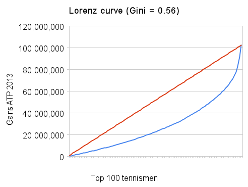

L'[initiative 1:12](http://www.admin.ch/ch/f/pore/vi/vis375.html) est extrémiste au sens propre : en voulant limiter le rapport entre les salaires le plus élevé et le moins élevé de chaque entreprise, elle ignore la très large majorité qui se situe entre deux.

Le [coefficient de Gini](w:) mesure bien mieux les inégalités car il tient compte de tous les revenus, et c'est lui qui est utilisé pour les comparaisons internationales. Pour la Suisse il vaut 0.29 après impôts et prélèvements obligatoires, et 0.34 avant, ce qui est étonnamment faible.

Selon le dernier rapport de l'OCDE sur les inégalités \[1, p.9\]:

> Les pays nordiques et la Suisse se caractérisent par une inégalité des revenus disponibles inférieure à la moyenne grâce à une faible disparité des salaires, en particulier au sommet de l’échelle.

Même si [ça peut surprendre](/2012/07/13/encore-plus-dinegalite/), la Suisse est dans le groupe des pays les plus équitables de l'OCDE, caractérisés par une "_Faible dispersion des revenus du travail (taux d’emploi élevé et faible dispersion des salaires)_" \[1, Fig 6 p.12\]. De plus, au contraire de nombreux pays, les inégalités n'augmentent pas notablement en Suisse : la part des revenus allant aux 10% des revenus les plus élevés en Suisse est restée assez stable entre 1933 et 2008 [[3]](#ref-3)

L'extrémisme de l'initiative 1:12 ne garantit pas des revenus plus équitables. On peut [facilement calculer](/2009/10/11/calculateur-dinegalite/) qu'une entreprise de 10 personnes seulement dans laquelle le patron se verserait un salaire 12 fois plus élevé que ses 9 employés a un coefficient de Gini de 0.52, au niveau du Mexique ou du Chili. Malheureusement, les entreprises ne calculent pas ni ne publient leur coefficient de Gini, qui serait pourtant un indicateur bien plus parlant que les rémunérations de leurs top managers.

En fait, il est très difficile d'obtenir une liste de revenus de quelque organisation que ce soit. Une exception notable est l'ATP, qui publie sur internet le [classement des gains des 100 meilleurs](http://legacy.tennis.com/rankings/money_men.aspx/) joueurs de tennis mondiaux. On y voit que le ratio des gains entre le No1 ( Raphael Nadal ) et le No 100 ( Alejandro Falla) vaut 33, et [on peut calculer](https://docs.google.com/spreadsheet/ccc?key=0Al_D4zS2T4QodGNwZmF0YlNhTFJGMmlVMFloM1ZzZ2c&usp=sharing) que le coefficient de Gini de ces 100 revenus vaut 0.56, ce qui correspond à une distribution très inégale.

Et encore, c'est compter sans les revenus publicitaires, qui ont permis par exemple à notre Federer national d'empocher 66 millions en 2012.

Pourquoi donc sommes-nous choqués par le fait que quelques patrons d'entreprises employant des dizaines de milliers de personnes gagnent autant qu'un génie de la raquette ou du football ? Peut-être parce que nous ne réalisons pas que ces gens exceptionnels partagent un même talent : anticiper.

Percevoir tout ce qui influence le jeu, se mettre dans la peau de l'adversaire pour sentir ce qu'il va faire, repérer à l'instinct des "patterns" vus et entraînés des centaines de fois. Décider vite, sans hésitation alors qu'on sait qu'on ne maîtrise pas tout. "Je suis un entonnoir" m'a dit une fois un grand patron. "Vous me remplissez d'informations qui viennent de tous côtés, et parfois une goutte sort : on investit en Chine, ou au Japon. Je ne peux pas vous expliquer pourquoi..."

Au tennis, les meilleurs joueurs mondiaux ne se distinguent que par [quelques pourcent](/2008/05/12/le-comptage-des-points-au-tennis/) de taux de réussite des balles, et nous payons ces écarts des millions, pour le plaisir. Dans le business, ce sont aussi quelques pourcents qui font la différence entre une entreprise saine et une moribonde, quelques pourcent de chômage qui font la différence entre pays... Ces pourcents ne valent pas des millions mais bien des milliards pour nous tous.

On ne paie pas les top managers pour leur travail mais pour leur talent, et pour qu'ils jouent dans nos équipes plutôt que dans celles d'en face.

### Références

1. OCDE 2012, « [Inégalités de revenus et croissance : le rôle des impôts et des transferts](http://www.oecd.org/fr/eco/finances-publiques/49446673.pdf) », OCDE Département des Affaires Économiques, Note de politique économique, no 9, janvier 2012.
2. 
    1. "[Tour d’horizon des inégalités croissantes de revenus dans les pays de l’OCDE : principaux constats](http://www.oecd.org/fr/social/soc/49177707.pdf)" annexe pdf publique
3. Ch. A. Schaltegger, Ch. Gorgas "[L’évolution des très hauts revenus en comparaison internationale](http://www.dievolkswirtschaft.ch/fr/editions/201212/Schaltegger.html)", La vie économique, décembre 2012
