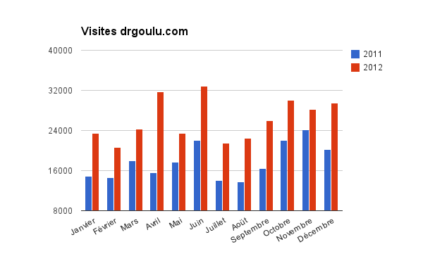

Rien ne m'inspire particulièrement parmi les 438 [90 propriétés du nombre 2013](https://oeis.org/search?q=seq%3a2013) répertoriées dans l'OEIS. Seule [A036462](https://oeis.org/A036462) m'a intriguée, mais je n'ai pas trouvé d'informations sur cette étrange conjecture selon laquelle toute puissance de 2 écrite en base 3 ne pourrait pas contenir 2013 zéros. Alors je me contente de vous souhaiter

## Bonne, Heureuse et Intéressante Année 2013

à vous tous et toutes, chers lecteurs. Je vous adresse aussi mes remerciements, car vous êtes de plus en plus nombreux à visiter ces pages : 314033 visites en 2013 2012, c'est presque 50% de plus que l'an passé (213374) !

Vous m'encouragez ainsi à continuer à me casser la tête (j'adore), perdre de l'argent (très peu, mais il n'y aura jamais pas de pub sur drgoulu.com) et passer de nombreuses soirées à rédiger plutôt qu'à jouer à [Far Cry 3](w:) (que j'ai fini quand même). Merci !

En 2012, les articles vus plus de 4000 fois ont été:

| Article | Année | Visites |
| --- | --- | --- |
| [Comment marche Shazam](/2009/07/11/comment-marche-shazam/) | 2009 | 19 174 |
| [Dites NON au mouvement perpétuel](/2012/05/27/dites-non-au-mouvement-perpetuel/) | 2012 | 11 772 |
| [La véritable histoire de l’ampoule de Livermore](/2011/10/16/la-veritable-histoire-de-lampoule-de-livermore/) | 2011 | 9 952 |
| [Comment faire 4 triangles équilatéraux avec 6 allumettes ?](/2007/01/26/comment-faire-4-triangles-equilateraux-avec-6-allumettes/) | 2007 | 7 209 |
| [Pyramides et populations](/2011/02/06/pyramides-et-populations/) | 2011 | 4 729 |
| [Comment trouver des nombres premiers](/2012/04/15/comment-produire-des-nombres-premiers/) | 2012 | 4 509 |
| [Mémoire eidétique](/2008/06/04/memoire-eidetique/) | 2008 | 4 102 |

C'est parfois frustrant de voir que de vieux articles peu un peu "coupés/collés" comme [Comment faire 4 triangles équilatéraux avec 6 allumettes ?](/2007/01/26/comment-faire-4-triangles-equilateraux-avec-6-allumettes/) ou [Mémoire eidétique](/2008/06/04/memoire-eidetique/) sont plus lus que de plus récents sur lesquels j'ai planché des jours comme [Comment stocker l'énergie](/2012/10/06/comment-stocker-lenergie/ "Comment stocker l’énergie") ou [Magnifique caféine](/2012/07/07/magnifique-cafeine/ "Magnifique caféine"), mais je me dis que les visiteurs qui arrivent sur ces articles "porteurs" vont peut être ensuite butiner un peu (même si le [taux de rebond](w:) de l'ordre de 75% me déçoit toujours...)

Je suis véritablement surpris par le "Top 3", et surtout par le fait que ces articles me semblaient a priori très différents:

1. Je voyais [Comment marche Shazam](/2009/07/11/comment-marche-shazam/) comme une simple recherche de brevet susceptible d'intéresser d'autres geeks technophiles (pléonasme?). Mais si 473 internautes ont lu cet article après avoir cherché "comment marche shazam" dans un moteur de recherche, 7413 l'ont vu après avoir seulement cherché "shazam", ce que j'interprète comme une marque de curiosité bénéfique.
2. [Dites NON au mouvement perpétuel](/2012/05/27/dites-non-au-mouvement-perpetuel/) a été écrit presque d'une traite sur un coup de sang. Après avoir vu M6 tomber dans un panneau tellement énorme, j'étais certain que c'était un gag planifié qui finirait par une bonne rigolade et mise au point à l'émission suivante. Je trouve très grave qu'M6 ait préféré noyer le poisson, car il y a très peu de pages expliquant que le mouvement perpétuel est contre nature, opposées à des myriades de pages de bricoleurs disséminés le long de l'axe escrocs-pigeons. Si cet article a pu éclairer une ou deux des 989 personnes qui l'ont vu après avoir cherché "mouvement perpétuel" sur Google, ça valait la peine de l'écrire. Cet article est aussi celui qui a suscité le débat le plus vif de l'histoire de ce blog, merci à tous les participants d'avoir su rester ouverts et corrects.
3. [La véritable histoire de l’ampoule de Livermore](/2011/10/16/la-veritable-histoire-de-lampoule-de-livermore/) a aussi été motivé par une mauvaise émission d'une bonne chaîne de TV, mais l'article m'a demandé pas mal de travail, et là je suis conscient d'aborder un sujet à la fois émotionnel et scientifiquement ouvert (je crois). Je ne sais toujours pas si l'obsolescence programmée est un mythe ou, dans une certaine mesure, une réalité. Ce sera l'objet d'un article en 2013, pour autant que je trouve quelques références sérieuses sur le sujet. Si vous en connaissez, faites le moi savoir svp ! A part quelques 469 visiteurs arrivés en tapant "ampoule de Livermore", la plupart des lecteurs viennent de nombreux autres sites et blogs référençant l'article,  dont 1197 visites provenant la [wikipédia](w:Ampoule_centenaire) : consécration !

De nos jours un petit blog aussi génial soit il n'est rien sans les sites "référents" qui lui amènent des visiteurs. 153117 visiteurs sont arrivés sur drgoulu.com en cherchant quelque chose sur un moteur de recherche, dont 102909 par Google, et 43612 par Google Image Search. Intéressant non ? 28% des internautes trouvent les articles qui les intéressent par les images qu'ils contiennent ! Sinon le Bing de Microsoft ne m'a amené que 1912 visiteurs bien que j'aie passé deux bonnes heures à m'y référencer correctement. Ma prédiction pour 2013 : "Bing sera le son qu'il fera en chutant". A la fin de l'année, je pourrai toujours faire comme [Dr. Elizabeth](http://www.homme-moderne.org/societe/socio/teissier/index.html) et dire que je parlais de Windows 8, du dollar ou de [notre Président](http://www.rts.ch/info/suisse/4546057-ueli-maurer-exprime-ses-voeux-sur-facebook-dans-un-francais-federal.html).

Suivent les média sociaux facebook (3704 visiteurs) et twitter (1699 seulement, [suivez-moi](https://twitter.com/goulu) !) NetVibes (1251) et scoop.it (640), ma découverte en 2012 que je vois promise à un bel avenir (c'est [par ici](http://www.scoop.it/u/goulu)). [Mon Tumblr](http://drgoulu.tumblr.com/) tout neuf semble n'amener aucune visite, mais c'est parce qu'elles passent par scoop.it...

Derrière Google mais nettement devant Bing, le [C@fé des Sciences](http://www.cafe-sciences.org/) m'a amené 3922 visiteurs, merci à tous mes camarades blogueurs scientifiques francophones pour l'émulation créée dans cette communauté très dynamique. Santé, Succès et Sérénité pour 2013 !
