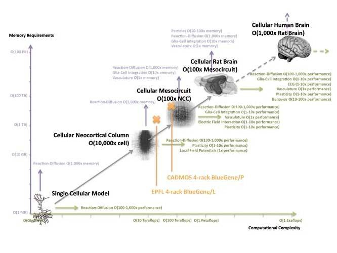

_(article publié dans le cadre de la [semaine thématique du C@fé des Sciences sur Le Cerveau](http://thema.cafe-sciences.org/articles/category/le-cerveau/))_

Lancé par [une équipe de l'EPFL](http://bluebrain.epfl.ch/) dirigée par [Henry Markram](http://people.epfl.ch/henry.markram), le "[Human Brain Project](http://www.humanbrainproject.eu/)" (HBP) vise à simuler un cerveau humain dans un superordinateur d'ici dix ans. Cet objectif extrêmement ambitieux a paru suffisamment réaliste à l'Union Européenne pour consacrer 1 milliard d'Euro à ce projet mêlant neurosciences et informatique.

Les neurosciences étant traitées par des blogueurs bien plus compétents que moi en la matière, cet article se limite à la partie facile et que je connais un peu : l'informatique. D'ailleurs, Markram et son équipe poursuivent une approche "bottom-up" [[1]](#ref-1) compatible avec un grand principe de l'informatique :

> Tout doit être construit de haut en bas (top-down), sauf la première fois. ([Alan Perlis](/2008/01/21/perlisismes-les-dictons-informatiques-dalan-perlis/))

Dès la fin des années 1950 les chercheurs ont analysé le fonctionnement de neurones vivants [[2]](#ref-2) et développé des modèles très simplifiés de neurones ayant débouché sur les [réseaux de neurones artificiels](w:réseau_de_neurones_artificiels) très à la mode dans les année 1990 et qui ont permis de grand progrès dans des applications comme la [reconnaissance optique de caractères](w:) notamment.

Les modèles actuels de neurones isolés sont beaucoup plus complexes et incorporent des modèles moléculaires comme le [canal sodium](w:)  [[3]](#ref-3) ou les [neurotransmetteurs](w:). La simulation en temps réel d'un seul neurone exige une mémoire d'environ 1 Megabyte pour stocker toutes les variables qui définissent l' "état" du neurone à chaque instant, et une puissance de calcul de 1 Giga[FLOPS](w:), ce qui correspond:

- au super ordinateur [Cray-2](w:Cray_(entreprise)) de 1985
- à un PC [Pentium III](w:) de 1999
- ([presque](http://www.walkingrandomly.com/?p=3079)) un bon smartphone actuel

Depuis 2006, le [projet "Blue Brain"](http://www.artificialbrains.com/blue-brain-project) de Markram a simulé non seulement le fonctionnement, mais aussi la croissance d'une [colonne néocorticale](w:néocortex) (NCC), une structure d'environ 1mm³ comprenant environ 10'000 neurones fortement interconnectés, répartis sur 6 couches. Un superordinateur [BlueGene](w:) doté de 8192 processeurs pour un total d'environ 20 TeraFLOPS a été utilisé, ce qui fonde l'hypothèse de l'équipe selon laquelle la puissance et la mémoire nécessaires à la simulation augmentent linéairement avec le nombre de neurones, et heureusement pas avec le nombre de [synapses](w:synapse) par exemple.

En extrapolant cette tendance linéaire, Markram estime qu'un ordinateur d'1 ExaFLOPS (un milliard de milliards d'opérations par seconde) doté de 100 PetaBytes de mémoire devrait être capable de simuler un cerveau humain contenant 100 milliards de neurones environ. Et en extrapolant aussi la [remarquablement exponentielle loi de Moore](/2008/06/19/moore-toujours/), un tel superordinateur sera disponible en 2018.

D'autres [projets de cerveaux artificiels](http://www.artificialbrains.com/) comme [Synapse](http://www.artificialbrains.com/darpa-synapse-program) [[7]](#ref-7), [Spaun](http://www.artificialbrains.com/spaun) [[8]](#ref-8) ou même [SpikeFun](http://www.artificialbrains.com/spikefun) qui simule 32'000 neurones sur votre PC confirment grosso-modo ces ordres de grandeur.



Le lecteur attentif aura remarqué qu'on a "perdu" deux ordres de grandeur en route : 100 milliards de neurones x 1 GigaFLOPS par neurone devraient donner 100 ExaFLOPS, pas 1. L'idée est que les étapes intermédiaires, mesocircuit, puis cerveau de rat, permettront de simplifier la simulation des neurones individuels, voire de la remplacer par un modèle des NCC. Markram considère en effet qu'une NCC est "est au cerveau ce qu'un microprocesseur est à un ordinateur" [[1]](#ref-1). Si c'est le cas, alors un cerveau serait l'équivalent d'environ 10 millions de processeurs de 100 GigaFLOPS chacun "seulement" soit un bon PC actuelCependant, les marges d'erreur sont considérables comme on le voit dans la première figure:

- il faudra peut-être une puissance 10x supérieure pour tenir compte de la [plasticité synaptique](w:)
- un autre facteur 10 pour tenir compte des [cellules gliales](w:cellule_gliale)
- mais surtout un facteur pouvant atteindre 1000 pour simuler la croissance des neurones, leur [morphogenèse](w:) par [réaction-diffusion](w:)

De plus, l'approche du "Human Brain Project" consiste à initialiser le simulateur avec un cerveau à l'état embryonnaire, puis à le "laisser pousser" en évoluant dans un monde virtuel sur lequel il peut agir par l'intermédiaire d'un corps virtuel [[1]](#ref-1), [[4]](#ref-4). Il faudra donc des années pour que la simulation converge vers un cerveau adulte si on ne parvient qu'à une simulation "temps réel". Pour pouvoir effectuer plusieurs simulations de croissance en un délai raisonnable (en "tuant" le cerveau à la fin...), il faudrait là encore gagner plusieurs ordres de grandeur.

Cette approche pourrait nécessiter des millions d'ExaFLOPS (je viens d'apprendre que ça s'appelle des yotaFLOPS),  qui ne seraient disponibles que vers 2040. Ceci justifie le scepticisme de certains [[9]](#ref-9) et motive des projets concurrents qui pourraient se révéler complémentaires. Ainsi Obama vient de décider d'injecter 3 milliards de dollars sur 10 ans dans le [Brain Activity Map Project](w:) qui consiste essentiellement à cartographier le cerveau en activité au niveau cellulaire.

Si des appareils d'imagerie médicale devenaient capables de capturer les quelques 100 PetaBytes d'information correspondant à l'état instantané d'un cerveau vivant, on pourrait imaginer un [téléchargement de l'esprit](w:) vers un "Personal Cerveau" de bureau d'1 ExaFLOPS dès 2032 [[10]](#ref-10).

 



En attendant, il y a toujours moyen de fabriquer un cerveau humain parfaitement fonctionnel, indépendant et consommant peu d'énergie électrique en quelques minutes de conception, 9 mois de montage et quelques années de programmation ...

### Références:

1. Henry Markram "[Human brain project : simuler le cerveau humain](http://www.pourlascience.fr/ewb_pages/f/fiche-article-human-brain-project-simuler-le-cerveau-humain-31108.php)", Pour la Science N°425, mars 2013
2. Lettvin, J.Y., Maturana, H.R., McCulloch, W.S., & Pitts, W.H. "[What the Frog's Eye Tells the Frog's Brain](http://citeseerx.ist.psu.edu/viewdoc/download?doi=10.1.1.117.4995&rep=rep1&type=pdf)" , 1959 ; Proceedings of the IRE, Vol. 47, No. 11, pp. 1940-51.
3. Marco A. Herrera Valdez, [Erin McKiernan](http://emckiernan.wordpress.com/), Sandra D. Berger, Stefanie Ryglewski, Carsten Duch, Sharon Crook "[Relating ion channel expression, bifurcation structure, and diverse firing patterns in a model of an identified motor neuron](http://dx.doi.org/10.6084/m9.figshare.96546)"  Journal of Computational Neuroscience August 2012, [DOI10.1007/s10827-012-0416-6](http://dx.doi.org/10.1007/s10827-012-0416-6)
4. Henry Markram "Keynote lecture at Neuroinformatics 2008 in Stockholm, Sweden" ([video](http://www.youtube.com/watch?v=8iDR8Z-e_GU))
5. Christian Clemençon "[Presentation Cadmos](http://bluegene.epfl.ch/Presentations/Cadmos_Pres_Clemencon_24sep.pdf)", EPFL, 2009
6. Nicolas Rougier "[À propos de la modélisation du cerveau](http://interstices.info/jcms/nn_72250/a-propos-de-la-modelisation-du-cerveau) ", interstices, 2013 (audio 13:22).
7. "[IBM simulates 530 billion neurons, 100 trillion synapses on supercomputer](http://www.kurzweilai.net/ibm-simulates-530-billon-neurons-100-trillion-synapses-on-worlds-fastest-supercomputer)", Kurzweil AI, 2012
8. Ed Yong, "[Simulated brain scores top test marks](http://www.nature.com/news/simulated-brain-scores-top-test-marks-1.11914)", Nature, 2012
9. Ed Yong "[Will we ever… simulate the human brain?](http://www.bbc.com/future/story/20130207-will-we-ever-simulate-the-brain) " BBC Future, 8 février 2013
10.  ([résumé détaillé en anglais](http://newbooksinbrief.com/2012/11/27/25-a-summary-of-how-to-create-a-mind-the-secret-of-human-thought-revealed-by-ray-kurzweil/))
