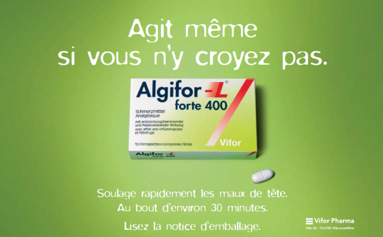

Loin de moi l'idée de faire de la publicité pour quoi que ce soit\* sur ce blog qui se voudrait scientifique, mais comme nous sommes tous soumis à la publicité et à ses messages plus ou moins directs, je vous propose ici deux "études de cas".

Commençons par cette affiche toute récente que j'ai trouvé absolument excellente: Pourtant j'ai remarqué que le second degré du slogan échappe à pas mal de gens... Vous le captez ?  Pourtant j'ai remarqué que le second degré du slogan échappe à pas mal de gens... Vous le captez ?

Pour moi c'est clair : la prochaine fois que j'ai mal au crâne, je vais acheter ce produit rien que pour soutenir leur superbe campagne anti-[homéopathie](/tags/homeopathie/) !

Mais par acquit de conscience j'ai cherché ce que l'homéopathie propose comme anti-douleurs et j'ai trouvé:

1. l'[arnica](https://fr.wikipedia.org/wiki/arnica)
2. le [produit](http://agence-prd.ansm.sante.fr/php/ecodex/frames.php?specid=68419955&typedoc=R&ref=R0164452.htm) d'un laboratoire connu pour ses [placebos](/2009/05/20/placebo-et-nocebo/), qui contient:

> Belladone (teinture) 0,004µg, Iris (teinture) 0,004µg, Noix vomique (teinture) 0,004µg, Spigélie anthelmintique (teinture) 0,004µg, Gelsemium (teinture de racine) 0,004µg

Un "µg" c'est un microgramme soit un millionième de gramme\*\*, donc 0,004µg c'est 4 milliardièmes de grammes... Comment ça soigne les douleurs ? Aucune idée. Mais à tout hasard ils ont ajouté:

> Acide acétylsalicylique 330mg et Caféine 36,6mg

soit 82 millions de fois plus d'aspirine que de noix vomique, au cas où ça pourrait aider un peu. Du coup la loi les a forcés à qualifier leur produit de "médicament"...

Sinon, en expliquant [pourquoi les montres sont devenues plus grosses](/2007/05/15/montre-mecanique-contre-quartz/), j'ai repensé à cette ancienne pub  :



L'association du "[Swiss made](http://fr.wikipedia.org/wiki/Swiss_made)" avec "[Made in Heaven](http://www.myswitzerland.com/fr/freddie-mercury-montreux.html)" flatte mon patriotisme, et la montre me plaisait beaucoup, au point où j'ai sérieusement envisagé en acheter une. Mais finalement je ne l'ai pas fait, et aujourd'hui je me demande si le fait d'avoir vu cette pub n'a pas joué un rôle dans ma décision de ne pas passer à la caisse.

Et vous ? Cette pub vous donne-t-elle l'envie d'acheter cette montre (qui ne se fait plus, hélas) ? Ou y-a-t'il quelque chose qui vous dérange aussi ?

### Notes:

\*Je n'ai ni fait de lien vers les produits concernés, ni même mentionné leur nom dans le texte ce qui m'amènerait des visiteurs via les moteurs de recherche. Plus indépendant que Dr. Goulu, y'a pas.

\*\*un microgramme, c'est la dose mortelle de plutonium et là il y a 250 fois moins de [belladone](https://fr.wikipedia.org/wiki/belladone) et de [noix vomique](https://fr.wikipedia.org/wiki/noix_vomique), pour rassurer ceux qui se souviendraient que ces plantes sont très toxique. Mais puisque désormais ce n'est plus la dose qui fait le poison, l'homéopathie devrait disparaître rapidement...
