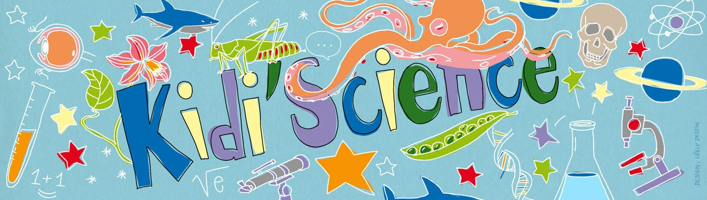

Je voulais écrire un petit article de pub pour [Kidi'Science](http://kidiscience.cafe-sciences.org/), le site du C@fé des Sciences destiné aux enfants. Et puis Sirtin a écrit [pourquoi il kiffe la science](http://www.sirtin.fr/2013/04/25/pourquoi-je-kiffe-la-science/) et lancé parmi les c@fetiers l'idée d'une chaîne d'articles expliquant pourquoi nous aimons la science. Et je me suis dit que j'allais faire d'une pierre deux coups.

Comme je le mets dans certains profils, je suis "tombé dans la science quand j'étais petit".



D'abord c'est à cause de mon papa, ingénieur en génie civil, qui faisait des trucs magiques comme calculer [ses ponts](http://drgoulu.local/2005/07/03/umberto-guglielmetti/) par [photoélasticimétrie](http://fr.wikipedia.org/wiki/Photo%C3%A9lasticim%C3%A9trie). Il s'intéressait, et s'intéresse toujours, à toutes les sciences et techniques. A la maison on avait un microscope, un télescope, un oscilloscope. Et aussi un atelier de bricolage bien outillé rempli d'appareils éventrés (souvent par mes soins) allant du réveil-matin au moteur de Solex en passant par les éléments de chaine stéréo. (Oui, "[j'ai souffert dans ma jeunesse](http://www.ina.fr/video/I07329367)" ...)

Autre personnalité influente : mon tonton, Dr. en chimie qui m'offrait de l'équipement de chimie amusante en quantité industrielle. Le droguiste de ma ville, après m'avoir fourni du sulfate de cuivre pour faire de jolis cristaux, m'a aussi vendu des kilos de nitrates, chlorates et permanganates pour réaliser des expériences qui seraient aujourd'hui relatées en première page: "une bande d'ados inconscients tirent une fusée de 2 kg bourrée de [fulmicoton](http://fr.wikipedia.org/wiki/Nitrocellulose) par dessus le terrain de tennis...". Depuis je sais que les expériences scientifiques demandent un peu de doigté, un soupçon de prudence, et des tonnes de chance.



Sinon, quand j'avais entre 5 et 10 ans, il y a eu six événements extraordinaires : on est allés six fois [sur la Lune](http://drgoulu.local/tag/lune/) ! Vous les jeunes vous ne pouvez pas imaginer ce que ça représentait. Quand je dis "on est allés sur la Lune", je veux dire tout le monde, toute l'humanité et moi futur astronaute y compris. A cette époque, à part pour les hippies, tout était clair : la science et la technique sont toutes puissantes. Si on veut, on peut. No limits. Vers l'infini et au delà !

Je n'arrive toujours pas à comprendre comment on est retombés sur Terre à cultiver bio et voter écolo en critiquant le méchant lobby agro-pharma-industriel alors qu'on vit 80 ans en bonne santé, en bossant moins que nos parents et en allant 3x plus loin en vacances qu'eux. C'est pas avec le "principe de précaution" qu'on a inventé le turboréacteur ni les chimiothérapies, que diable !

Bref à l'âge de 12 ans tout était déjà clair : je serai ingénieur. En astronautique, génie civil, mécanique, électronique, chimie, astronautique, peu importait au fond. Mon but était de démonter le monde pour voir comment il fonctionne (la science pour moi c'est ça), d'en utiliser les pièces pour l'améliorer en repoussant les limites du possible (ça c'est la technique, et ce n'est pas la même chose que la science).



A cette époque, mon papa a amené à la maison la première calculatrice programmable  qu'il utilisait professionnellement (HP-45 si je me souviens bien), puis un des premiers ordinateurs "personnel" le [PET 2001](http://fr.wikipedia.org/wiki/Commodore_PET). Un nouveau monde s'ouvrait. Devait s'ouvrir même, car il n'existait aucun programme pour ces machines : il fallait écrire ses programmes soi-même, et ça c'était un vrai challenge.

J'y ai repensé en décrochant mon diplôme d'ingénieur en informatique, puis un doctorat en systèmes dynamiques : mon premier programme était un simulateur d'alunissage. Il était encore beaucoup plus simple que [celui-là](http://lander.dunnbypaul.net/), mais écrire de tels programmes est très formateur. Il faut bien comprendre les maths et la physique pour pouvoir "modéliser" le comportement du vaisseau spatial. Il faut aussi concevoir un algorithme de simulation en pensant à tous les cas possibles, et faire beaucoup de tests pour rendre le jeu réaliste, en corrigeant les erreurs une à une et tenant intégrant de plus en plus de phénomènes au jeu. Par exemple [ce Lunar Lander](http://lander.dunnbypaul.net/) ne me semble pas tenir compte de l'allègement du module quand on consomme du carburant. Le mien si.

J'aime la science parce qu'elle est comme ce jeu. Vue de l'extérieur, la science doit "servir à quelque chose" comme s'amuser à poser un module sur la Lune. Mais ce qui est passionnant, c'est ce qu'il y a dedans : les scientifiques analysent, modélisent, expérimentent, se trompent, ne testent pas tous les cas, ajustent les constantes pour que ça soit plus joli, se piquent des idées, n'écrivent pas tout, ou trop, s'engueulent... Mais peu à peu les imperfections sont éliminées et le modèle que nous appelons "la Science" colle de mieux en mieux à la réalité.

Assez pour que la technique puisse nous permettre de vivre mieux. Et pas assez pour qu'on arrête la recherche scientifique car il reste plein de zones floues, voire de trous dans notre modèle, de quoi occuper de nombreuses générations futures de scientifiques. Et c'est pourquoi j'encourage et je soutiens toutes les initiatives visant à faire tomber les enfants dans la science quand ils sont petits, comme [Kidi'Science](http://kidiscience.cafe-sciences.org/).

Sur Kidi'Science, vos enfants trouveront des articles rédigés pour eux par les blogueurs du C@fé des Sciences, des scientifiques émérites soucieux de vulgarisation de qualité. Mais la page que je trouve la plus importante est celle qui permet aux enfants de [poser leurs questions](http://kidiscience.cafe-sciences.org/vous-avez-une-question/). Parce que c'est ça le plus important en science : poser des questions. Après on peut y répondre plus ou moins bien, mais l'essentiel, c'est la question "Pourquoi ..."
