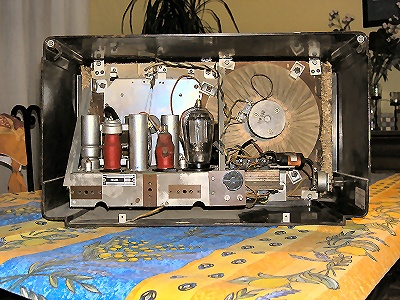
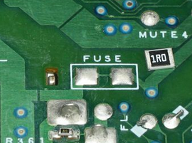
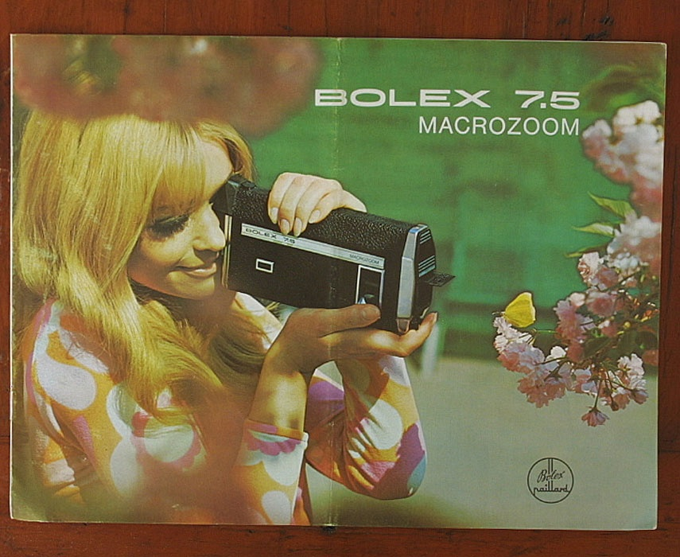

La notion d'[obsolescence programmée](https://fr.wikipedia.org/wiki/obsolescence_programmée) est à la mode. Autrefois cantonnée aux milieux "progressistes", la cause est entendue notamment depuis le documentaire "[Prêt à jeter](https://fr.wikipedia.org/wiki/Prêt_à_jeter)" : les industriels contraignent les ingénieurs à limiter la durée de vie des produits pour en vendre plus et maximiser leurs profits, ce qui provoque gaspillage, déchets et autres catastrophes. Certains vont jusqu'à qualifier cette pratique de crime contre l'humanité [[1]](#ref-1) ! Aujourd'hui les média ne prennent plus aucune précaution oratoire lorsqu'elles abordent ce sujet, et même une association de consommateurs que je considérais comme sérieuse l'affirme sans sourciller [[2]](#ref-2):

> L’obsolescence programmée contamine nombre de secteurs, de l’automobile en passant par l’électronique, les appareils électroménagers, les vêtements, les accessoires de mode, le mobilier, les jouets, etc., où les produits sont conçus pour une durée de vie toujours plus courte!

Pourtant, j'ai des doutes. Je sais que l'obsolescence programmée a été théorisée et même prônée [[3]](#ref-3). Mais ne sais pas si elle existe réellement. Je précise d'emblée que mon doute est motivé par ma curiosité scientifique et rien d'autre : je comprends que vous puissiez y croire, mais moi je veux savoir. Donc je formule cet article comme une question : "L'obsolescence est-elle programmée ?"

## Références s'il vous plait.

Car après avoir vu "Prêt à jeter" deux fois, analysé et compris la [raison de la limitation de la durée de vie des ampoules](http://drgoulu.local/2011/10/16/la-veritable-histoire-de-lampoule-de-livermore/) fréquemment citée comme preuve, lu et contribué à plusieurs forums et discussions sur le sujet, et entendu [Serge Latouche](https://fr.wikipedia.org/wiki/Serge_Latouche) face à [Alexandre Delaigue](http://econoclaste.org.free.fr/econoclaste/?p=7583) à la radio \[4\] je n'ai toujours trouvé aucun cas documenté d'obsolescence volontairement planifiée pour accroître la consommation.

Et je ne suis pas le seul. Dans un article récent dans "Pour La Science" \[5\], Alain Geldron de l'[ADEME](http://ademe.fr) confesse:

> Ces exemples (NdG : ampoules, bas nylons...) sont toutefois anciens et l'obsolescence programmée ne semble pas être la règle aujourd'hui. De nombreux témoignages d'utilisateurs font peser de sérieux soupçons sur quelques produits, telles des imprimantes qui tombent systématiquement en panne après un certain nombre d'impressions, mais ces cas restent rares et **aucune stratégie des industriels pour limiter la durée de vie des produits n'a pu être prouvée.**

Même la Wikipédia manque de références sérieuses sur l'obsolescence programmée :

- L'article francophone "[obsolescence programmée](https://fr.wikipedia.org/wiki/obsolescence_programmée)" affiche cette bannière (qui va et vient au fil des éditions de l'article...):  
    

- L'article anglophone "[Planned obsolescence](https://en.wikipedia.org/wiki/Planned_obsolescence)" en a une aussi depuis plus de 2 ans malgré une [discussion animée](http://en.wikipedia.org/wiki/Talk:Planned_obsolescence):  
    

Donc je me suis mis en quête de [publications scientifiques sur le sujet](http://scholar.google.ch/scholar?hl=fr&q=%22planned+obsolescence). Je confesse n'avoir pas lu tous les articles in-extenso, mais j'ai lu les abstracts des 100 plus référencés environ, et parcouru une vingtaine de ceux qui me paraissaient intéressants. Voici mes deux principaux constats après ces lectures:

## 1 : Manque de consensus sur la définition.

Premier constat à la lecture de ces articles : le manque de consensus sur la définition même d'obsolescence programmée, que l'on discerne déjà dans les définition des deux articles Wikipédia mentionnées ci-dessus.

- Pour certains auteurs la notion est plus ou moins celle de la wikipédia francophone : "_techniques visant à réduire la durée de vie ou d'utilisation d'un produit afin d'en augmenter le taux de remplacement"_. Cette définition "stricte", suppose des actions volontaires de la part des concepteurs du produit lui-même.

- Pour d'autres, la notion recouvre un domaine plus large correspondant à la définition de la wikipédia anglophone : "_policy of planning or designing a product with a limited useful life, so it will become obsolete, that is, unfashionable or no longer functional after a certain period of time_." Cette définition "large" inclut d'autres [types d'obsolescence](https://fr.wikipedia.org/wiki/Obsolescence_programm%C3%A9e#Diff.C3.A9rents_types_d.27obsolescence_programm.C3.A9e) concernant des aspects partiellement liés au comportement des consommateurs (comme l'obsolescence esthétique, la mode), au business model du produit (vendre de l'encre plutôt que des imprimantes par exemple), ou carrément aux sauts technologiques.

<figure>

<figcaption>

Commet ça "obsolète" ? Avec ça on pourrait capter Radio Londres si on trouvait encore les pièces détachées...

</figcaption>

</figure>

Il est clair que l'obsolescence au sens large existe : rien que là sous mes yeux il y a deux laptops, une mini-chaîne, deux appareils photo numériques et trois téléphones portables non utilisés depuis des mois, en état de marche ou réparables "facilement". Mon galetas regorge de livres comme "Programmer en Portal" ou "la Bible de Windows 3.1". Et les armoires de mes filles contiennent encore quelques fringues de l'année passée, immettables cette année parait-il.

Mais cette obsolescence est-elle programmée, au sens strict ?

## 2 : Beaucoup de théorie, très peu de cas concrets

La très grande majorité de la centaine d'articles les plus référencés sont des études théoriques analysant si l'obsolescence programmée est économiquement payante dans tel ou tel modèle de marché. En gros:

- Selon \[6\], une entreprise en situation de [monopole](https://fr.wikipedia.org/wiki/monopole) a effectivement intérêt à raccourcir la vie de ses produits. Mais jusqu'à un certain optimum lié aux coûts de production

- En situation d'[oligopole](https://fr.wikipedia.org/wiki/oligopole) les entreprises ont intérêt à allonger la durée de vie de leurs produits jusqu'à un autre optimum, pour éviter que les clients n'essaient le produit concurrent, juste pour voir.

- Toutefois, \[6\] montre aussi que la meilleures stratégie en monopole et en oligopole consiste souvent à louer un produit plutôt que le vendre, et l'illustre par les données de Xerox (mono- puis oligopole des photocopieuses) et d'IBM (mono- puis oligopole des ordinateurs)

- Dans des marchés de concurrence plus ouverte, les théoriciens se heurtent au problème de la modélisation du comportement des utilisateurs : on ne sait pas bien comment vous choisissez un produit parmi une dizaine\*, et comment vous décidez plus tard de le remplacer par un autre. (voir \[7\] par exemple)

Très peu d'articles analysent des cas concrets. Sur 100, je n'en ai trouvé que 3 ou 4:

- Un article de 1971 \[8\] sur le "style" des voitures américaines dans les années 1950. Selon les auteurs, si les fabricants avaient continué à produire les mêmes voitures pendant toute la décennie 1950 au lieu de lancer des nouveaux modèles, les consommateurs auraient payé $700 de moins pour leur voiture en 1960.

- Un article sur un appareil photo japonais dont la durée de vie a été étendue. Auteurs : des employés de la marque...

- Deux articles analysent la fréquence de réédition des manuels de cours (textbooks).  C'est intéressant ça : un marché où des produits durables ne sont utiles qu'un an, avec une forte concurrence du marché de l'occasion. Et bien, données à l'appui, l'auteur conclut que "les révisions fréquentes par les éditeurs ne peuvent être attribuées uniquement à l'obsolescence programmée." \[9\]

- plusieurs articles (concernant plus l'éthique comme \[7\] que l'économie) se réfèrent pour des exemples au livre \[10\] dont le documentaire "Prêt à jeter" [s'inspire clairement](http://en.wikipedia.org/wiki/Giles_Slade), mais ce n'est pas une publication scientifique, basée sur des données expérimentales et [évaluée par les pairs](https://fr.wikipedia.org/wiki/évaluation_par_les_pairs).

Voilà, c'est tout ce que j'ai trouvé, et j'ai pourtant pas mal cherché. Mais si vous connaissez une autre étude de cas scientifique (avec données expérimentales ou mesures ) sur le sujet, je vous serais vraiment reconnaissant d'en mettre la référence en commentaire.

Ce que je retiens de cette recherche bibliographique, c'est que les exemples communément cités d'obsolescence programmée au sens strict remontent à plusieurs décennies et/ou correspondent à des situations de marché particulières. Et surprise, il y a 14 ans quelqu'un était parvenu aux mêmes conclusions \[11\].

## Alors, si c'était un mythe ?

Voici maintenant quelques arguments qui me font penser que l'obsolescence programmée est en grande partie un mythe:

1. En plus de 20 ans d'expérience d'ingénieur R&D dans plusieurs entreprises, on ne m'a jamais demandé de limiter la durée de vie d'un produit, et je n'ai jamais entendu un collègue mentionner une telle directive. Mais j'admets que parfois, autour de la machine à café, on s'est demandés si le fait que d'anciens produits étaient "trop bons" ne limitaient pas les ventes actuelles.

3. Certains sites prétendent que les produits sont conçus avec un composant qui en limite la durée de vie en flanchant systématiquement après un certain temps. A mon avis, si c'était volontaire, ce serait idiot car on aurait pu économiser sur le coût des autres composants. On se retrouve avec un produit cher, et la défaillance systématique du même composant risque de donner une mauvaise image du produit, voire de la marque.

5. D'autres prétendent que les produits sont fabriqués de manière à ce que ce soit chaque fois un autre composant qui défaille. Quiconque a vu une usine de production moderne ne peut que sourire : il est techniquement irréaliste de produire en série des pièces différentes les unes des autres de manière contrôlée. Le fait que ce soit des pièces différentes qui cèdent indique que le produit a été bien conçu, avec des composants ayant environ la même durée de vie.

7. Donc oui, je le reconnais, les produits sont conçus pour une certaine durée de fonctionnement. J'ai même reçu un cours là dessus, donné par un ancien ingénieur de Bolex, entreprise qui fai(sai)t de remarquables caméras dont je reparlerai plus bas.. Mais ce n'est pas de l'obsolescence programmée au sens strict parce que:
    1. la durée de vie perçue par le consommateur est souvent très différente de la durée de fonctionnement réelle \*\*.
    
    3. le prix de revient du produit dépend fortement de la durée de fonctionnement prévue. Un moteur qui tourne 1000 heures ou 10'000 n'ont pas du tout le même prix.

9. Or un nouveau produit, c'est très souvent une cible marketing définie par un prix. Il s'ensuit que la durée de vie, la réparabilité, la garantie etc. sont des conséquences du prix. Exemple spectaculaire: [la Swatch](http://drgoulu.local/2012/07/01/innovation/). Or je note que l'argument du prix apparaît très rarement dans le "débat" sur l'obsolescence programmée. Et si l'obsolescence était une conséquence de l'apparition de produits bon marché plutôt qu'une cause ?

Voici quelques expériences personnelles pour illustrer ces différents arguments:

### Ma chaîne hi-fi sans fusibles

<figure>

<figcaption>

On fait encore moins cher que la résistance 1 Ω : la piste de circuit imprimé qui fond. Une honte, mais ça protège peut-être un composant plus cher...

</figcaption>

</figure>

Au début des années 1990, j'ai eu l'occasion d'acheter une chaîne hi-fi censée être haut de gamme (à l'époque) avec un bon rabais universitaire. En branchant les hauts-parleurs, l'ampli claque (bon, ok j'aurais du l'éteindre avant...) Je cherche les fusibles des HP : je n'en vois pas. Le truc pesant quelques kg de radiateurs, j'appelle le service de dépannage où le technicien paniqué me dit "_ah, ces amplis j'en ai jusqu'au plafond. On a mis des résistances de 1 Ω à la place des fusibles pour économiser quelques centimes... Si vous vous y connaissez je vous envoie des vrais fusibles à souder à la place, ça m'arrangerait..._". Je l'ai fait, mais ensuite les éléments de la chaîne sont morts l'un après l'autre au bout de 3-4 ans. Ce n'était pas de l'obsolescence programmée, c'était de la camelote. En vertu de l'argument No 2 je n'ai PLUS JAMAIS RIEN acheté de cette marque.

### L'Electrolux de ma maman

Grâce à [ce commentaire](http://drgoulu.local/2011/10/16/la-veritable-histoire-de-lampoule-de-livermore/#comment-7987), zelectron m'a remémoré l'increvable aspirateur de ma maman, et de la sienne entre de nombreuses autres. Cet aspi Electrolux est tellement costaud qu'il a survécu jusqu'à YouTube:



Mais il y a une chose qu’on oublie, c’est que ces merveilleux aspirateurs immortels coûtaient très cher. Ma maman a retrouvé la facture de son Electrolux Z325 acheté en 1976 : CHF 648.- , soit environ 1125 Euros actuels en comptant une [inflation de 2%](http://fr.global-rates.com/statistiques-economiques/inflation/indice-des-prix-a-la-consommation/ipc/suisse.aspx). Selon \[12\], seuls 50% des ménages avaient un aspirateur à la fin 1968; si on extrapole la baisse de prix de 30% en 8 ans de l’électroménager (soit 4.5% par an), on trouve que les aspirateurs coûtent aujourd’hui environ 7.5 fois moins cher qu’en 1968. Comme un aspirateur Electrolux coûte maintenant dans les 200 Euros, celui de nos mamans coûtait l’équivalent de 1500 Euros actuels. Alors, quel aspirateur revient moins cher ? L’Electrolux à 1500 Euros sur 25 ans ou l’autre à 200 sur 4 ?

Si vous préférez le "durable", alors payez 1000 Euros pour un aspirateur dit "professionnel", dimensionné pour une utilisation quotidienne intensive, et ne l’employez qu’une fois par semaine : il durera des décennies  Et oui, on trouve des sacs pour ces aspirateurs pendant tout ce temps, parce qu'on a payé pour.

Corollaire : vous voulez une loi pour allonger les garanties et forcer les fournisseurs à garder des pièces de rechange en stock ? Pas de problème, mais quelqu'un va devoir payer pour ça. Vous.

### La Bolex de mon papa

Mon papa possède encore une caméra [Super 8](https://fr.wikipedia.org/wiki/Super_8), une [Bolex 7.5](http://www.bolexcollector.com/cameras/75macro.html) en parfait état de marche. Elle a filmé mon enfance et la vie de la famille à la fin des années 60, début des 70, puis les méchants japonais ont flanqué par terre notre belle industrie mécanique \[13\] avec leurs vidéos et autres gadgets électroniques bon marché.

Dans une caméra mécanique, il y a un mécanisme qui fait avancer le film par saccades de 24 images par seconde, et un obturateur qui s'ouvre et se ferme à la même cadence. Donc des pièces qui bougent avec des accélérations assez fortes pour se déformer un peu et causer de la fatigue des matériaux, des frottements qui les usent etc.

Au cours sus-mentionné, le prof nous avait demandé quelle durée de fonctionnement prévoir pour ce mécanisme. Par comparaison, un moteur de voiture tournant en moyenne 3000 tours par minute à 60 km/h de moyenne fait dans les 300 millions de cycles pour 100'000 km sans qu'on doive changer les soupapes. Rien de surprenant donc à ce que Bolex ait développé un mécanisme de caméra capable de prendre 1 million d'images sans panne. A 24 images par seconde, ça fait presque 700 heures de fonctionnement, soit un mois non-stop. Pas assez pour un ingénieur suisse des années 60, mais si le chef dit que ça suffit...

En fait ça suffit amplement : une bobine de film 8mm durait 3 minutes qui revenaient à environ 100 Euros avec le développement, donc on filmait avec parcimonie. Je dispose ainsi d'1h30 de film réalisé par mon papa entre 1968 et 1975. 13 minutes par an. Bon, disons qu'avec les chutes et les ratés il en a tourné le double : 30 minutes par an. Disons même qu'il n'était pas un cinéaste passionné, et que d'autres filmaient leurs gamins faisant les idiots dans la piscine une heure par an.

<figure>

<figcaption>

dans 40 ans la pub de GoPro sera aussi kitsch que celle-ci

</figcaption>

</figure>

Reste qu'avec 700h de fonctionnement de sa partie la plus délicate, l'espérance de vie d'une caméra Bolex normalement utilisée se compte en siècles! D'ailleurs le boitier est fraisé dans l'alu, recouvert de cuir, doté d'un objectif de qualité : tout est mis en oeuvre pour que les archéologues retrouvent l'engin en parfait état de marche.

> "Il y a trois façons de se ruiner : le jeu, les femmes et les ingénieurs. Les deux premières sont les plus agréables, la troisième est la plus sûre" ( [Auguste Detœuf](https://fr.wikipedia.org/wiki/Auguste_Detœuf) J.M. Folz)

Comme sa chère Bolex chère (sic.) était flambant neuve lorsque les modèles sonores sont apparus, mon père n'en a pas changé. Et même lorsque les premières caméra vidéo sont apparues, il n'en a pas acheté vu que sa Bolex marchait très bien. Et Bolex a coulé, tellement ses clients étaient contents de leur achat, ou sont passés à la vidéo. Certes, les premières caméra vidéo ne duraient pas 700h. Peut être 70 à tout casser, mais c'était assez pour les quelques saisons de vacances avant la HD. Et le coût de la minute de vidéo a chuté, chuté ...

Pour le prix de deux films super-8 de mon papa, je peux acheter [une caméra actuelle](http://fr.gopro.com/) sans aucune pièce mobile, supportant les chocs, l'eau et la neige et fonctionnant certainement plus de 7000 heures.

### La Deuch' de ma soeur

Vous ne le savez pas, mais je vous épie. Je peux savoir sur quel lien vous avez cliqué pour arriver sur cette page, et aller voir ainsi qui parle de cet article. C'est ainsi que je suis remonté de [mon article sur l'ampoule de Livermore](http://drgoulu.local/2011/10/16/la-veritable-histoire-de-lampoule-de-livermore/) à [une discussion sur "Forum 2 Pattes](http://forum2pattes.forumactif.com/t77787p30-quand-on-construisait-quelque-chose-pour-que-ca-dure) intitulée "Quand on construisait quelque chose pour que ça dure..." et vantant l'indestructible 2CV.  J'y ai posté le commentaire suivant (légèrement édité ici):

L'exemple de l'automobile m'intéresse. Prenons... la Charleston Bordeaux 1980 de ma sœur, qu'elle sort encore une ou deux fois par an. Selon [ce site](http://2cv-legende.com/decouvertes-2cv/prix-2cv) elle coûtait 24800 NF soit 3780 Euro soit 1853 heures de boulot au SMIC de l'époque ([2.04 Euro/h en 1980](http://fr.wikipedia.org/wiki/Salaire_minimum_interprofessionnel_de_croissance#.C3.89volution_historique_du_SMIC_horaire_brut_en_euros))

L'équivalent de cette 2CV de l'époque serait donc une bagnole valant 1852 x 9.4 = 17418 Euros actuellement, donc dans [cette gamme](http://voiture.autoplus.fr/?page=52&sort=price). Ca m'inspire quelques remarques:

1. Il y a aujourd'hui sur le marché des voitures à 10000 Euro qui n'avaient pas d'équivalent à 4 roues en 1980 : la voiture est devenue accessible à plus de monde, peut-être en sacrifiant un peu de qualité

3. Encore que : même en oubliant la différence manifeste d'équipement, de sécurité et de consommation, je me demande qui gagnerait un match fiabilité ou durée de vie (en km) entre la 2CV de ma soeur et une Polo ou une Yaris actuelle (de même prix actualisés, je le rappelle...)

5. Est-il vraiment plus économique de faire durer une voiture au maximum ? Je me pose la question chaque fois que je fais le plein de ma Merc classe C, comme neuve à 260'000 km au compteur, mais qui consomme 9.2 l/100 km ...

## Conclusion.

L'obsolescence au sens large existe manifestement, mais je ne suis toujours pas convaincu qu'elle soit "programmée", au sens strict. Bon nombre des exemples communément cités sont anciens et peu ou mal documentés. Les trop rares études de cas spécifiques publiées ne démontrent pas l'existence de l'obsolescence programmée.

Personnellement, je pense qu'on attribue communément à l'obsolescence programmée des réalités économiques parfois mal comprises, entre autres:

- Qu'il arrive que des produits aient des défauts. Pour un nouveau produit, c'est même très fréquent. Dans tous les cas, ça coûte très cher au fabricant, soit en frais de garantie, soit en terme d'image. Renseignez-vous avant d'acheter, et sachez que vous prenez plus de risques en achetant un produit qui vient de sortir.

- Qu'un produit indémontable et irréparable est beaucoup moins cher que le produit réparable, mais il peut aussi souvent être plus résistant, étanche etc. On ne peut pas ouvrir un iPhone, mais quand il tombe il ne s'ouvre pas en éjectant la batterie... Choisissez, mais ensuite ne réclamez pas le beurre et l'argent du beurre.

- Que certains produits "vendus" sont en fait loués : lorsque vous achetez une imprimante à 100 Euros, si vous enlevez la TVA, la marge du distributeur, les frais de transports etc, vous comprendrez qu'on vous la donne. Ensuite vous payez l'encre, proportionnellement au nombre de pages que vous imprimez, donc on vous empêche de les remplir ou d'acheter des cartouches de contrefaçon.  Mais c'est vrai, les fabricants n'expliquent pas le deal clairement.

- Que les systèmes de production modernes se caractérisent par un écart type de plus en plus faible ([Six Sigma](https://fr.wikipedia.org/wiki/Six_Sigma)), donc des durées de fonctionnement beaucoup plus constantes que par le passé. Un produit actuel conçu pour durer 1000 heures a peu de chances de fonctionner 1200 heures, mais pas moins de 800 heures non plus. C'est vrai que dans le passé, on pouvait "tomber sur un bon numéro" qui fonctionnait très, très longtemps. Mais il ne faut pas oublier les "mauvais numéros" qu'on revendait en vitesse à la brocante de la paroisse...

- Que surtout, on ne réalise pas à quel point les prix des "biens durables" ont chuté en monnaie constante: les produits de nos parents coûtaient l'équivalent du haut de gamme actuel, donc il faut comparer ce qui est comparable. Et justement, il n'y avait rien de comparable à nos produits bon marché actuels.

## Notes :

\* ça me rappelle un cours de marketing ou le prof disait : "quand vous achetez une voiture vous comparez le prix, la puissance, la consommation, le volume du coffre. Et puis vous prenez celle qui vous plaît : l'acte d'achat est un acte irrationnel."

\*\* ce qui fait qu'il est très difficile de définir une garantie en années ou, du point de vue industriel, de déterminer une durée de fonctionnement correspondant à n années de possession par le client. Par exemple un aspirateur conçu pour 1000h durera 20 ans en étant utilisé 1h par semaine, mais seulement un an si un professionnel du nettoyage l'utilise 20h par semaine... En pratique on essaie de faire en sorte que seuls les quelques clients qui utiliseront le produit le plus intensivement bénéficieront d'une garantie en plus de ceux dont le produit est réellement défectueux. Donc la durée de fonctionnement prévue doit être largement supérieure à l'utilisation moyenne.

## Reférences

1. Stéphanie Marthely-Allard "[L'obsolescence programmée contre l'humanité](http://blogs.mediapart.fr/blog/stephanie-marthely-allard/090912/lobsolescence-programmee-contre-lhumanite)", 9 septembre 2012

3. "[Conditionnement: le coût de la flemme](http://www.frc.ch/articles/le-cout-de-la-flemme/)", FCR.ch, 2011

5. Bernard London"[Ending the Depression Through Planned Obsolescence](http://upload.wikimedia.org/wikipedia/commons/2/27/London_%281932%29_Ending_the_depression_through_planned_obsolescence.pdf)", 1932

7. "[L'iPod de nos grands-mères était-il vraiment plus solide ?](http://www.franceculture.fr/emission-du-grain-a-moudre-l-ipod-de-nos-grands-meres-etait-il-vraiment-plus-solide-2012-10-03)", Emission "du grain à moudre" sur France Culture, 3 octobre 2012

9. Alain Geldron, "[L'obsolescence programmée est-elle une stratégie répandue ?](https://www.pourlascience.fr/sd/technologie/lobsolescence-programmee-est-elle-une-strategie-repandue-7222.php)", 2013, Pour La Science No 425

11.  Jeremy Bulow (1980). An Economic Theory of Planned Obsolescence Quarterly Journal of Economics, 101 (4), 729-750 DOI: [10.2307/1884176](http://dx.doi.org/10.2307/1884176) [(pdf)](https://faculty-gsb.stanford.edu/bulow/articles/an%20economic%20theory%20of%20planned%20obsolescence.pdf)

13. J. Guiltinan, "[Creative Destruction and Destructive Creations: Environmental Ethics and Planned Obsolescence](http://www.grid.unep.ch/FP2011/step1/pdf/023a_guiltinan_2009.pdf)", 2008, Journal of Business Ethics, vol. 89, no. S1, pp. 19–28, Aug. 2008.

15. R. Sherman and G. Hoffer, “Does Automobile Style Change Payoff?,” Applied Economics, vol. 3, no. 3, pp. 153–165, 1971.

17. T. Iizuka, “[An Empirical Analysis of Planned Obsolescence](http://www.aeaweb.org/assa/2005/0107_1015_0616.pdf)” Journal of Economics Management Strategy, vol. 16, no. 1, pp. 191–226, 2007.

19. \[openbook booknumber="ISBN:0674022033" templatenumber="5"\]

21. Steven E. Landsburg "[Planning for Obsolescence- Not everything should last forever](http://www.slate.com/articles/arts/everyday_economics/1999/10/planning_for_obsolescence.single.html).", 1999, Slate

23. "[L'équipement des français en biens durables fin 1968](http://www.persee.fr/web/revues/home/prescript/article/estat_0336-1454_1969_num_3_1_1875)" Economie et statistique , Année 1969, Volume 3, Numéro 3, pp. 65-68

25. Urs Maurer "[Paillard - Bolex: il ne reste que le mythe](http://www.swissinfo.ch/fre/A_La_une/Archive/Paillard_-_Bolex:_il_ne_reste_que_le_mythe.html?cid=3764886)" swissinfo.ch 2004
