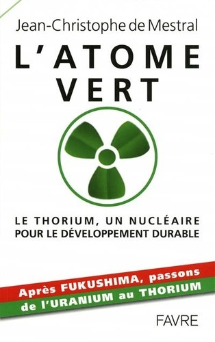

"L'atome vert" [[1]](#ref-1) est un livre consacré à une technologie peu connue du grand public mais beaucoup plus avancée et prometteuse que je ne le pensais : les réacteurs nucléaires au [Thorium](https://fr.wikipedia.org/wiki/Thorium). Les avantages sont très nombreux:

- le [Thorium 232](https://fr.wikipedia.org/wiki/Thorium_232) est plus abondant que l'uranium [[2]](#ref-2), on peut l'utiliser à 100% contre quelques pourcents pour l'uranium, et il n'y a pas besoin de l'enrichir.
- le 232Th étant [fertile](https://fr.wikipedia.org/wiki/Isotope_fertile) et non [fissile](https://fr.wikipedia.org/wiki/fissile) [[3]](#ref-3), il ne peut pas produire de réaction en chaîne. Une centrale ne peut pas s'emballer, et elle peut s'arrêter d'elle même en cas de défaut de refroidissement
- les [déchets du 232Th](https://fr.wikipedia.org/wiki/Cycle_du_combustible_nucléaire_au_thorium#Déchets_nucléaires) ne sont dangereux que quelques siècles, contre des centaines de milliers d'années pour ceux de l'uranium [[4]](#ref-4).
- les centrales au thorium peuvent "incinérer" les déchets des centrales à uranium, y compris le plutonium.
- on ne peut pas produire d'armes nucléaires  avec une centrale au thorium.

Coté désavantages, en cherchant bien il y en a quelques uns, mais le principal est :  on ne peut pas produire d'armes nucléaires  avec une centrale au thorium...

Selon Jean-Christophe de Mestral, c'est ce qui a favorisé la filière de l'uranium pendant la guerre froide alors que plusieurs expériences ont démontré la faisabilité et la sécurité des solutions au Thorium. Entre autres [réacteurs au Thorium](https://fr.wikipedia.org/wiki/Cycle_du_combustible_nucléaire_au_thorium#Liste_de_réacteurs_fonctionnant_au_Thorium):

- Le [réacteur nucléaire de Shippingport](https://fr.wikipedia.org/wiki/réacteur_nucléaire_de_Shippingport) aux USA qui a fonctionné comme [surgénérateur](https://fr.wikipedia.org/wiki/surgénérateur) au Thorium entre 1977 et 1982
- Plusieurs réacteurs à très haute température (HTGR) ont fonctionné avec des barres de combustible mixant Uranium 235 et Thorium 232 aux USA, mais aussi en Allemagne entre 1966 et 1989
- Les réacteurs expérimentaux et 7 [réacteurs CANDU](https://fr.wikipedia.org/wiki/Réacteur_CANDU) de 220 MW chacun utilisant un mix Uranium/Thorium qui fonctionnent actuellement en Inde. L'Inde est le seul pays mentionnant clairement le thorium dans son [programme énergétique](https://en.wikipedia.org/wiki/India%27s_three-stage_nuclear_power_programme), pour une raison simple : l'Inde a très peu d'Uranium, et ne peut pas en importer facilement car elle n'a pas signé le [Traité sur la non-prolifération des armes nucléaires](https://fr.wikipedia.org/wiki/Traité_sur_la_non-prolifération_des_armes_nucléaires). Par contre elle dispose de gros gisements de Thorium.
- Et aussi le [Molten-Salt Reactor Experiment](https://fr.wikipedia.org/wiki/Molten-Salt_Reactor_Experiment) (MSRE) qui fonctionna entre 1965 et 1969 avec divers combustibles, dont de l'Uranium 233 produit à partir de Thorium dans un autre réacteur.

Les [réacteurs à sels fondus](https://fr.wikipedia.org/wiki/Réacteur_nucléaire_à_sels_fondus) (MSR) sont prometteurs à moyen terme. Ils sont d'ailleurs prévus par le [Forum International Génération IV](https://fr.wikipedia.org/wiki/Forum_International_Génération_IV) dans les technologies disponibles d'ici 2030, mais hélas seulement dans leur version à l'Uranium. Les Réacteurs au Fluorure de Thorium Liquide ([LFTR](https://en.wikipedia.org/wiki/Liquid_fluoride_thorium_reactor))  n'ont pas été projetés dans cet horizon de temps, tout comme le "[Rubbiatron](https://fr.wikipedia.org/wiki/Amplificateur_d'énergie)" qui nécessite un accélérateur de particules d'ailleurs. Ce qui n'empêche pas l'AIEA d'en penser du bien [[5]](#ref-5), ni [la Chine de démarrer un ambitieux projet de LFTR](https://en.wikipedia.org/wiki/Liquid_fluoride_thorium_reactor#Chinese_Thorium_MSR_project), qui sera probablement une première mondiale...



Du point de vue nucléaire, les réacteurs à sels fondus n'ont que des avantages :

- le combustible est dissous dans un sel, solide à basse température, liquide en fonctionnement et servant en même temps de fluide de refroidissement primaire.
- la réaction ne se produit que dans le coeur car il faut à la fois une source de neutrons et un volume suffisant pour que la probabilité que le neutron soit absorbé soit assez élevée.
- l'installation fonctionne à pression ambiante : le très haut point d’ébullition du sel empêche que le système devienne une cocote-minute
- si l'installation surchauffe, un bouchon ("Freeze Plug" sur le dessin) fond et le sel s'écoule par gravité dans des réservoirs (en bleu) dont la géométrie stoppe les réactions nucléaires. C'est d'ailleurs comme ça que le MSRE était arrêté pour maintenance.

Les difficultés et inconnues sont surtout liés à la chimie de ces sels. Il faut installer une usine chimique pour les purifier à côté de la centrale, notamment pour en enlever le [Xenon 135](https://fr.wikipedia.org/wiki/Empoisonnement_au_xénon). On ne sait pas trop bien comment un LFTR vieillira, notamment en raison de la corrosion par les sels.



Au passage, j'ai découvert l'existence du projet Aircraft Reactor Experiment (ARE) qui visait la [propulsion nucléaire d'avions](https://en.wikipedia.org/wiki/Aircraft_Nuclear_Propulsion). C'était un MSR dont les sels à 850 ° chauffaient l'air dans les réacteurs, qui fonctionna 1000 heures en 1954, quand on avait peur de rien sauf peut être des rouges. Donc je ne le savais pas mais oui, il existe dans les cartons une alternative au turboréacteur.

Le livre "L'atome vert" est très intéressant et convaincant pour l'initié, mais il m'a semblé parfois trop technique pour le grand public. Je le trouve aussi inutilement provocateur pour les écolos irréductibles, notamment le passage comparant les risques des diverses sources d'énergie par TWh produit et celui comparant les taux de cancers dans les zones à forte radioactivité naturelle, même si c'est très intéressant [[6]](#ref-6).

Enfin, même la conclusion me semble trop touffue pour les politiciennes lambda qui sont pourtant les personnes à convaincre, alors je résume pour elles eux : "Thorium pouvoir produire Térawatts propres et pas chers pour remplacer pétrole et charbon. Vous y'en a donner feu vert, nous s'occuper du reste". Je ne sais pas ce que ça donne en hindi ou en mandarin, mais là bas ils ont compris.

_(merci à Alberto de m'avoir prêté le livre à l'insu de son plein gré)_

### Références

1. 
2. Maurice Mashaal, "[La chaleur radioactive de la Terre chiffrée](http://www.pourlascience.fr/ewb_pages/a/actualite-la-chaleur-radioactive-de-la-terre-chiffree-27249.php)", 2011, Actualités Pour La Science,
3. [Pourquoi le Thorium 232 est-il fertile ?](http://www.je-comprends-enfin.fr/index.php?/La-fission-dans-les-reacteurs-avec-fertilisation/pourquoi-le-thorium-232-est-il-fertile/id-menu-66.html) 2011, site Je Comprends Enfin
4. Sylvain David, Elisabeth Huffer, Hervé Nifenecker "[Revisiting the thorium-uranium nuclear fuel cycle](http://dx.doi.org/10.1051/EPN:2007007)" (2007), Europhysics News vol. 38 (2) p. 24-27 [DOI : 10.1051/EPN:2007007](http://dx.doi.org/10.1051/EPN:2007007)
5. "[Thorium fuel cycle - Potential benefits and challenges](http://www-pub.iaea.org/mtcd/publications/pdf/te_1450_web.pdf)" IAEA-TECDOC-1450, May 2005
6. Ghiassi-nejad, M;  Mortazavi, S M J;  Cameron, J R;  Niroomand-rad, A;  Karam, P A "[Very high background radiation areas of Ramsar, Iran: preliminary biological studies.](http://www.probeinternational.org/Ramsar.pdf)" (2002) Health physics vol. 82 (1) p. 87-93, PMID:[11769138](https://www.ncbi.nlm.nih.gov/pubmed/11769138)
