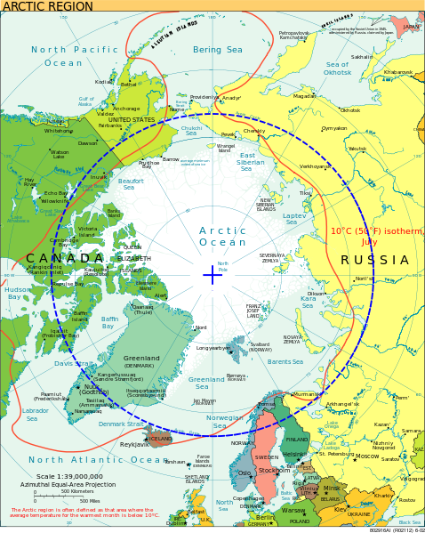

La Terre est sphérique, orbite autour du soleil en un an, et en 24 heures elle tourne sur elle-même autour d'un [axe incliné](w:inclinaison_de_l'axe) d'environ 23.5° par rapport à la perpendiculaire au plan de l'écliptique. Ceci produit les saisons, comme l'explique très bien ce [joli simulateur](http://astro.unl.edu/naap/motion1/animations/seasons_ecliptic.swf), mais fait aussi varier la durée du jour de manière assez complexe, pour autant qu'on définisse le [jour](w:) comme l'intervalle de temps entre un lever du soleil et son coucher suivant.

Sous nos latitudes, la durée du jour est certes plus longue en été qu'en hiver, mais dans les régions polaires, le soleil ne se couche pas pendant plusieurs semaines, voire mois. Ce long [jour polaire](w:) est un phénomène spectaculaire, comme on le voit dans cet [accéléré](w:) qui suit le soleil pendant une semaine:



Ceci ne se produit qu'en Antarctique ou dans le [cercle polaire arctique](w:cercle_arctique) en bleu sur la carte ci-dessous, où l'on voit que nous autres européens sommes très favorisés pour aller contempler le [soleil de minuit](w:jour_polaire). Il nous suffit d'aller au nord de la Scandinavie, jusqu'au [Cap Nord](w:) situé à 71° de latitude nord, accessible par route ou [par bateau](w:Hurtigruten).

Pourtant, quand j'y étais le 3 août, le soleil faisait déjà une sieste d'environ 4 heures, juste sous l'horizon après un coucher de soleil qui a bien duré une heure. Alors, comment connaitre les dates entre lesquelles le soleil de minuit est observable, ou la latitude à laquelle il faut se rendre à une date donnée pour l'observer ?

En tenant compte de l'astronomie, mais pas des effets atmosphériques qui font qu'on voit encore le soleil même lorsqu'il est un peu en dessous de l'horizon, la formule approximative de la durée du jour  est [[1]](#ref-1), [[2]](#ref-2), [[3]](#ref-3) :

$D = -\frac{24}{\pi}.\cos^{-1}\left( \tan \lambda \tan\left( \sin^{-1}\left( \sin \alpha \sin \delta \right)\right)\right)$

où α est l'inclinaison de l'axe terrestre ( 23.5° ), λ la latitude du site et δ l'angle parcouru par la Terre sur son orbite depuis sa position à l'[équinoxe de printemps](w:), environ égal au nombre de jours depuis l'équinoxe x 360°/365

en traçant cette fonction pour différentes latitudes, on obtient ce graphique :

Sous nos latitudes, la durée du jour varie approximativement comme une sinusoïdale qui s’aplatit lorsqu'on se rapproche de l'équateur, où le soleil surgit perpendiculairement à l'horizon à 6h du matin et y replonge en piqué vers une nuit noire 12h plus tard.

La situation est assez spéciale aussi aux cercles polaires (±66.55°) : la durée de leur jour y varie linéairement toute l'année, avec un seul soleil de minuit au solstice d'été et une seule nuit de 48h au [solstice](w:) d'hiver.

Au delà des cercles polaires, la durée du jour varie de façon très abrupte, ce que l'on peut comprendre si l'on considère qu'aux aux solstices d'été et d'hiver, les rayons du Soleil sont tangents à la Terre sur le cercle polaire. A partir de là, une augmentation de l'angle de l'axe de la Terre par rapport aux rayons du soleil de 1° (qui survient en environ une semaine) suffit à faire plonger le soleil de 1° sous l'horizon à minuit, mais comme il ne s'élève qu'à 23° dans le ciel à midi, la "nuit" dure plus d'une heure.

Le graphique permet aussi de répondre à ma question plus haut. On voit qu'au Cap Nord (λ = 70°, courbe bleu ciel), le soleil ne se couche pas depuis environ un mois avant le solstice d'été jusqu'à un mois après, soit du 21 mai au 21 juillet (la courbe bleu ciel fait un "plat" à 24h de jour entre ces deux dates). Mais le 3 août, à peine deux semaines plus tard, la courbe est déjà tombée à environ 20h de jour "seulement".

Pour voir le soleil de minuit en août, il eût fallu\* aller au [Svalbard](w:), archipel mieux connu par le son île principale [Spitzberg](w:) située non loin de 80°N. Et en y restant de fin août à fin octobre, on peut y vivre la spectaculaire plongée de la durée du jour de 24h à 0 en un peu plus d'un mois, qui précipite ces latitudes dans la [nuit polaire](w:), bleue avec des aurores boréales vertes... ([ajouté aux todo...](http://goo.gl/maps/g52gz))



Note \* : le passé antérieur conditionnel passé 2ème forme en jette moins que l' [imparfait du subjonctif](/?s=subjonctif), mais quand même ;-)

## Références et liens

1. "[Durée du jour](w:)" sur Wikipédia
2. "[Durée du jour en fonction de la date et de la latitude](http://maths-au-quotidien.fr/lycee/duree.pdf)" sur maths au quotidien
3. Xavier Hubaut, "[Mathématique du secondaire - Le jour et la nuit](http://xavier.hubaut.info/coursmath/var/jour.htm)"
4. François Lagarde, "[Les saisons, les tropiques, le cercle polaire](http://www.flagarde.fr/voyages/point_geo/les_saisons.htm)"

- [Day and Night World Map](http://www.timeanddate.com/worldclock/sunearth.html) : carte du monde avec zones jour/nuit
- [Jour et nuit au cours d'une année](http://www.appannie.com/app/ios/jour-et-nuit-au-cours-dune/) : application didactique pour iPad
- [pyephem](http://rhodesmill.org/pyephem/), un package Python qui permet des calculs d'éphémérides astronomiques précis.
