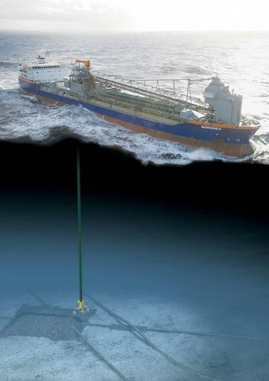
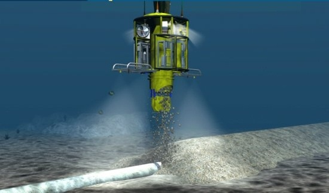
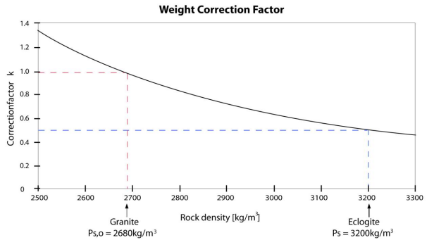



Vu en Norvège quelques trous dans une falaise de fjord dont on nous a indiqué qu'il s'agissait d'une ancienne carrière d'[éclogite](http://fr.wikipedia.org/wiki/%C3%89clogite). Qu'est-ce ?

Cette roche se forme à partir des fonds océaniques qui plongent dans le manteau terrestre aux [zones de subduction](https://fr.wikipedia.org/wiki/Subduction). La température, mais surtout la pression en chassent l'eau et compriment les minéraux jusqu'à former un mélange d'[omphacite](http://fr.wikipedia.org/wiki/Omphacite) verte et de [grenat](http://fr.wikipedia.org/wiki/Grenat) parsemé de petits grains d'autres minéraux comme le [rutile](http://fr.wikipedia.org/wiki/Rutile), voire même de micro [diamants](http://en.wikipedia.org/wiki/Eclogite#Eclogite_diamonds).

L'éclogite est parfois [très jolie](http://www.flickr.com/photos/34083234@N06/5768718484/), mais a surtout la propriété d'être particulièrement dense, entre 3 et 3.5 kg/dm³. Les géologues estiment qu'elle est de ce fait très abondante dans le manteau terrestre, à quelques centaines de km de profondeur [[1]](#ref-1), et joue un rôle important dans la [convection mantellique](https://fr.wikipedia.org/wiki/Convection_mantellique).

Et lorsqu'un gisement se trouvait directement sur une côte facilement accessible, la dense éclogite était fort utile pour lester les bateaux des siècles passés.

Mais à quoi peut donc donc servir aujourd'hui l'immense carrière d'éclogite moderne juste à côté ? [Cette page](http://www.visneskalk.no/eklogitt/en/produksjon.html) dit qu'elle produit principalement du ballast pour l' "offshore rockdumping", ou "déchargement sous-marin de roches"  [[2]](#ref-2), [[3]](#ref-3), [[4]](#ref-4).  Ca consiste à déposer une couche de cailloux au fond de la mer pour l'égaliser avant la pose d'une plateforme pétrolière par exemple, ou pour protéger des pipelines sous-marins et les isoler thermiquement. Des [bateaux spéciaux](http://en.wikipedia.org/wiki/Rock-dumping_vessels) sont capables de réaliser ceci avec une grande précision jusqu'à plus de 1200m de fond (mais [peuvent aussi chavirer](http://en.wikipedia.org/wiki/MV_Rocknes)...)

Oui mais bon, vaut-il vraiment la peine d'utiliser de la jolie éclogite à 3.2 kg/dm³ plutôt que du bête granit à 2.7 pour faire ceci ?

La réponse est oui, car la [poussée d'Archimède](http://fr.wikipedia.org/wiki/Pouss%C3%A9e_d%27Archim%C3%A8de) fait fortement varier le [poids apparent](http://fr.wikipedia.org/wiki/Poids#Poids_apparent) dans l'eau des corps immergés en fonction de leur densité. Dans le cas qui nous occupe, la densité de l'éclogite supérieure de 20% à celle du granit fait qu'il en faut deux fois moins (en kg) que du granit pour exercer la même force au fond de la mer, comme le montrent un petit calcul et ce graphique [[5]](#ref-5):

La carrière de [Visnes](http://en.wikipedia.org/wiki/Visnes,_M%C3%B8re_og_Romsdal) ayant le bon goût de se situer non loin des importantes installations pétrolières de Norvège et de Mer du Nord, nul doute que ses quelques millions de tonnes d'éclogite se retrouveront bientôt au fond de la mer...



### Références

1. Don L. Anderson "[The layered mantle revisited - An eclogite reservoir](http://www.mantleplumes.org/Eclogite.html)"
2. "[Rockdumping](http://www.theartofdredging.com/rockdumping.htm)" sur theartofdredging.com (l'art de la drague...)
3. "[Histoire du déchargement sous-marin de roches](http://www.rockdumping.eu/history.html)" (en néerlandais)
4. Clive Skelhorn, "[Hydrographic Survey in Deep Water and its Problems for Rockdumping](http://www.rockdumping.eu/deepwaterrockdumping.pdf)", 2003, Hydrographic Society Benelux
5. "[Company profile and material specification](http://www.norock.com/doc/Norock_Company_Profile_and_Material_Specification.pdf)", Norock & Co.
