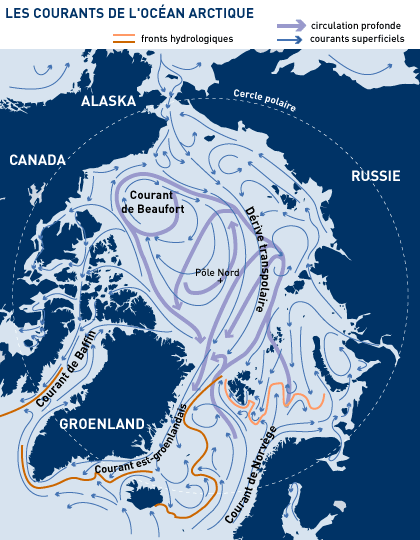

Sur cette carte illustrant déjà mon [article sur le cercle polaire](/2013/08/11/combien-dure-un-jour/ "Combien dure un jour") apparaît aussi en rouge [l'isotherme](w:Isotherme_(ligne)) de température moyenne de 10°C en juillet qui délimite l'[Arctique](w:) climatique plutôt que l'Arctique géographique :

[http://fr.wikipedia.org/wiki/Oc%C3%A9an\_Arctique](w:Océan_Arctique)

### Références

1. Jean-Louis Etienne, "[L'Océan Arctique et la circulation océanique](http://www.jeanlouisetienne.com/images/encyclo/imprimer/18.htm)"
2. R. Seager, D. S. Battisti et al. "[Is the Gulf Stream responsible for Europe’s mild winters?](http://www.atmos.washington.edu/~david/Gulf.pdf)", 2002, Q. J. R. Meteorol. Soc. 128, pp. 2563–2586
3. M. Latif, E. Roeckner et al. "[Tropical Stabilization of the Thermohaline Circulation in a Greenhouse Warming Simulation](http://eprints.uni-kiel.de/12858/1/Tropical.pdf)", 2000, Journal of Climate vol 13.
