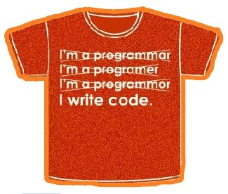

Dans un récent article [[1]](#ref-1) Anna Lietti fait le point sur une question qui fait son chemin un peu partout:

> Pour former des citoyens «informatiquement éclairés»\*, l’école doit-elle enseigner à tous le b. a.-ba de la programmation?

Selon certains comme [Bernard Stiegler](w:), les enfants du numérique ont une "expérience rusée" du fonctionnement des machines, mais leur approche intuitive approche vite ses limites et ne leur permet pas de dominer la machine. Or cette domination est nécessaire pour contrôler notre monde, de plus en plus automatisé, numérique et interconnecté. On le voit avec l'affaire [PRISM](<w:PRISM_(programme_de_surveillance)>) : contrôler [La Machine](/2008/11/29/les-dimensions-de-la-machine/), c'est avoir le pouvoir sur ses utilisateurs...

Des précurseurs comme [Seymour Papert](w:) (élève de [Jean Piaget](w:)) se sont intéressés dès les années 1960 à la pédagogie de l'informatique et inventé des outils comme le [langage Logo](<w:Logo_(langage)>) pour initier à l'algorithmique et à la programmation procédurale dès l'enfance. Pourtant, 50 ans plus tard, aucun pays n'intègre la programmation au cursus scolaire primaire, peu le font au niveau secondaire, et la branche y est rarement obligatoire.

En Grande-Bretagne, suite à un rapport de la Royal Society intitulé "Shut down or restart" [[3]](#ref-3) qui jugeait l'enseignement de l'informatique tellement insatisfaisant qu'il vaudrait mieux ne rien faire, la décision a été prise d’initier les enfants dès 5 ans à la programmation dès la rentrée 2014 et que la programmation devienne une branche obligatoire du baccalauréat au même titre que la physique ou la chimie.

En France aussi, un récent rapport de l’Académie des Sciences [[4]](#ref-4) vient de recommander d'aller plus loin que la récente (ré)introduction de la spécialité "[informatique et sciences du numérique](w:)" en terminale S [[5]](#ref-5), en incluant "une initiation aux concepts de l’informatique" dès l'école primaire , puis "un véritable enseignement d’informatique, qui ne soit pas noyé dans les autres enseignements scientifiques et techniques, mais développe des coopérations avec ceux-ci dans une volonté d’interdisciplinarité" au collège, puis "proposer un enseignement obligatoire d’informatique en seconde" au lycée.

Plusieurs initiatives se développement également  en Suisse, notamment:

- le Prof. Juraj Hromkovic avec son module "[programmer dans les écoles primaires](http://www.abz.inf.ethz.ch/)", adopté dans une trentaine d’établissements en Suisse alémanique
- Jürg Kohlas, qui promeut l'enseignement de l’informatique comme discipline fondamentale au gymnase (=lycée) dans un livre tout récent [[2]](#ref-2), en recommandant de commencer par former les professeurs, un problème qui semble général...
- 
  Manuela Barraud et Olivier Jorand proposent des ateliers de "[philobotique](http://www.philobotique.ch/home.html)" combinant programmation et robotique ludique dans la continuation de la "philosphie Logo", mais ils forment aussi des enseignants à leur approche. Outre Logo, ils utilisent le langage semi graphique [Scratch](http://scratch.mit.edu/) développé au MIT pour les enfants dès 7 ans.

Pour ma part, voici les quelques leçons que je tire de ma maigre expérience de l'enseignement de la programmation des deux côtés de la barrière:

1. Pas facile d'être prof. quand certains élèves maîtrisent mieux le sujet. Il faut une formation en béton, et si possible conserver le choix des armes...
2. La robotique est très motivante pour les jeunes. Avec juste une boucle et quelques tests on peut faire bouger quelque chose de concret alors que sur un écran il faut beaucoup plus de code pour faire quelque chose d'un tant soit peu excitant.
3. Mais les robots c'est cher et délicat, alors les environnements virtuels en 3D sont un bon compromis : ils conservent un rapport résultat visuel/code élevé tout en ouvrant des possibilités amusantes comme [écraser des poulets](http://www.youtube.com/watch?v=Ujzum8h9nmk) sans que la SPA ne proteste ([Alice](http://www.alice.org/)), ou monter un canon sur un robot sans occasionner trop de dégâts ([Ceebot,](http://www.ceebot.com/ceebot/index-f.php) testé avec succès au [Festival de Robotique de l'EPFL](http://festivalrobotique.epfl.ch/) )
4. L'âge minimum pour s'intéresser à la programmation est celui où l'enfant est capable de comprendre la notion de [variable](<w:variable_(informatique)>). Je dirais expérimentalement vers 10 ans. Les boucles, les tests, même les sous-programmes et les fonctions peuvent encore passer plus tôt avec des choses comme "POUR CARRE : REPETE 4 \[AV 100 TD 90\] : FIN", mais c'est peut-être justement une raison de l'échec de la programmation au primaire : sans la capacité d'abstraction nécessaire pour associer une information (nombre, texte etc...) à un symbole, on est très vite limité. Or cette [même notion en mathématiques](<w:variable_(mathématiques)>) n'est introduite, sauf erreur, que vers 10-12 ans, et n'est pas assimilée facilement par tous. Imaginez alors la pagaille dans les esprits si le prof de maths dit que "x=2\*x-1 a pour solution x=1" et l'heure d'après celui d'informatique dit que "x=x+1 incrémente la valeur de x" ...
5. Il est très difficile de découpler l'enseignement de la programmation de celui des maths. En particulier pour la robotique ludique (réelle ou virtuelle) on a très rapidement besoin des vecteurs, de la trigonométrie, voire de notions d'intégration et dérivation pour passer des vitesses aux positions ou vice-versa.

Donc je ne crois pas à l'introduction de la programmation au primaire. Et sans programmation, pour quoi "faire de l'informatique" ? Et plus tard, au collège et au lycée, à quoi bon enseigner la programmation si on ne veut pas former des armées de programmeurs ?

### La programmation, latin du futur ?

C'est un paragraphe de l'article [[1]](#ref-1) qui a particulièrement retenu mon attention :

> L’idée n’est donc pas de former de futurs programmeurs, mais d’initier les enfants à un langage programmatique\*\* simple pour les familiariser avec la logique informatique. Les adeptes de cet enseignement ne tarissent pas d’éloges sur ses vertus pédagogiques. La programmation apprend à penser un problème jusqu’au bout, à construire des processus qui marchent en apprenant de ses erreurs. (...)
>
> Et encore: le langage informatique enseigne à penser logiquement et systématiquement. «Peu de disciplines nécessitent une telle rigueur mentale», observe Jürg Kohlas. Bien sûr, les langues programmatiques\*\* sont multiples et mouvantes. Mais quand on en a appris une, il est facile de se familiariser avec les suivantes.
>
> Ça ne vous rappelle rien? Ne croirait-on pas entendre parler du latin? «La programmation est bel et bien un langage avec un vocabulaire, une grammaire, une syntaxe, acquiesce Juraj Hromkovic. Mais il y a une grosse différence avec les langues naturelles: la plupart des gens ne savent même pas qu’ils ont affaire à un langage.»

Dans mon esprit de lycéen des années 1980, la programmation n'avait rien, mais alors RIEN à voir avec la langue morte infligée aux fils d'avocats par des curés nostalgiques. Mais avec le recul, je partage le point de vue de gens qui connaissent le latin et la programmation comme Tyler Plack [[7]](#ref-7),

> Ecrire en latin ou programmer un ordinateur requièrent tous deux une compréhension qui dépasse la pensée humaine complexe et la simplifie. De tels processus sont ce qui nous permet de penser clairement; ils font de nous qui nous sommes.

Donc oui, il faut enseigner la programmation aux lycéens, même si "ça ne sert à rien", comme le latin. Faut-il en faire une branche obligatoire du bac ? Certainement, au moins pour ceux qui ne font pas de latin.

Parce que combiner les deux peut donner des idées trop bizarres. Damian Conway par exemple en a été perturbé au point d'écrire un module [Perl](<w:Perl_(langage)>) définissant des alias latins pour tous les éléments du langage [[8]](#ref-8), ce qui permet de rendre ce code :


use Lingua::Romana::Perligata;
maximum inquementum tum biguttam egresso scribe.
meo maximo vestibulo perlegamentum da.
da duo tum maximum conscribementa meis listis.
dum listis decapitamentum damentum nexto
fac sic
nextum tum novumversum scribe egresso.
lista sic hoc recidementum nextum cis vannementa da listis.
cis.


parfaitement valide et absolument équivalent à celui-ci:


print STDOUT 'maximum:';
my $maxim = ;
my (@list) = (2..$maxim);
while ($next = shift @list)
  {
    print STDOUT $next, "\n";
    @list = grep {$\_ % $next} @list;
}


Et si après [Astérix](http://www.asterix.com/la-collection/les-traductions/asterix-en-latin.html),  la programmation permettait de moderniser l'enseignement du latin ?

### Notes:

\* l’expression est de Jean-Pierre Archambault, président de [l’EPI](http://www.epi.asso.fr/) (qui a un site très moche)

\*\* voilà bien la marque des pédagogues : surtout ne pas utiliser l'expression ["langage de programmation](w:)" adopté par l'ensemble de la profession... Ou alors la journaliste n'a pas vérifié... (edit : c'est bien ça, Confirmé par anna Lietti...)

### Références

1. Anna Lietti "[Education: sus à l’analphabétisme informatique!](http://www.hebdo.ch/hebdo/mieux-comprendre/detail/education-sus-%C3%A0-l%E2%80%99analphab%C3%A9tisme-informatique)" 2013, L'Hebdo No 34, p. 38-41
2.  ([page officielle du livre](http://www.nzz-libro.ch/informatiqueatgymnase.html))
3. Steve Furber "[Shut down or restart? The way forward for computing in UK schools](http://royalsociety.org/uploadedFiles/Royal_Society_Content/education/policy/computing-in-schools/2012-01-12-Computing-in-Schools.pdf)" January 2012, Royal Society
4. Académie des Sciences "[L’enseignement de l’informatique en France : Il est urgent de ne plus attendre](http://www.academie-sciences.fr/pdf/rapport/rads_0513.pdf)", Rapport de l’Académie des sciences , Mai 2013
5. Jean-Pierre Archambault "[C’est un changement de paradigme que l’informatique devienne une discipline scolaire](http://www.letudiant.fr/educpros/entretiens/jean-pierre-archambault-president-d-enseignement-public-et-informatique-cest-un-changement.html)", 2012, l'Etudiant
6. "[Le code deviendra-t-il le latin du XXIe siècle ?](http://www.framablog.org/index.php/post/2011/12/08/code-latin-ecole)" 2011, Framablog (trouvé grâce à l'image du T-shirt)
7. Tyler Plack "[Logic: Computer Programming & Latin](http://tplack.com/logic-computer-programming-latin/)" (sur internet archive)
8. Damian Conway, "[Lingua::Romana::Perligata -- Perl for the XXI-imum Century](https://web.archive.org/web/20161129144419/http://www.csse.monash.edu.au/~damian/papers/HTML/Perligata.html/)", 2000, School of Computer Science and Software Engineering, Monash University (internet archive)
