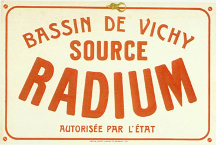
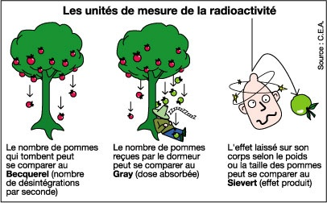

Il y a encore 150 ans, les scientifiques emmenés par Lord Kelvin pensaient que la Terre se refroidissait depuis 400 millions d'années au grand maximum [[1]](#ref-1). La dérive des continents était inimaginable car la croûte terrestre devait s'être solidifiée sur une très grande épaisseur, peut-être en formant les immenses cavernes décrites dans le "Voyage au centre de la Terre" de Jules Verne.

Un siècle plus tard, nous savons que si la Terre a toujours des volcans, de fins continents qui dérivent sur un [manteau](w:Manteau_(géologie)) visqueux et des montagnes qui poussent après 4.5 milliards d'années d'existence, c'est parce que la désintégration d'éléments radioactifs la réchauffent de l'intérieur [[2]](#ref-2). On estime actuellement la puissance de ce chauffage nucléaire naturel à environ 24 terawatts [[3]](#ref-3), soit l'équivalent de 24'000 centrales nucléaires humaines, ou deux fois la consommation humaine totale d'énergie\* si vous préférez.

Cette chaleur est produite par les chaines de désintégration de l'[uranium](w:) 238, du [thorium](w:) 232 et du [potassium 40](w:), et dans une toute petite mesure de l'[uranium 235](w:). On appelle ces [radioisotopes](w:radioisotope) "primordiaux" car ils existent depuis la formation de la Terre, et même depuis bien avant car ils ont été formés dans les supernova qui ont fabriqué les éléments lourds du système solaire. S'ils sont encore relativement [abondants](w:Uranium#Abondance_et_répartition), c'est grâce à leur [période (ou demi-vie)](w:Période_radioactive) de l'ordre du milliard d'années qui fait qu'ils sont relativement peu radioactifs. En se désintégrant, les primordiaux fabriquent d'autres radio-isotopes "descendants" de durée de vie plus courte, donc plus radioactifs. Les plus connus et abondants sont le [radium](w:) et le [radon](w:Radon_222), un gaz dont nous reparlerons plus bas.

D'autre part, il existe dans la nature des radio-isotopes "cosmogéniques", produits par l'interaction de [rayons cosmiques](w:Rayon_cosmique) avec d'innocents atomes qui se trouvaient sur leur trajectoires. Le plus connu est le [carbone 14](w:) utilisé pour la datation. Comme le carbone 14 est produit en continu mais se désintègre au fur et à mesure, il se trouve en (quasi) [équilibre séculaire](w:) : un atome de carbone sur 1012 environ est du 14C. Pendant sa vie, un organisme quel qu'il soit ingère, absorbe ou photosynthèse du carbone avec cette proportion de carbone 14. Après sa mort, les atomes de carbone 14 de ses restes se désintègrent, et au bout de 5730 ans environ il n'en reste plus que la moitié. Avec un bon spectromètre de masse, on peut ainsi déterminer la date du décès avec une bonne précision jusque vers -35'000 ans.

Un autre radio-isotope cosmogénique intéressant est le [tritium](w:), l'isotope 3H de l'hydrogène. Les rayons cosmiques en [produisent](w:Tritium#Réactions_de_production) environ 0.2 Kg/an sur toute la Terre, mais la moitié se désintègre en 12.32 ans ce qui fait que l'équilibre séculaire n'en laisse que 3.5 Kg en tout et pour tout sur toute la Terre, dilué à raison d'un atome de tritium pour 1018 atomes d'hydrogène. Ca n'est vraiment pas assez pour pouvoir l'extraire et [l'utiliser](w:Tritium#Usages), mais ça fait tout de même 67 millions d'atomes radioactifs dans chaque litre d'eau ordinaire\*\*.

Nous vivons donc dans un monde naturellement radioactif : le sol, l'air, l'eau, tout notre environnement contient des quantités non négligeables d'éléments radioactifs dont on n'avait à peu près aucune idée il y a un siècle.

Pour quantifier le phénomène, il existe plusieurs unités différentes, et les mesures peuvent varier sur beaucoup d'ordres de grandeur, donc il faut faire attention à ne pas s'emmêler les pinceaux en sachant bien de quoi on parle sinon on peut paniquer pour rien, ou faire paniquer ceux qui n'y connaissent rien, au choix.

 Le [Becquerel](w:) \[Bq\] mesure un nombre de désintégrations d'atomes par seconde. C'est tout. Il n'intègre ni le type de ces événements, ni la quantité de matière dans laquelle on mesure les désintégrations, ni même la manière de mesurer. Par exemple [l'activité de l'uranium naturel](w:Uranium#Activité_massique) est de 25'000 \[Bq/g\] : dans un gramme, 25'000 atomes se désintègrent chaque seconde. Mais si vous faites l'expérience assez longtemps, vous allez en mesurer 3 fois plus, voire 7 fois sous une cloche\*\*\*. Pourquoi ?  Parce que vous allez aussi mesurer l'activité des produits de désintégration de votre uranium, y compris le gaz radon si vous l’empêchez de se disperser dans l'atmosphère. Or le [radon 222](w:) a une activité de 5,73×1015\[Bq/g\], 230 milliards de fois plus que l'uranium qui lui a donné naissance car sa demi-vie n'est que de 3.82 jours. Pour ne rien simplifier, certains utilisent encore l'ancien [Curie](w:Curie_(unité)) \[Ci\] à la place du Becquerel, surtout pour de fortes radioactivités.

Le [Gray](w:Gray_(unité)) \[Gy\] remplace l'ancienne unité [Rad](w:Rad_(ancienne_unité)) et mesure la "[dose absorbée](w:)" par [irradiation](w:), qui est une énergie par masse \[J/kg\]. Avec les Gray, peu importe la cause du rayonnement : 1 milliGray de rayons X est égal à 1 milliGray de particules alpha produites par la désintégration du radon par exemple.

Enfin, le [Sievert](w:) \[Sv\] mesure la "[dose équivalente](w:)" (anciennement mesurée en [Röntgen equivalent man](w:) \[rem\] ), qui tient compte de l'effet des divers types de rayonnements sur les êtres vivants, l'humain en particulier. Les Sievert sont des Gray pondérés par des [facteurs](w:Dose_équivalente#Facteur_de_pondération_du_rayonnement) définis par la [CIPR](w:Commission_internationale_de_protection_radiologique), qui valent:

- 1 pour les [rayons X](w:), [gamma](w:Rayon_gamma) et [bêta](w:Particule_bêta)
- 2 pour les protons
- entre 2 et 20 [selon l'énergie](./images/facteu11.jpg) pour les [neutrons](w:Neutron#Radioactivité)
- 20 pour le reste, essentiellement les [particules alpha](w:Particule_alpha)



Ca peut surprendre si on se rappelle qu'une particule alpha (qui est un noyau d’hélium) est stoppée par une bête feuille de papier, que les bêta s'arrêtent contre une feuille métallique (parce que ce sont des électrons ou des [positrons](w:Positron), chargés électriquement) alors que les X et les gamma traversent tout sauf une épaisse couche de blindage.

Justement : nous ne sommes pas une épaisse couche de blindage, ni métalliques : les X et gamma nous traversent facilement, en interagissant peu. C'est ce qui permet de faire des [radiographies](w:Radiographie) entre autres. Quant aux neutrons, ils sont principalement produits sur Terre artificiellement, en particulier dans la [réaction en chaîne](https://fr.wikipedia.org/wiki/Réaction_en_chaîne_(nucléaire) de l'uranium 235. Les rayons cosmiques peuvent également produire des neutrons, qui contribuent un peu à la radioactivité naturelle (\*\*\*\*).

Par contre les alpha, on se les prend en plein dans la viande, et leur énergie peut faire des dégâts à notre ADN en particulier, avec risques de cancers supplémentaires à la clé. Or une bonne moitié de désintégrations de radio-isotopes produisent des alpha, et si ces isotopes se retrouvent à l'intérieur de notre corps, la possibilité d'être atteint par le rayonnement devient une certitude.

Finalement, la "dose équivalente" de radioactivité naturelle annuelle reçue par un français moyen est de 2.4 milliSievert \[mSv\], décomposée comme suit [[4]](#ref-4):

- 0.6 \[mSv\] reçus de la désintégration des radio-isotopes primordiaux dans le sol
- 0.4 \[mSv\] reçus par les rayons cosmiques. Pour un pilote professionnel, ce poste peut augmenter à plus de 5 \[mSv\]
- 0.2 \[mSv\] de potassium 40 et de carbone 14 ingérés par les aliments, qui représentent à eux deux 8000 Bequerels des 8500 typiquement mesurés sur un humain de 70 kg. Mais ces éléments produisent des rayons beta peu nocifs
- Plus de la moitié de la dose moyenne soit 1.3 \[mSv\] provient de l'inhalation de [radon](w:) et de sa rapide désintégration dans les poumons. Cette valeur correspond à respirer de l'air en permanence de l'air contenant 65 \[Bq/m³\] de radon, or il existe des régions dans lesquelles l'air de maisons mal ventilées en contient 1000 \[Bq/m³\] voire plus, ce qui amènerait la dose équivalente d'un habitant casanier au delà des 20 \[mSv/an\] considérés comme maximum acceptable. Il est établi que le radon [provoque des cancers du poumon](w:Radon#Maladie_professionnelle) chez les mineurs, d'uranium en particulier, mais aussi de charbon, et il est fortement suspecté que le radon présent dans les habitations augmente également le risque de cancer du poumon, surtout en conjonction avec le tabagisme. Donc si vous habitez dans une région particulièrement exposée au radon (voir [cette carte pour la Suisse](https://www.bag.admin.ch/bag/fr/home/themen/mensch-gesundheit/strahlung-radioaktivitaet-schall/radon/radongebiete-ch.html)) et dans une maison ancienne et mal ventilée, arrêtez de fumer. Et ventilez votre maison. Si vous êtes vraiment inquiets, faites en mesurer l'air, dont l'activité ne devrait pas dépasser 400 Bq/m³ (ou 150, ou 1000 [selon les pays](w:Radon#Normes_de_concentrations_admissibles_en_radon)).

Outre les régions exposée au radon et les mines d'uranium, il existe d'autres endroits où la radioactivité naturelle est particulièrement élevée, et intéressante.

A [Ramsar en Iran](w:Ramsar_(Iran)), la dose équivalente moyenne est de 260 \[mSv/an\], beaucoup plus que ce que permet n'importe quelle norme d'exposition de la population civile. Cette radioactivité provient pour beaucoup du radium dissous dans les eaux thermales de la ville. Or le taux de cancer des habitants de Ramsar n'est pas significativement différent de celui de populations vivant à des endroits moins exposés  [[6]](#ref-6). D'autres études sont parvenues au mêmes conclusions à propos de [Yangjiang en Chine](w:Yangjiang#cite_ref-1), de la province du Kerala en Inde (riche en minerai de [thorium](/2013/05/18/latome-vert-le-thorium/ "L’atome vert : le thorium")) et de [Guarapari](w:Guarapari#Radioactivité_naturelle) au Brésil où les niveaux de radioactivité naturelle sont aussi beaucoup plus élevées que la norme. Selon ces chercheurs, les populations vivant dans ces régions auraient développé une résistance biologique aux radiations, mais ce sujet est encore controversé, tout comme l'est d'ailleurs celui des [faibles doses d'irradiation](w:) en général.

Le cas de radioactivité naturelle le plus extrême est sans doute celui d'[Oklo au Gabon](w:Réacteur_nucléaire_naturel_d'Oklo). Des particularités dans la composition de l'uranium extrait des mines là bas ont révélé que plusieurs réacteurs nucléaire naturels y ont fonctionné pendant quelques centaines de milliers d'années, il y a environ 2 milliards d'années ! Ils ont consommé environ 6 tonnes d'uranium 235 dans une réaction en chaîne stabilisée par de l'eau, comme dans les réacteurs artificiels. Ensuite, les produits de fission sont restés sur place tout ce temps, ce qui est assez intéressant à étudier du point de vue de la gestion des déchets nucléaires.

Voilà, je voulais essayer de parler de nucléaire de manière totalement objective et dépassionnée en ne traitant que de radioactivité naturelle. C'est réussi ? Bon alors je termine en disant que ces points de repères devraient vous permettre de juger de manière critique certains chiffres concernant le nucléaire artificiel, comme la fuite de tritium de Fukushima dans l'océan ...

### Notes:

\*  de puissance continue plutôt, la consommation d'énergie étant d'environ 118'000 [TWh](w:Kilowatt-heure)/an

\*\*  Vous prenez du tritium à [9 CH](w:Dilution_homéopathique) chaque fois que vous buvez de l'eau, ce qui prouve l'efficacité du tritium homéopathique contre la soif...

\*\*\* en fait je ne sais pas vraiment comment on mesure des \[Bq\]. J'imagine que c'est avec des versions modernes du bon vieux compteur Geiger, comme le [compteur proportionnel à gaz](w:). Quelqu'un sait ?

\*\*\*\* phrase corrigée après le commentaire du Dr. Eric Simon

### Références:

1. P. England, P. Molnar, and F. Richter, "[Kelvin, Perry et l’âge de la Terre](http://www.pourlascience.fr/ewb_pages/a/article-18307-kelvin-perry-et-l-age-de-la-terre-.php)", 2008, Pour la Science no. 364
2. Pascal Richet "[La radioactivité, le soleil, la terre et la mort de Kelvin](http://www.larecherche.fr/la-radioactivit%C3%A9-le-soleil-la-terre-et-la-mort-de-kelvin)" , 1996, La Recherche n° 291 , page 78
3. "[La chaleur radioactive de la Terre chiffrée](http://www.pourlascience.fr/ewb_pages/a/actu-chaleur-interne-de-la-terre-la-radioactivite-compte-pour-moitie-27249.php)", 2011, Actualité Pour La Science
4. [L'irradiation naturelle en 10 épisodes](http://www.sfmn.org/images/pdf/GroupesDeTravail/GT_Radioprotection/Irradiation_naturelle_en_10_episodes.pdf), Société Française de Radioprotection (très bonne synthèse illustrée)
5. "[Naturally-Occurring Radioactive Materials (NORM)](http://www.world-nuclear.org/information-library/safety-and-security/radiation-and-health/naturally-occurring-radioactive-materials-norm.aspx)" World Nuclear Association
6. Ghiassi-nejad, M;  Mortazavi, S M J;  Cameron, J R;  Niroomand-rad, A;  Karam, P A "[Very high background radiation areas of Ramsar, Iran: preliminary biological studies.](http://www.probeinternational.org/Ramsar.pdf)" (2002) Health physics vol. 82 (1) p. 87-93 

### Autres sources:

- "[La radioactivité : le phénomène physique](http://www.futura-sciences.com/magazines/matiere/infos/dossiers/d/physique-radioactivite-phenomene-physique-13-761/page/8/)", Dossier Futura-Sciences
- "[Radioactivity in Nature](http://www.physics.isu.edu/radinf/natural.htm)", Idaho State University, avec de nombreuses références dont
    - 
