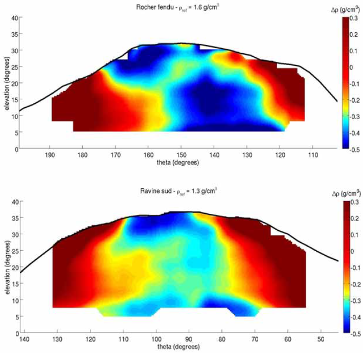

Avec des muons cosmiques, pardi !

Un article du "Pour la Science" de décembre m'a particulièrement scotché : une équipe a radiographié, ou plus exactement [tomographié](https://fr.wikipedia.org/wiki/Tomographie) l'intérieur du [volcan de la Soufrière](https://fr.wikipedia.org/wiki/Soufri%C3%A8re_\(Guadeloupe\)) en Guadeloupe [[1]](#ref-1). Le [projet "Diaphane" du CNRS](http://www.insu.cnrs.fr/terre-solide/experimenter-modeliser/projet-diaphane-radiographier-les-volcans-avec-les-rayons-cosmiq) a obtenu des mesures de la densité des roches comme celles ci-dessous:

On y distingue par exemple sur l'image du bas la cheminée bien verticale du cratère "sud-sud". Ces mesures sont compatibles avec celles obtenues par d'autres techniques [[2]](#ref-2), mais leur résolution de l'ordre de 30m est bien meilleure, et le système relativement peu coûteux.



L'idée géniale est de placer un détecteur sur le flanc de la montagne, et de laisser les rayons cosmiques produire naturellement des [muons](https://fr.wikipedia.org/wiki/Muon) qui vont traverser la montagne et arriver au détecteur. En mesurant leur direction d'arrivée et connaissant par cartographie l'épaisseur de roche traversée, on peut déterminer la densité de la roche à partir du flux de muons détectés [[3]](#ref-3).

Comme ce flux n'est pas très élevé (10 à 100 muons détectés par jour), il faut plusieurs semaines pour obtenir une image complète, mais un tel système pourrait surveiller en continu certains volcans et y détecter des mouvements internes potentiellement précurseurs d'éruptions. Technique à suivre donc.

D'autres articles du [Pour la Science de ce mois](http://www.pourlascience.fr/ewb_pages/e/espace-numerique-detail.php?art_id=32420&num=434) valent le déplacement chez votre marchand de journaux. Outre "[L'ordre caché des écoulements chaotiques](http://www.pourlascience.fr/ewb_pages/a/article-l-ordre-cache-des-ecoulements-chaotiques-32406.php)" de Thomas Peacock et George Haller qui clarifie la méthode ayant donné lieu au buzz des "[trous noirs marins](http://drgoulu.local/2013/10/05/ya-t-il-des-trous-noirs-dans-la-mer/)" et "[Tomber plus vite qu'en chute libre](http://www.pourlascience.fr/ewb_pages/a/article-tomber-plus-vite-qu-en-chute-libre-32417.php)" de Jean-Michel Courty et Édouard Kierlik qui explique lui aussi [cette surprenante expérience](http://drgoulu.local/2013/04/20/comment-tomber-plus-vite-que-la-gravite/) mais sans vidéo, il y a des articles sur les [oiseaux migrateurs nocturnes](http://drgoulu.local/2013/04/20/comment-tomber-plus-vite-que-la-gravite/), la [structure du langage](http://www.pourlascience.fr/ewb_pages/a/article-la-structure-en-reseaux-du-langage-32404.php), d'étonnantes [fleurs de glace](http://www.pourlascience.fr/ewb_pages/a/article-les-fleurs-et-les-rubans-de-glace-32403.php) et la [cryptomonnaie Bitcoin](http://www.pourlascience.fr/ewb_pages/a/article-i-bitcoin-i-la-cryptomonnaie-32413.php), entre autres sujets passionnants. D'ailleurs j'y replonge immédiatement.

## Références

1. N. Lesparre, D. Gibert, and J. Marteau, "[Sonder les volcans avec des rayons cosmiques](http://www.pourlascience.fr/ewb_pages/a/article-sonder-les-volcans-avec-des-rayons-cosmiques-32402.php)", Pour la Science, no. 434, pp. 44–51. Décembre 2013
2. N. Lesparre, D. Gibert, J. Marteau, J.-C. Komorowski, F. Nicollin, and O. Coutant "Density muon radiography of La Soufrière of Guadeloupe volcano: comparison with geological, electrical resistivity and gravity data", Geophys. J. Int., vol. 190, no. 2, pp. 1008–1019, Aug. 2012. [DOI > 10.1111/j.1365-246X.2012.05546.x](http://dx.doi.org/10.1111/j.1365-246X.2012.05546.x)
3. Olivier Coutant, "Tomographie de la Soufrière avec les muons cosmiques".octobre 2012 \[[pdf](http://wwwobs.univ-bpclermont.fr/CNFGG2012/presentations/session4/Gibert_CNFGG_2012.pdf)\]
