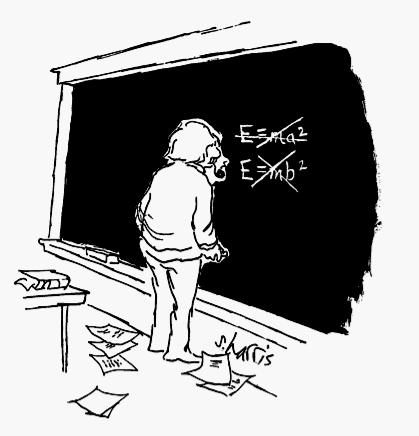

> Au fait, sur ton magnifique blog , tu ne pourrais pas nous pondre une explication claire des découvertes d'Einstein, comme si nous étions des enfants de 12 ans ? Pourquoi donc les vitesses ne s'additionnent-elles pas (celle du train et de la bille qui y roule par exemple) et qu'il faut y mettre cette constante c ?

Face à ce défi reçu de Franck par e-mail, j'ai commencé par me défiler en lui répondant que c'était assez difficile à expliquer avec des mots, qu'une petite vidéo avec des animations me semblait plus adaptée, et après une petite recherche je lui ai recommandé celle ci-dessous (pas la meilleure, mais en français)



Et puis je me suis rappelé cette citation attribuée à Albert :  "_Si vous ne pouvez expliquer un concept à un enfant de six ans, c'est que vous ne le comprenez pas complètement_", qui m'oblige à justifier ma dérobade. Outre le fait que cette phrase n'est [pas d'Einstein mais de Vonnegut](http://drgoulu.local/2008/11/26/ce-queinstein-na-jamais-dit/), je ne prétends d'une part pas comprendre complètement la relativité, mais surtout je ne suis pas sur qu'un enfant "normal" pourrait la comprendre même si les meilleurs vulgarisateurs du monde la lui expliquaient. Pas parce que le développement cognitif de l'enfant serait insuffisant pour comprendre, mais parce que:

1. La relativité ne fait pas partie des "expériences sensibles".
2. Les démonstrations non mathématiques de la relativité restreinte sont encore trop verbeuses.

Détaillons ceci dans deux paragraphes.

### 1\. Je peux toucher ?

Hubert Reeves disait à propos de la relativité [[1]](#ref-1):

> La réaction d'un esprit non préparé est normalement : "je ne comprends pas." En fait il n'y a rien à "comprendre": voilà un énoncé qui représente un fait vérifié par l'expérience. On part de là; on n'y arrive pas après raisonnement. On constate le fait, comme on constate l'existence du monde, comme on constate sa propre existence.



Malheureusement on ne constate pas la relativité comme un fait dans la vie quotidienne : il n'existe pas d'expérience permettant de visualiser un effet relativiste dans sa cuisine ou dans une classe primaire. Dans un coûteux labo de physique universitaire on peut commencer à "toucher" la relativité par l'expérience, mais dans une classe primaire on est paradoxalement forcé de travailler à un niveau d'abstraction supérieur, à partir de descriptions d'expériences réalisées par d'autres, et par raisonnement, Ce n'est pas facile, même au niveau de l'enseignement supérieur [[2]](#ref-2).

Ma suggestion à un enseignant qui voudrait s'attaquer à une introduction à la relativité serait de relever le défi à l'envers, en demandant aux élèves d'imaginer un monde dans lequel la lumière irait beaucoup plus lentement, par exemple à 10 m/s (36 km/h) seulement. Que verrait un coureur de 100m pendant les 10 secondes de sa course s'il regardait le chrono placé à l'arrivée ? Et à l'arrivée, qu'indiquerait le chrono placé au départ ? Que se passerait-il s'il essayait de brûler les fesses du concurrent devant lui avec un rayon laser ?

Ensuite, la classe pourrait jouer un peu avec "[a Slower Speed of Light](http://gamelab.mit.edu/games/a-slower-speed-of-light/)", un jeu video gratuit développé par le MIT dans lequel la lumière ralentit au fur et à mesure qu'on trouve des objets :



Puis tenter d'expliquer pourquoi les couleurs se modifient, faire le parallèle avec l'[effet Doppler](https://fr.wikipedia.org/wiki/Effet_Doppler) sonore bien perceptible au passage d'une ambulance pour introduire l'idée que la lumière est une onde. Commencer à se demander ce qui se passerait si le coureur de 100m pouvait dépasser la vitesse de la lumière. Que verraient les caméras ? Que verrait-il, lui ? Que pourrait-il faire une fois à l'arrivée alors que les rayons lumineux émis pendant sa course ne seraient pas encore arrivés ?

### 2\. Chérie, j'ai rétréci la formule

Le paragraphe suivant est tiré d'un ouvrage fondamental de la physique:

> Les changements qui arrivent dans le mouvement sont proportionnels à la force motrice, et le sont dans la ligne droite dans laquelle cette force a été imprimée. Si une force produit un mouvement quelconque, une force double de cette première produira un mouvement double, et une force triple un mouvement triple, soit qu'elle ait été imprimée en un seul coup, soit qu'elle l'ait été peu à peu et successivement, et que ce mouvement, étant toujours déterminé du même côté que la force génératrice, sera ajouté au mouvement que le corps est supposé avoir déjà, s'il conspire avec lui; ou en sera retranché s'il lui est contraire, ou bien sera retranché ou ajouté en partie, s'il lui est oblique; et de ces deux mouvements il s'en formera un seul, dont la détermination sera composée des deux premières.

Compris ? Pourtant c'est ainsi que Newton lui-même énonce sa [deuxième loi du mouvement](https://fr.wikipedia.org/wiki/Lois_du_mouvement_de_Newton#Deuxième_loi_de_Newton_ou_principe_fondamental_de_la_dynamique_de_translation) dans ses [Principia Mathematica](https://fr.wikipedia.org/wiki/Philosophiae_Naturalis_Principia_Mathematica) en 1687 (la traduction française date de 1756 [[3]](#ref-3) ). De nos jours, on résume ceci par F = m.a

Même le cancre interrogé sur "efégalema" ne parviendra pas à emberlificoter ses explications autant que le grand Newton, pour autant qu'elles soient justes. En 3 siècles, les 803 caractères de la formulation newtonienne destinée à l'élite intellectuelle de son temps ont été réduits à 5 symboles assénés à tous les ados du monde ou presque.

Et ce n'est pas un cas unique. Même E=m.c² est un raccourci de l'article d'Einstein [[4]](#ref-4) qui disait initialement

>  Si un corps perd une énergie L sous forme de rayonnement, sa masse diminue de L/c2

A mon humble avis, la relativité (qui ne se résume pas à  E=m.c²) est encore trop jeune pour avoir été formulée sous une forme assez claire, cohérente et compacte pour être transmise à - et comprise par - des enfants. Plusieurs générations de professeurs devront encore raffiner leur approche pédagogique de la relativité par des livres grand public [[5]](#ref-5), voire l'expérimentation animale [[6]](#ref-6) avant que la relativité ne soit enseignée au secondaire, puis peut-être au primaire dans les classes des [vaisseaux relativistes](http://drgoulu.local/2004/08/09/acceleration/)...

Et avec tout ça, j'ai encore éludé la question de Franck ... je suis tenté d'y répondre par "Tu comprendras quand tu seras plus grand" mais je préfère "Cherche et tu trouveras" ;-)

### Références:

1. Hubert Reeves "[La théorie de la relativité](http://id.erudit.org/iderudit/59825ac)", 1961, Liberté, 3(2), 490–492. \[[pdf](http://www.erudit.org/culture/liberte1026896/liberte1430666/59825ac.pdf)\]
2. Pierre MAGNIEN "La relativité restreinte dans le programme de TS : Cherchez l’erreur!" \[[pdf](http://acces.ens-lyon.fr/clea/lunap/Relativite/relativite-restreinte-principes-et-applications/RR_TS.pdf)\]
3. \[openbook booknumber="ISBN:2876470705" templatenumber="5"\] ([en ligne](http://www.scribd.com/doc/8538529/Newton-Principes-mathematiques-de-la-philosophie-naturelle))
4. Albert Einstein "[Does the Inertia of a Body Depend upon its Energy-Content?](http://www.fourmilab.ch/etexts/einstein/E_mc2/www/)" 1905
5. \[openbook booknumber="ISBN:9781613740286" templatenumber="5"\]
6. \[openbook booknumber="ISBN:0465023312" templatenumber="5"\]
