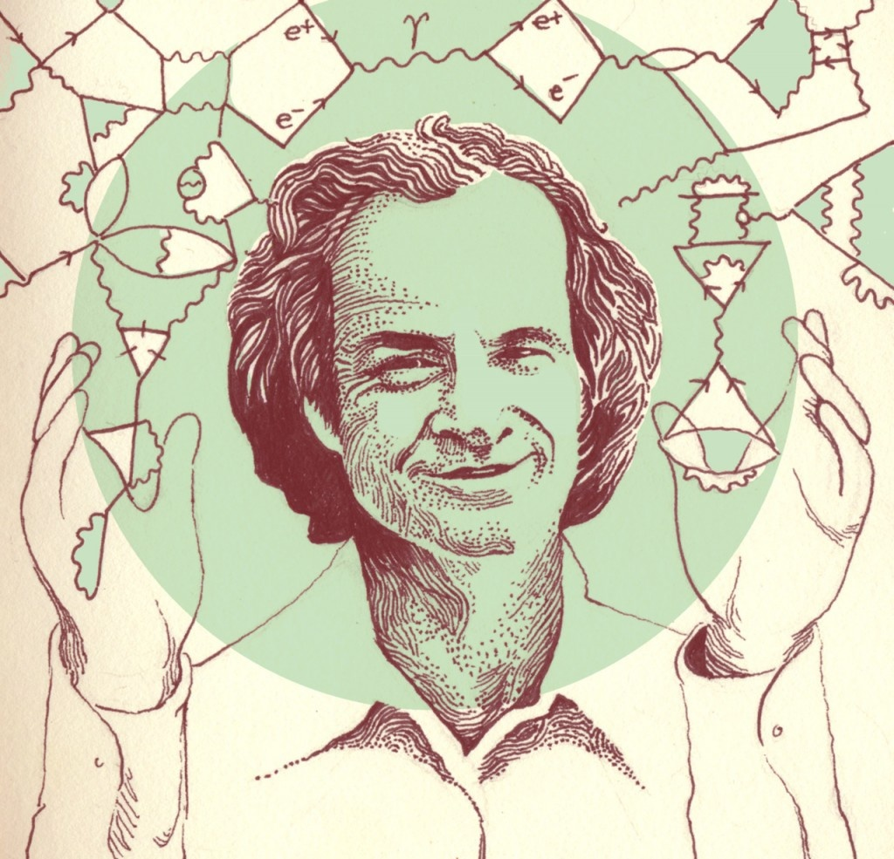

_Intrigué par la citation de [Feynman](w:Richard_Feynman) "Science is the belief in the ignorance of experts", j'ai découvert qu'il l'a prononcée en 1966 dans un discours intitulé "[What Is Science](http://www.fotuva.org/feynman/what_is_science.html)" au congrès de la [National Science Teachers Association](http://www.nsta.org/) \[1\], que je n'ai pas trouvé en français._

_Je vous offre donc ma traduction de ce texte comme Conte de Noël scientifique. A part le machisme courant à l'époque, il pourrait toujours susciter ou réveiller les vocations de profs de science. Mais surtout, il partage une vision de la science qui n'a pas pris une ride._  _Les titres de paragraphes sont de moi et les phrases en gras sont celles que j'ai particulièrement appréciées._

_Bonne lecture, Bonnes Fêtes à tous, et à l'année prochaine!_

## Introduction

Je remercie M. DeRose de m'avoir invité parmi vous, enseignants de sciences. Je suis aussi un enseignant de sciences. Je n'ai d'expérience que dans l'enseignement de la physique à l'université, et le résultat de cette expérience est que je sais que je ne sais pas enseigner.

Je suis sur que vous aussi - véritables enseignants travaillant au plus bas niveau de cette hiérarchie d'enseignants, formateurs d'enseignants, experts en programmes scolaires - vous aussi j'en suis sur ne savez pas comment faire, sinon vous ne vous fatigueriez pas à venir à ce congrès.

Je n'ai pas choisi le sujet "Qu'est-ce que la science". Le sujet est de M. DeRose. Mais je voudrais dire que je crois que "Qu'est-ce que la science" n'est pas du tout équivalent à "Comment enseigner la science", et j'attire votre attention là dessus pour deux raisons. La première est que la manière dont je me prépare à donner ce discours pourrait donner l'impression que j'essaie de vous dire comment enseigner la science. Ce n'est absolument pas le cas, parce que je ne sais rien à propos des jeunes enfants. J'en ai un, donc je sais que je ne sais pas. L'autre est que je crois que la plupart d'entre vous (parce qu'il y a tant de présentations, tant d'articles et tant d'experts du domaine) ont une sorte de sentiment de manque de confiance en soi. D'une certaine façon on vous donne toujours des cours sur pourquoi les choses ne vont pas bien et comment vous devriez apprendre à enseigner mieux. Je ne vais pas vous réprimander sur le mauvais travail que vous faites et vous indiquer comment vous pouvez vous améliorer. Ce n'est pas mon intention.

En fait, nous avons de très bons étudiants qui arrivent à Caltech, et nous trouvons qu'ils sont de mieux en mieux année après année. De quoi ça vient, je n'en sais rien. Je me demande si vous le savez. Je ne veux pas interférer avec ce système : il est très bon.

Il y a juste deux jours nous avions une conférence dans laquelle nous avons décidé que nous n'avions plus besoin de donner un cours de mécanique quantique élémentaire au niveau master ("graduate school"). Quand j'étais étudiant, il n'y avait pas de cours de mécanique quantique tout court à ce niveau, c'était un sujet considéré comme trop difficile. Quand j'ai commencé à donner un tel cours, nous en avons eu un. Maintenant nous l'enseignons au niveau bachelor ("undergraduate") Et nous découvrons actuellement que nous n'avons plus besoin de le donner aux gradués venant d'autres écoles. Pourquoi cette poussée vers le bas ? Parce que nous sommes capables de donner un meilleur enseignement à l'université, et parce que les étudiants qui y arrivent ont une meilleure formation .

## Science et Philosophie

Qu'est-ce que la science ? Bien sur vous le savez tous, puisque vous l'enseignez. C'est évident. Que puis-je dire de plus ? Et si vous ne savez pas, chaque édition pour enseignant de n'importe quel manuel de cours vous fournira une discussion complète du sujet. On y trouve des sortes de distillations distordues et édulcorées de mélanges de mots de [Francis Bacon](w:Francis_Bacon_(philosophe)) datant de quelques siècles, supposés être alors la profonde philosophie de la science. Mais [William Harvey](w:), l'un des plus grands scientifiques expérimentateurs de l'époque qui faisait vraiment quelque chose, a dit que ce que Bacon considérait comme la science était la science d'un [lord chancelier](w:). Il \[Bacon\] parlait de faire des observations, mais omettait le facteur vital du jugement sur ce qu'il faut observer et à quoi faire attention.

Et donc ce qu'est la science n'est pas ce qu'en ont dit les philosophes, et certainement pas ce que les manuels de cours en disent. Ce qu'elle est est un problème que je me suis assigné après avoir accepté de donner cette conférence.

Après quelques temps je me suis rappelé [ce petit poème](w:en:The_Centipede's_Dilemma):

> Un mille-pattes était heureux, Jusqu'à ce qu'un crapaud lui dit: "Dis, quel pas vient après l'autre?" Ce qui monta ses doutes jusqu'au point Qu'il tomba distrait dans le fossé Ne sachant plus comment marcher.

Toute ma vie j'ai fait de la science et su ce qu'elle était, mais maintenant que je suis venu vous dire quel pas vient après l'autre, j'en suis incapable. Plus grave encore, l'analogie avec le poème m'inquiète tant que lorsque je rentrerai chez moi, je ne serai plus capable de la moindre recherche.

De nombreux journalistes ont tenté d'obtenir un résumé de cette présentation, mais comme je ne l'ai préparée que récemment c'était impossible. Mais je peux maintenant en voir se précipiter à l'extérieur pour écrire de gros titres du genre "Le Professeur a qualifié le Président de la NSTA de crapaud."

Dans ces circonstances, vu la difficulté du sujet et mon aversion pour les exposés philosophiques, je vais présenter ceci d'une manière très inhabituelle. je vais juste vous dire comment j'ai appris ce qu'est la science.

## Comment j'ai appris ce qu'est la science

C'est un peu enfantin. Je l'ai appris quand j'étais un enfant. Je l'avais dans le sang depuis le début. Et je voudrais vous dire comment je l'ai attrapé. On dirait que j'essaie de vous dire comment enseigner la science, mais ce n'est pas mon intention. Je vais vous dire ce qu'est la science en vous disant comment j'ai appris ce qu'est la science.

Mon père me l'a dit. Quand ma mère me portait, à ce qu'on m'a dit car je ne me rappelle pas de la conversation, mon père a dit "si c'est un garçon, il sera un scientifique." Comment l'a-t-il fait ? Il ne m'a jamais dit que je devrais devenir un scientifique. Il n'était pas un scientifique, il était un businessman, responsable des ventes dans une compagnie d'uniformes, mais il lisait sur la science et aimait ça.

Quand j'étais très jeune, la première histoire dont je me souvienne, quand je mangeais encore dans un siège surélevé, mon père jouait avec moi après le dîner.

Il avait amené un tas de vieux carreaux de sol de salle de bains de je ne sais où à Long Island. On les disposait sur la tranche, l'un à côté de l'autre, et j'avais le droit de faire tomber celui à une extrémité et de regarder tous les dominos tomber. Jusqu'ici ça va.

Puis, le jeu s'est compliqué. Il y avait des carreaux de différentes couleurs. Je devais en mettre un blanc, deux bleus, un blanc, deux bleus, et encore un blanc et puis deux bleus, et si je voulais mettre encore un bleu, je devais en mettre quand même un blanc avant. Vous reconnaissez l'habituelle intelligence insidieuse : d'abord leur faire plaisir en jouant, et puis injecter lentement du matériel éducatif.

Alors ma mère, qui est une femme beaucoup plus sensible, commença à réaliser l'insidiosité de ses efforts et dit "Mel s'il te plaît, laisse ce pauvre enfant poser un carreau bleu s'il en a envie." Mon père dit "Non, je veux qu'il fasse attention aux motifs ("patterns"). C'est la seule chose que je peux faire en mathématiques à ce stade précoce." Si je donnais une conférence sur " Qu'est-ce que les mathématiques" je vous aurais déjà répondu : les mathématiques, c'est la recherche de motifs, de modèles.

## Les mathématiques

J'aimerais vous apporter une autre preuve que les mathématiques ne sont que des modèles. Quand j'étais à Cornell, j'étais absolument fasciné par le corps estudiantin qui, me semblait il, était une sorte de dilution de quelques personnes sensées dans une grande masse muette d'étudiants en [économie familiale](w:en:Home_economics) etc qui incluait beaucoup de filles. J'avais l'habitude de m’asseoir à la cafétéria avec ces étudiant(e)s et en mangeant, j'essayais d'intercepter leurs conversations pour voir si un mot intelligent en sortait. Vous pouvez  imaginer ma surprise lorsque je découvris cette chose qui me semble énorme.

J'écoutais une conversation entre deux filles, et l'une expliquait que si vous voulez faire une ligne droite, voyez-vous, vous vous déplacez d'un certain nombre de carreaux vers la droite pour chaque ligne de carreaux que vous traversez, ou autrement dit, si vous répétez le même déplacement vers la droite pour chaque ligne vers le haut, vous faites une ligne droite. Un grand principe de géométrie analytique ! J'était stupéfait. Je n'avais pas réalisé que l'esprit féminin était capable de comprendre la géométrie analytique.\*



Elle continua en disant "Suppose que tu as une autre ligne venant d'une autre direction et que tu cherches où elles vont se croiser. Suppose qu'une ligne va 2 à droite pour 1 en haut, et que l'autre va 3 à droite pour 1 en haut et qu'elles commencent à 20 lignes d'écart." etc. J'étais époustouflé. Elle arriva à dire où l'intersection se produisait. Et puis je compris qu'elle expliquait à l'autre comment tricoter des bas "[argyle](w:en:Argyle_(pattern))".

J'en ai tiré une leçon :  l'esprit féminin est capable de comprendre la géométrie analytique. Les gens qui ont insisté depuis des années, en dépit de toutes les preuves évidentes du contraire, que les hommes et les femmes sont également capables de pensée rationnelle on peut-être marqué un point. La difficulté est peut-être que nous n'avons jamais encore trouvé un moyen de communiquer avec l'esprit féminin. Mais si c'est fait correctement, on pourrait en tirer quelque chose...

Je vais maintenant continuer avec ma propre expérience comme débutant en mathématiques. Une autre chose que mon père m'a dit, et je ne peux que difficilement l'expliquer parce que c'était plus une émotion que des paroles, était que le rapport entre la circonférence et le diamètre de tous les cercles était toujours le même, quel que soit la taille. Ca ne me semblait pas trop étonnant, mais ce rapport aveit de merveilleuses propriétés. C'était un nombre merveilleux, un nombre profond : Pi. Il y avait un mystère que je ne comprenais pas totalement autour de ce nombre, mais c'était quelque chose de grand, et le résultat fut que j'ai cherché Pi partout.

Quad j'ai appris plus tard à l'école comment écrire une fraction sous forme décimale et que j'ai écrit 3 1/8 = 3.125, j'ai cru reconnaître un ami et écrivis que c'était égal P, le rapport entre la circonférence et le diamètre d'un cercle. L'instituteur le corrigea en 3.1416.

J'illustre ceci pour montrer une influence. L'idée qu'il y a un mystère, une merveille à propos de ce nombre était important pour moi, pas la valeur du nombre. Beaucoup plus tard,  alors que je faisais des expériences au laboratoire, je veux dire mon labo à la maison, bricolant un peu ... non excusez-moi : je ne faisait pas d'expériences, je n'en ai jamais fait, je n'ai fait que bricoler. Progressivement dans des livres et manuels j'ai commencé à découvrir qu'il existait des formules applicables à l'électricité pour relier la résistance au courant, etc. Un jour, en regardant les formules d'un bouquin quelconque, j'ai découvert la formule de la fréquence de résonance d'un [circuit](w:Circuit_LC) qui est $f=1/(2\pi.\sqrt{LC})$, où L est l'inductance et C la capacité ... du cercle ? Vous riez, mais j'étais très sérieux. Pi concernait les cercles, et voilà pi qui sort d'un circuit électrique. Où était le cercle ? Est-ce que vous qui avez ri savez d'où ça vient ?

Je dois aimer ça. Je dois le rechercher. Je dois y penser. Et puis j'ai réalisé que les bobines sont faites de cercles. Et quelques mois plus tard, j'ai trouvé un autre livre qui donnait l'induction de bobines carrées, et pi était dans ces formules. J'y ai réfléchi à nouveau et réalisé que le pi ne venait pas des bobines circulaires. je le comprends mieux aujourd'hui, mais **dans mon cœur je ne sais toujours pas où est le cercle, d'où vient ce pi**.

## Les choses et leur nom

Quant j'étais encore assez jeune, je ne sais plus exactement à quel âge, j'avais une balle dans un chariot et j'ai remarqué quelque chose. J'ai couru vers mon père en disant "Quand je tire le chariot, la balle roule vers l'arrière et quand je cours et que je m'arrête, la balle roule vers l'avant. Pourquoi ?"

Comment répondriez-vous ?

Il a dit "Ça, personne ne le sait." Il a dit "C'est pourtant très général, ça arrive tout le temps à n'importe quoi : tout ce qui bouge tend à continuer à bouger, et ce qui est immobile tend à le rester. Si tu regardes de près, tu verras que la balle ne roule pas vers l'arrière du wagon quand tu commences à le déplacer. Elle avance aussi un peu, mais pas aussi vite que le wagon. L'arrière du wagon rattrape la balle qui avait de la peine à commencer à bouger. Ca s'appelle [l'inertie](w:Inertie), ce principe." Je me suis évidemment dépêché de vérifier et c'était vrai : la balle ne reculait pas. Il avait mis une **différence très claire entre ce que nous savons et comment nous l'appelons**.

A propos de cette relation entre les choses et leur nom, je voudrais vous raconter une autre histoire. Nous avions l'habitude l'aller aux [montagnes Catskill](w:) pour les vacances. A New-York, on va aux montagnes Catskill pour les vacances. Les pauvres maris devaient travailler la semaine, mais ils se dépêchaient de revenir le weekend pour rester avec leurs familles. Ces weekends, mon père m’emmenait marcher dans les bois. On allait souvent marcher, et tout apprendre sur la nature en même temps. Mais d'autres enfants, des amis à moi voulaient aussi venir et demandaient à mon père de les emmener. Il ne voulait pas, disant que j'étais plus avancé. Je n'essaie pas de vous dire comment enseigner, parce que mon père le faisait avec une classe d'un seul élève; s'il en avait eu plus d'un, il en aurait été incapable.

Donc nous allions tout seuls dans les bois. Mais les mères étaient très puissantes à l'époque, comme aujourd'hui, et elles ont convaincu les autres pères d'emmener leurs propres fils marcher dans les bois. Alors tout les pères emmenèrent tous les garçons dans les bois un dimanche après-midi. Le jour suivant, lundi, nous jouions ensemble et un garçon m'a demandé " Tu vois l'oiseau sur le tronc là bas ? Quel est son nom?" J'ai dit : "J'en ai pas la moindre idée" Il a dit : "C'est une [grive à gorge rousse](w:). Ton père ne t'apprends pas grand chose en sciences."

J'ai souri intérieurement parce que mon père m'avait déjà enseigné que le nom ne dit rien de l'oiseau. Il m'avait dit "Tu as vu cet oiseau : en anglais on l'appelle [brown-throated thrush](w:en:Dark-throated_Thrush)\*\*, mais en allemand on l'appelle Halsenflügel, et les chinois l'appellent [赤颈鸫](w:zh), et **même si tu connais tous ces noms, tu ne connais toujours rien de l'oiseau**, tu ne sais que quelque chose sur les hommes, comment ils appellent l'oiseau. En fait cette grive chante, apprend à voler à ses jeunes, et pendant l'été elle vole si loin à travers tout le pays, et personne ne sait comment elle trouve son chemin" et ainsi de suite. Il y a une différence entre le nom d'une chose et ce qui se passe.

Le résultat de ceci est que je ne peux pas me rappeler le nom de quiconque, et quand des gens discutent de physique avec moi ils sont souvent exaspérés quand ils me parlent de "l'[effet Fitch-Cronin](w:Violation_de_la_symétrie_CP)" et que je demande "quel est cet effet?" parce que je ne peux pas me rappeler du nom.

Je voudrais dire un mot ou deux, si je peux interrompre ma petite histoire, sur les mots et définitions, parce qu'il est nécessaire d'apprendre les mots.

Ce n'est pas la science. Mais ça ne veut pas dire que, juste parce que ce n'est pas de la science, nous ne devons pas enseigner les mots. Nous ne parlons pas de ce que nous devons enseigner, nous parlons de ce qu'est la science. Ce n'est pas de la science de savoir comment convertir des degrés Centigrade en Fahrenheit. C'est nécessaire, mais ce n'est pas exactement de la science. Dans le même genre, si vous discutiez de ce qu'est l'art, vous ne diriez pas que l'art c'est de savoir qu'un crayon 3-B est plus doux qu'un crayon 2-H. Il y a une différence. Ça ne veut pas dire qu'un prof d'art ne doit pas l'enseigner, où qu'un artiste sera à l'aise s'il ne connaît pas ça. En fait vous pouvez découvrir ça en une minute en faisant des essais, mais c'est une approche scientifique que les profs d'art ne penseront peut-être pas à expliquer.

Afin de pouvoir nous parler, nous devons avoir des mots et c'est bien ainsi. C'est une bonne idée d'essayer de voir la différence, et **c'est une bonne idée de savoir quand nous enseignons des outils de la science comme des mots, et quand nous enseignons la science elle-même.**

## Qu'est-ce qui le fait bouger ?

Pour rendre ce point encore plus clair, je vais critiquer défavorablement certains livres de science, ce qui n'est pas très juste car avec un peu d'ingéniosité je peux aussi trouver des aspects défavorables aux autres. Il y a un manuel de science qui, à la première leçon du niveau primaire commence de manière malheureuse à enseigner la science parce qu'il part d'une fausse idée de ce qu'est la science.  On y trouve le dessin d'un chien, un chien jouet mécanique, et une main près du remontoir, puis le chien bouge. Sous le dernier dessin il est écrit "Qu'est-ce qui le fait bouger ?". Puis il y a l'image d'un vrai chien avec la légende "Qu'est-ce qui le fait bouger ?", puis l'image d'une moto avec la question "Qu'est-ce qui le fait bouger ?" et ainsi de suite.



Au début j'ai pensé qu'ils se préparaient à dire ce que concerne la science : la physique, la biologie, la chimie, mais ce n'était pas ça. La réponse était dans l'édition de l'enseignant et la réponse qu'il fallait apprendre était "L'énergie le fait bouger."

Seulement, l'énergie est un concept très subtil. Il est très très difficile de le comprendre correctement. Ce que je veux dire, c'est qu'il n'est pas facile de comprendre l'énergie assez bien pour l'utiliser correctement, de manière à pouvoir déduire quelque chose correctement en utilisant l'énergie. C'est après l'école primaire. Ca serait tout aussi bien de dire "Dieu l'a fait bouger" ou "l'esprit le fait bouger" ou "la déplaçabilité (movability) le fait bouger". En fait on peut tout aussi bien dire "L'énergie l'a arrêté".

Voyez ça ainsi : ce n'est que la définition de l'énergie, elle doit être inversée. On peut dire que quand quelque chose bouge il possède de l'énergie, mais pas que c'est l'énergie qui le fait bouger. Il y a une subtile différence. C'est la même qu'à propos de l'inertie.

Peut-être que je peux rendre cette différence plus claire ainsi : quand vous demandez à un enfant ce qui fait bouger le jouet, vous devriez penser à ce qu'un humain normal répondrait. La réponse est que vous avez remonté le ressort : il essaie de se dérouler en entraînant des engrenages.

Quelle bonne manière de commencer un cours de science. Démontez le jouet, voyez comment il fonctionne. Voyez la subtilité des engrenages, voyez les cliquets. Apprenez quelque chose du jouet, comment il est assemblé, l'ingéniosité des gens qui ont conçu les cliquets et les autres pièces. C'est bien. La question est bonne. La réponse est un peu maladroite parce que ce qu'ils essayaient de faire était d’enseigner une définition de l'énergie, mais au moins quelque chose est appris.

Supposez qu'un élève dise "Je ne pense pas que l'énergie le fasse bouger". Où va la discussion depuis là?

## Pédagogie

J'ai finalement découvert un test permettant de savoir si vous avez enseigné une idée ou juste enseigné une définition.

Le test fonctionne comme ça. Vous dites "Sans utiliser le mot que vous venez d'apprendre, essayer de reformuler ce que vous venez d'apprendre avec vos propres mots." Sans utiliser le mot "énergie", dites moi ce que vous savez du mouvement du chien. Si vous ne pouvez pas, vous n'avez rien appris sur la science. Ca peut être assez. Peut-être que vous ne voulez pas enseigner quelque chose sur la science tout de suite. Vous devez enseigner des définitions. Mais pour la toute première leçon, est-ce que ça ne pourrait pas être destructeur ?

Je trouve que pour la leçon numéro un, apprendre une formule mystique pour répondre aux questions est très mauvais. Le livre en a d'autres : "La gravité le fait tomber.", "Les semelles de vos chaussures s'usent à cause du frottement". Les chaussures s'usent parce les petites aspérités du trottoir se plantent dans les semelles et en arrachent de petits morceaux. De dire seulement que c'est à cause du frottement est regrettable, parce que ce n'est pas de la science.

Mon père ne s'est que peu occupé de l'énergie et n'a utilisé le terme qu'après que j'aie une petite idée là dessus. Je sais ce qu'il aurait dit, parce qu'il a fait essentiellement la même chose, quoique pas avec le même exemple du jouet. Il aurait dit "il bouge parce que le soleil brille" s'il avait voulu donner la même leçon.

J'aurais dit "Non. Qu'est-ce que ça à a voir avec le soleil qui brille ? Il bouge parce que j'ai remonté le ressort." - "Et mon ami, pourquoi est-tu capable de remonter le ressort ?" - "Je mange." - "Et que manges tu, mon ami ?" - "Je mange des plantes." - "Et comment poussent-elles ?" - "Elles poussent parce que le soleil brille."

Et c'est la même chose pour le vrai chien.

Et pour l'essence ? Energie du soleil accumulée, capturée par les plantes et préservée dans le sol. Les autres exemples finissent tous avec le soleil. Et ainsi, la même idée que celle que notre manuel voulait introduire est formulée d'une manière très intéressante.

Toutes les choses que nous voyons bouger bougent parce que le soleil brille. Ca explique la relation d'une source d'énergie à l'autre, et ça ne peut pas être nié par un enfant. S'il dit "je ne crois pas que ça peut être du au soleil qui brille", vous pouvez commencer une discussion. Donc il y a une différence.

C'est juste un exemple de la différence entre les définitions, qui sont nécessaires, et la science. Ma seule objection dans ce cas particulier est que c'était à la première leçon. Ca doit certainement venir plus tard, de dire ce qu'est l'énergie, mais pas après une question aussi simple que "qu'est-ce qui fait bouger le chien ?". Il faut donner une réponse d'enfant à un enfant : "ouvrons-le, et examinons ça."

## Éloge de l'observation

Pendant ces ballades dans les bois, j'ai appris plein de choses. Sur les oiseaux par exemple, j'ai déjà mentionné les migrations, mais je vais vous donner un autre exemple à propos des oiseaux de la forêt. Au lieu de les nommer, mon père m'a dit une fois "Regarde, tu vois comme cet oiseau picote dans ses plumes ? Il picote beaucoup ses plumes, Pourquoi penses-tu qu'il fait ça ?"

J'ai pensé que c'était parce que les plumes étaient froissées, et qu'il essayait de les lisser. Mon père "D'accord, quand, ou comment ses plumes se seraient froissées ?" "Quand il vole. Quand il marche c'est bon, mais quand il vole ça froisse ses plumes." Alors il me dit "Alors dans ce cas, il devrait picoter plus ses plumes juste après un atterrissage qu'après qu'il les ait lissées et marché au sol un moment. Ok, observons."

Alors on a regardé, observé, et il est apparu que l'oiseau picorait ses plumes tout autant et tout aussi souvent, indépendamment du temps passé au sol, et pas seulement juste après un vol.

Donc mon idée était fausse, et je n'arrivais pas à trouver la bonne raison. Mon père me l'a révélée. C'est que les oiseaux ont des poux. Les plumes produisent de petits flocons, dit mon père, et les poux les mangent. Et aux articulations des pattes de ces poux, il y a un peu de graisse qui est sécrétée, et il y a une larve d'acarien qui se nourrit de cette graisse. Mais cette graisse est si nutritive que la larve ne peut pas la digérer complètement, alors le liquide qu'elle rejette contient trop de sucre, et dans ce sucre peut vivre un microbe qui ... etc.

Les faits ne sont pas justes, mais l'idée est correcte. D'abord j'ai appris sur le parasitisme, une (bête) sur une autre, sur une autre, sur une autre. Et puis il continua en disant que partout dans le monde où il y a une source de quelque chose qui peut être mangé pour que la vie continue, des espèces vivantes trouvent une manière d'utiliser cette source, et que chaque petite goutte est mangée par quelque chose.

L'important dans ceci est que le résultat de l'observation, même si j'étais incapable d'arriver à la conclusion ultime, était une fantastique pièce d'or, avec de merveilleux résultats. C'était merveilleux.

Supposez qu'il m'ait dit d'observer, de faire une liste, de regarder et d'écrire, et quand j'aurais écrit la liste, de la ranger avec 130 autres listes dans un carnet de notes. J'aurais appris que l'observation est pénible, et qu'il n'en sort pas grand chose.

Je crois qu'il est très important, en tout cas ça l'a été pour moi, que si vous vous enseignez à faire des observations, vous devez montrer que quelque chose de merveilleux peut en résulter. J'ai appris à ce moment là ce qu'était la science : c'était de la patience. Si vous regardiez, observiez et faisiez attention, vous receviez une belle récompense, mais pas à tous les coups.  Quand je suis devenu plus adulte, la conséquence a été que j'ai travaillé sur des problèmes péniblement, heure après heure pendant des années, parfois moins longtemps, avec beaucoup d'échecs, beaucoup de choses jetées dans la corbeille, mais une fois de temps en temps il y avait l'or d'une nouvelle compréhension que j'ai appris à espérer alors que j'étais enfant, le résultat de l'observation. Parce que je n'avais pas appris que l'observation n'avait pas de valeur.

En passant, nous avons appris d'autres choses dans la forêt. Pendant nos excursions nous voyions les choses habituelles et discutions sur beaucoup de choses : sur le combat des arbres pour la lumière, comment ils poussent le plus haut possible, et comment ils résolvent le problème de faire monter l'eau à plus de 10 ou 12 mètres, sur les petites plantes plantes sur le sol qui capturent les petits rayons de lumière qui traversent toute la végétation, et ainsi de suite.

Un jour, après que nous ayons vu tout ceci, mon père m'emmena encore dans les bois et dit "pendant tout ce temps où nous avons observé la forêt, nous n'avons vu que la moitié de ce qui s'y passe, exactement la moitié." J'ai dit "Que veux-tu dire ?" Il a dit : "Nous avons regardé comment toutes ces choses poussent, croissent, mais pour chaque parcelle de croissance il doit y avoir la même quantité de décroissance, sinon les matières seraient consommées pour toujours : les arbres morts resteraient pour toujours au sol après avoir tout absorbé de l'air et du sol, et ça ne retournerait pas dans le sol ou l'air, donc rien d'autre ne pourrait pousser ici car il n'y aurait plus de matière disponible. Pour chaque parcelle de croissance, il doit y avoir exactement la même quantité de décroissance.

Alors suivirent beaucoup de ballades dans les bois au cours desquelles nous avons cassé de vieilles souches, vu pousser des mousses et des champignons. Il ne pouvait pas me montrer les bactéries, mais nous avons vu l'effet de la pourriture etc. J'ai vu la forêt comme un processus continu de transformation des matières.

Il y eut beaucoup de choses similaires, de descriptions faites d'étrange manières. Il commençait souvent à parler de certains sujets ainsi : "Suppose qu'un Martien atterrisse et regarde le monde". Par exemple, quand je jouais au train électrique, il me racontait qu'il y avait une grande roue mue par l'eau, branchée par des fils de cuivre qui partent dans toutes les directions, et puis qu'il y a de petites roues, et que toutes ces petites roues tournent quand la grande roue tourne. Le lien entre elles n'est que de cuivre et du fer, rien d'autre, aucune pièce mobile. Tu tournes la grande roue là, et toutes les petites roues tournent aussi, partout, et ton train est l'une d'elles. C'était un monde merveilleux que mon père me décrivait.

Vous pourriez vous demander ce qu'il en a tiré. Je suis allé au MIT. Je suis allé à Princeton. Je suis rentré à la maison et il m'a dit "Maintenant tu as une éducation scientifique. J'ai toujours voulu savoir quelque chose que je n'ai jamais compris et, mon fils, j'aimerais que tu me l'expliques." J'ai dit oui. Il a dit "Je sais qu'ils disent que la lumière est émise par un atome quand il passe d'un état à l'autre, d'un état excité à un état de plus basse énergie." J'ai dit "C'est juste." "Et la lumière est une sorte de particule, un [photon](w:) je crois." "Oui" "Donc si le photon sort d'un atome quand il passe de l'état excité à l'état plus bas, le photon doit avoir été dans l'atome excité." J'ai dit "En fait, non." Il a dit "Comment peux tu imaginer une particule, un photon sortant de l'atome sans avoir été dedans à l'état excité ?" J'y ai pensé quelques minutes et j'ai dit "Je suis désolé, je ne sais pas. Je ne peux pas te l'expliquer."

Il a été très déçu après toutes ces années à essayer de m'enseigner quelque chose, que ça ne donne que de si piètres résultats.

## Éloge du doute

Ce qu'est la science, je pense, pourrait être quelque comme  ça : il y a eu sur cette planète une évolution de la vie jusqu'à l'étape où existent des animaux évolués, intelligents. Je ne veux pas dire juste les êtres humains, mais les animaux qui jouent et apprennent de leurs expériences, comme les chats. Mais à cette étape, chaque animal n'apprendrait que de ses propres expériences. Ils se développement graduellement, jusqu'à ce que certains animaux puissent apprendre plus vite de l'expérience, et puissent même apprendre des expériences des autres en regardant, ou l'un peut montrer à un autre, ou l'un voit ce que l'autre a fait.Donc il est apparu la possibilité que tous puissent apprendre, mais la transmission était inefficace, et ils pouvaient mourir, et peut-être celui qui apprenait mourrait aussi avant qu'il puisse transmettre à d'autres.

La question est : est-il possible d'apprendre plus vite ce que quelqu'un a appris par accident que la vitesse à laquelle la chose est oubliée, soit à cause d'une mauvaise mémoire, soit en raison de la mort des élèves ou de l'inventeur ?

Alors est venu le temps, peut-être, où pour certaines espèces (humaines ?), la vitesse de l'apprentissage augmenta, atteignant une telle cadence que soudainement quelque chose de complètement nouveau arriva : les choses apprises par un unique animal passèrent à un autre, puis à un autre si vite que ce n'est pas oublié par l'espèce. Ainsi devint possible une accumulation de la connaissance de l'espèce.

Ceci a été appelé "[time-binding](w:Sémantique_générale#Historique)". Je ne sais pas qui l'a appelé comme ça en premier (_NdT : [Alfred Korzybski](w:Korzybski)_). En fin de compte, nous avons ici, dans cette salle, des représentants de ces animaux assis, essayant de relier leurs expériences, chacun essayant d'apprendre de l'autre.

Ce phénomène d'avoir une mémoire de l'espèce, d'avoir une accumulation de connaissances transmissible d'une génération à l'autre était nouvelle, mais elle incorporait une maladie : il était possible de transmettre des idées qui n'étaient pas profitables à l'espèce. L'espèce a des idées, mais elles ne sont pas nécessairement profitables.

Donc un temps est venu où les idées, bien qu'accumulées très lentement, n'étaient pas que des choses utiles, mais un tas de toutes sortes de préjugés, et de croyances étranges et bizarres.

Alors un moyen d'éviter la maladie a été découvert. C'était de douter que ce qui était transmis du passé était vrai, et d'essayer de redécouvrir [ab initio](w:) ce qu'il en est à partir de l'expérience plutôt que de faire confiance à l'expérience du passé sous la forme sous laquelle elle nous a été transmise. Et c'est **ce qu'est la science : le résultat de la découverte selon laquelle il vaut la peine de revérifier par de nouvelles expériences directes**, et ne pas nécessairement faire confiance à l'expérience de l'espèce humaine du passé. C'est ma meilleure définition.

Je voudrais vous rappeler toutes les choses que que vous savez très bien afin de vous donner un peu d'enthousiasme. En religion, les leçons de morale sont enseignées, mais elles ne sont pas juste enseignées une fois, vous êtes inspirés encore et encore, et je crois qu'il est nécessaire d'inspirer encore et encore, et de rappeler la valeur de la science aux enfants, aux ados et à tout le monde, de différentes manières, et pas seulement pour qu'ils deviennent de meilleurs citoyens, plus capables de contrôler la nature etc.

Il y a autre chose.

Il y a la valeur de la vision du monde créée par la science. Il y a la beauté et les merveilles du monde que nous découvrons à travers les résultats de ces nouvelles expériences. C'est-à-dire les résultats de ce que je vous ai juste rappelé, que les choses bougent parce que le soleil brille. (Cependant, pas tout ne bouge parce que le soleil brille. La Terre tourne indépendamment du fait que le soleil brille, et la réaction nucléaire produit de l'énergie sur Terre, une nouvelle source. Probablement que les volcans sont alimentés par une source différente que le rayonnement du soleil.)

Le monde a l'air si différent après avoir appris la science. Par exemple les arbres sont faits d'air, principalement. Quand ils brûlent ils retournent à l'air et dans leurs flammes, la chaleur libérée est celle que le soleil a fourni pour convertir l'air en arbre, et dans les cendres il y a les petits restes de ce qui n'est pas venu de l'air mais de la terre. Ce sont de magnifiques choses, et le contenu de la science en est merveilleusement plein. Elles sont très inspiratrices, et peuvent être utilisées pour inspirer d'autres.

## Science et experts

Une autre des qualités de la science est qu'elle enseigne la valeur de la pensée rationnelle ainsi que l'importance de la liberté de pensée, les résultats positifs qui viennent du doute que les leçons sont toutes justes. Vous devez distinguer ici, spécialement dans l'enseignement, la science des formes et procédures qui sont parfois utilisées pour développer la science. Il est facile de dire : "Nous écrivons, expérimentons et observons et faisons ceci ou cela." Vous pouvez recopier ce schéma exactement. Mais les grandes religions sont dissipées par les formes suivantes en oubliant le contenu exact de l'enseignement de leurs fondateurs. De la même manière, il est possible de suivre le schéma et de l'appeler "science", mais c'est de la pseudo-science. C'est ainsi que nous souffrons tous de cette sorte de tyrannie qui existe aujourd'hui dans beaucoup d'institutions qui sont passées sous l'influence de conseillers pseudo-scientifiques.

Il y a beaucoup d'études en pédagogie par exemple où des gens font des observations, des listes, des statistiques et ainsi de suit C'est tout au plus une sorte d'imitation de science analogue aux terrains d'aviation en bois faits par des indigènes des Mers du Sud, avec tours de contrôle et tout. Les indigènes espèrent qu'un grand avion viendra. Ils ont même construits des avions en bois ressemblant à ceux qu'ils voient sur les aéroports autour d'eux, mais étonnamment, leurs avions ne volent pas \*\*\*

Le résultat de cette imitation pseudo-scientifique est de produire des experts, tels que beaucoup d'entre vous. Mais vous les instituteurs, qui enseignez réellement aux enfants à la base, vous pouvez peut-être douter des experts. En fait, je peux aussi définir la science d'une autre manière :  **la science est la croyance en l'ignorance des experts**.

Quand quelqu'un dit : "La science nous enseigne ceci ou cela", il utilise le mot de manière incorrecte. **La science n'enseigne rien du tout, c'est l'expérience qui enseigne.** Si on vous dit "La science a montré ceci ou cela," vous pouvez demander "Comment la science montre ceci ? Comment les scientifiques l'ont-ils découvert ? Comment ? Quoi ? Où ?"

Ca ne doit pas être "la science a montré" mais "cette expérience, ou cet effet a montré." Et vous avez tout autant le droit que n'importe qui d'autre en entendant parler de ces expériences, mais soyez patient en écoutant toutes les informations, de juger si une conclusion sensée en a été tirée.

Dans un domaine tel que l'éducation, si compliqué que la vraie science n'a pas encore été capable d'aller nulle part, nous devons nous reposer sur une sorte de sagesse démodée, une sort d'évidence dirigée. Je suis en train d'inciter l'enseignant de base à avoir de l'espoir et de la confiance en l'intelligence naturelle et le sens commun. Les experts qui vous dirigent peuvent avoir tort.

J'ai probablement ruiné le système, et le étudiants qui viennent à Caltech ne seront plus assez bons. je crois que nous vivons une époque non scientifique dans laquelle tout le verbiage de la communication, de la télévision, les mots, les livres etc. sont non scientifiques. En conséquence, il y a une quantité considérable de tyrannie intellectuelle au nom de la science.

Finalement, à propos de ce "time-binding", un homme ne peut pas vivre après la tombe. Chaque génération qui découvre quelque chose par sa propre expérience doit la transmettre plus loin, mais doit la transmettre avec un délicat équilibre de respect et d'irrespect, de manière à ce que l'espèce humaine, maintenant qu'elle est consciente de la maladie qui l'atteint, n'inflige pas ses erreurs à sa jeunesse de manière trop rigide, mais passe la sagesse accumulée plus la sagesse qui n'est peut-être pas de la sagesse.

Il est nécessaire d'enseigner à la fois d'accepter et de rejeter le passé avec une sorte d'équilibre qui demande un talent considérable. La science, en plus de tous ses sujets, contient en elle-même une leçon sur le danger de croire à l'infaillibilité des plus grands maîtres de la génération précédente.

Alors continuez. Merci.

## Notes Dr.G.

\* : voilà pour mesurer le niveau de machisme ambiant dans les années 1940 ...

\*\* mais j'ai des doutes : selon la Wikipédia cet oiseau ne vit pas en Amérique du Nord, et je n'ai trouvé "Halsenflügel" nulle part... D'après les recherches d'une passionnée d'oiseaux (ma maman), ce serait plus probablement la [grive à ailes rousses](http://www.oiseaux.net/oiseaux/grive.a.ailes.rousses.html), Dusky Thrush en anglais, Rostflügeldrossel en anglais, 斑鸫 en chinois et Turdus eunomus en latin.

\*\*\* Feynman a prononcé en 1974 un discours à Caltech intitulé "Cargo cult science" utilisant [cette image](w:Culte_du_cargo), et il est déjà traduit ici : "[la science du culte du cargo](http://esgs.free.fr/fr/art/rf1.htm)"

## Référence:

1. Feynman, R. P. "What Is Science", 1969, The Physics Teacher, 7(6), 313. [doi:10.1119/1.2351388](http://scitation.aip.org/content/aapt/journal/tpt/7/6/10.1119/1.2351388)
