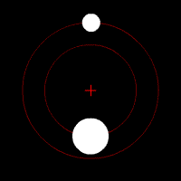

Si je lâche un caillou d'une hauteur h raisonnable, je suis absolument certain que cette hauteur va diminuer selon la loi x(t) = h-g.t²/2 et qu'il va heurter le sol après un temps $t = \sqrt{2.h/g}$ que je peux déterminer avec un bonne précision. Si j'ai mal mesuré h ou g et que j'en prends des valeurs faussées de 10%, le temps de chute ne sera faux que de 5% (à cause de la racine carrée), mais l'issue ne fait aucun doute : le caillou va tomber au sol.

#Astronomie)Si je calcule la trajectoire de deux (gros) cailloux lancés dans l'espace, je peux également déterminer de façon certaine leur trajectoire. Soit ils entreront rapidement en collision, soit ils s'éloigneront l'un de l'autre jusqu'à l'infini, soit ils se mettront à parcourir des ellipses autour de leur barycentre commun. Le "[problème à deux corps](w:)" est admet une solution analytique : on peut obtenir une formule  qui donnera l'orbite des deux cailloux avec une précision du même ordre que la précision avec laquelle on connait les masses, les positions et les vitesses initiales.



Avec trois cailloux, ça devient très nettement plus compliqué [[1]](#ref-1). Dans certains cas les orbites

, mais contrairement à ce qu'on lit parfois, il existe une solution analytique

> le Système solaire interne (Mercure, Venus, Terre et Mars), est chaotique, avec un temps de Lyapounov de 5 millions d'années. Une erreur de 15 mètres dans le position initiale de la Terre donne lieu a une erreur d'environ 150 mètres après 10 Ma, mais cette même erreur devient 150 millions de km apres 100 Ma. Il est donc possible de construire des éphémérides précises sur une période de quelques dizaines de Ma, mais il devient pratiquement impossible de prédire le mouvement des planètes au delà de 100 millions d'années. [[3]](#ref-3)
> 
>  

http://aeon.co/magazine/world-views/should-we-trust-scientific-models-to-tell-us-what-to-do/

### Références:

1. A. Chenciner, "[Three body problem](http://www.scholarpedia.org/article/Three_body_problem)", 2007, Scholarpedia, vol. 2, no. 10, p. 2111
2. [http://physics.aps.org/synopsis-for/10.1103/PhysRevLett.110.114301](http://physics.aps.org/synopsis-for/10.1103/PhysRevLett.110.114301)
3. [http://news.sciencemag.org/physics/2013/03/physicists-discover-whopping-13-new-solutions-three-body-problem](http://news.sciencemag.org/physics/2013/03/physicists-discover-whopping-13-new-solutions-three-body-problem)
4. [http://suki.ipb.ac.rs/3body/](http://suki.ipb.ac.rs/3body/)
5. "[Chic planètes : Billard cosmique](http://www.agoravox.fr/actualites/technologies/article/chic-planetes-billard-cosmique-76393)" sur Agoravox
6. [J. Laskar](w:Jacques_Laskar) "La stabilité du système solaire", in 
7. J. Laskar, "[Le Système solaire est-il stable ?](http://www.bourbaphy.fr/laskar.pdf)",2010, Séminaire Poincaré XIV, pp. 221–246.
8. [http://www.eci.ox.ac.uk/4degrees/ppt/poster-pietsch.pdf](http://www.eci.ox.ac.uk/4degrees/ppt/poster-pietsch.pdf)
9. [http://wulixb.iphy.ac.cn/EN/abstract/abstract54218.shtml](http://wulixb.iphy.ac.cn/EN/abstract/abstract54218.shtml)
10. [http://www.mucm.ac.uk/Pages/Downloads/Presentations/Workshop%20talk%20PC%2010072009.pdf](http://www.mucm.ac.uk/Pages/Downloads/Presentations/Workshop%20talk%20PC%2010072009.pdf)
11. [http://www.ecmwf.int/newsevents/training/rcourse\_notes/pdf\_files/Predicting\_uncertainty.pdf](http://www.ecmwf.int/newsevents/training/rcourse_notes/pdf_files/Predicting_uncertainty.pdf)
12. [http://www.meteo.unican.es/en/node/454](http://www.meteo.unican.es/en/node/454)
13. [http://arxiv.org/ftp/arxiv/papers/1310/1310.3956.pdf](http://arxiv.org/ftp/arxiv/papers/1310/1310.3956.pdf)
14. [http://physicsworld.com/cws/article/news/2013/nov/20/chaos-reigns-in-unexpected-places](http://physicsworld.com/cws/article/news/2013/nov/20/chaos-reigns-in-unexpected-places)
