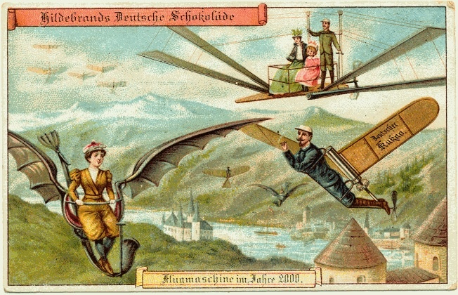

Le team [AeroVelo](http://www.aerovelo.com/) de l'université de Toronto vient de [remporter le prix AHS Sikorsky](https://web.archive.org/web/20130715085221/http://vtol.org/hph) de $250'000 lancé en 1980 pour récompenser le premier hélicoptère à propulsion humaine.

Le 13 juin 2013, leur engin a volé plus d'une minute, à atteint plus de 3m d'altitude et le pilote est resté au dessus d'un carré de 10m de côté.



Comme on le voit, les dimensions de l' [AeroVelo "Atlas"](w:en:AeroVelo_Atlas) sont impressionnantes : occupant un carré de 47m au sol, les 4 rotors font 20.2 m de diamètre chacun. L'ensemble ne pèse que 55 kg grâce à l'utilisation de poutres triangulées en carbone, de pales en carbone+kevlar+mylar et de "chaines de transmission" en vectran \[1\]. Aucun doute : la disponibilité et la maîtrise de tels matériaux sont essentielles dans une telle réalisation.

Accessoirement, il faut aussi un moteur humain exceptionnel. Le pilote Todd Reichert a fourni une puissance de 1.1 kW au début du vol et arrivait encore à fournir 600 watts à l' atterrissage, tout ça avec 72 kg de muscles, d'os et de cerveau.  Il devait aussi contrôler l'appareil en tirant sur les haubans en vectran afin de déformer la structure pour modifier très légèrement l'orientation des rotors.

Ce fantastique exploit comble un peu notre léger retard sur ce qui était prévu en 1900 pour l'an 2000 (mais [on a eu 140 caractères](http://www.foundersfund.com/the-future) à la place...)

### Référence:

1. Graham Warwick "[Human + Helo - How AeroVelo Won the Prize](https://web.archive.org/web/20140911231439/http://aviationweek.com/blog/human-helo-how-aerovelo-won-prize)",12 juillet 2013 sur Aviation Week
