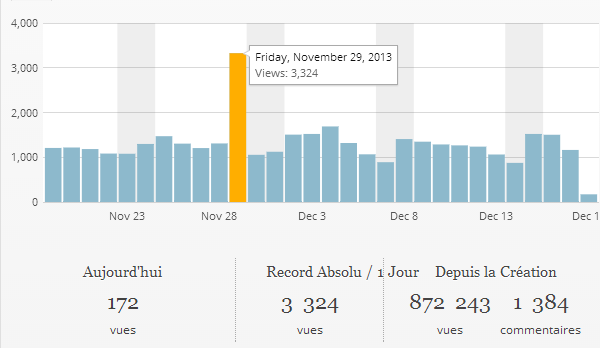

350'000 Mercis. Vous avez été juste un peu moins de 1000 à visiter quotidiennement ce blog en 2013. Ca me fait très plaisir et me motive pour une nouvelle année. Mais quelques statistiques me font aussi  réfléchir. Un peu comme l'[année passée](/2013/01/03/bilan-2012-et-vive-2013/), les articles les plus lus ne sont pas les plus récents mais:

1. [Dites NON au mouvement perpétuel](/2012/05/27/dites-non-au-mouvement-perpetuel/) (18500 visites) datant de 2012,
2. [Comment marche Shazam](/2009/07/11/comment-marche-shazam/) (14000) écrit en 2009,
3. [La véritable histoire de l’ampoule de Livermore](/2011/10/16/la-veritable-histoire-de-lampoule-de-livermore/) (11800) de 2011,
4. [Comment trouver des nombres premiers](/2012/04/15/comment-produire-des-nombres-premiers/) (8300) pondu en 2012
5. L'éternel [Comment faire 4 triangles équilatéraux avec 6 allumettes ?](/2007/01/26/comment-faire-4-triangles-equilateraux-avec-6-allumettes/) , antiquité de 2007 qui a amené 8200 visiteurs sur drgoulu.com



"[L’obsolescence est-elle programmée ?](/2013/05/01/lobsolescence-est-elle-programmee-2/)" écrit en mai 2013 arrive en 6ème place avec 7800 visiteurs. Visiblement, les articles qui analysent voire démystifient certains lieux communs sont appréciés.

Et je trouve ça bien : drgoulu.com n'est pas un blog scientifique destiné aux scientifiques. Certains articles attirent manifestement des visiteurs qui ne sont pas habitués à la démarche scientifique, voire s'en méfient comme de la peste, et ce sont ceux-là qu'il s'agit de tenter d'éclairer.

Les échanges de commentaires sont parfois virulents, mais je continue à considérer que l'ouverture et le dialogue sont les meilleurs moyen de désacraliser la science, d'expliquer que la connaissance est un bien commun de l'humanité qui ne demande qu'un peu d'efforts pour être partagée. Parfois ça prend du temps,

Un exemple intéressant s'est produit le 29 novembre 2013. Ce jour là l'audience de drgoulu.com a triplé d'un seul coup lorsque plus de 2000 visiteurs ont soudain visité mon article de 2005 sur l'[éviteur d'axe](/2005/12/29/eviteur-daxe/):



Étonnamment, les statistiques du blog ne m'ont pas permis de retrouver l'origine de ces visiteurs, j'ai du faire une petite enquête pour découvrir qu'une [page de "Hacker News"](https://news.ycombinator.com/item?id=6817451), discrète comme le nom peut le laisser supposer, pointait vers la mienne comme source d'info sur ce mécanisme étonnant. En plus de la satisfaction de voir 2000 anglophones s'intéresser à une page en français, j'ai eu celle de voir des passionnés réaliser ce mécanisme oublié depuis la seconde guerre mondiale grâce aux outils du 3ème millénaire que sont les imprimantes 3D. Superbe exemple d'une démarche motivée par la curiosité, voire un doute légitime, et qui s'achève par une réalisation expérimentale.

Le moteur de recherche de Microsoft n'a pas fait "Bing" en 2013 comme je l'avais annoncé. Je vais donc consacrer plusieurs articles en 2014 à expliquer pourquoi "la prévision est un art difficile, surtout lorsqu'elle concerne l'avenir" (Pierre Dac). Si tout se passe bien, deux ou trois articles préparatoires seront nécessaires avant que je dise enfin ce que le pense du livre "Les Limites à la Croissance" et de ses prévisions pour le siècle en cours.

Il y aura bien d'autres sujets traités sur ce blog pendant l'année, un peu au gré des actualités, de mes navigations erratiques sur le web et de vos questions ou suggestions que je reçois toujours avec plaisir. Donc "stay tuned", n'oubliez pas tous mes excellents confrères du [C@fé des Sciences](http://www.cafe-sciences.org/) et

# Excellente Année 2014 à vous tous !
