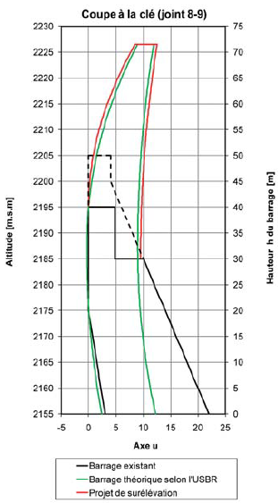

J'ai eu la chance de visiter récemment le chantier d'un très gros projet hydroélectrique, "[Nant de Drance](http://www.nant-de-drance.ch/)", en Suisse, tout près de la frontière française entre Martigny et Chamonix. Depuis 2009, des équipes de mineurs s'y relaient jour et nuit pour creuser la montagne sous deux barrages existants, [Emosson](http://fr.wikipedia.org/wiki/%C3%89mosson) et le Vieux Emosson. Ambiance :



D'abord, un [tunnelier](http://fr.wikipedia.org/wiki/Tunnelier) de Ø 9.47m a percé un tunnel de 5.6 km depuis la vallée, en montant selon une pente de 12% jusqu'à l'emplacement de la future centrale, 400m sous terre, ou plutôt sous roche, entre les deux barrages. Bientôt, une des plus grande cavernes artificielles du monde (190 x 40 x 54 m = 410'000 m³) accueillera 6 [turbines Francis](http://fr.wikipedia.org/wiki/Turbine_Francis) réversibles de 150 MW chacune pour faire du [pompage-turbinage](http://fr.wikipedia.org/wiki/Pompage-turbinage) en exploitant la différence d'altitude entre les deux lacs artificiels:



La caverne est pratiquement terminée. Elle a été creusée de haut en bas : d'abord la voûte a été entièrement creusée et bétonnée, puis le sol a été dynamité couche par couche. En fait on n'utilise plus les bons vieux bâtons de dynamite, mais une pâte presque liquide produite en mélangeant deux composants stockés séparément juste avant de les injecter dans les trous de mine avec un bête tuyau. Puis on recouvre la zone avec un tapis formé de déchets de pneus attachés les uns aux autres pour empêcher les projections de cailloux. Et on fait péter ça sans prévenir, en faisant littéralement léviter le groupe de visiteurs qui se trouve à l'autre bout de la caverne ! J'ai vécu quelques explosions mémorables, de ma période "chimie amusante" à celle dans l'artillerie helvétique, mais cette détonation dans cette caverne, c'est l'apothéose !

|    |  |
| --- | --- |

Deux autres réalisations extraordinaires sont les deux puits verticaux de Ø 8m et de 425m de haut qui conduiront les 2x150 m³ d'eau par seconde aux turbines. Ils sont réalisés par la méthode du "[raise boring](http://en.wikipedia.org/wiki/Raise_borer)" : on commence par forer un puits vertical de faible diamètre jusque dans la cavité inférieure, puis on fixe au tube de forage une sorte de fraise, et on tire le tout vers le haut en faisant tourner la fraise qui agrandit le diamètre à Ø2.44 m en faisant tomber la roche excavée au bas du puits d'où elle est évacuée par le tunnel d'accès.

|  |  |
| --- | --- |

Enfin, une plateforme du diamètre final est progressivement descendue. je n'ai pas très bien compris comment elle fragmente la roche sous elle, mais en tout cas elle fait également tomber le matériel dans le trou déjà existant, et les ouvriers travaillant sur la plate-forme peuvent bétonner les flancs du puits au cours de la descente. Et c'est là une autre de mes surprises : pas besoin de chemiser ces conduites d'acier, le béton suffit car la roche est très compacte, et une pression d'une quarantaine de bars n'est pas si énorme à l'intérieur d'une montagne.

D'autres exploits techniques ont été réalisés dans ce chantier, comme la dépose des prises d'eau au fond du lac d'Emosson \[4, 5\]. Une autre est la surélévation du barrage du Vieux Emosson de 20m pour augmenter le volume du lac, qui correspond à de l'[énergie stockée](/2012/10/06/comment-stocker-lenergie/), de 11.2 millions de m³ à 24.6 millions de m³. Ce qui est étonnant, c'est qu'on transforme un barrage "poids-voûte" de 1955 en barrage "voûte" de 2014, nettement plus élevé , sans avoir besoin de renforcer la base, comme on le voit sur la figure ci-contre \[6\]



Cette partie du chantier était stoppée pour l'hiver mais néanmoins spectaculaire, avec ses énormes blocs de béton (non armé, le fer ne sert à rien dans un barrage) et la grue, capable de soulever 11 tonnes au bout de sa flèche de 80 m.

Une fois tout ceci terminé, Nant de Drance pourra absorber 900 MW de [puissance produite au mauvais moment](/2011/01/15/qui-veut-de-lelectricite-a-prix-negatif/) par des centaines d'éoliennes et la restituer quand vous en aurez besoin. Quand vous allumez la lumière, ayez une petite pensée pour ces centaines de mineurs et ouvriers qui travaillent dans l'ombre, les gaz et la poussière pour que clic! ça marche ... Et si vous passez dans la région, venez admirer ces réalisations, la vue sur le Mont-Blanc et les [traces de dinosaures](http://fr.wikipedia.org/wiki/%C3%89mosson#Traces_de_dinosaures_d.27.C3.89mosson). Un tel triopack, c'est rare !

Merci à Philippe, Jacky et Kari d'avoir rendu cette visite possible et mémorable.

### Documents

1. [Brochure "Nant de Drance" (pdf)](http://www.nant-de-drance.ch/fileadmin/Documentation_Brochures/Broschuere-NdD-franzoesisch.PDF)
2. "[Suisse - Nant-de-Drance, turbinage-pompage](http://www.hydrelect.info/articles.php?lng=fr&pg=1397)" sur hydrelect.info
3. [Swiss setting for shaft drilling prototype](http://tunneltalk.com/Switzerland-03September2013-Herrenknecht-Shaft-Drilling-Jumbo-showcased-on-Nant-de-Drance-hydro-project.php), Tunnel Talk, Herrenknecht News, Sept 2013
4. Gérard Seingre, "[Centrale de pompage-turbinage Nant de Drance : les défis d’un grand projet](http://www.aftes.asso.fr/doc_gd_public/article_fichier/T220-306a320NantDeDrance.pdf) [hydroélectrique dans les Alpes valaisannes](http://www.aftes.asso.fr/doc_gd_public/article_fichier/T220-306a320NantDeDrance.pdf)", Tunnels et Espace Souterrain - n°220 - Juillet/Août 2010 (avec chiffres du projet initial)
5. Gérard Seingre, "[Aménagement de pompage-turbinage, Projet Nant de Drance](http://www.infra-schweiz.ch/fr/documents/journee/journee-2011/Journee-Infra-2011_Gerard-Seingre.pdf)", infra, 2011
6. Olivier Vallotton "[Surélévation du barrage de Vieux Emosson](http://www.stucky.ch/fr/contenu/pdf/WEL_3_2012_Surelevation_du_barrage_de_Vieux_Emosson.pdf)", Wasser Energie Luft No 104/3, 2011
7. "[Travailler dans la roche en toute sécurité](http://www.implenia.com/files/media/files/bbbbe03c7992581d9ca8c9411b91e934/Implenia-Nachhaltigkeitsbericht-2011-securite.pdf)", Brochure Implenia.
