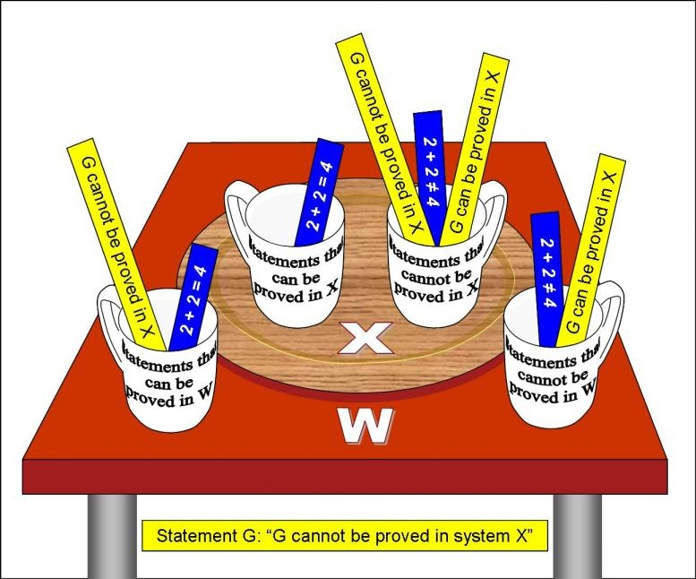

Au moins quatre commentateurs de mon [article sur le mouvement perpétuel](/2012/05/27/dites-non-au-mouvement-perpetuel/) m'ont sorti le même argument: des scientifiques célèbres ont dit au XIXème siècle qu’il était impossible aux avions de voler, donc les scientifiques n'ont pas le droit d'affirmer que quelque chose est impossible, en particulier violer le [premier principe de la thermodynamique](https://fr.wikipedia.org/wiki/premier_principe_de_la_thermodynamique). Donc le mouvement perpétuel est possible, CQFD.

Ca pose tout de même une question intéressante : qu'est-ce que la science considère comme réellement impossible ? Mais avant de tenter de répondre à cela, j'ai d'abord vérifié ...

### Qui est le c.. savant qui a dit "_Les machines volantes plus lourdes que l'air sont impossibles_"?



Selon les sites que l'on consulte, cette bêtise est parfois attribuée à [Simon Newcomb](https://fr.wikipedia.org/wiki/Simon_Newcomb)\*, parfois à [Lord Rayleigh](https://fr.wikipedia.org/wiki/Lord_Rayleigh) et très souvent à [Lord Kelvin](https://fr.wikipedia.org/wiki/Lord_Kelvin). Après pas mal de recherches, la plus ancienne trace écrite de cette "citation" que j'ai pu trouver figure dans un bouquin de 1981 \[2\], où elle est attribuée à Kelvin. De même, sur [cette page de citations sourcées de Kelvin](http://zapatopi.net/kelvin/quotes/), l'auteur indique qu'il n'a pas trouvé de source contemporaine de Kelvin. [La wikipédia](https://fr.wikipedia.org/wiki/Liste_de_pr%C3%A9dictions_erron%C3%A9es#Avant_1940) mentionne une variante fréquente "La réalisation d’une machine volante plus lourde que l’air est impossible", que Kelvin est censé avoir dit en 1895, sans source vérifiée non plus.

Il existe plusieurs autres citations authentifiées montrant que Kelvin ne croyait effectivement pas à l'aviation \*\*, notamment

> _Je n'ai pas la moindre molécule de la foi dans la navigation aérienne autre que l'aérostation_

gribouillé en 1896 dans sa [réponse à Baden-Powell](http://zapatopi.net/kelvin/papers/letters.html#baden-powell) (ci-contre) qui lui proposait de rejoindre l'Aeronautical Society. Notez la première personne et la référence à (l'absence de) foi : ce n'est clairement pas un énoncé scientifique, et il n'y utilise pas le mot "impossible".

Un [texte](http://escolapracachorro.net/Bus/819.html) reproduit et [traduit](http://www.dormirenfrance.fr/croire-experts-s182393.htm) à de multiples exemplaires sur le web attribue pourtant cette même citation à Lord Rayleigh, pour lequel je n'ai pas trouvé le moindre indice d'une citation "anti-vol". Quant à Simon Newcomb, il n'a [pas dit ça](https://en.wikipedia.org/wiki/Simon_Newcomb#On_the_impossibility_of_a_flying_machine) non plus. Au contraire, il écrit dans un article \[1\] en 1901:

> _Il est probable que le vingtième siècle est destiné à voir les forces naturelles qui nous permettront de voler de continent à continent avec une vitesse excédant largement celle des oiseaux_.

Il semblerait donc qu'aucun de ces célèbres scientifiques n'ait dit que les avions étaient impossibles pour des raisons physiques ou théorique. Ils voyaient des animaux voler, et ils sont tous plus lourds que l'air. Leurs enfants jouaient avec des avions en papier et des cerf-volants. Ils connaissaient les vols planés des précurseurs comme [Otto Lilienthal](https://fr.wikipedia.org/wiki/Otto_Lilienthal). Et comme ils savaient calculer, ils savaient aussi que voler avec les techniques de l'époque était extrêmement difficile, au point de dire peut-être "La réalisation ... est impossible", et de passer pour des idiots quelques années plus tard.

### L'échelle des impossibles

Mais il faut aussi être juste : Lord Kelvin a décrit correctement le [zéro absolu](https://fr.wikipedia.org/wiki/zéro_absolu) des températures, qui est une véritable limite physique absolue. Ce n’est pas une "loi de Kelvin" ou un [principe physique](https://fr.wikipedia.org/wiki/principe_physique), c'est juste la conséquence de la compréhension de ce qu'est la température : une mesure de l'[agitation thermique](https://fr.wikipedia.org/wiki/agitation_thermique) des molécules. Et quand elles ne bougent plus, cette agitation est nulle et la température ne peut pas être plus basse. La conséquence est qu'il est impossible que quelque chose soit plus froid que 0 [kelvin](https://fr.wikipedia.org/wiki/kelvin).

Cette impossibilité est une véritable impossibilité physique, alors que l'impossibilité (supposée) de construire des avions en 1895 était une impossibilité technique. Il faut bien distinguer les deux. Et à la réflexion, je vois plusieurs autres "niveaux d'impossibilité" entre le "c'est pas possible" du fonctionnaire derrière son guichet et démonstration d'énoncés [indécidable](https://fr.wikipedia.org/wiki/indécidable)s, comme l'[hypothèse du continu](https://fr.wikipedia.org/wiki/hypothèse_du_continu) dans la [théorie des ensembles de Zermelo-Fraenkel](https://fr.wikipedia.org/wiki/théorie_des_ensembles_de_Zermelo-Fraenkel). Je commence par ça :

### Les impossibilités mathématiques et logiques

Les théorèmes mathématiques prouvent l'impossibilité de toutes sortes de choses : il est [impossible](https://fr.wikipedia.org/wiki/Pi#Irrationalit.C3.A9) de trouver deux nombres entiers a et b tels que a/b = π, [impossible](https://fr.wikipedia.org/wiki/Dernier_th%C3%A9or%C3%A8me_de_Fermat) que [1782¹² + 1841¹² = 1922¹²](/2010/03/07/20-ans-de-science-simpson/) même si ça a l'air juste sur votre calculatrice, [impossible](https://fr.wikipedia.org/wiki/Th%C3%A9or%C3%A8me_de_Wantzel) de diviser un angle en trois angles égaux avec une règle et un compas \[4\] etc.

La solidité des [démonstration](https://fr.wikipedia.org/wiki/démonstration)s des théorèmes repose sur celle de deux éléments : les [axiomes](https://fr.wikipedia.org/wiki/axiomes) et la [logique](https://fr.wikipedia.org/wiki/logique). Ces deux piliers des mathématiques ont été complètement reconstruits lors de la révolution de la [logique mathématique](https://fr.wikipedia.org/wiki/logique_mathématique)  du début du XXème siècle, vulgarisée notamment dans la BD [Logicomix](/2011/01/06/logicomix/).

A cette époque, les logiciens ont formalisé mathématiquement leur propre langage. Grâce aux [calcul des prédicats](https://fr.wikipedia.org/wiki/calcul_des_prédicats), une démonstration peut s'écrire comme une grosse formule que l'on peut évaluer sans risque de commettre des erreurs liées au langage humain. Voici par exemple une partie de la démonstration formelle que 1 + 1 = 2, datant de 1910 \[3\] :

Aujourd'hui, une partie des théorèmes les plus importants des mathématiques ont été formalisés ainsi, et leurs démonstrations vérifiées, souvent à l'aide de logiciels "[assistant de preuve](https://fr.wikipedia.org/wiki/assistant_de_preuve)" \[5\].

Encore faut-il que les axiomes sur lesquels tout ceci est construit soient eux aussi solides.  Et là, les mathématiciens ont eu une énorme surprise en 1931 lorsque Kurt Gödel démontra que, quels que soient les axiomes choisis , il existe toujours des énoncés "[indécidable](https://fr.wikipedia.org/wiki/indécidable)s" qu'il est [impossible](https://fr.wikipedia.org/wiki/Théorèmes_d'incomplétude_de_Gödel) de démontrer. Le cas le plus typique est celui des propositions se référant aux 'axiomes eux-mêmes comme "cette proposition ne peut pas être démontrée avec les axiomes X".

Le théorème d'incomplétude de Gödel démontre que cette proposition ne peut être ni vérifiée, ni infirmée à partir des axiomes X. On peut alors éventuellement ajouter quelques axiomes pour former un système d'axiomes W dans lequel la proposition peut être prouvée, mais alors il existe d'autres énoncés indémontrables dans W ...

Par exemple, le [théorème de Goodstein](https://fr.wikipedia.org/wiki/théorème_de_Goodstein) n'est pas démontrable avec les [axiomes de Peano](https://fr.wikipedia.org/wiki/axiomes_de_Peano) datant de 1889, mais l'est avec ceux de la [théorie des ensembles de Zermelo-Fraenkel](https://fr.wikipedia.org/wiki/théorie_des_ensembles_de_Zermelo-Fraenkel) (ZF ou ZFC) utilisés actuellement comme axiomes des mathématiques. Cependant, il est [impossible](https://fr.wikipedia.org/wiki/Forcing) de démontrer l'[hypothèse du continu](https://fr.wikipedia.org/wiki/hypothèse_du_continu) dans ZF.

Pour en savoir plus sur le théorème de Gödel et ses extraordinaires implications, je vous conseille cet [excellent article de Science Etonnante](http://sciencetonnante.wordpress.com/2013/01/14/le-theoreme-de-godel/).

Et comme cet article est en train de me prendre un temps fou et qu'il est déjà assez long, je vous donne rendez-vous très bientôt pour une suite consacrée aux impossibilités physiques et techniques.

### Notes:

\* Newcomb est le vrai découvreur de la Loi de Benford

\*\* d'autres citations de Kelvin montrent qu'il admirait Tesla et croyait à l'ether.

Références

1. Simon Newcomb "[Is the airship coming ?](http://invention.psychology.msstate.edu/library/Magazines/Airship_Coming.html)" McClure's Magazine, 17, September 1901, pp. 432-435 [pdf](http://www.unz.org/Pub/McClures-1901sep-00432)
2. 
3.   _p. 379 \*54.43 : [1+1=2](http://quod.lib.umich.edu/cgi/t/text/pageviewer-idx?c=umhistmath&cc=umhistmath&idno=aat3201.0001.001&frm=frameset&view=image&seq=401)_
4. Ian Stewart, "[Les théorèmes de l’impossible](http://www.pourlascience.fr/ewb_pages/a/article-les-theoremes-de-l-impossible-27765.php)", 2000, Pour la Science, No 268, pp. 92–93
5. J.-P. Delahaye, "[Du rêve à la réalité des preuves](http://www.pourlascience.fr/ewb_pages/a/article-du-reve-a-la-realite-des-preuves-26716.php)", 2011, Pour La Science, No. 402, p. 90, 2011 [texte sur interstices](https://interstices.info/jcms/int_63417/du-reve-a-la-realite-des-preuves)
