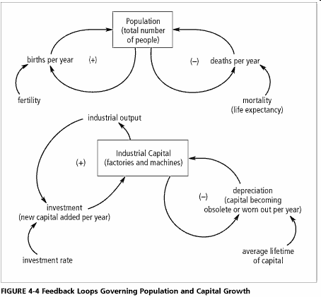



En 1972, le [Club de Rome](w:) fut un précurseur de l'[écologisme](w:Écologisme#.C3.89cologie_et_.C3.A9cologisme) introduisant des notions comme l'empreinte écologique ou le développement durable\*. Une équipe du MIT fut mandatée pour réaliser des prévisions basées sur des simulations de plusieurs scénarios, et les résultats de cette étude furent publiés dans "Halte à la croissance ? : Rapport sur les limites de la croissance" [[1]](#ref-1), ouvrage qui eut un retentissement planétaire : la croissance des [Trente Glorieuses](w:) ne serait pas éternelle. Ce premier "rapport Meadows" du nom du couple d'auteurs fut suivi en 1992 d'un second, présenté comme une mise à jour des scénarios et baptisé "au delà des limites" [[2]](#ref-2) car il affirmait que l'humanité avait déjà dépassé la [capacité de charge](w:Capacité_porteuse) de la planète. La "mise à jour des 30 ans" de 2004 vient d'être traduite en français [[3]](#ref-3), et j'ai eu envie de le lire d'une part car je n'ai pas lu les précédents et d'autre part car [Jean-Marc Jancovici](/2009/02/15/manicore/) l'a préfacé. Comme en plus [Hervé](http://www.hervekabla.com/wordpress/dennis-meadows-universite-des-experts/) m'en a très aimablement fait cadeau, je l'ai lu. C'est un excellent bouquin, résultat d'un remarquable travail scientifique de modélisation et de simulation de la dynamique de l'écosystème. Et même si les auteurs partagent le pessimisme ambiant sur la capacité des humains à maîtriser les problèmes qu'ils créent, 30 ans de recul les ont également rendus attentifs à la difficulté de l'exercice, que Pierre Dac avait si bien résumé

> La prévision est difficile surtout lorsqu'elle concerne l'avenir,

La préface de l'ouvrage comporte d'ailleurs cette petite précaution:

> On nous a souvent demandé si les prévisions que nous avions faites dans "The Limits to Growth" (de 1972) étaient correctes. Voilà bien le langage des médias, et pas le nôtre! Car nous continuons à considérer notre travail comme une démarche visant à identifier différents futurs possibles, et non comme une prévision de l'avenir.

Effectivement, le monde tel qu'il est aujourd'hui ne correspond pas à plusieurs des scénarios élaborés en 1972, notamment pas à celui de l'explosion démographique crainte alors, encore moins à celui de la "[croissance zéro](w:)"  qui y était suggéré. Mais la situation actuelle correspond assez bien au "scénario standard" de 1972, aussi nommé "business as usual" car il simulait l'évolution prévue en l'absence de changements technologiques ou politiques majeurs [[4]](#ref-4) :

La "mise à jour des 30 ans" propose 10 scénarios, dont le scénario 1 baptisé "point de référence" est une mise à jour du "scénario standard" de 1972. Il décrit comment une "crise des ressources non renouvelables" telles que le pétrole mais aussi les phosphates nécessaires aux engrais industriels pourrait causer une chute de la production industrielle entraînant celle de la production alimentaire, causant une forte baisse de la population mondiale tant quantitative que qualitative, aboutissant en 2100 à environ 3.5 milliards d'habitants (7 actuellement...) avec une espérance de vie de 33 ans et un niveau de vie comparable à celui de 1900 :

Le scenario 2 suppose qu'il reste encore 2x plus de ressources non renouvelables que ce que l'on imagine, et aboutit au même résultat : effondrement de la population, encore plus brutal du à une explosion de la pollution. Les autres scénarios aboutissent tous au même type de comportement de "dépassement et effondrement" à des degrés divers. Seul le scénario 9 impliquant des actions rapides et énergiques au niveau mondial pour réduire l'empreinte écologique des humains dès aujourd'hui permettrait éventuellement de stabiliser la population autour de 8 milliards sans baisse notable de la qualité ou de l'espérance de vie, et le scénario 10 montre qu'on aurait eu intérêt de commencer il y a 30 ans :



Plutôt que de débattre sans fin sur les actions à entreprendre pour éviter la catastrophe, "Les Limites à la Croissance" font le choix de rendre leurs scénarios fortement vraisemblables en décrivant en détail les mécanismes pris en compte dans leur [modèle World3](w:World3) de la dynamique du monde. En passant, World3 est disponible gratuitement pour PC sous forme d'exemple du programme [Vensim](http://vensim.com/) PLE, [téléchargeable ici](http://vensim.com/free-download/) pour ceux qui ont fait le tour d'[Hammurabi](http://www.atariarchives.org/basicgames/showpage.php?page=78) et de [Civilization](w:), le meilleur jeu du monde. Le chapitre 2 est consacré au "moteur" qu'est la croissance exponentielle. Que signifie-t'elle ? Qu'est-ce qui a tendance à croître de manière exponentielle ? Les auteurs font une distinction importante:

> La croissance exponentielle peut prendre deux aspects. Si une entité est auto-reproductible, sa croissance exponentielle est inhérente. Si, en revanche, elle est entraînée par une autre chose qui croît de façon exponentielle, sa croissance est dérivée. Tous les êtres vivants, des bactéries aux êtres humains, appartiennent à la première catégorie.

Pour eux, il n'y a que deux "entités auto-reproductibles" dont la croissance est modélisée comme exponentielle dans World3:

1. la démographie. Plus humains veulent faire plus d'enfants. Or même si la croissance démographique a ralenti, elle est toujours nettement positive.
2. le capital, plus précisément le capital industriel qui correspond aux machines et usines servant à la production de biens industriels

Le taux de croissance de ces croissances exponentielles est donné respectivement par la fertilité et le taux d'investissement, atténués voire inversés par les contre-réactions négatives que sont la mort et la dépréciation, comme illustré dans ce diagramme  Le chapitre 4 "World3 : La dynamique de la croissance dans un monde monde fini" détaille de nombreuses relations et boucles qui couplent les différentes grandeurs dans World 3. Voici par exemple comment l'agriculture et la pollution lient le capital industriel et la population:

Avant d'exposer les différents scénarios au chapitre 6 "La technologie, les marchés et le dépassement" Le premier paragraphe du chapitre 3 "Les limites: sources et exutoires" pose une hypothèse fondamentale sur le modèle de World 3. Il me semble tellement important que je me permets de le citer intégralement :

> Si un éventuel effondrement nous inquiète, ce n'est pas parce que estimons que l'humanité est sur le point d'épuiser les stockes d'énergie et de matières premières de la planète. Tous les scénarios produits par World3 indiquent en effet qu'en 2100, la planète disposera encore d'une part importante des ressource qu'elle avait en 1900. Lorsque nous analysons les projections de World3, **nous nous inquiétons davantage des coûts** croissants de l'exploitation des sources et exutoires de notre planète. Les données sur ces coûts ne sont pas toutes pertinentes et sucitent d'âpres débats, mais nous pouvons en conclure que l'exploitation croissante des ressources renouvelables, la disparition des matières non renouvelables et le remplissage des exutoires font ensemble augmenter, lentement mais surement, la somme d'énergie et de capitaux requise pour continuer à assurer la quantité et la qualité des flux de matière qu'exige notre économie. Ces coûts résultent d'une association de facteurs physiques, environnementaux et sociaux. A terme, ils seront trop élevés pour que l'industrie puisse continuer à se développer. Lorsque nous en serons là, la boucle de rétroaction positive qui a rendu possible l'expansion de l'économie matérielle va faire machine arrière et l'économie va se contracter. Nous ne sommes pas en mesure de prouver cette affirmation.

Ca, c'est la première phrase du paragraphe suivant [http://vensim.com/free-download/](http://vensim.com/free-download/) Merci à [http://rs6.risingnet.net/~ddcc/wbi/World3Again.html](http://rs6.risingnet.net/~ddcc/wbi/World3Again.html) [http://majorityrights.com/weblog/comments/forresters\_limits\_to\_growth\_model\_for\_your\_personal\_computer/](http://majorityrights.com/weblog/comments/forresters_limits_to_growth_model_for_your_personal_computer/) [http://enuncombatdouteux.blogspot.fr/2012/10/nous-navons-pas-mis-fin-la-croissance.html](http://enuncombatdouteux.blogspot.fr/2012/10/nous-navons-pas-mis-fin-la-croissance.html) [http://www.terraeco.net/Dennis-Meadows-Nous-n-avons-pas,44114.html](http://www.terraeco.net/Dennis-Meadows-Nous-n-avons-pas,44114.html) Critiques. L'ONU prévoit 9 milliards d'humains en 2050 et 11 milliards en 2100, soit une croissance de l'ordre de 80% pendant ce siècle. Pour ma part j'ai noté quelques affirmations discutables, comme "_les modes de croissance actuels perpétuent la pauvreté et accentuent le fossé entre les riches et les pauvres_" (p.82)  avec laquelle Rosling n'est clairement pas d'accord (voir la vidéo [ici](/2009/03/21/combien-dinegalite/))

### Notes:

\*  [[1]](#ref-1) parlait plutôt d' "équilibre"; selon le livre [[3]](#ref-3), la notion de développement durable a été introduite en 1989 dans le [rapport de la Commission Brundtland](w:Rapport_Brundtland),

### Références

1. 
2.  (non traduit en français à ma connaissance)
3.  [synopsis en anglais](http://www.sustainer.org/pubs/limitstogrowth.pdf)
4. Graham Turner "[A Comparison of the Limits to Growth with Thirty Years of Reality](http://www.csiro.au/files/files/plje.pdf)", 2008 ,CSIRO Working Paper
5. [http://www.slate.com/articles/business/project\_syndicate/2013/06/climate\_panic\_ecological\_collapse\_is\_not\_upon\_us\_and\_we\_haven\_t\_run\_out.html](http://www.slate.com/articles/business/project_syndicate/2013/06/climate_panic_ecological_collapse_is_not_upon_us_and_we_haven_t_run_out.html)
6. [http://nextbigfuture.com/2013/06/limits-to-growth-30-year-update-claimed.html](http://nextbigfuture.com/2013/06/limits-to-growth-30-year-update-claimed.html)
7. "[Le scénario de l’effondrement l’emporte - Interview de Dennis Meadows](http://www.liberation.fr/terre/2012/06/15/le-scenario-de-l-effondrement-l-emporte_826664)", Libération, 15 juin 2012
    
8. https://interstices.info/jcms/ni\_77270/les-limites-de-la-croissance-dans-un-monde-fini
