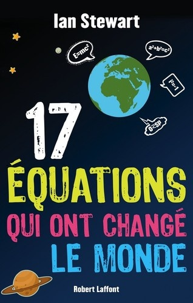
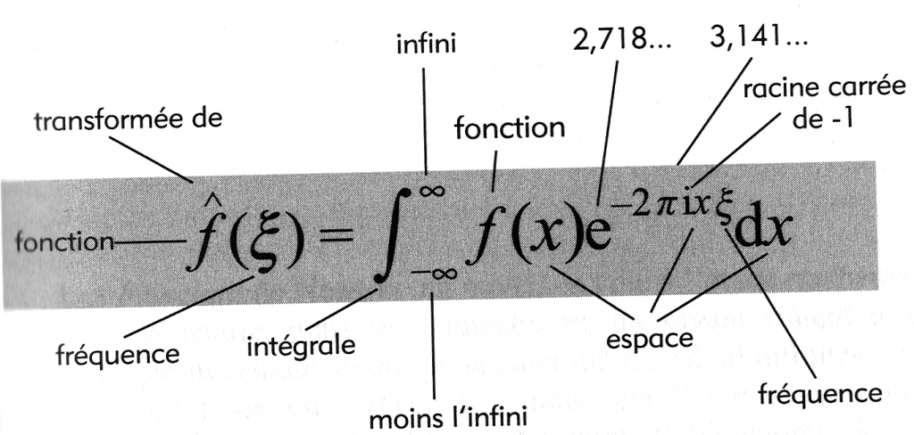

Ce livre [[1]](#ref-1) est l'une des raisons pour lesquelles je n'ai pas encore terminé la suite des "[impossibles](http://drgoulu.local/2014/02/02/les-impossibles-1/)". [Ian Stewart](https://fr.wikipedia.org/wiki/Ian_Stewart_(mathématicien)) attaque le sujet dès la première page:

> Il existe en mathématiques deux types d'équations, très semblables en apparence. Le premier représente des relations entre diverses quantités mathématiques; la tâche consiste dans ce cas à **démontrer** que l'équation est vraie. Le second fournit des informations sur une quantité inconnue, et la tâche du mathématicien consiste alors à **résoudre** l'équation, à rendre connu l'inconnu. (...)
> 
> En mathématiques pures, les équations sont généralement du premier type : elles révèlent des schémas et des régularités aussi belles que profondes, Elles tirent leur validité du fait que, considérant nos présupposés fondamentaux à propos de la structure logique des mathématiques, il ne peut en être autrement.
> 
> En mathématiques appliquées et en physique mathématique, on trouve habituellement des équations du second type. Elles codifient des informations à propos du monde réel; elles expriment des propriétés de l'univers qui en principe auraient pu être très différentes.

Les 17 équations retenues par Stewart sont autant de chapitres sur des ponts établis entre mathématiques et réalité au cours des siècles:

|  | titre du chapitre | [formule](http://www.vincentabry.com/wp-content/uploads/2014/03/equations.png) | auteur | date |
| --- | --- | --- | --- | --- |
| 1 | Le carré de l'hippopotame (le théorème de Pythagore) | $latex a^2+b^2=c^2$ | Pythagore | \-530 |
| 2 | Ecourter les procédures (les logarithmes) | $latex \\log xy=\\log x+\\log y$ | John Napier | 1610 |
| 3 | Fantômes de quantités disparues (le calcul infinitésimal) | $latex \\frac{df}{dt}=\\lim\\limits\_{h \\to 0}=\\frac{f(t+h)-f(t)}{h}$ | Newton | 1668 |
| 4 | Le système du monde (la loi de la gravitation de Newton) | $latex F=G\\frac{m\_1 m\_2}{d^2}$ | Newton | 1687 |
| 5 | Prodige du monde des idées (la racine carrée de -1) | $latex i^2=-1$ | Euler | 1750 |
| 6 | Beaucoup de bruit pour des noeuds (la formule d'Euler pour les polyèdres) | $latex V-E+F=2$ | Euler | 1751 |
| 7 | Les motifs du hasard (la distribution normale) | $latex \\Phi(x) = \\frac{1}{{\\sigma \\sqrt {2\\pi } }}e^\\frac {( x - \\mu)^2 } {2\\sigma ^2 }$ | C.F. Gauss | 1810 |
| 8 | Bonnes vibrations (l'équation d'onde) | $latex \\frac{\\partial ^2 u}{\\partial t^2}=c^2\\frac{\\partial ^2 u}{\\partial x^2}$ | J. d'Alembert | 1746 |
| 9 | Ondelettes et soubresauts (la transformée de Fourier) | $latex f(\\omega )=\\int\_{-\\infty }^{+\\infty }e^{-2\\pi ix\\omega }dx$ | J. Fourier | 1822 |
| 10 | L'ascension de l'humanité (l'équation de Navier-Stokes) | $latex \\rho \\left(\\frac{\\partial v}{\\partial t}+v.\\nabla v \\right) = -\\nabla p + \\nabla.T+f$ | C. Navier, G. Stoker | 1845 |
| 11 | Des vagues dans l'éther (les équations de Maxwell) | $latex \\nabla\\cdot E = \\rho / \\varepsilon\_0$ $latex \\nabla\\cdot B = 0$ \[latex\]\\nabla\\times E = - \\partial B/{\\partial t}\[/latex\] \[latex\]\\nabla\\times B = \\mu\_0 \\left( J + \\varepsilon\_0 \\partial E / {\\partial t}\\right) \[/latex\] | [James Clerk Maxwell](https://fr.wikipedia.org/wiki/James_Clerk_Maxwell) | 1865 |
| 12 | Loi et désordre (deuxième principe de la thermodynamique) | $latex dS\\geq 0$ | [Ludwig Boltzmann](https://fr.wikipedia.org/wiki/Ludwig_Boltzmann) | 1874 |
| 13 | Une chose est absolue (la relativité) | $latex E=mc^2$ | [Albert Einstein](https://fr.wikipedia.org/wiki/Albert_Einstein) | 1905 |
| 14 | Bizarrerie quantique (l'équation de Schrödinger) | $latex i\\hbar \\frac{\\partial }{\\partial t} \\psi=H\\psi$ | [Erwin Schrödinger](https://fr.wikipedia.org/wiki/Erwin_Schrödinger) | 1927 |
| 15 | Codes communication et ordinateurs (la théorie de l'information) | $latex H=-\\sum p(x)\\log p(x)$ | [Claude Shannon](https://fr.wikipedia.org/wiki/Claude_Shannon) | 1949 |
| 16 | Le déséquilibre de la nature (la théorie du chaos) | $latex x\_{t+1}=kx\_t(1-x\_t)$ | [Robert May](https://fr.wikipedia.org/wiki/Robert_May) | 1975 |
| 17 | La formule du roi Midas (l'équation Black-Scholes) | $latex \\frac{\\sigma ^2}{2}S^2\\frac{\\partial ^2V}{\\partial S^2}+rS\\frac{\\partial V}{\\partial S}+\\frac{\\partial V}{\\partial t}-rV$ | F. Black, M. Scholes | 1990 |

Chaque chapitre commence par une page de résumé présentant l'équation sous une forme que j'ai trouvé intéressante. Voici par exemple celle du chapitre 9 sur la transformée de Fourier (mais oui, vous savez, [le truc barbare](http://drgoulu.local/2010/03/06/succes-hollywoodiens-et-transformee-de-fourier/)...)

Ensuite trois paragraphes résument "Ce que cela nous dit", "Pourquoi c'est important" et "A quoi cela nous a conduits". On le voit, l'ambition est de rendre accessible à tous la signification et l'importance de formules qui en rebutent beaucoup.

Mais disons le tout net : si vous n'avez pas une formation de base en maths ou une réelle curiosité pour ce monde, il est probable que la lecture de chaque chapitre se résume à celle des premières pages dans lesquelles Stewart fait l'historique de la découverte de chaque équation. Ce sont des pages passionnantes, où l'on voit que les mathématiciens de génie sont souvent incompris, bien que fréquemment ils ne fassent que formuler clairement les idées absconses de leurs contemporains.

Ensuite, le niveau de chaque article monte selon des pentes parfois assez raides qui peuvent décourager certains lecteurs. Stewart évite au maximum d'infliger d'autres formules mathématiques que celle servant de titre mais ses explications couvrent souvent plusieurs pages de texte compact pas forcément plus digeste.

En fait, chaque chapitre de ce livre peut être lu indépendamment et constitue un petit cours sur le domaine concerné par l'équation. En établissant des liens entre l'histoire, les maths et les applications technologiques actuelles, les formules prennent un sens plus concret et les chapitres de ce livres aideront certainement les étudiants et passionnés à mieux comprendre la signification et l'importance de ces équations célèbres.

Pour ma part, le chapitre qui m'a le plus plu car j'y ai le plus appris est le quatrième, dévolu à la gravitation newtonienne. J'y ai appris l'existence du [réseau de transport interplanétaire](https://fr.wikipedia.org/wiki/réseau_de_transport_interplanétaire) utilisée par les sondes spatiales ainsi que par des [comètes périodiques](https://fr.wikipedia.org/wiki/comète_périodique) comme [Oterma](https://en.wikipedia.org/wiki/Oterma). L'idée est que les [points de Lagrange](https://fr.wikipedia.org/wiki/point_de_Lagrange) peuvent être utilisés comme des aiguillages permettant de passer d'une orbite stable à une autre, très différente, en ne nécessitant que très peu d'énergie (cf [mon article](http://drgoulu.local/2012/09/05/un-petit-pas-pour-lhomme/) sur les puits gravitationnels). Par exemple, entre 1910 et 1980, la comète Oterma a alterné deux fois des orbites situés à l'intérieur de celle de Jupiter avec des orbites extérieures [[2]](#ref-2)

Pourquoi 17 équations, et pas plus ou moins ? Après 410 pages on ne se pose plus trop la question : éventuellement moins, mais pas plus. Le chapitre 1 sur Pythagore est "trop facile" par rapport aux autres, peut-être pour appâter le chaland. Le 13 sur la relativité m'a fait un peu la même impression, mais bon, on ne peut nier que e=mc² ait changé le monde... Personnellement c'est le dernier chapitre sur [Black-Scholes](https://fr.wikipedia.org/wiki/Modèle_Black-Scholes) qui m'a laissé un peu froid. Ok, les maths actuelles s'intéressent beaucoup à l'économie, mais il me semble que là, Stewart s'éloigne un peu des "deux types d'équations" de son introduction.

Peut-être que Stewart aurait pu ajouter l'équation du Page Rank de Google ou celle du [filtre de Kalman](https://fr.wikipedia.org/wiki/filtre_de_Kalman) comme il le suggère dans un mail ([[3]](#ref-3), "bonus" en bas). Mais il les garde plus probablement pour un prochain livre sur les "17 équations qui changeront le monde", si celui-ci marche bien...

"17 équations" est un bon bouquin, mais ne soigne pas l'allergie aux maths. Si vous connaissez déjà certaines des équations, ça vous fera une bonne révision et vous en découvrirez probablement de nouvelles facettes, comme les [ondelettes](https://fr.wikipedia.org/wiki/ondelette) par exemple. Si vous êtes un passionné d'histoire des sciences vous y trouverez certainement votre bonheur également.

(merci à l'éditeur pour la "copie presse")

### Références:

1. \[openbook booknumber="ISBN:222113334X" templatenumber="5"\]
2. W. S. Koon, M. W. Lo, J. E. Marsden, S.D. Ross, “[Resonance and Capture of Jupiter Comets](http://www.cds.caltech.edu/~koon/papers/comet_paper.pdf)” 2001, in "Dynamics of Natural and Artificial Celestial Bodies", Springer DOI > [10.1023/a:1013398801813](http://dx.doi.org/10.1023/a:1013398801813)
3. Max Nisen, "[The 17 Equations That Changed The Course Of Humanity](http://www.businessinsider.com/17-equations-that-changed-the-world-2013-1?op=1)", 2013, Business Insider
