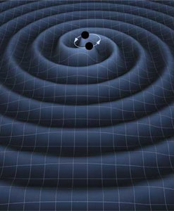

La grosse nouvelle scientifique de la semaine, du mois ou même de l'année a été annoncée par des titres comme "Big Bang : les ondes gravitationnelles d'Einstein enfin détectées" ou "Des physiciens découvrent des preuves du Big Bang". La découverte est fantastique, mais ces titres sont trompeurs:

- On avait déjà des preuves du Big Bang d'une part, et de l'existence des ondes gravitationnelles d'autre part.
- L'observatoire [BICEP2](w:) n'a pas détecté directement des ondes gravitationnelles, mais un de leurs effets
- Il manque un mot clé dans ces titres : "inflation". Ce que les récents résultats confirment semblent confirmer\*, c'est la théorie de l'[inflation cosmique](w:).

"Découverte des Premières Ondes Gravitationnelles de l'Univers et Confirmation de l'Inflation" est un bon titre, et c'est celui d'un [excellent article](http://drericsimon.blogspot.ch/2014/03/decouverte-des-premieres-ondes.html) [[1]](#ref-1) d'un autre c@fetier des sciences sur les résultats récents de l'expérience BICEP2 . Il y en a d'autres \[3,4,\*\]. Ici je vais juste essayer de faire le point sur les [ondes gravitationnelles](w:).

Avec la [relativité générale](w:) Albert Einstein explique la gravité par un [champ gravitationnel](w:) déformé par les masses. Lorsque des masses sont accélérées, les déformations du champ se propagent, en principe à la vitesse de la lumière, un peu comme l'accélération de charges électriques produit des ondes électromagnétiques. (_update du 15.02.2016 : cette [analogie n'est pas correcte](/2016/02/14/einstein-et-les-ondes-gravitationnelles/)_)

Comme la gravitation est l' [interaction élémentaire](w:) de très loin la plus faible, cent milliards de milliards de milliards de milliards de fois plus faible que l'électromagnétisme, il faut des masses énormes soumises à des accélérations fantastiques pour que les ondes gravitationnelles émises aient une puissance suffisante pour provoquer un effet mesurable, et des instruments de mesure incroyablement sensibles pour les détecter.

Les premières tentatives de détection directe datent de la fin des années 1960 avec la [barre de Weber](w:). L'idée est d'isoler une grosse barre de métal de toute vibration extérieure et de détecter une subite résonance de la barre au passage d'une onde gravitationnelle. L'amplitude des vibrations attendues étant d'environ 10\-16 m si une supernova avait la bonne idée d'exploser pas trop loin, aucune des expériences basées sur ce principe (ALLEGRO, AURIGA, miniGRAIL, ou encore EXPLORER [[2]](#ref-2)) n'a fourni de résultat concluant.

Pas mieux pour l'instant pour l'[interféromètre VIRGO](w:), [LIGO](w:), [GEO 600](w:) et les autres détecteurs géants basés sur l'interférométrie. L'idée est de comparer les distances parcourues par deux faisceaux lasers sur plusieurs kilomètres dans des directions distinctes. Quand une onde gravitationnelle passe par là, elle modifie la distance parcourue par l'un des lasers d'un pouillème de nanomètre par rapport à l'autre.



Ne reste plus alors qu'à isoler cette mesure des variations thermiques, des ondes sismiques, de celles produites par les collaborateurs et les scarabées du désert qui crapahutent à côté du détecteur... Comme on n'y est pas parvenu, l'idée est désormais de faire tout ça dans l'espace avec le  [projet NGO, anciennement LISA](w:New_Gravitational_wave_Observer). Lancement prévu en 2020.

Pourtant, bien qu'on n'en ait jamais détecté directement, on sait que les ondes gravitationnelles existent depuis 1974. Cette année là, les astronomes Hulse et Taylor découvrent [PSR B1913+16](w:), un "pulsar binaire". C'est encore un de ces objets astronomiques qui nous ramènent à notre juste dimension : pas grand chose. Il s'agit de deux étoiles à neutrons de 1.4 masses solaires environ chacune qui se tournent autour en à peu près 7h45, à une distance variant entre 1 et 5 fois le rayon du Soleil, donc astronomiquement très très très proches.

D'après Einstein, un tel système devrait émettre des ondes gravitationnelles très puissantes "en spirale" comme dans le dessin ci-contre. Si c'est bien le cas, le signal radio émis par le pulsar avec une régularité extrême doit arriver un peu décalé dans le temps suivant la configuration des ondes gravitationnelles. Hulse et Taylor vérifient : gagné ! En 1993, ils reçoivent le prix Nobel de physique pour la première détection d'ondes gravitationnelles.



De plus, selon Albert les ondes gravitationnelles emportent de l'énergie au loin, donc un astre en orbite perd peu à peu de l'énergie et "tombe" en orbitant plus vite, donc en émettant encore plus d'ondes gravitationnelles, ce qui le ralentit encore plus jusqu'à la catastrophe. Et c'est exactement ce que l'on mesure depuis 40 ans sur PSR B1913+16.

Le même phénomène a été mesuré sur [mon quasar préféré, OJ 287](/2008/04/18/ca-cest-du-trou-noir-du-vrai/) et d''autres objets astronomiques spectaculaires.

Les résultats récents de BICEP2 constituent également une détection indirecte des ondes gravitationnelles par une voie totalement différente des précédentes. Je n'ai absolument pas compris pourquoi, mais la théorie prédit que les ondes gravitationnelles produites lors de l'[inflation cosmique](w:) ont du causer une polarisation "[mode B](w:en:B-modes)" du [fond diffus cosmologique](w:), et c'est cette polarisation qui a été mise en évidence. Re-prix Nobel en perspective.

En attendant des mesures directes qui confirmeront que ces ondes se propagent à la vitesse de la lumière, voire de détecter enfin le [graviton](w:), ces détections indirectes montrent que les ondes gravitationnelles existent, et qu' Albert a toujours raison un siècle après s'être ennuyé au bureau des brevets de Berne.

Note \* et ajout du 24.3.2014 : Science étonnante vient de publier "[Ondes gravitationnelles ? Inflation ? Ou les deux ?](http://sciencetonnante.wordpress.com/2014/03/24/ondes-gravitationnelles-inflation/)", article remarquable (comme d'hab) qui détaille la récente découverte et relève quelques bémols. Le niveau est plus élevé que dans ma modeste synthèse, mais si vous vous intéressez à ce sujet, je vous encourage vivement à lire cet excellent article.

### Références:

1. [L'expérience EXPLORER](http://cds.cern.ch/record/43675?ln=fr), 2003, CERN-EX-0303017
2. Eric Simon "[Découverte des Premières Ondes Gravitationnelles de l'Univers et Confirmation de l'Inflation](http://drericsimon.blogspot.ch/2014/03/decouverte-des-premieres-ondes.html) !", 18 mars 2014, ça se passe là haut
3. Sébastien Bohler, "[Naissance de l’Univers: pourquoi la découverte des physiciens nous émerveille](http://www.scilogs.fr/l-actu-sur-le-divan/naissance-de-lunivers-pourquoi-la-decouverte-des-physiciens-nous-emerveille/)", 18 mars 2014, SciLogs
4. "[Six questions pour comprendre l’inflation (pas celle-là, l’autre)](http://www.sciencepresse.qc.ca/actualite/2014/03/17/six-questions-pour-comprendre-linflation-celle-lautre)",  17 mars 2014, Agence Science-Presse
