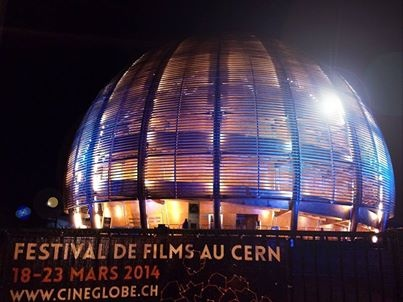

CineGlobe est un festival international du film "inspiré par la science" qui a lieu au Globe de la Science et de l’Innovation du CERN. La quatrième édition a eu lieu la semaine passée. Plus de 3000 spectateurs dont votre serviteur y ont découvert des courts métrages ainsi que des soirées spéciales dédiées au cinéma, à la danse ou à la technologie.

Les films suivants ont été primés cette année:

- Prix du Jury dans la catégorie documentaire : "Devil In The Room", [Carla MacKinnon](http://www.mackinnonworks.com/) – UK Il est disponible en ligne, et ci dessous. Assez spécial comme documentaire: https://vimeo.com/68638523
- Prix du Jury dans la catégorie fiction  : "SuperVenus", [Frederic Doazan](http://www.12fps.net/fr/home/index) – France [Visible ici](http://www.metaproject.net/fr/articles/author/189/12fps/view/3398/supervenus) . Vraiment excellent !
- Prix Storyville pour l'excellence narrative  : "Motorbike Midwife", [Masumi Higashi](http://www.masumihigashi.com/) - UK Le [trailer est sur YouTube](http://www.youtube.com/watch?v=dwNAi1DgUuQ)
- Prix spécial du Jury : "Why Do I Study Physics ?" de [Xiangjun Shi](http://www.xiangjunshi.com/) – USA 
- Prix du Public dans la catégorie documentaire: "The 1 Up Fever", Silvia Dal Dosso – Germany [Visible ici](https://vimeo.com/71559751). Ensuite lisez [l'article de Korben](http://korben.info/la-fievre-du-1up.html) ...
- Prix du Public dans la catégorie fiction: "Diagnostic", [Fabrice Bracq](http://www.fabricebracq.com/) – France [Extrait ici](http://www.dailymotion.com/video/x169r07_extrait-diagnostic_tv)

Le festival a également [organisé](http://cineglobe.ch/hackathon/?lang=fr) un [hackathon](https://fr.wikipedia.org/wiki/hackathon) sur le thème "Story Matter" en collaboration avec le [Tribeca Film Institute](https://tribecafilminstitute.org/). En 5 jours seulement, des équipes combinant scientifiques, artistes et techniciens ont créé des applications multimédia assez spectaculaires:

- Teamosaurus Rex a créé "[\[anti\]matter](<http://antimatter.meteor.com/whatismatter >)", un site sur la dualité matiére/antimatière avec une interface utilisateur assez surprenante (j'ai déjà vu ça, mais où ...)
- Team Swarm a réalisé "[The Naughty Gene](http://smelendez.github.io/naughtygene/)", un site destiné à faire connaitre la [maladie de Batten](https://fr.wikipedia.org/wiki/maladie_de_Batten), une de ces saletés rarissimes et par conséquent ignorées...
- Team Entropy Bleu a présenté "[Climate Anxiety](http://www.strikingly.com/climate-anxiety)", une boite dans laquelle le sujet visionne une histoire composée en fonction de son état émotionnel mesuré par différents capteurs. Je n'ai juste pas compris pourquoi l'expérience ne s'adresse qu'à une seule personne à la fois... https://vimeo.com/89733904
- Team 6 a réalisé "[Peter’s Bubble](http://petersbubble.com/)", un site sur le thème de l'[enfant bulle](https://fr.wikipedia.org/wiki/enfant_bulle). L'idée était de permettre aux internautes d'uploader des vidéos incitant Peter à sortir de sa bulle pour découvrir le monde au péril de sa vie, ou au contraire d'y rester par sécurité.
- Team3 a présenté "A°", un film sur l'antimatière avec des effets vidéo aussi "space" que le look de la designer du team. Je ne le trouve pas sur le web, dommage ...
- L'idée que j'ai trouvé la meilleure est celle du Team vHackSin. "[Vector](http://vector.upian3.typhon.net/)" pourrait devenir, si quelqu'un le finit, un "serious game" pour smartphones sur la vaccination. L'idée est que l'application de chaque joueur transporte des "virus" qui infectent les applications des joueurs passant à proximité, à moins d'être vacciné: https://vimeo.com/89494137

Festival fort intéressant et créatif donc, à ne pas manquer l'année prochaine. D'ici là, à l'occasion du 60ème anniversaire du CERN en septembre, CineGlobe organise un [concours de court métrages](http://cineglobe.ch/60ans/?lang=fr) sur le thème "inspiré par le CERN". Vidéastes et créateurs inspirés, vous avez jusqu'au 31 juillet 2014 pour envoyer vos oeuvres, donc à vos caméras ! (HD)
