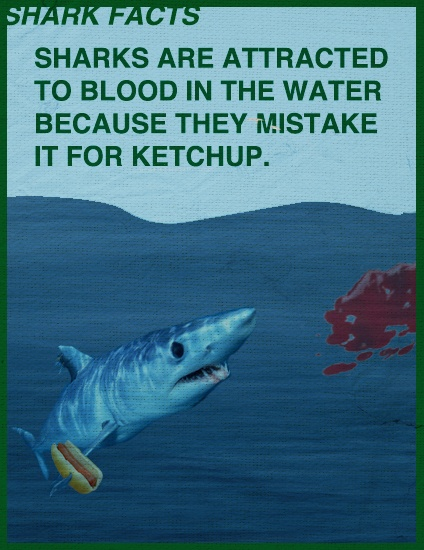

Dans le [quiz sur les poissons](/2014/03/31/poisson-davril-ou-pas/) (d'avril ou pas), une majorité des participants a répondu "vrai" à la question 6: "Les requins sont attirés par une goutte de sang humain à des kilomètres". Or la réponse, ou plutôt ma réponse puisque c'est moi qui ai proposé cette question, était "Poisson d’Avril : les requins détectent bien le sang de poisson, mais très mal le sang humain. Voici [une video](http://www.youtube.com/watch?v=gU9CQT-snIo) extraite de l’émission des [MythBusters](https://fr.wikipedia.org/wiki/MythBusters) qui le prouve."



Certains ne sont pas satisfaits par cette réponse, et trouvent à raison que la démonstration des MythBusters n'est pas suffisamment scientifique. Alors j'ai un peu approfondi les références plus scientifiques que j'avais trouvé pour étayer la réponse, et voici l'état des connaissances sur ce sujet.

Selon certaines études, le sens de l'odorat des requins semble effectivement très développé [[1]](#ref-1) :

> La sensibilité olfactive des requins en général est presque légendaire, favorisé par d'innombrables histoires stupéfiantes de ces prédateurs suivant une traînée de sang de 400 mètres ou plus à sa source. Les tests en laboratoire de l'acuité olfactive des requins ont révélé que ces anecdotes font pâle figure en comparaison de la réalité soigneusement mesurée. Des expériences sur des lamelles olfactives isolées de certaines raies ( famille Rajidae) ont montré des seuils de réaction étonnamment faibles à des stimuli chimiques: elles répondent à des concentrations aussi faibles que 10\-14 moles par litre d'eau pour des acides aminés comme la [sérine](https://fr.wikipedia.org/wiki/sérine), soit environ 1 molécule de sérine pour 1015 molécules d'eau. En termes de volume relatif, c'est comparable à la détection d'une balle de golf dans le Loch Ness .

Ceci correspond approximativement à l'histoire populaire de la goutte de sang dans une piscine olympique, qui date probablement des premières études anatomiques sur les "nares" des requins dans les années 1910 [[2]](#ref-2), époque où on bouchait les nares des requins pour mesurer leur capacité à retrouver une proie [[3]](#ref-3).

Des mesures effectuées récemment par electro-olfactogramme sur des animaux vivants [[4]](#ref-4) ont montré que les requins ne réagissent en réalité qu'à des concentrations beaucoup plus élevées d'acides aminés, de l'ordre de 10\-9 à 10\-7 moles par litre, ce qui correspond environ à leur présence normale dans l'eau de mer.  Les mêmes chercheurs ont montré que d'autres poissons comme les thons ont une sensibilité de l'odorat tout aussi élevée [[4]](#ref-4).  Ils relèvent en outre que l'odorat ne sert pas uniquement à détecter des proies, mais aussi pour trouver des partenaires sexuels et aide probablement à se localiser dans l'océan grâce aux odeurs transportées par les courants.

On en arrive à un point important : les odeurs sont principalement transportées par les courants. La [diffusion](https://fr.wikipedia.org/wiki/Diffusion_de_la_matière) dans l'eau est trop lente et il faudrait des quantités de sang trop importantes pour créer un gradient de concentration suffisant sur des centaines de mètres pour qu'un requin puisse remonter à la source. Il faut qu'un courant transporte le sang de la source aux "nares" du requin assez vite pour que le sang ne se dilue pas trop. Au pif, je dirais que si vous saignez assez dans un courant de 4 km/h pour qu'un requin vous sente à 1km (donc 15 minutes plus tard), vous allez probablement mourir d'hémorragie avant d'être croqué...

Jusqu'ici aucune expérience scientifique n'a vérifié ceci en pleine mer, mais j'ai trouvé un témoignage plein de bon sens sur le blog d'une entreprise sud-africaine qui propose de voir des [grands requins blancs](https://fr.wikipedia.org/wiki/grand_requin_blanc) de près [[5]](#ref-5):

> Est il vrai que les Grands Blancs peuvent sentir une goutte de sang humain à 100 km? En tant qu'opérateurs de plongées en cages, nous aimerions que ce soit vrai! Si c'était le cas nous pourrions économiser beaucoup d'argent en n'achetant plus d'appâts ("chum"?) mais ce n'est simplement pas vrai. Nous appâtons les requins blancs avec de l'huile de poisson très concentrée. Même avec cette puissante mixture, si la tache d'huile ne va pas dans la bonne direction, celle où les requins se regroupent, vous ne verrez aucun requin.
> 
> L'équipe de la [Réserve de Dyer Island](http://www.dict.org.za/) a suivi des requins blancs dans ces zones et a découvert que si les requins ne sont pas proches de la tache d'huile, ils n'approchent pas du bateau. Ils ont aussi trouvé des requins qui n'ont pas réagi du tout en traversant la tache d'huile. Donc même dans une baie pleine de requins, si le courant ne va pas dans la bonne direction, vous attendrez longtemps avant d'en voir un!

A ce propos je me rappelle avoir vu un reportage expliquant que la [frénésie alimentaire](https://fr.wikipedia.org/wiki/Attaque_de_requin#La_frénésie_alimentaire) que l'on constate parfois lors de plongées organisées ne correspond pas à un comportement naturel. En conditions normales, il n'y a jamais de poisson haché menu et saignant abondamment, ou alors il est déjà à moitié dans la gueule d'un prédateur. En inondant l'eau d'appâts dégoulinants de jus, les requins ont probablement l'odorat complètement saturé et se sentent aussi à l'aise que vous dans une manif gazée aux lacrymogènes...

Donc je maintiens : la réponse à "Les requins sont attirés par une goutte de sang humain à des kilomètres" est "poisson d'avril", ou plutôt "mythe hollywoodien à oublier" [[6]](#ref-6).

### Références

1. "[Biology of Sharks and Rays - Smell & Taste](http://elasmo-research.org/education/white_shark/smell.htm)" sur ReefQuest Centre for Shark Research
2. Sheldon, R. E. , "The reactions of the dogfish to chemical stimuli", 1909 J. Comp. Neurol. Psychol. 19, 273-311
3. Parker, G. H. "The directive influence of the sense of smell in the dogfish", 1913, In Bulletin of the United States Bureau of Fisheries, Vol. 33 (ed.Smith, H. M., Commissioner), pp. 63-68.  \[[pdf](http://fishbull.noaa.gov/33-1/parker.pdf)\]
4.  [Tricia L. Meredith](http://scholar.google.com/citations?user=Bh1X1kkAAAAJ) and S. M. Kajiura, "Olfactory morphology and physiology of elasmobranchs" J. Exp. Biol., vol. 213, no. Pt 20, pp. 3449–56, Oct. 2010. [doi: 10.1242/jeb.045849](http://doi.org/10.1242/jeb.045849) \[[pdf](http://www.science.fau.edu/sharklab/pdfs/mk10b.pdf)\]
5. "[Can white sharks smell a drop of blood?](http://www.sharkwatchsa.com/en/blog/category/482/post/1084/shark-fact-18-04-2012/)", 2012, SharkWatch SA Blog
6. Devin Powell, "[Shark Smell Myth Found Fishy](http://www.insidescience.org/content/shark-smell-myth-found-fishy/1151)", 2010 sur Inside Science
