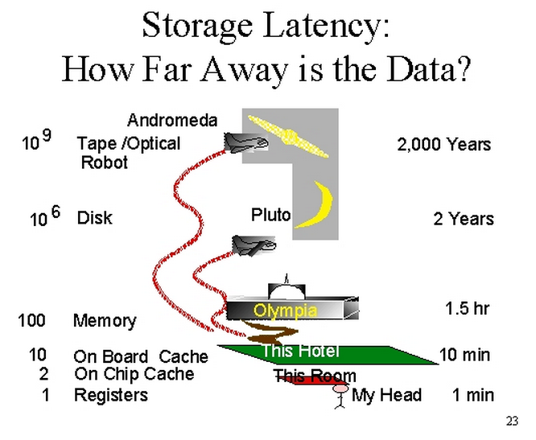
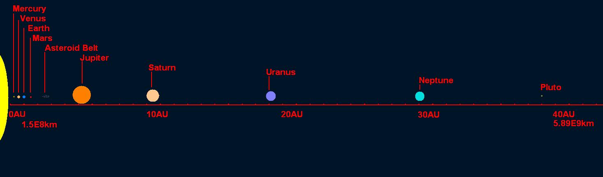

_Bon, ça fait juste trop longtemps que je fais toutes sortes de choses passionnantes au lieu d'avancer sur les 4 ou 5 brouillons d'articles pour ce blog... Alors je vous livre en vitesse une traduction du dernier article du blog Coding Horror, intitulé "[The Infinite Space Between Words](http://blog.codinghorror.com/the-infinite-space-between-words/)" [[1]](#ref-1). Je le trouve excellent (l'article, et le blog) :_

La performance des ordinateurs est une sorte de [bonneteau](w:) Vous êtes toujours en train d'attendre l'une de ces 4 choses:

- Disque
- Processeur
- Mémoire
- Réseau

Mais laquelle ? Et combien de temps faudra-t'il attendre ? Et que faire pendant que vous attendez ?

Avez-vous vu le film [Her](w:) ? Si non, vous devriez. Il est bien. L'une de mes scènes préférée est quand l'[IA](w:Intelligence_Artificielle) décrit comme il devient difficile de communiquer avec les humains :

> C'est comme si je lisais un livre... c'est un livre que j'aime profondément, mais je le lis si lentement, maintenant. les mots sont loin les uns des autres, l'espace entre les mots est presque infini. je peux toujours vous ressentir... et les mots de notre histoire ... mais cet dans cet espace sans fin entre les mots que je me trouve maintenant.. C'est un endroit qui n'est pas dans le monde physique. C'est là où se trouve tout ce dont j'ignorais l'existence. je vous aime tant. Mais c'est là que je suis désormais. Et c'est ce que je suis désormais. Et j'ai besoin que vous me laissiez partir. Même si je le voulais, je ne peux plus vivre votre livre plus longtemps.

J'ai de sérieuses réserves sur l'environnement de travail décrit dans "Her", où tout le monde passe toute ses journées à murmurer frénétiquement à son ordinateur, mais il y a une très profonde vérité dans cette scène clé.  C'est que l'espace infini "entre" ce que nous autres humains ressentons comme le temps est l' "endroit" où les ordinateurs passent tout leur temps. C'est une échelle de temps totalement différente.

Dans le livre "Systems Performance: Enterprise and the Cloud" [[2]](#ref-2) se trouve une table qui illustre très bien l'énorme différence entre ces différences de temps. Ramenons tout à l'échelle de la seconde:

| 1 cycle [processeur](w:) | 0.3 [ns](http://fr.wiktionary.org/wiki/nanoseconde) | 1 s |
| --- | --- | --- |
| accès au [cache](w:Mémoire_cache\) L1 | 0.9 ns | 3 s |
| accès au cache L2 | 2.8 ns | 9 s |
| accès au cache L3 | 12.9 ns | 43 s |
| accès à la [mémoire vive](https://fr.wikipedia.org/wiki/mémoire vive) | 120 ns | 6 min |
| entrée/sortie à un disque [SSD](w:Solid-state_drive\) | 50-150 μs | 2-6 jours |
| entrée/sortie à un [disque dur](w:) | 1-10 ms | 1-12 mois |
| Internet: San Francisco - New-York | 40 ms | 4 ans |
| Internet: San Francisco - Angleterre | 81 ms | 8 ans |
| Internet: San Francisco - Angleterre | 183 ms | 19 ans |
| [Reboot](w:Amorce_(informatique)\) d'un OS [virtualisé](w:Virtualisation\) | 4 s | 423 ans |
| time-out d'une commande [SCSI](w:) | 30 s | 3000 ans |
| Reboot d'un ordinateur virtualisé | 40 s | 4000 ans |
| Reboot d'un ordinateur physique | 5 m | 32 millénaires |

Les temps "internet" ci-dessus sont quelque peu optimistes. Si vous consultez [le tableau des temps de latence aux USA d'AT&T en temps réel](http://ipnetwork.bgtmo.ip.att.net/pws/network_delay.html), le temps de San Francisco à New-York est plutôt autour de 70ms. Je vais donc doubler les valeurs internet de ce tableau.

La [latence](w:Latence_(informatique)) est une chose, mais il faut aussi considérer [le coût de cette bande passante](http://blog.codinghorror.com/the-economics-of-bandwidth/).

A ce propos, le grand [Jim Gray](w:James_Gray_(informaticien)), avait une [intéressante manière d'expliquer ceci](http://loci.cs.utk.edu/dsi/netstore99/docs/presentations/keynote/sld023.htm) [[3]](#ref-3). Si on ramène ces temps à des distances où se trouvent les données à accéder, alors un accès à un disque est équivalent à chercher des données sur Pluton.

il se référait probablement aux traditionnels disques rotatifs rouillants, alors ajustons ces points extrêmes à la situation d'aujourd'hui :

- Distance à Pluton : 7.5 milliard de kilomètres.
- Meilleure performance d'un disque rotatif ([49.7](http://www.anandtech.com/show/5729/western-digital-velociraptor-1tb-wd1000dhtz-review/3)) par rapport au meilleur disque SSD PCI Express ([506.8](http://anandtech.com/show/8006/samsung-ssd-xp941-review-the-pcie-era-is-here/6)). C'est 10x mieux
- Nouvelle distance : 750 millions de kilomètres
- Distance à Jupiter : 750 millions de kilomètres

Donc, au lieu d'aller jusqu'à Pluton pour chercher nos données en 1999, aujourd'hui nous n'avons plus besoin que d'aller jusqu'à Jupiter.

Ceci pour la performance des disques en une décennie. Et quelle est laccélération des processeurs, de la mémoire et des réseaux dans ce même temps ? Est-ce qu'une amélioration d'un facteur 10 ou 100 fait vraiment une différence dans ce grand espace infini de temps dans lequel les ordinateurs travaillent ?

Pour les ordinateurs, nous autres humains vivons dans une échelle de temps totalement différente, presque un [temps géologique](w:Chronologie_du_futur_lointain). Ce qui déforme notre perception. Plus les ordinateurs vont vite, plus cette disparité de temps s'accroît.

### Références:

1. Jeff Atwood, "[The Infinite Space Between Words](http://blog.codinghorror.com/the-infinite-space-between-words/)", 2014, Coding Horror
2. 
3. Jim Gray, "[When every disk is a supercomputer, then what?](http://loci.cs.utk.edu/dsi/netstore99/docs/presentations/keynote/NetStore-keynote-Gray-JG-BC-3-linked.html)", 1999, [Netstore '99](http://loci.cs.utk.edu/dsi/netstore99/)
