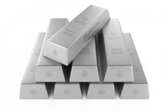
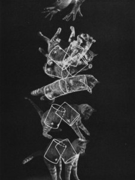

_Chaque fin de mois à partir de maintenant, le "trop-plein" transformera des brouillons d'articles potentiels en paragraphes d'un véritable article._

## Quand l'aluminium coûtait aussi cher que l'or

C'est vrai ça : comment produisait on l'[aluminium](https://fr.wikipedia.org/wiki/aluminium) avant que l'électricité soit disponible en quantité suffisante pour l'électrolyse de l'[alumine](https://fr.wikipedia.org/wiki/alumine) ?

Bien que l'aluminium soit le troisième élément le plus abondant de la croûte terrestre (après l'oxygène et le silicium), il n'était connu que sous forme d'oxyde jusqu'en 1825 où des chimistes réussirent à en produire un peu sous forme de poudre. En 1855 le premier lingot d'aluminium, obtenu par voie chimique, est exposé à l'Exposition Universelle de Paris. Le métal coûtait alors aussi cher que l'or et était utilisé pour des bijoux et de l' "argenterie" de luxe !

Ce n'est qu'à partir de 1886 que la [production de l'aluminium par électrolyse](https://fr.wikipedia.org/wiki/production_de_l'aluminium_par_électrolyse) est mise au point et que ce métal devient peu à peu suffisamment bon marché pour emballer votre sandwich.

source: [http://www.todayifoundout.com/index.php/2014/05/aluminium-cost-gold/](http://www.todayifoundout.com/index.php/2014/05/aluminium-cost-gold/)

## Lumière bleue et santé

Sur Twitter, @zeJeep\_ m'a soumis une brochure reçue avec sa facture EDF : "économisez votre énergie : l'éclairage" ([scan](http://pbs.twimg.com/media/BofvHFyIYAEu3fg.jpg)) qui contient ce passage à propose des LED :

> "il est recommandé d'éviter une longue exposition aux lumières froides (tirant vers le bleu) pour les personnes photosensibles."

Sur le web je n'ai trouvé mention que de [photosensibilité](https://fr.wikipedia.org/wiki/photosensibilité) de la peau et d'[épilepsie photosensible](http://www.epilepsymatters.com/french/faqphotosensitive.html) induite par des lumières variables. Après un [appel sur Reddit](http://www.reddit.com/r/ScienceFr/comments/26i1k0/lumi%C3%A8re_bleue_et_personnes_photosensibles/) relayé sur twitter par @MrPourquoi j'ai obtenu des réponses intéressantes:

- guilalune pense qu'il s'agit plutôt de [photophobie](https://fr.wikipedia.org/wiki/photophobie)
- selon @SamuelPEAN C'est plus lié à la dégénérescence maculaire ([page Inserm](http://www.inserm.fr/actualites/rubriques/actualites-recherche/dmla-quelles-sont-les-ondes-lumineuses-responsables-de-la-perte-de-la-vision)) Il existe des LEDs "warm white" pour limiter le problème
- et @Inserm complète : A voir aussi au sujet de l'impact de la #lumière bleue sur la #santé 

Autres référence trouvée sur [ce forum](http://www.chassimages.com/forum/index.php?topic=107845.0):

- ANSES "[Systèmes d’éclairage utilisant des diodes électroluminescentes : des effets sanitaires à prendre en compte](http://www.afssa.fr/Documents/PRES2010CPA14.pdf)", 2010, Dossier de presse ANSES

## Une explication dynamique du phénomène de la chute du chat

Suite d'une discussion à la pause café, retrouvé un article de légende :

Kane, T. R., & Scher, M. P. "[A Dynamical Explanation of the Falling Cat Phenomenon](http://pentagono.uniandes.edu.co/~jarteaga/geosem/taller7/minicursoJK-Uniandes/robotic%20examples/kane.pdf)", 1969, Int. J. Solid Structures, 5, 663–670.

Illustré par la non moins célèbre image ci-contre, on y trouve les "équations différentielles du chat" décrivant comment un acrobate peut déclencher ou stopper un mouvement de vrille, pour peu que son corps ressemble à deux cylindres...

## Indices de Lisibilité

Très intéressante [émission "Médialogues" entendue à la RTS](http://www.rts.ch/la-1ere/programmes/medialogues/5712180-medialogues-du-05-04-2014.html). Eliane Ballif y a parlé des [indices de lisibilité](https://fr.wikipedia.org/wiki/test_de_lisibilité) permettant de mesurer la difficulté de lecture des textes et, partant, la proportion de la population capable de les comprendre.

L'un des plus utilisé et le "[Gunning fog index](https://en.wikipedia.org/wiki/Gunning_fog_index)" , qui mixe le nombre moyen de mots par phrase et la proportion de "mots complexes", un mot étant "complexe" s'il contient trois syllabes ou plus. La formule de l'indice:

$latex 0.4\\left\[ \\left(\\frac{\\mbox{Nmots}}{\\mbox{Nphrases}}\\right) + 100\\left(\\frac{\\mbox{Nmots complexes}}{\\mbox{Nmots}}\\right) \\right\]$

correspond très approximativement au nombre d'années de scolarité nécessaires à la compréhension du texte. On considère qu'un texte est largement compréhensible par l'ensemble de la population si son indice est inférieur à 8. Un texte d'indice 12 correspond au niveau de lecture courant à la fin du bac. [Cet article](http://s.billard.free.fr/referencement/?2006/09/21/287-tester-la-lisibilite-des-textes) fournit le petit tableau suivant:

| Gunning Fog | Type d'écrit |
| --- | --- |
| 8-9 | Littérature junior et ado, Paris Match, Elle |
| 10-11 | Télérama, Libération |
| 14-15 | Marcel Proust, Le Monde Diplomatique, L'Express |
| 16-17 | Rapports parlementaires |
| 17-18 | Article universitaire |
| 22 et plus | Directives européennes |

Le présent article analysé par [https://readable.io](https://readable.io) présente un indice Gunning fog de 11.7 à relativiser car l'anglais considère comme "mots complexes" ceux de plus de 3 syllabes, qui me semblent plus fréquents en français. Niveau bac, un peu au dessus de Télérama, ça me va très bien.

Là où ça devient intéressant, c'est quand on considère la lisibilité des textes légaux. Le [code civil suisse](https://fr.wikipedia.org/wiki/code_civil_suisse) par exemple a été rédigé dans l'esprit d'être compréhensible par une majorité de la population [[1]](#ref-1). En analysant [une page au hasard](http://www.admin.ch/opc/fr/classified-compilation/20012239/index.html), j'ai obtenu un indice Gunning fog de 12.9. Plus compliqué que drgoulu.com, mais toujours compréhensible par pas mal de gens.

Mais quand on voit qu'une étude de la lisibilité des Directives Européennes [[2]](#ref-2) "a conclu que les lecteurs de ces textes doivent avoir fait des études en master en vue d’arriver à comprendre leur contenu.", on ne peut s'empêcher de se demander si elles ont vraiment été écrites pour que quelqu'un les comprenne...

## Références:

1. Alexandre Flückiger,"[Le principe de clarté de la loi ou l'ambiguïté d'un idéal](http://www.conseil-constitutionnel.fr/conseil-constitutionnel/francais/nouveaux-cahiers-du-conseil/cahier-n-21/le-principe-de-clarte-de-la-loi-ou-l-ambiguite-d-un-ideal.50557.html)", 2007, Cahiers du Conseil constitutionnel n° 21 Dossier : La normativité - janvier 2007
2. Karantzi Ismini "[La lisibilité des textes européens](http://www.irtea.gr/?p=429&lang=fr)", 2013, IRTEA
