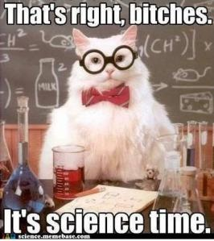

_Pressé par diverses activités, je vous propose cette semaine la traduction d'un article \[1\] qui m'a beaucoup plu et fait réfléchir. D'autant qu'il me semble qu'on peut remplacer "recherche scientifique" par "innovation technologique" sans dénaturer l'idée de fond. Qu'en pensez-vous ?_

J'ai récemment revu une ancienne amie pour la première fois depuis de nombreuses années. Nous avions été doctorants en sciences en même temps, quoique dans des domaines différents. Puis elle a laissé tomber, est allée à Harvard à l'Ecole de Droit et est maintenant avocate senior dans une grande organisation environnementale. A un certain moment, la conversation arriva sur la raison pour laquelle elle avait quitté les études doctorales. A mon grand étonnement, elle a dit que ces études la faisaient se sentir stupide. Après quelques années passées à se sentir stupide tous les jours, elle avait décidé de faire quelque chose d'autre.

Je l'avais toujours vue comme l'une des personnes les plus intelligentes que je connaisse, et sa carrière ultérieure soutient ce point de vue. Ce qu'elle a dit m'a dérangé. Je n'arrêtais pas de penser à ce sujet... Soudain le lendemain, ça m'a frappé : la science me fait me sentir stupide aussi. C'est juste que je m'y suis habitué. Tellement habitué qu'en fait, je recherche activement de nouvelles occasions de me sentir stupide. Je ne saurais pas quoi faire sans cette sensation. Je pense même que c'est censé être comme ça. Je m'explique.

Pour la quasi-totalité d'entre nous, l'une des raisons pour lesquelles nous aimions la science au lycée et à l'université est que nous étions bons en science. Cela n'est pas la seule raison, la fascination pour la compréhension du monde physique et un besoin émotionnel de découvrir de nouvelles choses entrent aussi en compte. Mais la science au lycée et à l'université signifie suivre des cours, et bien suivre les cours signifie connaître les bonnes réponses aux tests. Et si vous connaissez ces réponses, vous réussissez et vous sentez intelligent.

C'est tout différent avec un doctorat, dans lequel vous avez à effectuer un travail de recherche. Pour moi, c'était une tâche ardue. Comment pourrais-je formuler les questions qui mèneraient à des découvertes importantes; concevoir et interpréter des expériences dont les conclusions seraient absolument convaincantes, prévoir les difficultés et voir les moyens de les contourner, ou, à défaut, les résoudre quand elles se concrétisent ? Mon projet de doctorat était assez interdisciplinaire et pendant un certain temps, chaque fois que je suis tombé sur un problème, j'ai harcelé les gens de ma faculté qui étaient les experts dans les différentes disciplines qu'il me fallait. Je me souviens du jour où [Henry Taube](w:) (qui a remporté le prix Nobel de deux ans plus tard) m'a dit qu'il ne savait pas comment résoudre le problème que j'avais dans son domaine. J'étais un étudiant diplômé de troisième année et je pensais que Taube en savait environ 1000 fois plus que moi (estimation prudente). S'il n'avait pas la réponse, personne ne l'avait.

C'est ce qui m'a frappé: personne ne l'avait. C'est pourquoi c'était un problème de recherche. Et puisque c'était mon problème de recherche, c'était à moi de le résoudre. Une fois que j'ai réalisé ce fait, j'ai résolu le problème en quelques jours. (Il n'était pas vraiment très dur, j'ai juste eu à essayer quelques trucs.) La leçon cruciale était que le volume des choses que je ne connaissais pas était non seulement vaste, mais pratiquement infini. Cette prise de conscience, au lieu d'être décourageante, est libératrice. Si notre ignorance est infinie, la seule action possible est de nager dedans du mieux que nous pouvons.

Je voudrais suggérer que nos programmes doctoraux rendent souvent deux mauvais services à nos étudiants. Tout d'abord, je ne pense pas que les élèves soient amenés à comprendre combien il est difficile de faire de la recherche. Et combien il est très, très difficile de faire des recherches importantes. C'est beaucoup plus difficile que de prendre des cours même très exigeants. Ce qui le rend la recherche si difficile est l'immersion dans l'inconnu. Nous ne savons simplement pas ce que nous faisons. Nous ne pouvons pas être sûrs que nous posons la bonne question ou faisons la bonne expérience jusqu'à ce que nous obtenions la réponse ou le résultat. Certes, la science est rendue plus difficile par la concurrence pour les subventions et la publication dans les meilleures revues. Mais en dehors de tout cela, faire de la recherche importante est fondamentalement difficile et tous les changements de ministère, de politiques institutionnelles ou nationales ne permettront pas de réduire sa difficulté intrinsèque.

Deuxièmement, nous n'enseignons pas suffisamment bien à nos étudiants à être productivement stupides, ou autrement dit que si nous ne nous sentons pas stupides cela signifie que nous n'essayons pas assez. Je ne parle pas de la stupidité "relative", dans laquelle les autres élèves de la classe, en lisant la matière y réfléchissent et réussissent l'examen alors que vous pas. Je ne parle pas non plus de gens brillants que l'ont pourrait trouver à des postes qui ne correspondent pas à leur talents. La science implique de nous confronter à notre stupidité "absolue". Ce genre de stupidité est un fait existentiel, inhérente à nos efforts pour faire notre chemin dans l'inconnu. Les examens préliminaires et de thèse ont la bonne approche lorsque le comité de la faculté pousse jusqu'à ce que l'étudiant commence à donner de mauvaises réponses ou abandonne en disant "Je ne sais pas". Le but de l'examen n'est pas de voir si l'étudiant répond juste à toutes les questions. S'il le fait, c'est la faculté qui a échoué à l'examen. Le but est d'identifier les faiblesses de l'élève, en partie pour voir où investir des efforts et en partie pour voir si la connaissance de l'étudiant flanche à un niveau suffisamment élevé pour qu'il soit prêt à prendre un projet de recherche.

La stupidité productive implique d'être ignorant par choix. Nous concentrer sur des questions importantes nous met dans la position inconfortable d'être ignorants. Une des belles choses sur la science est qu'elle nous permet de brasser de l'air, de nous tromper jour après jour, et de nous sentir parfaitement bien tant que nous apprenons quelque chose à chaque fois. Sans doute, cela peut être difficile pour les étudiants habitués à obtenir les bonnes réponses. Sans doute, des niveaux raisonnables de confiance et la résilience émotionnelle aident, mais je pense que l'éducation scientifique pourrait faire plus pour faciliter cette très grande transition: de l'apprentissage ce que d'autres ont découvert une fois à faire vos propres découvertes. Plus nous sommes à l'aise avec notre stupidité, plus nous pataugerons profond dans l'inconnu et plus nous sommes susceptibles de faire de grosses découvertes.

## Référence du texte original

1. \[altmetric doi="10.1242/jcs.033340" float="right"\]Martin A. Schwartz, "[The importance of stupidity in scientific research](http://jcs.biologists.org/content/121/11/1771.full)", Journal of Cell Science 121,1771 doi: 10.1242/jcs.033340
