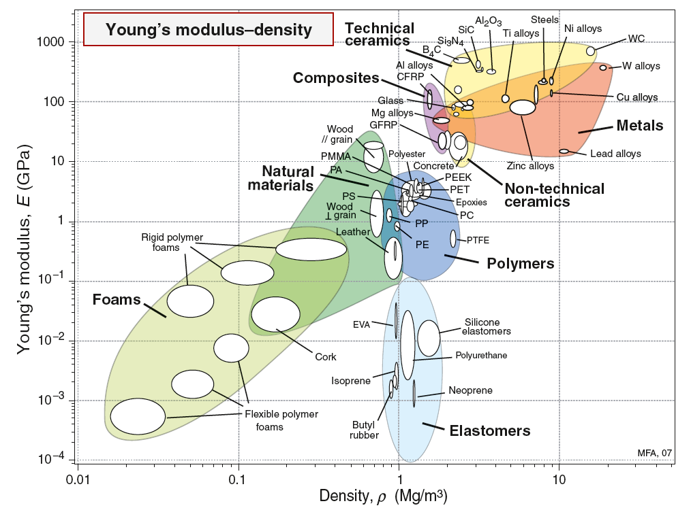
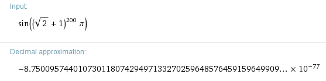
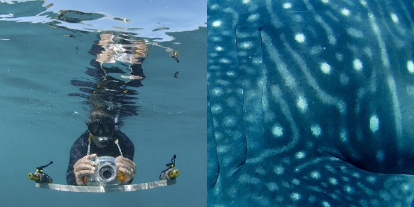

Les articles que je n'ai pas eu le temps de finir ce mois-ci.

### La disparition de la vie sur Terre

Celui-là je l'ai fini, mais [sur Kidi'Science "pour les enfants"](http://kidiscience.cafe-sciences.org/articles/la-disparition-de-la-vie-sur-terre/). J'ai appris plein de choses extraordinaires sur les [extinctions massives](w:) en l'écrivant et je voulais en faire une version "pour les grands ici", avec des liens, des références etc. Mais finalement l'article sur Kidi'Science peut vous convenir aussi, et je vais plutôt écrire sur l'[extinction de l'Holocène](w:) à l'occasion.

### Foundations of Ultraprecision Mechanisms Design

Retrouvé avec délice une authentique bible de la microtechnique de précision : 

Le chapitre le plus intéressant est le huitième, consacré à la [sélection des matériaux](w:en:Material_selection). On y montre que les caractéristiques habituelles des matériaux (densité, module d'élasticité, conduction thermique etc.) interviennent rarement seules lorsqu'on cherche un matériau adapté à la construction d'un système pointu. Beaucoup plus souvent on a besoin d'un compromis entre plusieurs de ces caractéristiques que l'on peut représenter dans un "diagramme d'[Ashby](w:Michel_Ashby)" comme celui ci-dessous:

Le livre va plus loin en normalisant les matériaux par rapport à un matériau de référence, ce qui permet de comparer facilement les matériaux entre eux.

Pour la petite histoire, c'est grâce aux tables figurant dans ce chapitre que j'avais convaincu mon chef de faire une [plateforme XY déformable en titane](https://grabcad.com/library/flexi-1). Le titane, c'est plus cher que l'acier au kilo, mais comme son σ/E est deux fois meilleur que celui de l'acier ressort, une pièce flexible en titane peut être 2x plus petite dans toutes les dimensions, donc 8 fois moins volumineuse et grâce à sa faible densité presque 15 fois moins lourde qu'en acier.

(Edit du 14.7.2014 : j'ai recréé [ces fameuses tables dans Google Docs](https://docs.google.com/spreadsheets/d/1uY04McAQALPntNEjLtUhl9-CgA_dxp0rTMuKGy_B66A/edit?usp=sharing))

(Edit du 15.1.2015 : trouvé le logiciel [CES Selector](http://www.grantadesign.com/products/ces/) de la société Granta basé sur les travaux d'Ashby)

### Pourquoi ne pas faire confiance à une calculatrice

David Madore donne sur son blog un [exemple de calcul qui donne un résultat faux](http://www.madore.org/~david/weblog/2014-06.html#d.2014-06-04.2205) avec la plupart des calculatrices : sin((1+√2)200×π)

Je ne connaissais pas cet exemple mais effectivement toute formule dans laquelle intervient un très grand nombre ou un très petit est potentiellement dangereuse à cause des erreurs d'arrondi. Je repense toujours à "[The right way to calculate stuff](http://www.plunk.org/~hatch/rightway.php)" lorsqu'un tel risque pourrait exister dans mon code...

J'ai tout de même essayé Python sur l'exemple de David, avec un résultat faux, sans surprise. Par contre ma calculatrice préférée http://www.speedcrunch.org/ m'a un peu déçue : elle a renvoyé NaN (Not a Number) alors qu'elle est censée travailler avec autant de décimales que nécessaire. En creusant j'ai vu qu'elle arrive "presque" car

(sqrt(2)+1)^200 donne 35903523178476671398039972962187754894463006960216912732142716329467686943874.003

mais ensuite elle n'arrive pas à calculer le sinus de ça \*pi.

Le seul outil que j'utilise (pas assez apparemment) qui m'ait donné la "bonne" valeur est [Wolfram Alpha](http://www.wolframalpha.com/input/?i=sin%28%28sqrt%282%29%2B1%29%5E200*pi%29) (donc Mathematica doit probablement s'en sortir aussi):

### Requins-baleines, touristes et Rolex awards

Sinon j'ai vu un reportage extraordinaire sur les requins-baleines et j'avais commencé un article en traduisant le communiqué de presse ci-dessous:

En 2006, les [Rolex Awards](http://www.rolexawards.com/) ont [récompensé Brad Norman](http://www.rolexawards.com/profiles/laureates/brad_norman), un scientifique australien spécialiste de la conservation marine, des [requins baleines](w:requin_baleine) en particulier. Dès 2004, il créé un système d'identification de  ces géants des mers par les photos prises par les habitants des côtes, les plongeurs, et les touristes assez chanceux pour les croiser.

Après dix ans d'activité de son projet [ECOCEAN](http://www.whaleshark.org.au/), environ 5000 individus ont été identifiés, grâce à plus de 25'000 observations et 50'000 photos, faites dans 54 pays. Une centaine de requins-baleines de plus sont identifiés chaque année Par comparaison, entre le 19ème siècle et le milieu des années 1980, seules 350 observations avaient été faites de ce mystérieux animal. C’est donc un franc succès pour Brad Norman, qui se félicite autant pour cette nouvelle masse de données que pour l’intérêt de l’opération pour la sensibilisation du grand public à la protection de la faune.

"Le nombre de personnes qui ont contribué à la base de données d'observations de requins-baleines dépasse les 4000, dans des pays aussi distants que le Qatar et Israel, la Thaïlande l'Australie et les Galapagos" selon Norman. Il a joué un rôle crucial dans l'étude de cette espèce grâce à une méthode innovante pour identifier les requins-baleines, en utilisant un algorithme développé pour cartographier les étoiles que ses collègues, dont un astronome de la NASA, ont adapté pour reconnaître les taches blanches spécifiques à la peau de chaque individu.

Tout le monde est encouragé à prendre des photos des requins-baleines dans l'océan et de les uploader sur le site web, ce qui permet de tracer les déplacements des animaux. "C'est une excellente manière d'impliquer le public, spécialement les enfants" explique Norman. "Nous identifions de nouveaux requins baleines chaque année. En 2011, 500 nouveaux animaux ont été identifiés. En 2012, le nombre a été de 722, et en 2013, 774 ont été identifiés.

L’équipe de chercheurs a décidé de renforcer cette stratégie en mettant au point une application smartphone. Cette appli, qui devrait être lancée courant 2014, permettra de prendre une photo sous-marine d'un requin baleine puis de la télécharger directement sur le site du projet.

source : [blog Rolex Awards](http://blog.rolexawards.com/2014/02/whale-shark-research-speeds-up-with-citizen-scientists-2/)
