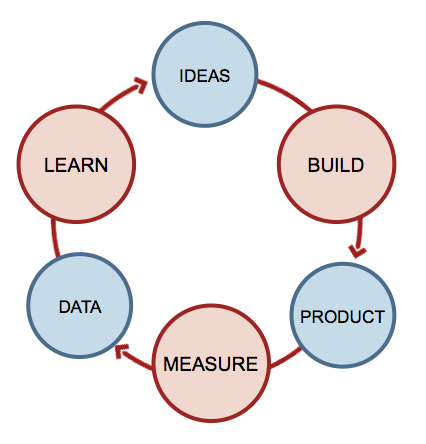



La prochaine fois que quelqu'un trouve mon CV "atypique", je lui fais lire ce bouquin.



En le lisant, je me suis senti comme Monsieur Jourdain faisant de la prose sans le savoir : voilà enfin le lien que je pressentais entre innovation et lean, voilà enfin une approche scientifique au management de la technologie.

L'idée de départ d'[Eric Ries](http://www.startuplessonslearned.com/)

