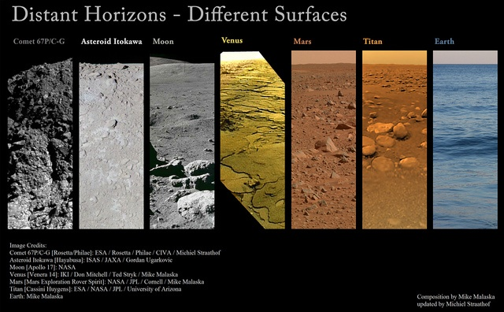

Comment ça, deux mois sans article ? Je pourrais raconter que j'habite trop près d'un trou noir, comme dans "Interstellar", dont je causerai très bientôt, mais en réalité je suis occupé par plusieurs sujets qui provoqueront des articles un jour peut-être, et surtout un qui provoque l'article d'aujourd'hui:

### Le MOOC "Introduction à l'Astrophysique" de l'EPFL

Je voulais depuis longtemps suivre un [MOOC (ou FLOT ou CLOM ?)](https://fr.wikipedia.org/wiki/Formation_en_ligne_ouverte_à_tous), pour voir à quoi ça ressemble. Voyant que le [Laboratoire d'astrophysique de l'EPFL](http://lastro.epfl.ch/) propose le premier [cours d'introduction à l'astrophysique en français sur edX](https://www.edx.org/course/introduction-lastrophysique-introduction-epflx-phys-209x-1), je me suis immédiatement inscrit et je le suis assidûment depuis deux mois en y consacrant une bonne soirée par semaine.

Ce qui m'a surpris temporairement, c'est que le cours ne suit pas le plan des livres d'astronomie de ma jeunesse qui partaient du Soleil et s'en éloignait en décrivant d'abord les planètes, puis les autres étoiles, les nébuleuses, les galaxies etc. Mais comme l'indique très bien le descriptif "Le cours met l'accent sur le lien entre les prédictions théoriques et les observations",

Voici la table des matières du cours, semaine par semaine, avec mes petites remarques personnelles

1. Après un bref aperçu, [Frédéric Courbin](http://people.epfl.ch/frederic.courbin?lang=fr) présente les [lois de Képler](https://fr.wikipedia.org/wiki/lois_de_Képler) et le [théorème du viriel](https://fr.wikipedia.org/wiki/théorème_du_viriel) que j'ignorais totalement ou avais oublié, et qui permet notamment de lier la taille d'un [amas globulaire](https://fr.wikipedia.org/wiki/amas_globulaire) à la vitesse des étoiles qui le forment et réciproquement
2. La deuxième semaine est consacrée au processus de [rayonnement](https://fr.wikipedia.org/wiki/rayonnement), au [corps noir](https://fr.wikipedia.org/wiki/corps_noir) et aux [raies d'absorbtion et d'émission](https://fr.wikipedia.org/wiki/raie_spectrale) ainsi qu'aux magnitudes [absolues](https://fr.wikipedia.org/wiki/magnitude_absolue) et [apparentes](https://fr.wikipedia.org/wiki/magnitude_apparente). Là, pour simplifier et vérifier mes calculs pour les exercices, j'ai découvert et commencer à utiliser le module Python [Astropy](http://www.astropy.org/), qui définit de nombreuses constantes et unités bien utiles. Il permet notamment de convertir des unités du [système CGS](https://fr.wikipedia.org/wiki/système_CGS) comme l' [erg](https://fr.wikipedia.org/wiki/erg_(unité))"que les astrophysiciens continuent d'utiliser, à mon grand dam.
3. On aborde ensuite l'[effet Doppler-Fizeau](https://fr.wikipedia.org/wiki/effet_Doppler-Fizeau) et les [milieu interstellaire](https://fr.wikipedia.org/wiki/milieu_interstellaire) et [milieu intergalactique](https://fr.wikipedia.org/wiki/milieu_intergalactique), avant de passer aux [force de marée](https://fr.wikipedia.org/wiki/force_de_marée). Légère déception à ce niveau, j'espérais qu'on aborde le phénomène de ralentissement de la rotation et d'échauffement des astres soumis aux marées, mais j'imagine que ça doit être compliqué...
4. Suit logiquement la [limite de Roche](https://fr.wikipedia.org/wiki/limite_de_Roche), puis le cours parle des [comètes](https://fr.wikipedia.org/wiki/comètes) avant d'aborder le bilan énergétique des planètes, et en particulier l'effet de leur atmosphère. Là j'ai eu le plaisir de voir esquissé le "[graphique qui vaut 10000 mots](http://drgoulu.local/2011/11/13/climat-le-graphique/)", et la demi surprise de voir que la température de corps noir de la Terre, Vénus et Mars sont beaucoup plus proches que leurs températures au sol. A ce sujet et au passage, [vu ici](http://www.universetoday.com/116274/comet-landing-side-by-side-pics-of-all-alien-surfaces-humanity-explored/) ce beau montage des surfaces de tous\* les astres sur lesquels des engins humains se sont posés en douceur: 
5. La cinquième semaine est consacrée aux étoiles, leur formation, leur classification et leur distribution dans le [diagramme de Hertzsprung-Russell](https://fr.wikipedia.org/wiki/diagramme_de_Hertzsprung-Russell) illustré de magnifique manière par cette video\[embed\]
    
    la formation des étoiles est illustrée dans le [diagramme de Hayashi](https://en.wikipedia.org/wiki/Hayashi_track), puis les réactions nucléaires des différents types d'étoiles ainsi que les morts correspondantes sont décrites. J'ai particulièrement apprécié la méthode de datation d'un amas d'étoile via le "coude" apparaissant dans la distribution des étoiles de la [séquence principale](https://fr.wikipedia.org/wiki/séquence_principale)
6. La sixième semaine est consacrée aux galaxies. Ca commence par leur classification (avec un peu de pub pour [Galaxy Zoo](http://www.galaxyzoo.org/) dans un exercice), leur formation et leur évolution, le tout illustré par de [belles simulations](http://obswww.unige.ch/~revaz/pNbody/rst/Movies.html) faites par Yves Revaz à l'aide de [pNbody](http://obswww.unige.ch/~revaz/pNbody/), un package Python que je vais me dépêcher d'explorer dès que les journées auront 36 heures (il y a de l'espoir : les marées freinent la rotation de la Terre ...). Ensuite le cours aborde le mouvement des étoiles dans les galaxies via les [constantes d'Oort](https://fr.wikipedia.org/wiki/constantes_d'Oort), et se termine par un exposé sur la [matière noire](https://fr.wikipedia.org/wiki/matière_noire)
7. (ajouté le 24.11.14) La dernière semaine est consacrée à une introduction à la cosmologie : âge de l'univers, galaxies primordiales, [énergie sombre](https://fr.wikipedia.org/wiki/énergie_sombre), [fonds diffus cosmologique](https://fr.wikipedia.org/wiki/fonds_diffus_cosmologique), échelles des grandes distances et moyens de mesure ([céphéide](https://fr.wikipedia.org/wiki/céphéide), [supernova de type Ia](https://fr.wikipedia.org/wiki/supernova_de_type_Ia)) et le cours se termine avec l'étude des [lentilles gravitationnelles](https://fr.wikipedia.org/wiki/lentilles_gravitationnelles)

Je suis très content d'avoir suivi ce cours, je le recommande vivement aux passionnés de l'espace qui ont (encore) de bonnes notions de maths et de physique. Outre la matière enseignée, l'intérêt du cours réside pour moi dans les liens qui sont établis entre divers domaines de la physique : en jonglant avec la mécanique classique, la thermodynamique et un soupçon de mécanique quantique, on développe une vision cohérente, multidisciplinaire de connaissances qui peuvent paraître disparates lorsqu'on les rencontre la première fois en cours. A mon goût il ne manque qu'un soupçon de relativité assaisonné de trous noirs et d'étoiles à neutrons pour que ce cours soit parfait, mais peut-être sera-ce le sujet d'un cours suivant.

Sinon, la [plateforme edX](https://www.edx.org/) utilisée pour les MOOC de l'[EPFL et beaucoup d'universités prestigieuses](https://www.edx.org/schools-partners) est performante et agréable. On peut passer les vidéos en accéléré ou ralenti, commuter entre la vidéo et la page des exercices à volonté, et une zone de discussion permet de poser des questions ou de râler comme dans une vraie salle d'exercices, en plus calme.

Si mon rythme de publication reste bas, ce sera surement à cause d'un autre MOOC.

Note\* : En fait il existe un 8ème objet : [NEAR Shoemaker](https://fr.wikipedia.org/wiki/NEAR_Shoemaker) a été crashée sur [l'astéroïde Eros](https://fr.wikipedia.org/wiki/(433)_Éros) en 2001 alors que ce n'était pas prévu initialement, et la sonde a survécu et transmis quelques images avant sa mort.
