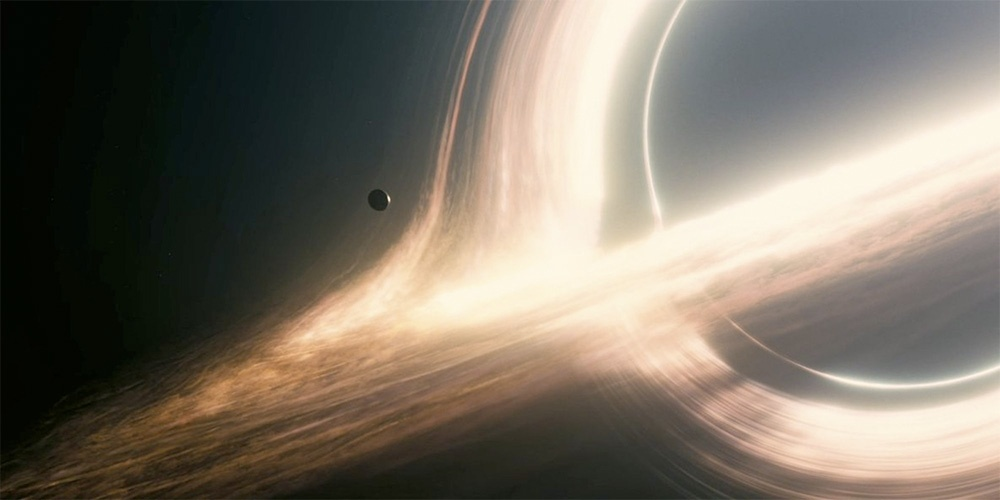

Je suis ressorti mitigé de la séance d'[Interstellar](https://fr.wikipedia.org/wiki/Interstellar). C'est un beau spectacle, on ne s'ennuie pas, on en a pour son argent, rien à dire. C'est un film de science-fiction, donc il peut y avoir plus de fiction que de science, ce n'est pas ce qui m'a dérangé outre mesure.

Ce qui m'a déçu, c'est le peu d'attention apporté à la partie "science". C'est peut-être un détail pour vous, mais pour moi ça veut dire beaucoup : quant on chasse un drone solaire parce que "ses panneaux solaires peuvent fournir de l'énergie à toute une ferme", il faut que le drone ait plus d'1m² de cellules, sinon même avec un rendement de 100%, il ne collectera que 1000 watts, pas un rayon de plus. Et quand un vaisseau spatial a besoin d'une énorme fusée genre  Saturn-V pour quitter la Terre, il ne peut pas ensuite se poser et redécoller de 2 planètes sans me faire mal à la physique. Et lorsqu'une vague énorme approche, le creux de la vague n'est ni plat ni calme: l'eau reflue vers la vague et cette dernière déferle si la profondeur est insuffisante. Ce genre de faute me choque autant qu'un "faux raccord" où la robe de l’héroïne passerait instantanément du vert pomme au rose bonbon : ça relève d'un manque d'attention.

C'est d'autant plus dommage que d'autres scènes du film sont très bien documentées. Comme l'ont noté beaucoup de critiques, la visualisation du trou noir est l'une des plus réalistes dont on dispose actuellement. Elaborée avec la collaboration de [Kip Thorne](https://fr.wikipedia.org/wiki/Kip_Thorne) elle montre le disque d'accrétion de matière orbitant autour du trou à une vitesse telle qu'elle est chauffée à blanc et devient lumineuse. L'effet de lentille gravitationnelle du trou permet de voir la partie du disque d'accrétion qui se trouve derrière le trou autour de celui-ci. Vivement Interstellar 2 avec Effet Doppler et jets relativistes !

Voilà d'ailleurs un autre aspect qui m'a dérangé dans Interstellar : j'ai eu l'impression d'assister aux 4 premiers épisodes d'une série tant les sujets abordés étaient différents et séquencés:

1. la survie sur une planète en ruine (mais où il y a toujours du pétrole pour les pick-ups des fermiers et de l'eau pour leur maïs)
2. le voyage spatial, avec hibernation, trou de ver bien placé et [paradoxe des jumeaux](https://fr.wikipedia.org/wiki/paradoxe_des_jumeaux)
3. la survie de l'espèce vs survie de l'individu. Je crois que c'est le thème que j'ai préféré, en définitive.
4. le voyage temporel. En tant que [fan du genre](/2010/10/23/retours-vers-les-futurs/), j'ai apprécié à sa juste valeur (univers bloc avec [paradoxe du grand-père](https://fr.wikipedia.org/wiki/paradoxe_du_grand-père) [paradoxe de l'écrivain](https://fr.wikipedia.org/wiki/paradoxe_de_l'écrivain) )

En fin de compte, il y a juste trop de sujets dans ce film, trop de sujets traités trop superficiellement, ce qui dé-sert le message optimiste que j'ai cru déceler dans "Interstellar" : "vers l'infini et au-delà !"
