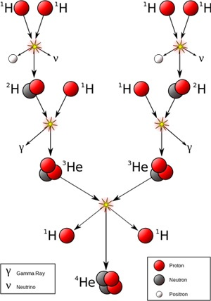
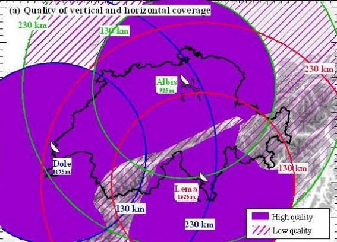
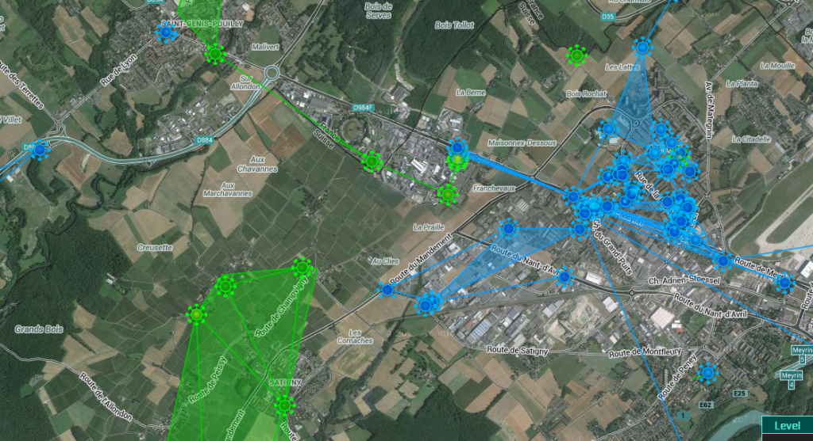

Un trop-plein résolument météorologique ce mois-ci :

### Le régime du Soleil

Je voulais traduire [l'article du Bad Astronomer](http://www.slate.com/blogs/bad_astronomy/2014/07/14/solar_wind_versus_fusion_how_does_the_sun_lose_mass.html) qui répond à certaines de mes questions sur le Soleil, mais voici juste les réponses brutes:

- le [vent solaire](w:) envoie 300 millions de protons par seconde sur chaque cm2 d'une [voile solaire](w:) qui se trouverait sur l'orbite terrestre
- le Soleil expulse ainsi 1.5 million de tonnes de matière par seconde
- le noyau d'Helium 4 est légèrement plus léger que la somme des 4 atomes d'Hydrogène qui le produisent par fusion dans le Soleil. La différence est convertie dans l'énergie de rayonnement de l'astre du jour par la fameuse E=m.c² . Pour le soleil, m correspond à 4 millions de tonnes de matière convertie en énergie chaque seconde !
- à ce régime, le soleil perd 127 mille milliards de tonnes par an. Ca paraît beaucoup comme ça mais ce n'est que 21 milliardièmes de la masse de la Terre, qui est beaucoup, beaucoup plus petite que le Soleil.
- mais comme il brille depuis 4.5 milliards d'années, il a déjà converti en énergie et expulsé dans l'espace l'équivalent de 100 masses terrestres environ.

### Les radars météo

Mais hélas, le soleil n'est pas toujours au rendez-vous de nos barbecues. En Suisse tout le monde connait [la page "Landi"](http://www.landi.ch/meteo/fra/niederschlagsprognosen_32451.aspx) à consulter pour savoir s'il vaut mieux installer les parasols ou les parapluies.

Pour réaliser ces prévisions de pluie à court terme des machines extraordinaires mesurent les précipitations en temps réel avec une grande précision : le [radar météorologique](w:). Il y en a actuellement 3 en service couvrant entre tout le territoire suisse ([en France c'est là](https://web.archive.org/web/20140625060250/http://www.meteofrance.fr/prevoir-le-temps/observer-le-temps/moyens/les-radars-meteorologiques)), et deux de plus vont être installés dans le cadre du [projet Rad4Alps](http://www.meteoschweiz.admin.ch/web/en/research/current_projects/forecast/rad4alp/scientific_challenges.html) pour couvrir les vallées des Alpes actuellement masquées Il s'agit en fait de [radar Doppler pulsé](w:), capables de mesurer non seulement la position des averses, mais aussi leur vitesse de déplacement avec une grande précision.

### Pas d'été sans jeux.

S'il pleut, essayez de créer un système solaire stable dans [Super Planet Crash](https://web.archive.org/web/20140717115442/http://www.stefanom.org/super-planet-crash/). pour un max de points, il faut mettre plusieurs planètes dans la zone habitable. J'ai essayé la [rosace de Klemperer](w:en:/Klemperer_rosette) comme les Marionnettistes de [l'Anneau-Monde](/2012/10/28/anneau-monde-et-surpopulation/), mais sans succès jusqu'ici. D'une part le je ne permet pas de placer les planètes avec une grande précision, et d'autre part j'ai des doutes sur la méthode d'intégration utilisée. Découvert les [intégrateurs symplectiques](w:en:Symplectic_integrator) et l'[intégration de Verlet](w:) utilisées en astronomie, parce qu'elles permette de ocnserver l'énergie du système

S'il fait beau, testez [Ingress](http://ingress.com), le jeu de Google pour conquérir le monde. Le concept est assez génial : il faut physiquement se déplacer aux positions GPS de "portails" disséminés sur toute la planète à des endroits un tant soit peu remarquables. J'en ai deux dans mon petit village, il y en a plein dans chaque ville et d'autres disséminés dans la campagne.

Deux équipes s'affrontent pour la maîtrise de ces portails, les bleus (eux), et les verts (nous), car une fois des portails capturés on peut les "linker" à leurs voisins et les zones ainsi triangulées apportent points et ressources. Le site https://www.ingress.com/intel montre l'état des forces en présence sur toute la planète.

Voici par exemple la situation actuelle autour de chez moi : j'ai contribué à trianguler la grande surface verte que je vais tenter d'étendre vers la ligne de portails verts le long du CERN, mais les bleus qui ont envahi Meyrin tentent de détruire les portails verts pour nous en empêcher.  C'est vraiment un jeu d'équipe, mais on y joue en découvrant des coins sympas juste à côté de chez soi, et en rencontrant des gens bizarres sous la pluie au petit matin, seuls avec leur téléphone face à une sculpture en bois...



Après Androïd, il vient d'être porté sur iOS, donc plus d'excuse pour ne pas l'essayer. Choisissez votre camp, en sachant que je suis vert :-)
