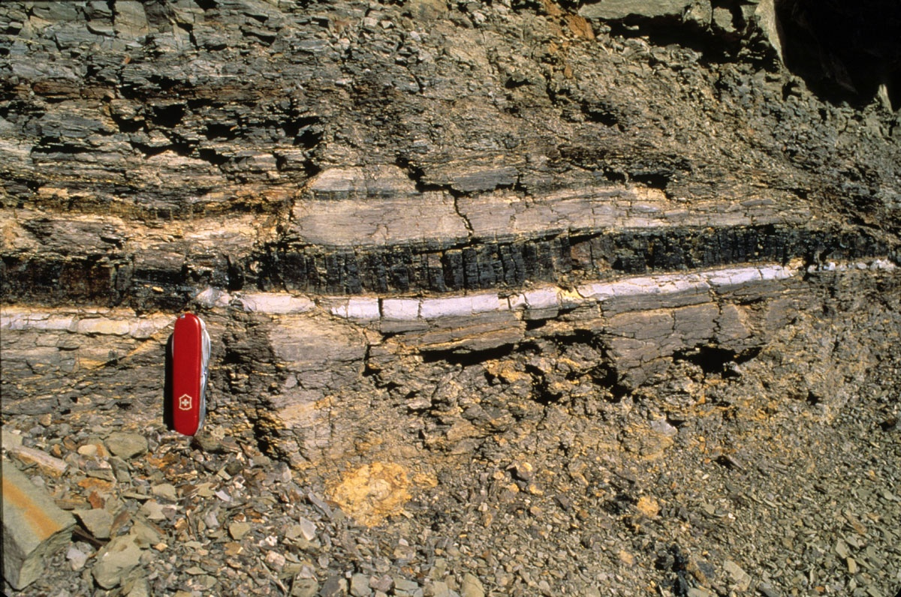
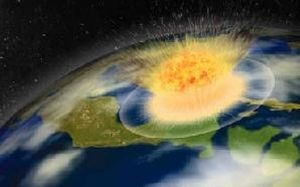

_Ceci est une version "pour adultes" de l'[article que j'avais écrit sur Kidi'Science.](http://kidiscience.cafe-sciences.org/articles/la-disparition-de-la-vie-sur-terre/)_

Après l'article de Mr Pourquoi sur [comment la vie est apparue sur Terre,](http://kidiscience.cafe-sciences.org/articles/comment-la-vie-est-elle-apparue-sur-terre/) nous allons voir comment la vie a failli disparaître plusieurs fois, et comment elle pourrait disparaître un jour, dans très longtemps.

Pendant les derniers 500 millions d’années ont eu lieu six [extinctions massives](w:) au cours desquelles le nombre d’espèces vivantes a été brutalement réduit. La plus connue est la plus « récente », est celle qui a anéanti presque\* tous les dinosaures il y a 65 millions d’années. Les scientifiques appellent cette catastrophe [extinction Crétacé-Tertiaire](w:) ou « événement K-T ».

Ce qu’on en sait est le résultat d’une véritable enquête policière.

### Qui a tué les dinosaures ?

les couches blanches et noires datent de l’extinction Crétacé-Tertiaire

Les premiers indices ont été retrouvés dans des [roches sédimentaires](w:), qui se forment couche par couche. Sur la photo ci-contre, on voit en bas les couches qui datent du Crétacé, l’époque des dinosaures, puis une couche blanche au dessus, puis une couche noire qui ressemble à du charbon, puis les roches plus récentes de notre époque que le géologues appellent le Tertiaire. Qu’est-ce qui avait bien pu fabriquer ces couches blanche et noire si spéciales ?

La couche blanche est visible dans les roches vieilles de 65 millions d’années sur presque toute la Terre. Elle contient beaucoup d’iridium, un métal rare sur Terre mais assez fréquent dans certaines météorites. C'est pourquoi on pensait depuis longtemps que l’extinction des dinosaures était due à une très grosse météorite, mais on ne connaissait pas de gros cratère datant de cette époque. En 1980 une équipe de géologues a retrouvé dans le Golfe du Mexique un cratère de 180 km de diamètre datant de 65 millions d’années, le [Cratère de Chicxulub](w:) Bingo ! Le suspect numéro un a été identifié. Mais comment a-t-il tué les dinosaures ?

Vu de l’espace, ça devait ressembler à ça …

Pour creuser un tel cratère il a fallu une explosion correspondant à des milliards de bombes atomiques, ce qui a causé un énorme tremblement de terre, un tsunami gigantesque et une onde de choc qui ont immédiatement fait un énorme massacre. L’explosion a catapulté sur toute la Terre des morceaux de lave qui ont allumé d’énormes incendies de forêt. Les arbres carbonisés ont formé la couche noire, qui est plus visible en Amérique qu’ailleurs. Mais l’impact et les incendies ont aussi recouvert l’atmosphère d’un nuage de cendres et de poussières qui a masqué le soleil. Ca a provoqué un long hiver et des pluies acides qui ont empêché l’herbe et les plantes de pousser normalement pendant plusieurs années.

Tous les animaux terrestres plus gros que 25 kilos qui ne sont pas morts broyés, carbonisés ou noyés tout de suite sont morts de froid ou de faim plus tard. En plus on pense que les dinosaures avaient le même problème que les reptiles d’aujourd’hui : le sexe de leur descendance dépend de la température. S’il fait trop froid, tous les bébés sont mâles et si ça dure trop longtemps l’espèce disparaît parce qu’elle ne peut plus se reproduire.

Nos ancêtres les premiers mammifères ont probablement survécu de justesse à cette terrible catastrophe, peut-être grâce à quelques individus qui avaient assez de provisions au fond de leur terrier…

Comme dans beaucoup d’enquêtes policières, on n’est pas surs à 100% que ça se soit passé comme ça. D’autres géologues pensent qu’il y a aussi eu beaucoup d’éruptions de volcans à peu près à la même période. Peut-être qu’il y a eu plusieurs criminels au lieu d’un seul, mais le résultat est le même : des milliers d’espèces terrestres ont disparu de la surface de la Terre en peu de temps.

### L’apparition des dinosaures



Avant ça, les dinosaures avaient régné sur la Terre depuis la grande extinction précédente, celle du Trias-Jurassique il y a 200 millions d’années environ. On connait l’heure du crime à quelques millions d’années près…

Parmi les nombreuses victimes, il y a eu une bonne partie des [Crurotarsi](w:), les ancêtres des crocodiles actuels. Certains étaient gigantesques. En disparaissant, ils ont fait de la place pour les dinosaures.

On ne sait pas exactement ce qui s’est passé mais pour comprendre, l’enquête scientifique est en cours.



 

Ce qu’on sait, c’est qu’à cette époque il n’y avait qu’un continent unique appelé la [Pangée](w:) qui avait commencé à se fracturer pour former les continents actuels. La plus grosse fracture est devenue l’Océan Atlantique, entre l’Afrique et l’ Amérique. Les roches qui sont des deux côtés de l’Océan Atlantique contiennent du basalte, de la lave refroidie qui a justement 200 millions d’années. Il y a donc eu beaucoup de volcans à cette époque, probablement très gros, en plein au milieu de la Pangée, dans un futur océan en train de se remplir d’eau…

Cette extinction a probablement duré beaucoup plus longtemps que celle du Crétacé-Tertiaire mais elle a exterminé à peu près la même proportion d’espèces, notamment marines.

### La Pé-Tée



Mais il y a 252 millions d’années, la vie a bien failli disparaître pour de bon. 90% des espèces marines et 70% de celles sur terre ont été éradiquées lors de l’[extinction du Permien-Trias](w:) (P-T) qu'un paléontologue inspiré a baptisé « la mère de toutes les extinctions de masse ».

Les scientifiques ne sont pas surs qu’il n’y ait eu qu’une extinction à cette époque, il y a peut être eu plusieurs extinctions rapprochées. Ce qu’on sait, c’est qu’il a fait très très chaud à cette époque, entre 50° et 60° à l’équateur et peut être 40° à la surface des océans, et que ça a duré peut être 5 millions d’années. Peu d’espèces, plantes ou animaux, peuvent survivre à ça.

Mais sur les responsables de cet énorme réchauffement climatique, on n’a qu’une liste de suspects pour l’instant:

- météorites,
- volcans et supervolcans,
- collision des supercontinents Protogondwana et Laurussia qui ont formé la Pangée,
- Au fond des océans il existe de grosses réserves de méthane sous forme d’une sorte de glace, l’[hydrate de méthane](w:). Si l’océan se réchauffe un peu, cette glace fond et libère du méthane, qui est un gaz a effet de serre, ce qui réchauffe encore plus le climat et les océans, etc.
- un microbe.

Oui, une des hypothèses les plus récentes est qu’un petit microbe de rien du tout a failli tuer toutes les autres espèces de la Terre, comme [Guillaume l'explique sur son blog](http://blog.science-infuse.fr/post/Le-microbe-qui-a-failli-eradiquer-toute-vie-sur-Terre). Le responsable serait [Methanosarcina](w:), une « archée anaérobie méthanogène » :

- Les [archées](w:) sont des unicellulaires très résistants, à la chaleur en particulier,
- [anaérobie](w:) signifie qu’ils n’ont pas besoin d’oxygène pour vivre,
- et [méthanogène](w:) qu’ils fabriquent du méthane, un gaz à effet de serre très puissant.

En attendant plus de recherches et de découvertes, tous ces suspects ont le bénéfice du doute, mais je me sens assez proche du microbe pour des raisons que j'expliquerai plus bas.

### Avant la Pé-Tée

Avant, il y a encore eu :

1. L' \[\[extinction du Dévonien\] qui a éliminé environ 70 % des espèces entre 380 et 365 millions d’années avant maintenant. On pense qu'il s'agissait de plusieurs extinctions rapprochées combinant météorites, mouvements continentaux et glaciations.
2. Deux extinctions très rapprochées à la limite [Ordovicien-Silurien](w:extinction_de_l'Ordovicien-Silurien) il y a 435-440 millions d’années, probablement dues à des glaciations
3. l’[extinction du Cambrien](w:) il y a 480 ou 500 millions d’années, qui a éliminé 85% des grandes espèces. La suspecte est une énorme glaciation du seul continent, le [Gondwana](w:), qui a eu la mauvaise idée d’être au pôle Sud à cette époque.
    

Si la Terre a subi au moins 6 grandes extinctions en 500 millions d’années, il y en a certainement eu encore beaucoup avant puisque la vie existe sur Terre depuis au moins 3 milliards d’années. Mais il ne reste pas assez de traces fossiles de ce qui s’est passé il y a si longtemps pour pouvoir allonger la liste de ces terribles périodes.

Il y a plusieurs leçons importantes à retenir de ces extinctions massives du passé:

1. La vie sur Terre est résistante. Même quand une énorme catastrophe se produit, il y a toujours eu des petites bêtes et des petites plantes qui sont arrivées à survivre. Les gros animaux sont plus menacés.
2. Après chaque extinction, de nouvelles espèces différentes des précédentes ont pu apparaître. Les extinctions sont en partie responsables de la grande variété des espèces que nous connaissons aujourd’hui. On peut même dire que sans les grandes extinctions, nous ne serions pas là. Ou on serait peut être des trilobites…
3. Les responsables des grandes extinctions sont très variés. Parfois ils viennent du ciel et parfois du sol. Parfois il fait trop chaud, parfois trop froid. Et parfois ce sont peut être des espèces comme le microbe Methanosarcina qui ont massacré les autres.

Maintenant, voyons rapidement à quoi ressembleront peut-être les prochaines grandes extinctions.

### L’extinction de l’Holocène

Certains pensent que nous sommes déjà en train de vivre une extinction massive, maintenant à notre période qu’on appelle l’Holocène. L'[extinction de l'Holocène](w:) est causée par l'espèce Homo Sapiens. Nous. Les humains.

Depuis que nous nous sommes répandus sur la planète, nous avons chassé et pêché toutes sortes d’animaux, remplacé des forêts pleines d’espèces différentes par de cultures de quelques espèces de plantes seulement, transformé des prairies qui hébergeait pleins de petites bêtes en pâturages pour quelques gros animaux qui nous « donnent » leur lait et leur viande. Nous bétonnons et polluons de grands surfaces où plus grand chose ne peut vivre ou pousser. Et nous dégageons des quantités astronomiques de CO2, gaz a effet de serre qui est en train de réchauffer notre climat.

En grande partie à cause de nous, les grands animaux sont en train de disparaître à une vitesse 100 à 1000 fois plus rapide que la normale selon certaines estimations. Vous connaissez certainement l'histoire du [dodo](w:), mais il y a aussi eu le [tarpan](w:), l’[auroch](w:), la [rhytine](w:), le [quagga](w:) et d'autres espèces de grands animaux qui ont disparu à notre contact pendant les deux derniers siècles. Et il y en a beaucoup d’autres. Et ce n’est pas nouveau. Aujourd’hui on se demande sérieusement si l’homme n’a pas joué un rôle important dans la [disparition du mammouth laineux](w:Mammouth#Chasse_par_les_humains) et de beaucoup d’autres grands mammifères il y a environ 10’000 ans. 80% des espèces d’animaux qui avaient plus d'1 tonne de bonne viande ont disparu.

Comme pour les extinctions précédentes, les petits animaux s’en sortent mieux. Mais un grande différence par rapport aux autres extinctions, c’est que 70% des espèces de plantes ont disparu ou risquent de disparaître. Ca n’est jamais arrivé avant dans cette proportion.

Il est difficile de savoir comment ça va finir, mais il est très possible que l’extinction de l’Holocène provoque une diminution du nombre d’humains, volontaire ou pas. Mais il est probable que nous ne disparaîtrons pas facilement, car nous sommes petits, résistants au froid et au chaud, et intelligents parait-il.

On sait que les humains on plusieurs fois failli disparaître lors de « petites » extinctions. Par exemple il y a 73’000 ans, le [supervolcan de Toba](w:Théorie_de_la_catastrophe_de_Toba) en Indonésie s’est réveillé et a craché des quantités énormes de cendres qui ont provoqué un refroidissement de plusieurs siècles. On sait par l’analyse de notre ADN qu’il n’y a eut que quelques milliers de survivants, et pourtant c’était assez pour « croître et multiplier » sur toute la Terre par la suite…

Et tant que nous serons là, nous ne laisserons pas d’autres bêtes prendre notre place

### Les extinctions du futur



Peut-être que grande extinction de l’Holocène ne s’arrêtera que quand nous disparaîtrons, parce que ça fera de la place sur la Terre pour de nouvelles espèces.

Je ne sais pas trop comment ça pourrait arriver, parce qu’avec la technologie actuelle on [voit arriver les grosses météorites](/2012/01/28/risques-meteoritiques/) bien à l’avance et qu’on pourra peut-être détruire celles qui nous menaceront.

Aussi comme la Terre est de moins en moins radioactive il y a de moins en moins de gros volcans, et même si un gros supervolcan comme celui de Toba se réveille on arrivera à mieux se planquer que nos ancêtres dans leurs cavernes.

J'aime mieux rêver que nous disparaîtrons en partant vers d’autres planètes et en laissant la Terre à d’autres animaux vraiment intelligents comme les singes s’il en reste, ou les dauphins.

### La dernière grande extinction

Pendant un milliard d’années, il y aura surement encore plusieurs grandes extinctions qui n’arriveront probablement pas à éliminer toute vie sur Terre, alors l’Evolution va continuer à rendre la vie sur Terre de plus en plus variée, en trouvant à chaque fois moyen de fabriquer de nouvelles espèces pour prendre la place de celles qui disparaissent. Peut-être que dans un milliard d’années ce seront les descendants des vers de terre qui domineront la Terre, qui sait …

Mais dans un peu plus d’un milliard d’années, les êtres qui vivront sur Terre auront un très gros problème, gros comme le Soleil. En fait, le Soleil rayonne petit à petit de plus en plus fort. Dans 1 milliard d’années, il fera plus de 100°C sur la Terre, donc les océans vont bouillir et on ne sait pas trop ce qui pourrait vivre après ça. Par comme Mars pourrait bien devenir habitable à ce moment là, peut être que les descendants des vers de terre auront été assez intelligents pour y aller (et devenir des « vers de Mars »…)

Ensuite le Soleil va devenir de plus en plus chaud et gros. Dans 7.5 milliards d’années, peut être que les descendants des bactéries qui étaient dans les tubes digestifs des vers de Mars seront devenus assez intelligents pour aller sur Titan, une grosse lune de Saturne qui sera peut-être devenue habitable….

### Références

1. 
