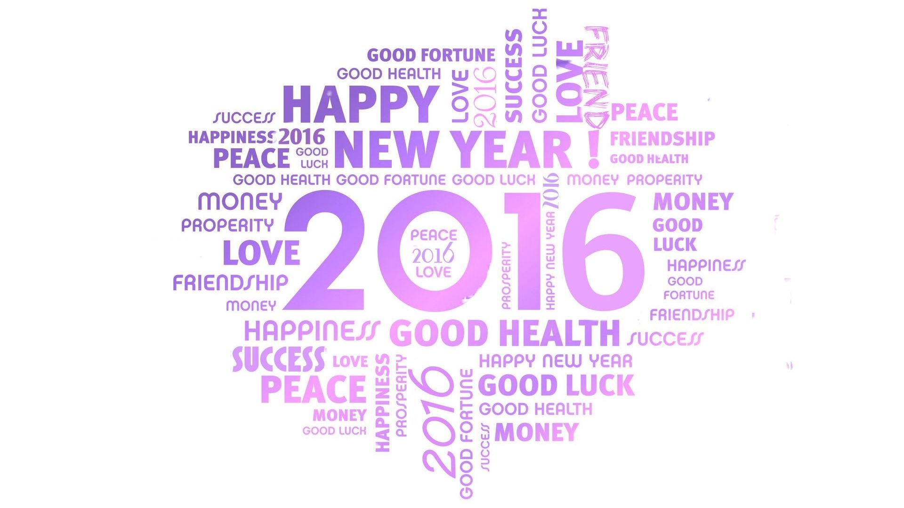

Avec [4 ou 5 articles seulement publiés](/2015/) l'année passée, 2015 a été mon année la moins productive en tant que blogueur (je précise pour mon patron...) pour différentes raisons. Mais j'en ai profité pour faire quelques expériences de référencement et d'activité augmentée sur les réseaux sociaux qui se sont avérées intéressantes et payantes : avec 376000 visiteurs cette année, ce blog se maintient au niveau des années précédentes bien que très peu de contenu y ait été ajouté. Ceci me ravit, car ça vérifie un des objectifs que je m'étais fixés : écrire des articles à longue durée de vie, des articles que l'on trouve comme références lors de recherches sur Google, ou même la Wikipédia.

Merci à vous tous, fans fidèles et visiteurs de passage !

Le succès de "[Dites NON au mouvement perpétuel](/2012/05/27/dites-non-au-mouvement-perpetuel/)" n'arrête pas de me surprendre : avec26300 visiteurs cette année c'est encore et toujours l'article le plus lu de ce blog. En l'écrivant en 2012 je pensais qu'une petite poignée d'illuminés croyaient encore pouvoir faire surgir de l'énergie d'une roue tournant en rond. Je me suis lourdement trompé : les réactions et commentaires à cet article m'ont convaincu que de très nombreuses personnes ne veulent pas croire qu'il existe des limites absolues, même si elles les ont apprises, expérimentées et vérifiées dans les labos de leurs lycées et dans leur vie de tous les jours.

Une proportion non négligeable d'internautes fait plus confiance à YouTube et à des gourous qui promettent de changer le monde à coups de crowdfunding, en invoquant de vastes complots (inter)planétaires pour justifier leurs échecs.Comment attirer du côté clair de la Science ceux qui sont attirés par le côté obscur ? Dans notre société de l'image faut-il voir pour croire ? Alors comment faire pour savoir plutôt que croire ? Plusieurs de mes collègues blogueurs de science ont commencé des chaînes YouTube avec talent et succès,peut-être est-ce la voie à suivre... Mais je m'exprime mal par oral et j'ai une sale tronche en vidéo...

Alors après cette petite phase de crise et d'introspection, c'est décidé : en 2016, plus souvent j'écrirai, des articles plus courts je rédigerai, et  les jeunes padawans dans leur Quête j'aiderai.

## 2016

Avec [784 propriétés recensées dans l'OEIS](https://oeis.org/search?q=2016%2c&fmt=data), 2016 est nettement plus [minéralisé](/2009/04/18/nombres-mineralises/) que ses voisins 2015 et 2017. Beaucoup de propriétés découlent du fait que ce soit un [nombre triangulaire](https://fr.wikipedia.org/wiki/nombre_triangulaire) : \[mathjax\] $$\binom {a} {b}  = 2016$$, qui plus est [hexagonal](https://fr.wikipedia.org/wiki/nombre_hexagonal) et même 24-gonal , mais c'est aussi :

- un nombre dont le carré (4064256) est la somme de 4 nombre premiers consécutifs.  ([A051395](https://oeis.org/A051395)) Trouverez-vous lesquels ?
- la surface d'un triplet pythagoricien ([A073120](https://oeis.org/A073120)) Lequel ?
- un ordre de [groupe non résoluble](https://fr.wikipedia.org/wiki/Groupe résoluble) ([A056866](https://oeis.org/A056866)), et beaucoup d'autres propriétés moins fun.

# Excellente Année 2016 à vous tous !
