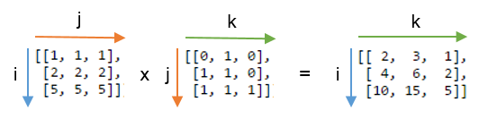



L'autre jour, j'ai rencontré Einstein se promenant incognito dans un bout de code.

J'ai commencé par ne rien comprendre à une ligne de Python trouvée dans un algo de traitement d'image:

norms = np.einsum('ij,ij->i', X, X)

Alors je suis allé voir la doc de la [fonction einsum de NumPy](http://docs.scipy.org/doc/numpy/reference/generated/numpy.einsum.html) à laquelle je n'ai rien compris non plus, sauf que le bout du nez d'Albert commençait à apparaître via une mystérieuse "[convention de sommation d'Einstein](https://fr.wikipedia.org/wiki/convention_de_sommation_d'Einstein)" qui serait "un raccourci de notation utile pour la manipulation des équations concernant des coordonnées".

Par exemple, une simple [multiplication matricielle](https://fr.wikipedia.org/wiki/multiplication_matricielle) de deux matrices A et B s'écrit  \[mathjax\] $$A^i{}_j \times B^j{}_k = C^i{}_k$$ avec la notation d'Einstein, et C=np.einsum('ij,jk->ik', A, B) avec la fonction Python correspondante.

On voit que la chaîne de caractères 'ij,jk->ik' correspond aux indices des lignes et colonnes des matrices qui figurent en indice et "exposant" dans la notation d'Einstein, dans le même ordre que dans la représentation de la multiplication matricielle ci-dessous:

Pour une simple multiplication matricielle on ne voit pas trop l'avantage sur la notation $$A \times B = C$$ , mais ajoutons les 3 règles supplémentaires de la notation d'Einstein appliqués à la fonction einsum (traduit de [[2]](#ref-2))

1. Les indices qui se répètent entre [tableaux](https://fr.wikipedia.org/wiki/Tableau_(structure_de_données)) (qui peuvent avoir N dimensions) signifient que les valeurs selon ces axes doivent être multipliées. Les produits font les valeurs du tableau de sortie. Dans le cas ci-dessus on a utilisé l'indice 'j' une fois pour A et une fois pour B, ce qui signifie qu'on multiplie chaque ligne de A avec chaque colonne de B
2. Une lettre omise dans le résultat signifie que les valeurs le long de cette axe doivent être sommées. Dans le produit matriciel ci-dessus, 'j' ne figure pas dans les indices du tableau de sortie. Cette omission somme le long de cette "troisième direction en réduisant de 1 la dimension du tableau final. Si la signature avait été 'ij,jk->ijk', on aurait obtenu une matrice 3x3x3 des produits, et si on n'avait écrit aucun indice mais gardé la flèche 'ij,jk->', on aurait obtenu la somme de tous les éléments de C
3. On peut obtenir les axes non sommés dans n'importe quel ordre. Si on omet la flèche, einsum arrange les indices qui n'apparaissent qu'une fois dans l'ordre alphabétique, donc on aurait pu écrire juste 'ij,jk' au lieu de 'ij,jk->ik' pour le produit de matrices "normal" ci-dessus. Mais on aurait pu écrire 'ij,jk->ki' si on avait souhaité obtenir la [transposée](https://fr.wikipedia.org/wiki/matrice_transposée) du résultat.

Avec ces astuces, beaucoup (toutes?) les opérations vectorielles, matricielles et sur des tableaux à N dimensions peuvent être effectuées par einsum

| Signature de einsum | équivalent NumPy | Description |
| --- | --- | --- |
| `(A)` | `A` | renvoie le vecteur A |
| `('i->', A)` | `sum(A)` | somme des valeurs du vecteur A |
| `('i,i->i', A, B)` | `A * B` | multiplication des vecteurs A et B élément par élément |
| `('i,i', A, B)` | `inner(A, B)` | [produit scalaire](https://fr.wikipedia.org/wiki/produit_scalaire) de A et B |
| `('i,j', A, B)` | `outer(A, B)` | [produit vectoriel](https://fr.wikipedia.org/wiki/produit_vectoriel) de A et B |
| `('ij', A)` | `A` | renvoie la matrice A |
| `('ji', A)` | `A.T` | transposée de A |
| `('ii->i', A)` | `diag(A)` | diagonale de A |
| `('ii', A)` | `trace(A)` | somme de la diagonale de A |
| `('ij->', A)` | `sum(A)` | somme des valeurs de A |
| `('ij->j', A)` | `sum(A, axis=0)` | somme des colonnes de A |
| `('ij->i', A)` | `sum(A, axis=1)` | somme des lignes de A |
| `('ij,ij->ij', A, B)` | `A * B` | multiplication des matrices A et B élément par élément |
| `('ij,ji->ij', A, B)` | `A * B.T` | multiplication des matrices A et B transposée élément par élément |
| `('ij,jk', A, B)` | `dot(A, B)` | [produit scalaire](https://fr.wikipedia.org/wiki/produit_scalaire) de A et B |
| `('ij,jk->ij', A, B)` | `inner(A, B)` | produit intérieur de A et B |
| `('ij,jk->ijk', A, B)` | `A[:, None] * B` | chaque ligne de A multipliée par B |
| `('ij,kl->ijkl', A, B)` | `A[:, :, None, None] * B` | chaque valeur de A multipliée par B |

Les mathématiciens apprécieront l'élégance de la notation, les physiciens pourront manipuler le [tenseur de Ricci](https://fr.wikipedia.org/wiki/tenseur_de_Ricci) et d'autres objets mathématiques avec plus de facilité, mais en quoi la fonction einsum est-elle utile aux informaticiens ?

D'abord, elle permet d'effectuer en une seule fois des opérations qui auraient nécessité de stocker des matrices intermédiaires sans ça. De plus le code de la fonction einsum peut être fortement [vectorisé](https://fr.wikipedia.org/wiki/Vectorisation_(informatique)) puisqu'il effectue essentiellement des produits puis des sommes sur des vecteurs. Ce n'est en définitive que l'indexation des tableaux qui change en fonction de l'opération désirée, et le tout peut être optimisé dans certains cas en jouant avec la [représentation interne des matrices](https://en.wikipedia.org/wiki/Matrix_representation) et la commutativité des opérations. Grâce à ceci, la plupart des opérations listées dans le tableau ci-dessus sont entre 1 et 4 fois plus rapides avec einsum qu'avec leur équivalent Numpy, jamais plus lentes. Et pour des opérations plus complexes comme le calcul de la [matrice de Fock](https://fr.wikipedia.org/wiki/matrice_de_Fock), l'accélération peut être d'un facteur 10 ou plus [[4]](#ref-4).

Si vous n'avez pas tout suivi, retenez juste ceci:

1. Einstein n'était [pas nul en maths](http://omnilogie.fr/O/Einstein_et_les_math%C3%A9matiques) du tout. Il était un surdoué en maths qui a préféré faire de la physique, mais le fait que sa "convention de sommation" apparaisse dans les langages de programmation un siècle plus tard confirme le génie du bonhomme
2. Que Python est LE langage de programmation scientifique qui s'impose. Oubliez Matlab, qui n'offre même pas de fonction einsum ...

### Références

1.  Åhlander, K. (2002). "Einstein summation for multidimensional arrays", Computers and Mathematics with Applications, 44, 1007–1017.  [doi:10.1016/S0898-1221(02)00210-9](http://dx.doi.org/10.1016/S0898-1221\(02\)00210-9) \[[pdf](http://www.nik.no/2000/Krister.Aahlander.pdf)\]
2. Alex Riley, "[A basic introduction to NumPy's einsum](http://ajcr.net/Basic-guide-to-einsum/)"
3. [Einstein summation](http://mathworld.wolfram.com/EinsteinSummation.html) sur MathWorld
4. [Einsum tutorial](https://github.com/dgasmith/psi4numpy/blob/master/Tutorials/03_einsum/README.md) sur GitHub
5. [Code source en C de la fonction einsum de NumPy](https://github.com/numpy/numpy/blob/master/numpy/core/src/multiarray/einsum.c.src) (pas simple...)
