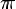
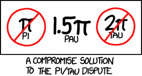



Oui je sais, certains fêtent la [journée de pi](https://fr.wikipedia.org/wiki/journée_de_pi) aujourd'hui, puisque le 14 mars se note 3.14 aux USA. Et comme nous sommes en 2016, c'est même 3.1416 . Et en prime Gilles nous a fait déguster une délicieuse [Nusstorte des Grisons](https://en.wikipedia.org/wiki/Bündner_Nusstorte) bien ronde.

Mais je ne suis pas parvenu à me réjouir pleinement car depuis quelques temps un doute me ronge : et si π était faux ?

C'est ce que suggère un article de 2001, "Pi est faux!" [[1]](#ref-1). Son auteur Bob Palais ne prétend évidemment pas que la valeur de pi soit fausse, mais plutôt que sa définition soit boiteuse et propose d'utiliser plutôt la constante  =2π . Son idée a toutes les apparences d'un canular, mais elle a pourtant été appuyée par une partie de la communauté de mathématiciens, surtout depuis que le bizarre symbole "newpi" a été remplacé par la lettre grecque τ (tau).

Le "Tau manifesto" [[2]](#ref-2) de Michael Hartl donne pas mal de bonnes raisons à l'introduction de τ=2π.

- dans la plupart des équations\*, π apparaît accompagné d'un facteur 2. C'est le cas dans [la loi normale de Gauss et la transformée de Fourier](/2014/03/16/17-equations-qui-ont-change-le-monde/) et beaucoup d'autres [[2]](#ref-2), y compris en physique de la troisième [loi de Képler](https://fr.wikipedia.org/wiki/loi_de_Képler) aux [équations d'Einstein](https://fr.wikipedia.org/wiki/équations_d'Einstein) en passant par la [loi de Coulomb](https://fr.wikipedia.org/wiki/loi_de Coulomb_(électrostatique))
- c'est normal puisque [τ correspond à un tour](https://en.wikipedia.org/wiki/Turn_(geometry)#Tau_proposal), d'où le choix du τ, lettre d'origine du T comme "tour" ou "turn"
- historiquement [[4]](#ref-4), [[5]](#ref-5) on a calculé et utilisé aussi bien τ que π :
    - [Archimède](https://fr.wikipedia.org/wiki/Archimède) détermina que π était proche de 22/7 à l'aide de polygones réguliers inscrits et circonscrits
    - en 1424 le mathématicien perse [Al-Kashi](https://fr.wikipedia.org/wiki/Al-Kashi) a déterminé 16 décimales de τ par une formule en base 60 [[3]](#ref-3)
    - en 1697 le mathématicien écossais [David Gregory](https://fr.wikipedia.org/wiki/David_Gregory) utilisa la lettre π pour définir le périmètre mais définit la constante du cercle comme étant le rapport π/r , où r est le rayon, pas le diamètre...
    - mais en 1706 [William Jones](https://fr.wikipedia.org/wiki/William_Jones_(mathématicien)) utilisa le symbole π comme rapport du périmètre au diamètre, et [Euler](https://fr.wikipedia.org/wiki/Euler) réutilisa cette notation dans son traité de 1737 qui fit autorité, jusqu'à aujourd'hui
- car enfin, pourquoi considérer le diamètre d'un cercle alors que toutes les équations usuelles du [cercle](https://fr.wikipedia.org/wiki/cercle), du [cylindre](https://fr.wikipedia.org/wiki/cylindre) du [cône de révolution](https://fr.wikipedia.org/wiki/cône_(géométrie)) et de la [sphère](https://fr.wikipedia.org/wiki/sphère) utilisent le rayon ?

Les mathématiques étant une science vivante, peut-être bien que les tau-istes l'emporteront à la longue sur les pi-istes. En attendant, saluons la tentative de compromis de XKCD proposant la constante pau. Hélas sa valeur (4.71238898038468985769...) n'est pas très propice aux anniversaires à deux décimales. Je préfère donc fêter le [Tau Day](http://tauday.com/) le 28 juin avec une deuxième Nusstorte !

### Notes:

\* exercice : trouvez des contre-exemples de formules dans lesquelles pi n'est pas multiplié par un nombre pair

### Références:

1. [Bob Palais](http://www.math.utah.edu/~palais), “[π is wrong!](http://www.math.utah.edu/~palais/pi.pdf)”, 2001, The Mathematical Intelligencer, Volume 23, Number 3, 2001, pp. 7-8. [DOI 10.1007/BF03026846](http://doi.org/10.1007/BF03026846)
    
2. Michael Hartl "[Tau manifesto](http://tauday.com/tau-manifesto)", 26 juin 2010
3. Peter Harremoës "[Al-Kashi’s constant τ](http://www.harremoes.dk/Peter/Undervis/Turnpage/Turnpage1.html)", 2012
    
4. "[à la recherche de π](http://neamar.fr/Res/Histoire_Pi/)" sur le site de Neamar
    
5. 
