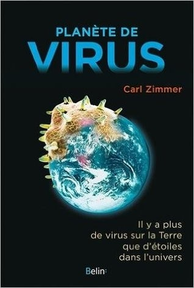

 Dévoré un excellent livre : "Planète de virus" de [Carl Zimmer](https://en.wikipedia.org/wiki/Carl_Zimmer)[[1]](#ref-1). En 113 pages qui se lisent comme un roman, on apprend une multitude de choses sur les [virus](https://fr.wikipedia.org/wiki/virus), bestioles, microbes, êtres  vivants, choses inconnues il y a un siècle et qui se révèlent aujourd'hui être les formes de vie bouts d'ADN les plus abondants dans la nature.

C'est le problème avec les virus : les scientifiques ne sont pas encore d'accord pour dire s'ils sont vivants ou pas, si ce sont des parasites des bactéries et cellules, ou leurs précurseurs (genre [mimivirus](https://fr.wikipedia.org/wiki/mimivirus)), voire un de leurs constituants via les [retrovirus endogènes](https://fr.wikipedia.org/wiki/retrovirus_endogène),

Ces sujets sont traités en marge de chapitres dévolus principalement aux virus affectant l'homme [rhinovirus](https://fr.wikipedia.org/wiki/rhinovirus), [grippe](https://fr.wikipedia.org/wiki/grippe), [papillomavirus](https://fr.wikipedia.org/wiki/papillomavirus), [VIH](https://fr.wikipedia.org/wiki/VIH), [variole](https://fr.wikipedia.org/wiki/variole) etc. J'y ai découvert une multitude de choses passionnantes, mais pour ne pas trop spoiler je ne ressortirai ici que deux passages, destinés aux antivax qui passeraient par ici:

> Ne sous-estimez jamais la créativité d'un virus qui peut transformer des lapins en [jackalopes](https://fr.wikipedia.org/wiki/jackalope) et des [hommes en arbres](http://www.maxisciences.com/peau/l-039-effrayante-maladie-de-l-039-homme-arbre-dont-la-peau-se-change-en-039-039-ecorce-039-039_art34058.html)

> Entre 1400 et 1800, on estime que la [variole](https://fr.wikipedia.org/wiki/variole) a tué cinq cent millions de personnes par siècle, rien qu'en Europe. (...) La variole se répandait comme une traînée de poudre, mais la progression fut rapidement stoppée par la vaccination, et elle finit par s'éteindre. Epidémie après épidémie le virus recula jusqu'à ce qu'un dernier cas soit enregistré en Ethiopie en 1977. Le monde était désormais libéré de la variole.

Dans le même ordre d'idées, le chapitre sur les virus [bactériophages](https://fr.wikipedia.org/wiki/bactériophage) laisse espérer de nouveaux moyens de lutte contre les bactéries, notamment celles qui deviennent résistantes aux antibiotiques.

Le chapitre sur les virus marins et leur stupéfiante abondance ("il y a plus de virus sur Terre que d'étoiles dans l'univers") m'a fait repenser à une phrase de [Richard Dawkins](https://fr.wikipedia.org/wiki/Richard_Dawkins)\* qui disait en substance "la vie est ce que l'ADN a inventé pour pouvoir se répliquer au maximum". La lecture de ce livre me conforte dans l'idée qu'il pourrait y avoir du vrai dans cette "[inversion de la pensée](http://drgoulu.local/2009/03/25/pourquoi-on-aime-le-joli-le-sexy-le-sucre-et-le-drole)" ...

Ce livre est un excellent livre de vulgarisation, un modèle du genre. Il me semble accessible à un très large public, sans nécessiter de connaissances scientifiques particulières. Carl Zimmer donne les clés nécessaires au moment utile et évite de noyer le lecteur dans trop de détails. Mais le curieux trouvera 6 pages de références scientifiques en fin d'ouvrage.

Qui plus est "Planète de virus" a été parfaitement traduit en français par [Alan Vonlanthen](http://alan.vonlanthen.org/) et [Karim Madjer](http://sweetrandomscience.blogspot.ch/), membres émérites du Café des Sciences et fondateurs de [Big Bang Science](http://www.bigbangscience.fr/fr), et est paru chez Belin dans une nouvelle collection "[Science à plumes](https://www.facebook.com/Scienceaplumes)" lancée par [Laurent Brasier](http://headbangingscience.fr/), un autre collègue Cafetier.

Foncez l'acheter chez votre libraire préféré, il vaut largement son prix. (Et merci à Alan et Karim pour l'exemplaire dédicacé ! )

Note \* : précisé le 29.3 suite au commentaire de Thierry Caminel

### Références

1. \[openbook booknumber="ISBN:9782701197678" templatenumber="5"\]
2. [interview de Carl Zimmer sur PodcastScience.fm](http://www.podcastscience.fm/dossiers/2016/03/10/carl-zimmer-planet-of-viruses-in-english/) (en anglais)
