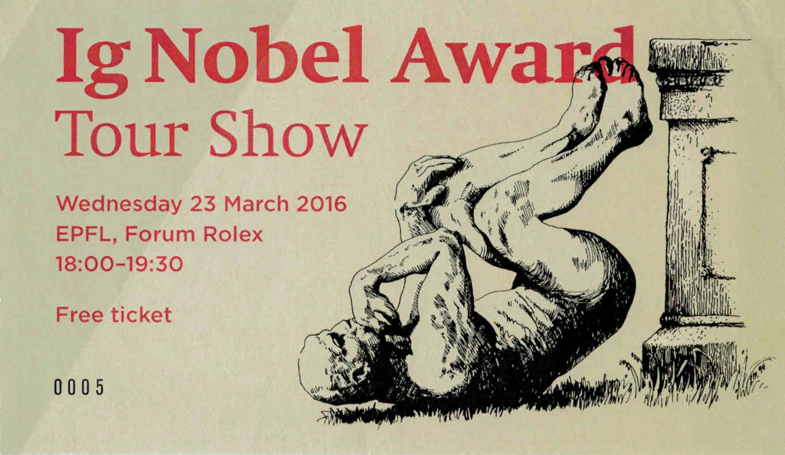
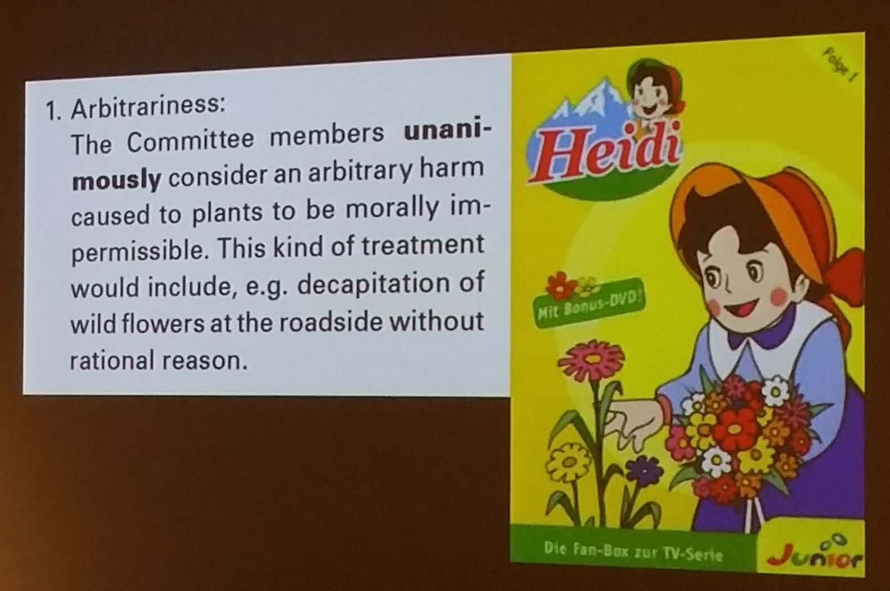

Comme certains ne connaissent pas encore les fameux [Prix Ig Nobel](https://fr.wikipedia.org/wiki/Prix_Ig_Nobel), leur fondateur [Marc Abrahams](https://en.wikipedia.org/wiki/Marc_Abrahams) parcourt le monde pour présenter cette institution. J'ai ainsi eu la chance d'assister au "Ig Nobel Award Tour Show" organisé à l'EPFL il y a quelques semaines, et ce fut un grand moment de science poilante.

Le "Show" se déroule en deux temps. D'abord, Marc Abrahams explique le but des prix:

> Récompenser la recherche qui fait rire, puis réfléchir

Puis il en décrit le mécanisme de sélection, d'attribution et la célèbre cérémonie d'attribution des prix à Harward, à laquelle je donnerais cher pour assister. En attendant, la dernière est en [vidéo ici](https://www.youtube.com/watch?v=MqVCl2VoZqU). Excellent communicateur et pince-sans-rire, Marc Abrahams illustre son propos avec de nombreux exemples et documents hilarants, le tout dans un anglais parfaitement compréhensible. Cette partie de la soirée ressemble beaucoup à sa conférence au TED visible en [video ici](https://www.youtube.com/watch?v=FFG2rilqT2g).

 

Dans un deuxième temps, des lauréats Ig Nobel des années précédentes viennent présenter leurs travaux primés. Nous avons eu droit à 3 présentations:

1. Emily Baird de l'Université de Lund nous a expliqué comment elle a déterminé que "Le [bousier](https://fr.wikipedia.org/wiki/bousier) utilise la Voie lactée pour s’orienter" [[1]](#ref-1), ce qui lui a valu le Prix 2013 de biologie et astronomie. En fait, son équipe a démontré que ce scarabée ne se repère pas sur le paysage environnant pour s'éloigner en ligne droite d'une bouse bien fumante avec une petite boule d'appétissant fumier, mais qu'il garde un angle constant par rapport à la source lumineuse la plus intense : Soleil le jour, Lune la nuit, ou à défaut, la Voie Lactée, bien lumineuse dans les nuits des savanes d'Afrique australe.
2. Ensuite Elisabeth Oberzaucher de l'Université de Vienne, lauréate du Prix 2015 de mathématiques a calculé "Comment [Moulay Ismaïl ben Chérif](https://fr.wikipedia.org/wiki/Moulay_Ismaïl_ben Chérif), sultan du Maroc, a pu engendrer 888 enfants ?" [[2]](#ref-2) Bon, un harem de 500 femmes ça aide, mais malgré ça, compte tenu du caractère assez aléatoire de la fertilité féminine, ce sultan par ailleurs peu recommandable a du donner de sa personne...
3. Enfin Stephan Bolliger de l'Université de Zurich a répondu à la question "Est-il préférable de se faire fracasser la tête avec une bouteille de bière pleine ou vide ?" [[3]](#ref-3) qui lui a valu le Prix 2009 de la paix. D'après les tests effectués, les deux cas sont susceptibles de provoquer une fracture du crane, mais il faut une force plus grande pour casser une bouteille vide que pleine...

Avec ce dernier prix mon beau pays a remporté le prix IgNobel de la paix deux années de suite, car en 2008 notre Commission d'Ethique Fédérale avait déjà été récompensée pour un document officiel sur la dignité des plantes. Le petit intermède où Marc Abrahams a félicité un à un tous les citoyens helvétiques de l'assistance co-récipiendaires du prix était illustré par ce splendide slide citant un extrait du rapport primé [[4]](#ref-4):

Excellente soirée donc, je vous recommande vivement d'assister à un "IgNobel Award Tour Show" près de chez vous (ou d'en organiser un...). On commence par beaucoup rigoler, mais on réfléchit aussi.

### References

(Pour mémoire, je contribue à maintenir une liste des publications récompensées par un prix [IgNobel sur Mendeley](https://www.mendeley.com/groups/1459873/ig-noble/papers/) )

1. M. Dacke, E. Baird, M. Byrne, C. H. Scholtz, and E. J. Warrant, “Dung beetles use the Milky Way for orientation” Curr. Biol., vol. 23, no. 4, pp. 298–300, Feb. 2013. [doi:10.1016/j.cub.2012.12.034](http://dx.doi.org/10.1016/j.cub.2012.12.034)
2. E. Oberzaucher and K. Grammer, “The Case of Moulay Ismael - Fact or Fancy?,” PLoS One, vol. 9, no. 2, p. e85292, Feb. 2014. [doi:10.1371/journal.pone.0085292](http://dx.doi.org/10.1371/journal.pone.0085292)
3. S. A. Bolliger, S. Ross, L. Oesterhelweg, M. J. Thali, and B. P. Kneubuehl, “Are full or empty beer bottles sturdier and does their fracture-threshold suffice to break the human skull?,” J. Forensic Leg. Med., vol. 16, no. 3, pp. 138–42, Apr. 2009. [DOI:10.1016/j.jflm.2008.07.013](http://dx.doi.org/10.1016/j.jflm.2008.07.013)
4. Federal Ethics Committee on Non-Human Biotechnology (ECNH) "[The dignity of living beings with regard to plants](http://www.ekah.admin.ch/fileadmin/ekah-dateien/dokumentation/publikationen/e-Broschure-Wurde-Pflanze-2008.pdf)”, 2008 Bern, Switzerland
