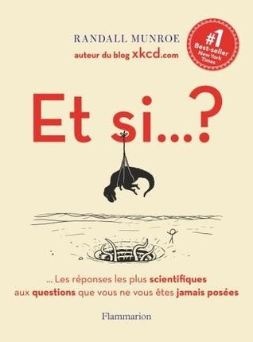

 

Je suis un fan absolu de [xkcd.com](http://xkcd.com/). [Randall Munroe](https://fr.wikipedia.org/wiki/Randall_Munroe) est connu de toute la blogosphère pour ses petits cartoons scientifiques dont certains sont devenus cultes\* et d'autres sont des merveilles de vulgarisation scientifique, comme [celui que j'ai utilisé dans cet article](http://drgoulu.local/2012/09/05/un-petit-pas-pour-lhomme/) par exemple. Randall est aussi un infatigable artiste comme le prouve ["Time", sa séquence de 3101 dessins](http://geekwagon.net/projects/xkcd1190/) faits main. Tous ses dessins étant publiés gratuitement sous licence CC-BY-NC, Randall vit de l'écriture de bouquins qui font un tabac outre-Atlantique, et qui vont faire un tabac ici puisqu'ils commencent à être traduits.

J'ai dévoré "Et si... ?" [[1]](#ref-1). C'est un bouquin prodigieusement drôle et instructif. De la vraie bonne vulgarisation pour grands et petits de tous les niveaux. Dans ce livre Randall répond aux questions de lecteurs les plus absurdes en initiant subrepticement le lecteur à plusieurs outils utilisés dans l'analyse scientifique : les ordres de grandeur, [savoir négliger](http://drgoulu.local/2008/05/28/lingenieur-est-un-type-qui-sait-ce-quil-peut-negliger/), le raisonnement par l'absurde, l'extrapolation.

J'ai particulièrement apprécié son talent à identifier un problème intéressant dans une question stupide. Par exemple en répondant à la sempiternelle question "si tous les humains se réunissaient en un endroit et sautaient sur place ensemble, est-ce que la Terre bougerait ou est-ce que ça causerait un tremblement de Terre", Randall étudie plutôt ce qui se passerait si tous les humains se réunissaient en un endroit, au hasard New-York. Il montre que beaucoup mourraient de faim car il n'est pas possible d'approvisionner une telle foule avec les moyens actuels, ni même de disperser cette foule assez vite avec tous les moyens de transports disponibles.

Randall fait aussi très peu usage de l'analogie, une technique à la fois facile et dangereuse en vulgarisation scientifique. Je n'en ai repéré qu'une, basée sur cette jolie histoire:

> Loin dans le grand Nord, dans le pays nommé Svithjod, il y a un rocher. C’est un rocher qui fait cent miles de haut et cent miles de large. Une fois tous les mille ans, un petit oiseau se pose sur le rocher pour aiguiser son bec. Lorsque le rocher a ainsi totalement été usé, c’est une seule journée de l’éternité qui s’est écoulée. (_The Story Of Mankind_,  Hendrik Van Loon, 1922 [[2]](#ref-2))

Un [calcul fait aussi ici](http://couleur-science.eu/?d=2014/02/23/22/22/55-lhistoire-du-petit-oiseau-de-svithjod-combien-de-temps-dure-leternite) montre qu'une telle éternité, c'est très long, mais moins long que le temps qu'il faudra pour générer tous les messages Twitter possibles. Étonnant, parlant, et fort à propos puisque Twitter est un petit oiseau...

Pour ma part j'ai beaucoup rigolé et appris plusieurs choses, entre autres le fonctionnement de l'[amatoxine](https://fr.wikipedia.org/wiki/amatoxine) des amanites et le fait que l'objet construit ayant atteint la vitesse la plus élevée est probablement une plaque en fonte qui bouchait le puits d'accès lors d'un essai nucléaire souterrain...

C'est peut-être le seul reproche que je ferais à "Et si...?". Il y a beaucoup de "science hollywoodienne", avec catastrophes thermonucléaires, voitures propulsées par des mitrailleuses lourdes et épidémies décimant l'humanité. Mais comme le résultat est suffisamment addictif pour amener un large public vers la réflexion scientifique, je peux pardonner ce côté cow-boy et recommander cet excellent livre sans réserve.

Note \* si vous avez Python sur votre ordinateur, faites "import antigravity" pour une surprise !

### Références

1. \[openbook booknumber="ISBN:9782081343016" templatenumber="5"\]
2. \[openbook booknumber="OLID:OL7117659M" templatenumber="5"\]
