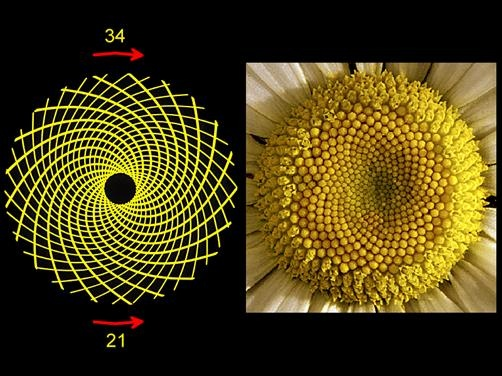
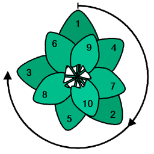

Le [nombre d'or](w:) ou "divine proportion"représente parait-il le rapport le plus esthétiquement parfait que l'on puisse trouver dans la nature, dans les monuments antiques, les œuvres d'art célèbres ou un simple rectangle. Alors dites : lequel de ces rectangles vous parait-il le mieux proportionné ?

Si vous avez répondu 5, vous avez la même préférence que les 34% des participants à un sondage identique [[1]](#ref-1), mais ce n'est pas un rectangle d'or. Le rectangle d'or, c'est le 2, choisi par 18% des gens, mais aussi le 9, choisi par 5%, soit nettement moins que les 11% de moyenne. Autrement dit : vous n'êtes statistiquement pas foutus de trouver du divin dans un rectangle...

Ce fameux "nombre d'or" Φ est défini historiquement comme le rapport de deux nombres a et b satisfaisant l'équation $a/b = (a+b)/a$. La solution est $\phi = a/b = (1+\sqrt{5})/2$ soit approximativement 1.6180339887. Et ça c'est approximativement, parce qu'avec seulement 6 décimales, 1.618034 peut déjà être pas mal d'autres choses selon le génial [inverseur de Plouffe](w:) [qui est ici](http://isc.carma.newcastle.edu.au/advanced). Par exemple :

- $$7^{1/3}-6^{3/4}/13$$
- $$3/18541$$
- $$Re((20+5i)^{13/14})$$
- $$Im((4-24i)^{1/11})$$
- [BesselJ](http://mathworld.wolfram.com/BesselFunctionoftheFirstKind.html)(2,23/19)
- et d'autres nombres encore

Et avec seulement 4 décimales, 1.6180 correspond à l'arrondi de dizaines, voire de centaines d'expressions répertoriées dans l'inverseur, dont [un petit extrait peut être vu ici](/wp-content/uploads/2016/04/2016-04-04_221513.png).

Bref, quand quelqu'un vous dit que le nombre d'or est présent dans une construction antérieure à Euclide (300 avant JC), ou une structure "naturelle", il faut qu'il le prouve par des mesures précises au millionième pour obtenir 6 ou 7 décimales, parce que 1.62 c'est plus proche de 6/37037 que je trouve très beau aussi, voire divin. Ou de 9/55555, nombre si magnifique que je m'empresse de le baptiser "nombre de platine" pour la postérité.



Ou alors il faut prouver que la construction géométrique ou mathématique de l'oeuvre aboutit bien à $\\phi=(1+\\sqrt{5})/2$ . Par exemple dans le célèbre [homme de Vitruve](w:) de Léonard de Vinci, comme chacun sait. Sauf que non. De Vinci ne fait nulle part référence au nombre d'or ni dans son texte explicatif de la figure, ni dans sa construction géométrique. Les proportions que Vinci utilise sont celles conseillées par l'architecte romain [Vitruve](w:) 1/10, 1/4, 1/8 et 1/6 . Il faut bien chercher pour trouver un quasi nombre d'or dans cette oeuvre. Le plus proche est celui entre la hauteur du corps (482 pixels sur l'image) et la distance entre le nombril et la plante des pieds (294 pixels), qui donne environ 1.639 [[1]](#ref-1). Même pas 2 décimales exactes et pas de construction géométrique : ce n'est pas le nombre d'or, désolé. Ni celui de platine, grande tristesse... Alors je désigne en vitesse la proportion 294/482 "nombre de [scandium](http://www.journaldunet.com/economie/industrie/metal-le-plus-cher.shtml)" et voilà : Léonard de Vinci connaissait le nombre de scandium 500 ans avant vous et moi. Wow !

En fait il n'y a que deux manières simples de tomber pile sur le nombre d'or:

1. 
    
    calculer ou construire explicitement deux nombres a et b tels que $a/b = (a+b)/a = (1+\\sqrt{5})/2$. Par exemple dans la construction ci-contre, où l'on part d'un triangle rectangle ABC dont le côté AC est la moitié du côté AB et que l'on reporte l’hypoténuse en prolongement du côté AC, on forme un "rectangle d'or" dont les côtés a=AD et b=AB sont tels que a/b=Φ. En passant, les [formats de papier](w:) A3, A4, A5 etc ne sont pas des rectangles d'or. Les côtés du papier a et b sont définis de manière à ce que le rapport soit préservé si on coupe ou plie la feuille en deux. On a donc $a/b = 2b/a = \\sqrt{2} = 1.4142135624$ qui est très différent de Φ.
2. 
    
    A partir de la [suite de Fibonacci](w:), suite dans laquelle chaque terme est la somme des deux précédents : 0, 1, 1, 2, 3, 5, 8, 13, 21, 34 etc ([A000045](https://oeis.org/A000045 "oeis:A000045")). Il se trouve que le rapport entre deux nombres consécutifs de la suite converge vers $\\phi : \\lim\_{n \\to \\infty} \\frac{\\mathcal F\_{n}}{\\mathcal F\_{n-1}} = \\phi$. On voit donc qu'en juxtaposant des carrés dont les côtés correspondent à la suite de Fibonacci comme ci-contre, le rapport des cotés du rectangle va converger vers Φ au fur et à mesure qu'on ajoute des carrés.

Voilà les deux constructions mathématiques simples qui conduisent au nombre d'or. Aucune des deux ne correspond à un phénomène naturel à ma connaissance.



Certains ont pourtant vu le nombre d'or dans des spirales comme celle de la coquille du [nautile](w:Nautilus_(mollusque)). Effectivement, en traçant des quart de cercles dans chaque carré de Fibonacci on dessine la "[spirale d'or](w:)" qui est très proche d'une [spirale logarithmique](w:) d'équation $r = a.e^{b\\theta}$ particulière, celle obtenue pour $b=3\\phi+2$. Mais il existe une infinité de spirales logarithmiques avec des paramètre b différents, et certaines se retrouvent dans la nature car elles résultent d'équations différentielles assez simples. C'est le cas de la coquille du nautile, mais son b est nettement inférieur à 3Φ+2, donc non, la coquille du nautile n'a rien à voir avec le nombre d'or [[3]](#ref-3).

Et puis il y a la [phyllotaxie](w:) : des graines de tournesol aux pommes de pin, beaucoup de structures botaniques croissent en faisant de jolies spirales apparentes, les "parastiches". Certaines tournent dans un sens et s'entrecroisent avec d'autres orientées en sens inverse, et Ô stupeur, le nombre de parastiches dans chaque sens correspond toujours à deux termes consécutifs de la suite de Fibonacci.

Et le rapport entre deux termes de la suite de Fibonacci étant "proche" de Φ. 34/21= 1.619047... pour la marguerite ci-dessus. Serait-ce la Signature du Grand Architecte de Toutes Choses ?

Non, c'est juste le résultat d'une optimisation. Ces structures sont issues d'un [apex végétal](w:) qui produit des feuilles, pétales, graines etc. à intervalles réguliers. Pour maximiser l'efficacité de la plante, il faut que chaque organe accède au maximum de lumière en faisant le moins d'ombre possible aux autres, et pour cela il faut qu'il s'éloigne du centre dans une direction différente des précédents, et ceci, étonnamment, forme les parastiches spiraux. Deux chercheurs français, Stéphane Douady et Yves Coudert ont montré en 1992 qu'il n'y a pas besoin d'un organisme vivant pour produire de telles structures. Ils ont généré des gouttes d'un [ferrofluide](w:) à intervalles réguliers au centre d'une plaque soumise à un champ magnéique radial. Les gouttes se repoussent mutuellement et lorsque'elles sont produites à une cadence assez élevée, elles forment des "parastiches" spiraux :



Evidemment les matheux se sont aussi attaqués au problème. En 1907 déjà, un dénommé [Gerrit van Iterson](w:en) a montré que l’optimum était atteint lorsque chaque graine (ou pétale ou feuille etc...) s'éloignait de la précédente selon un "[angle d'or](w:)" de $\\frac{2 \\pi}{\\phi+1}=137.5^{\\circ}$ environ, et que la structure formait bien des parastiches dont le nombre dans chaque sens correspond à deux termes consécutifs de la suite de Fibonacci. Joli. Très joli, même.



Alors quand Tâniel m'a parlé de son bouquin sur le nombre d'or dans les nids d'abeilles [[5]](#ref-5) j'étais un peu méfiant mais pas fondamentalement sceptique a priori. Les abeilles sont d'excellentes optimisatrices, on sait que leurs rayons d'[alvéoles](w:alvéole_d'abeille) hexagonales à fond rhombique (3 losanges) permet de minimiser la cire utilisée pour produire un maximum d'alvéoles de petit diamètre [[6]](#ref-6), [[7]](#ref-7)

Sauf que pas tout à fait. En 1964, [László Fejes Tóth](w:) a montré qu'il existait une forme de fond d'alvéole qui permettrait aux abeilles d'économiser 0.35% de cire. Peut-être la trouveront-elles aussi après quelques millions d'années d'évolution. En attendant, ni le nombre d'or ni l'angle d'or n'apparaissent dans la [géométrie](w:Alvéole_d'abeille#Calcul_des_angles) des alvéoles, car on n'y trouve ni pentagone, ni nombres de Fibonacci, ni rien qui ressemble à un apex.

Donc la "découverte" que les nids d'abeilles elliptiques s'inscrivent dans un cadre rectangulaire dont le rapport vaut 1.6±0.4 me semble plus probablement due à une "loi inhérente du Cosmos" comme la résistance des matériaux qu'à un nombre d'or vachement moins universel que e, pi, ou [1548](/2008/08/24/nombres-acratopeges/), désolé...

### Références

1. Cyril Jaquier, Kévin Drapel "[Le nombre d’or : réalité ou interprétations douteuses ?](/wp-content/uploads/2016/04/nombredor.pdf)" Projet STS EPFL, 25 avril 2005
2. Jean-Paul Krivine "[Le mythe du nombre d’or](http://www.pseudo-sciences.org/spip.php?article796)", SPS n° 278, août 2007
3. Christiane Rousseau, "[Nautile, nombre d’or et spirale dorée](http://accromath.uqam.ca/accro/wp-content/uploads/2013/04/nautile.pdf)", 2008, Accromath, Vol 3, p.8-11
4. S. Douady et Y. Couder, La physique des spirales végétales, La Recherche, janvier 1993, p. 26
5. Daniel Favre "[Golden ratio in the elliptical honeycomb](http://www.blurb.fr/b/6940163-golden-ratio-in-the-elliptical-honeycomb)", 2016, Blurb
6. Philip Ball "[Why Nature Prefers Hexagons](http://nautil.us/issue/35/boundaries/why-nature-prefers-hexagons)", 2016 April 7 sur Nautilus
7. Alain Satabin "[L'âme de géomètre des abeilles](http://www.pourlascience.fr/ewb_pages/a/article-l-ame-de-geometre-des-abeilles-22316.php)", 2004, Dossier Pour la Science, N°44
