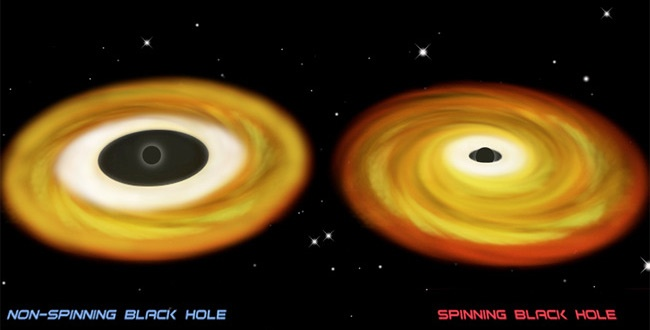



Les trous noirs sont des objets extrêmement déroutants\*. La plupart des explications "grand public" qui leur sont consacrés, y compris [la mienne](http://kidiscience.cafe-sciences.org/articles/tout-savoir-sur-les-trous-noirs/), se limitent à décrire un modèle de trou noir très simplifié : le [trou noir de Schwarzschild](https://fr.wikipedia.org/wiki/trou_noir_de_Schwarzschild), qui ne tourne pas sur lui-même. Un tel trou noir a un [horizon des événements](https://fr.wikipedia.org/wiki/horizon_des_événements) sphérique d'où aucun rayonnement ne peut sortir, et près duquel la lumière est très fortement déviée.

Le trou noir d'[Interstellar](/2014/11/29/interstellar/) est aussi un "Schwarzschild", même si [Kip Thorne](https://fr.wikipedia.org/wiki/Kip_Thorne) lui a ajouté un [disque d'accrétion](https://fr.wikipedia.org/wiki/disque_d'accrétion) de matière en orbite (dont la production a honteusement sabré une bonne partie du réalisme [[1]](#ref-1))

Les trous noirs de Schwarzschild sont virtuellement très beaux, mais en raison du théorème de la patineuse, ils n'existent probablement pas. Quand une étoile en fin de vie s'effondre, son diamètre se réduit énormément, beaucoup plus qu'une patineuse qui ramène ses bras lors d'une pirouette, et en vertu de la conservation du [moment cinétique](https://fr.wikipedia.org/wiki/moment_cinétique), sa vitesse de rotation accélère énormément. Même si la [rotation des étoiles](https://fr.wikipedia.org/wiki/rotation_stellaire) peut être très lente (le [Soleil](https://fr.wikipedia.org/wiki/Soleil) tourne sur lui même en 27 jours), après effondrement [les étoiles à neutrons tournent extraordinairement vite](/2010/05/16/etoiles_a_neutrons/), parfois à plus de 100 tours par seconde !

Pour les trous noirs stellaires, souvent plus petits que les étoiles à neutrons, la rotation pourrait être plus élevée encore, des milliers de tours par seconde ! Or dans l'[équation d'Einstein](https://fr.wikipedia.org/wiki/équation_d'Einstein), ils se passe des choses étranges quand les objets massifs tournent : ils "enroulent l'espace" autour d'eux. Ca s'appelle l'[effet Lense-Thirring](https://fr.wikipedia.org/wiki/effet_Lense-Thirring) et ça été mesuré expérimentalement autour de la Terre par le satellite [Gravity Probe B](https://fr.wikipedia.org/wiki/Gravity_Probe_B), dont j'ai parlé dans [un article sur les gyroscopes](/2010/04/09/gyroscopes-dhier-et-de-demain/). Autour de la Terre l'effet est minuscule mais autour d'une masse de dizaines de soleils tournant en quelques millisecondes, il est colossal.

Depuis 2012 [Alain Riazuelo](https://fr.wikipedia.org/wiki/Alain_Riazuelo) a incorporé cet effet a ses simulations [[2]](#ref-2), et c'est aussi joli qu'étonnant:



Si Kip Thorne et l'équipe du film l'avaient vraiment voulu, ils auraient pu intégrer ce travail à "Interstellar" pour un trou noir encore plus réaliste. Mais ils n'ont pas voulu... Peut-être pour "Interstellar 2" ?

Le modèle relativiste d'un trou noir en rotation s'appelle le [Trou noir de Kerr](https://fr.wikipedia.org/wiki/Trou_noir_de_Kerr), et il apporte son lot d'étrangetés par rapport au trou noir de Schwarzschild. Par exemple dans l'[ergosphère](https://fr.wikipedia.org/wiki/ergosphère), l'espace s'enroule autour du trou noir si vite que même la lumière ne peut "remonter le courant". Ou encore, il semblerait que l'existence de deux [horizons des événements](https://fr.wikipedia.org/wiki/horizon_des_événement) au lieu d'un seul permette d'imaginer des voyages dans des univers parallèles [[3]](#ref-3), mais ma maîtrise du [diagramme de Penrose](https://fr.wikipedia.org/wiki/diagramme_de_Penrose) ne me permet pas de parler valablement de ceci pour l'instant.

Mais j'ai tout de même compris quelque chose : si un trou noir de Kerr tourne trop vite, ses horizons devraient s'aplatir au point de laisser sa singularité apparaître "[toute nue](https://fr.wikipedia.org/wiki/singularité_nue)" dans l'espace "normal". Et ça c'est interdit. Du moins on pense que ça l'est : [Roger Penrose](https://fr.wikipedia.org/wiki/Roger_Penrose) a conjecturé que l'Univers n'autorise pas les [singularités nues](https://fr.wikipedia.org/wiki/singularité_nue) et baptisé ceci très logiquement "[censure cosmique](https://fr.wikipedia.org/wiki/censure_cosmique)".

Si la censure cosmique est vraie, alors il existe une limite à la vitesse de rotation d'un trou noir, plus exactement son [moment cinétique](https://fr.wikipedia.org/wiki/moment_cinétique) ne doit pas dépasser M2G/c . Si on intègre cette contrainte dans les simulations, on s'aperçoit qu'un trou noir éjecte de la matière lors de sa formation pour ne pas dépasser cette limite, et qu'il refuse obstinément d'absorber de la matière qui augmenterait son moment cinétique. Je n'ai pas trouvé par quel mécanisme, mais si c'était en [émettant des jets](/2008/05/03/le-jets-des-trous-noirs/), ceci expliquerait cela ...

Mais qu'en est il en réalité ? Si on découvre un trou noir dépassant la limite, on pourrait peut être observer sa singularité un jour ! Et si on n'en trouve aucun, mais beaucoup proches de la limite, c'est que la [censure cosmique](https://fr.wikipedia.org/wiki/censure_cosmique) est vraie...

Yapluka mesurer la vitesse de rotation d'un tout petit objet totalement invisible à des centaines, milliers, voire millions d'années lumière de distance. Et à ma grande surprise, on sait faire ça ! [[4]](#ref-4) On utilise le fait que le bord interne du disque d'accrétion est d'autant plus proche de l'horizon du trou noir que celui-ci tourne vite.

Et on peut mesurer le diamètre du bord intérieur par plusieurs méthodes dont la "fluorescence du fer" : excités par les rayons X du disque ultra chaud, les atomes de fer présents dans le disque émettent une raie à 6.4 keV dont on observe l'étalement du spectre du à l'effet Doppler, d'où on peut tirer le diamètre intérieur du disque.

C'est comme ça qu'en 2006, on a démontré que le trou noir stellaire [GRS 1915+105](https://fr.wikipedia.org/wiki/GRS_1915+105) situé à 35900 années lumière tourne à plus de 1100 tours par seconde (wow!) ce qui correspond à 98% de la limite de censure cosmique

Plus récemment, c'est le [trou noir supermassif](https://fr.wikipedia.org/wiki/trou_noir_supermassif) au centre de la galaxie [NGC 1365](https://fr.wikipedia.org/wiki/NGC_1365) qui a été mesuré à sa limite de vitesse également [[6]](#ref-6), [[7]](#ref-7). Comme ce monstre pèse 2 millions de masses solaires, ce n'est pas sa vitesse angulaire qui impressionne, mais peut-être plus la vitesse tangentielle de son horizon : 84% de la vitesse de la lumière !

Comme le dit Fraser Cain à la fin de son article [[6]](#ref-6), l'Univers est vraiment un endroit fou. J'ajouterais qu'il est très probablement pudique.

Notes: \* je pensais évidemment écrire "troublants" mais j'ai eu honte... \*\* cet article a été motivé par [cette conférence](https://mediaserver.unige.ch/play/89366) de [Jean-Pierre Luminet](https://fr.wikipedia.org/wiki/Jean-Pierre_Luminet) à laquelle j'ai assisté l'an passé, suite à laquelle j'ai échangé quelques mails avec Alain Riazuelo.

### Références

1. Robbie Gonzales "[The Truth Behind _Interstellar_'s "Scientifically Accurate" Black Hole](http://io9.gizmodo.com/the-truth-behind-interstellars-scientifically-accurate-1686120318)", 2015, io9
    
2. Alain Riazuelo  "[Some aspects of circular prograde orbits in an extreme Kerr metric](http://www2.iap.fr/users/riazuelo/bh/kip/prograde.php)", 2012
3. N. Rumiano "A l'intérieur d'un trou noir" ([part 1](http://nrumiano.free.fr/Fetoiles/int_noir.html) et [part2](http://nrumiano.free.fr/Fetoiles/int_noir2.html))
4. [How to measure black hole spin?](http://stronggravity.eu/how-to-measure-black-hole-spin/)" sur Strong Gravity
5. E. H. Morgan, R. A. Remillard & J. Greiner, "[RXTE Observations of QPOs in the Black Hole Candidate GRS 1915+105](http://citeseerx.ist.psu.edu/viewdoc/download?doi=10.1.1.25.3290&rep=rep1&type=pdf)", 1997, The Astrophysical Journal, Volume 482, Number 2, DOI:[0.1086/304191](http://dx.doi.org/10.1086/304191)
6. Fraser Cain "[how fast do black holes spin?](http://www.universetoday.com/109308/how-fast-do-black-holes-spin/)", 2015 sur UniverseToday et [sur YouTube](https://www.youtube.com/watch?v=SMrwHnow3hk)
7. G. Risaliti, F. A. Harrison et al. "[A rapidly spinning supermassive black hole at the centre of NGC 1365](https://www.nature.com/articles/nature11938)", Nature doi:10.1038/nature11938
8. Jean-Pierre Luminet "[Black Holes : A General Introduction](https://arxiv.org/pdf/astro-ph/9801252v1.pdf)", 1998, in Black Holes : Theory and Observation, Eds. F. Hehl, C. Kiefer, R. Metzler, Springer Verlag, Lecture Notes in Physics, pp. 3-36. DOI [10.1007/978-3-540-49535-2\_1](http://dx.doi.org/10.1007/978-3-540-49535-2_1), [arXiv:astro-ph/9801252](https://arxiv.org/abs/astro-ph/9801252)
