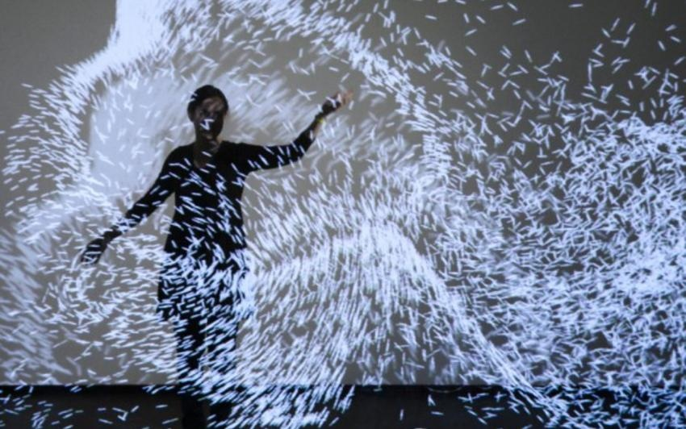

La [Maison d'Ailleurs](https://fr.wikipedia.org/wiki/Maison_d'Ailleurs) au centre d'Yverdon  ([site officiel](http://www.ailleurs.ch/)) est un musée de la science-fiction reconnu par les amateurs du genre mais, il faut le dire, sa collection permanente de livres et objets est un peu... statique. Heureusement, l'exposition temporaire actuelle "Danse avec les étoiles" rend la visite beaucoup plus interactive, amusante et étonnante [[1]](#ref-1), [[2]](#ref-2). A voir avec grands et petits jusqu'au 28 août.

Inspirés par un livre de SF de 1979 [[3]](#ref-3), le studio [Adrien M / Claire B](http://www.am-cb.net/ "Adrien M / Claire B") a créé plusieurs installations interactives spectaculaires. Immergés dans entre des toiles sur lesquelles des trames de particules sont projetées, les mouvements des visiteurs captés par des [kinect](https://fr.wikipedia.org/wiki/kinect) font littéralement danser les étoiles. Dans une autre pièce, la spectaculaire "galerie Jules Verne" du musée, le souffle des visiteurs agitent des lettres dans de petites oeuvres typographiques, ou les propulsent dans tous les coins d'un monde parallèle révélé par un [Oculus Rift](https://fr.wikipedia.org/wiki/Oculus_Rift).

Totalement subjugué par leur travail\*, en ressortant du musée j'ai craqué pour le livre d'Adrien M / Claire B "La neige n'a pas de sens"\*\*[[5]](#ref-5) mis en relief par une application de réalité augmentée ([Android](https://play.google.com/store/apps/details?id=com.AMCB.Neige) et [Pomme](https://itunes.apple.com/fr/app/am-cb/id1096747889)) qui vous fera oublier Pokemon Go:

\[video src="https://vimeo.com/161944781" width="640"\]\[/video\]

Les oeuvres d'un autre créateur vous attendent dans la dernière salle de l'exposition. [Aurélien Jeanney](http://atelierfp7.fr/) a codé, voire crypté les [voyages extraordinaires](https://fr.wikipedia.org/wiki/voyages_extraordinaires) de Jules Verne pour les transformer en [Voyages typographiques](http://atelierfp7.fr/#/voyages-typographiques/) : ses pages multicolores s'animent et sa police de caractère cryptique devient lisible par l'intermédiaire d'un iPad fourni. Très surprenant aussi, cette salle plaira autant aux plus petits qu'au plus grands amateurs de Jules Verne.

En ressortant de la pièce, ne manquez pas le message crypté dont le déchiffrement vous vaudra un petit cadeau à la sortie. Normalement des indices sont distribués aux enfants lors de la visite, mais sans indice, il a fallu 3 cerveaux de Goulu(es) à plein régime pendant 5 bonnes minutes pour en venir à bout. Et non, je ne vous aiderai pas.

Si vous êtes en Suisse Romande d'ici au 28 août, ne manquez pas de visiter cette superbe exposition. Et on mange très bien juste à côté, au resto partenaire de la Maison d'Ailleurs, avec un petit rabais et un patron forts sympathiques.

Pour vous consoler si vous ne pouvez pas venir ou pour vous occuper sur une plage bondée, voici deux magnifiques jeux pour mobile présentés dans la salle "jeux vidéo" de la Maison d'Ailleurs" comme étant innovants du point de vue gameplay et esthétique. Et j'approuve chaleureusement:

1. ### [Monument Valley](https://ustwo.com/what-we-do/monument-valley)
    
    Ce jeu est tellement extraordinaire que je voulais depuis longtemps en parler. Dans un monde surréaliste de perspectives truquées à la Escher, il faut guider un petit personnage vers la sortie de tableaux qui sont autant de casse-têtes magnifiques  Seul bémol : après une petite phase d'apprentissage les tableaux se traversent trop facilement, et il faut repasser plusieurs fois à la caisse pour en avoir plus. Le jeu n'est pas donné, mais quand on pense au travail nécessaire on paie volontiers.
2. ### [Osmos,](http://www.osmos-game.com/) 
    
    un jeu magnifique, tout simple, addictif et pas cher que je ne connaissais pas. Après quelques minutes j’étais accro. 

A ce sujet, la Maison d'Ailleurs participera au festival  [Numerik Games](https://www.numerik-games.ch) du 2 au 4 septembre. C'est noté ?

Pas sur que j'aie le temps de terminer un autre article avant la "pause estivale", je vous souhaite, chères lectrices et chers lecteurs, un été ensoleillé, mais surtout, reposant, calme et pacifique.

### Notes

\*\* titre que je conteste vigoureusement : le sens absolument essentiel de la neige est de pouvoir skier dessus. \* et encore, c'était avant que j'apprenne qu'ils ont développé leur propre soft "[Millumin 2](http://millumin.com)". J'ai cru que c'était du [Processing](/tags/proce55ing/)...

### Références:

1. Etienne Dumont "[YVERDON/La Maison d'Ailleurs danse avec les étoiles numériques](http://www.bilan.ch/etienne-dumont/courants-dart/yverdonla-maison-dailleurs-danse-etoiles)" 1 mars 2016, Bilan.ch
2. video "[Danse avec les étoiles la nouvelle expo de La Maison d'Ailleurs](https://www.youtube.com/watch?v=6IMEvXTIjik)" sur YouTube
3. 
4. "[Project Showcase : Le mouvement de l'air](http://imimot.com/blog/project-showcase-le-mouvement-de-lair/)"
5.  ([page officielle](http://www.loeildorenligne.com/fr/subjectile/99-la-neige-na-pas-de-sens-9782365300254.html#))
